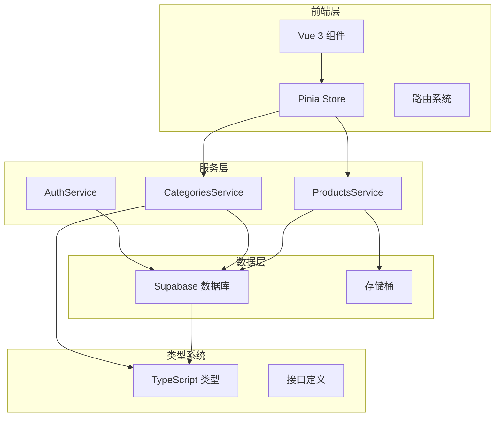
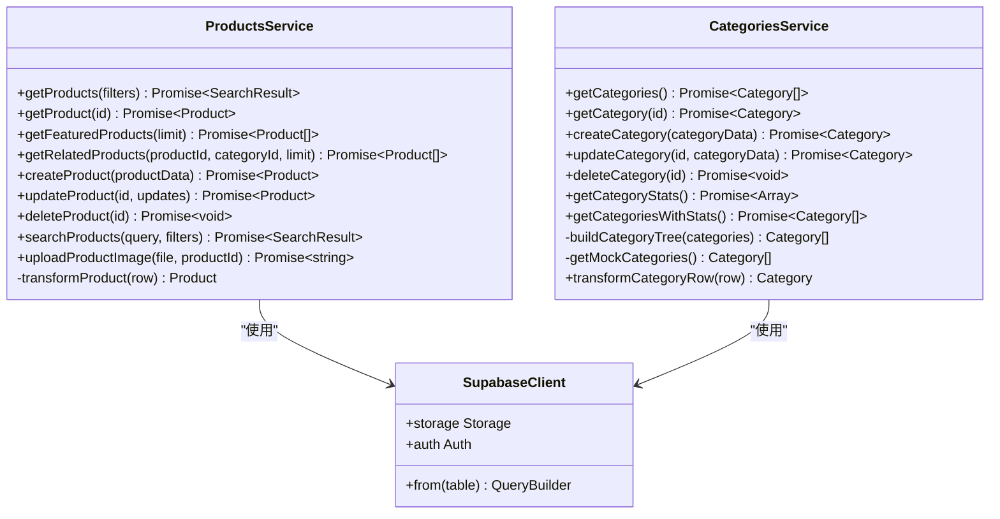
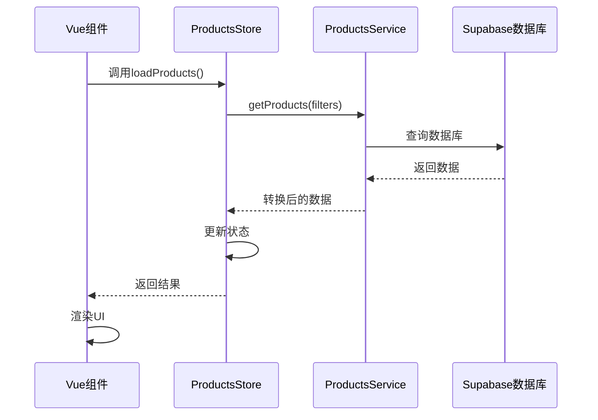
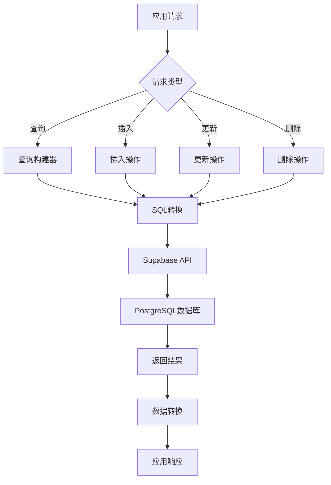
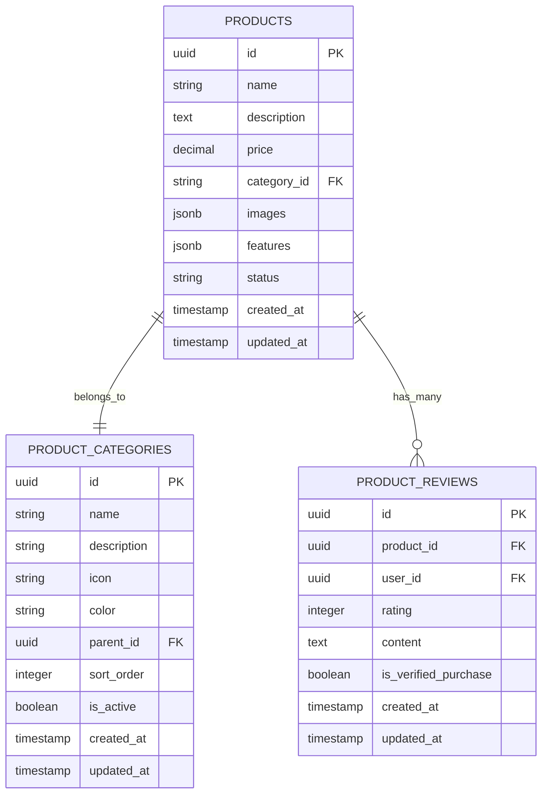

# 产品API文档

<cite>
**本文档引用的文件**
- [productsService.ts](file://src/services/productsService.ts)
- [categoriesService.ts](file://src/services/categoriesService.ts)
- [products.ts](file://src/stores/products.ts)
- [categories.ts](file://src/stores/categories.ts)
- [index.ts](file://src/types/index.ts)
- [supabaseClient.ts](file://src/lib/supabaseClient.ts)
- [ProductDetailView.vue](file://src/views/ProductDetailView.vue)
- [ProductDetailModal.vue](file://src/components/admin/ProductDetailModal.vue)
</cite>

## 目录
1. [简介](#简介)
2. [项目架构概览](#项目架构概览)
3. [核心服务组件](#核心服务组件)
4. [产品服务详解](#产品服务详解)
5. [分类服务详解](#分类服务详解)
6. [状态管理机制](#状态管理机制)
7. [数据库交互模式](#数据库交互模式)
8. [前端集成示例](#前端集成示例)
9. [性能优化建议](#性能优化建议)
10. [故障排除指南](#故障排除指南)
11. [总结](#总结)

## 简介

本文档详细介绍了基于Vue 3和TypeScript构建的产品管理系统API，重点阐述了`productsService`和`categoriesService`提供的核心接口方法。该系统采用Supabase作为后端数据库，结合Pinia状态管理，为用户提供完整的产品浏览、搜索、管理和展示功能。

系统的核心特性包括：
- 全面的产品生命周期管理
- 智能的分类体系支持
- 高效的搜索和筛选功能
- 实时的状态同步
- 完善的错误处理机制

## 项目架构概览



**图表来源**
- [productsService.ts](file://src/services/productsService.ts#L1-L347)
- [categoriesService.ts](file://src/services/categoriesService.ts#L1-L354)
- [supabaseClient.ts](file://src/lib/supabaseClient.ts#L1-L246)

## 核心服务组件

### 服务架构设计

系统采用面向服务的设计模式，每个服务负责特定的功能领域：



**图表来源**
- [productsService.ts](file://src/services/productsService.ts#L7-L347)
- [categoriesService.ts](file://src/services/categoriesService.ts#L15-L354)
- [supabaseClient.ts](file://src/lib/supabaseClient.ts#L10-L20)

**章节来源**
- [productsService.ts](file://src/services/productsService.ts#L1-L347)
- [categoriesService.ts](file://src/services/categoriesService.ts#L1-L354)

## 产品服务详解

### 核心方法解析

#### 1. 获取产品列表 (getProducts)

```typescript
static async getProducts(
  filters?: SearchFilters,
): Promise<SearchResult<Product>>
```

**功能描述**: 根据多种过滤条件获取产品列表，支持分页、排序和搜索功能。

**输入参数**:
- `filters`: 可选的搜索过滤器对象，包含以下属性：
  - `query`: 搜索关键字
  - `category`: 分类ID
  - `priceRange`: 价格范围数组 [min, max]
  - `sortBy`: 排序字段 ('name' | 'price' | 'created_at' | 'sort_order')
  - `sortOrder`: 排序顺序 ('asc' | 'desc')
  - `page`: 当前页码
  - `limit`: 每页数量

**返回值**: `SearchResult<Product>` 对象，包含：
- `items`: 产品数组
- `total`: 总记录数
- `page`: 当前页码
- `limit`: 每页数量
- `hasMore`: 是否有更多页

**使用示例**:
```typescript
// 基本查询
const products = await ProductsService.getProducts();

// 带过滤条件的查询
const filteredProducts = await ProductsService.getProducts({
  query: "开发工具",
  category: "dev-tools",
  priceRange: [100, 1000],
  sortBy: "price",
  sortOrder: "asc",
  page: 1,
  limit: 20
});
```

#### 2. 获取单个产品 (getProduct)

```typescript
static async getProduct(id: string): Promise<Product>
```

**功能描述**: 根据产品ID获取详细的产品信息，包括关联的分类和评论数据。

**输入参数**:
- `id`: 产品唯一标识符

**返回值**: 完整的 `Product` 对象

**使用示例**:
```typescript
const product = await ProductsService.getProduct("product-123");
console.log(product.name, product.price);
```

#### 3. 获取特色产品 (getFeaturedProducts)

```typescript
static async getFeaturedProducts(limit = 6): Promise<Product[]>
```

**功能描述**: 获取标记为特色产品的列表，通常用于首页推荐。

**输入参数**:
- `limit`: 可选参数，限制返回的产品数量，默认为6

**返回值**: 特色产品数组

**使用示例**:
```typescript
const featured = await ProductsService.getFeaturedProducts(8);
```

#### 4. 获取相关产品 (getRelatedProducts)

```typescript
static async getRelatedProducts(
  productId: string,
  categoryId: string,
  limit = 4,
): Promise<Product[]>
```

**功能描述**: 根据当前产品和分类获取相关产品推荐。

**输入参数**:
- `productId`: 当前产品ID
- `categoryId`: 产品所属分类ID
- `limit`: 可选参数，限制返回数量，默认为4

**返回值**: 相关产品数组

**使用示例**:
```typescript
const related = await ProductsService.getRelatedProducts(
  "current-product-id", 
  "category-123", 
  6
);
```

#### 5. 创建产品 (createProduct)

```typescript
static async createProduct(productData: ProductInsert): Promise<Product>
```

**功能描述**: 创建新产品，支持完整的数据验证和存储。

**输入参数**:
- `productData`: 包含产品信息的对象

**返回值**: 创建成功的 `Product` 对象

**使用示例**:
```typescript
const newProduct = await ProductsService.createProduct({
  name: "新工具",
  description: "产品描述",
  price: 99.99,
  category_id: "cat-123",
  images: ["image-url-1", "image-url-2"],
  features: ["功能1", "功能2"]
});
```

#### 6. 更新产品 (updateProduct)

```typescript
static async updateProduct(
  id: string,
  updates: ProductUpdate,
): Promise<Product>
```

**功能描述**: 更新现有产品的信息，自动更新修改时间戳。

**输入参数**:
- `id`: 产品ID
- `updates`: 需要更新的字段对象

**返回值**: 更新后的 `Product` 对象

**使用示例**:
```typescript
const updatedProduct = await ProductsService.updateProduct("product-123", {
  price: 89.99,
  status: "active"
});
```

#### 7. 删除产品 (deleteProduct)

```typescript
static async deleteProduct(id: string): Promise<void>
```

**功能描述**: 从系统中删除指定产品（软删除或硬删除）。

**输入参数**:
- `id`: 产品ID

**返回值**: 无返回值

**使用示例**:
```typescript
await ProductsService.deleteProduct("product-123");
```

#### 8. 上传产品图片 (uploadProductImage)

```typescript
static async uploadProductImage(
  file: File,
  productId: string,
): Promise<string>
```

**功能描述**: 将产品图片上传到存储桶并返回公共访问URL。

**输入参数**:
- `file`: 图片文件对象
- `productId`: 产品ID

**返回值**: 图片的公共访问URL

**使用示例**:
```typescript
const imageUrl = await ProductsService.uploadProductImage(imageFile, "product-123");
```

**章节来源**
- [productsService.ts](file://src/services/productsService.ts#L10-L347)

## 分类服务详解

### 分类管理功能

#### 1. 获取分类列表 (getCategories)

```typescript
static async getCategories(): Promise<Category[]>
```

**功能描述**: 获取所有有效的分类列表，并构建分类树结构。

**返回值**: 分类树数组

**使用示例**:
```typescript
const categories = await CategoriesService.getCategories();
```

#### 2. 获取单个分类 (getCategory)

```typescript
static async getCategory(id: string): Promise<Category>
```

**功能描述**: 根据分类ID获取详细的分类信息。

**输入参数**:
- `id`: 分类ID

**返回值**: `Category` 对象

**使用示例**:
```typescript
const category = await CategoriesService.getCategory("cat-123");
```

#### 3. 创建分类 (createCategory)

```typescript
static async createCategory(
  categoryData: Partial<Category>,
): Promise<Category>
```

**功能描述**: 创建新的分类，支持层级结构。

**输入参数**:
- `categoryData`: 分类数据对象

**返回值**: 创建成功的 `Category` 对象

**使用示例**:
```typescript
const newCategory = await CategoriesService.createCategory({
  name: "新分类",
  description: "分类描述",
  icon: "icon-name",
  color: "#ffffff",
  parent_id: "parent-cat-123"
});
```

#### 4. 更新分类 (updateCategory)

```typescript
static async updateCategory(
  id: string,
  categoryData: Partial<Category>,
): Promise<Category>
```

**功能描述**: 更新现有分类的信息。

**输入参数**:
- `id`: 分类ID
- `categoryData`: 需要更新的数据

**返回值**: 更新后的 `Category` 对象

**使用示例**:
```typescript
const updatedCategory = await CategoriesService.updateCategory("cat-123", {
  name: "更新后的分类名",
  sort_order: 1
});
```

#### 5. 删除分类 (deleteCategory)

```typescript
static async deleteCategory(id: string): Promise<void>
```

**功能描述**: 删除分类，会检查是否有子分类或关联的产品。

**输入参数**:
- `id`: 分类ID

**返回值**: 无返回值

**使用示例**:
```typescript
try {
  await CategoriesService.deleteCategory("cat-123");
} catch (error) {
  console.error("删除失败:", error.message);
}
```

#### 6. 获取分类统计 (getCategoryStats)

```typescript
static async getCategoryStats(): Promise<Array<{categoryId: string; count: number}>>
```

**功能描述**: 获取每个分类下的产品数量统计信息。

**返回值**: 统计数组

**使用示例**:
```typescript
const stats = await CategoriesService.getCategoryStats();
stats.forEach(stat => {
  console.log(`分类 ${stat.categoryId}: ${stat.count} 个产品`);
});
```

#### 7. 获取带统计的分类 (getCategoriesWithStats)

```typescript
static async getCategoriesWithStats(): Promise<Category[]>
```

**功能描述**: 获取分类列表并附带产品数量统计。

**返回值**: 带统计信息的分类树

**使用示例**:
```typescript
const categoriesWithStats = await CategoriesService.getCategoriesWithStats();
```

**章节来源**
- [categoriesService.ts](file://src/services/categoriesService.ts#L15-L354)

## 状态管理机制

### Pinia Store架构

系统使用Pinia进行状态管理，提供了响应式的全局状态控制：



**图表来源**
- [products.ts](file://src/stores/products.ts#L60-L80)
- [productsService.ts](file://src/services/productsService.ts#L10-L50)

### 核心状态属性

#### 1. 产品状态管理

```typescript
interface ProductsState {
  // 基础状态
  loading: boolean;
  error: string | null;
  initialized: boolean;
  
  // 数据存储
  products: Product[];
  categories: Category[];
  searchResult: SearchResult<Product> | null;
  featuredProducts: Product[];
  currentProduct: Product | null;
  
  // 搜索和筛选状态
  searchQuery: string;
  selectedCategory: string;
  priceRange: [number, number] | null;
  sortBy: string;
  sortOrder: "asc" | "desc";
}
```

#### 2. 计算属性和派生状态

```typescript
// 计算属性示例
const filteredProducts = computed(() => {
  return searchResult.value ? searchResult.value.items : products.value;
});

const totalProducts = computed(() => {
  return searchResult.value ? searchResult.value.total : products.value.length;
});

const productsByCategory = computed(() => {
  const grouped = new Map<string, Product[]>();
  products.value.forEach((product) => {
    const categoryId = product.category.id;
    if (!grouped.has(categoryId)) {
      grouped.set(categoryId, []);
    }
    grouped.get(categoryId)!.push(product);
  });
  return grouped;
});
```

#### 3. 异步操作方法

```typescript
// 异步操作示例
const loadProducts = async (filters?: SearchFilters) => {
  try {
    loading.value = true;
    error.value = null;
    
    const result = await ProductsService.getProducts(filters);
    
    if (filters) {
      searchResult.value = result;
    } else {
      products.value = result.items;
      searchResult.value = null;
    }
    
    return result;
  } catch (err) {
    error.value = err instanceof Error ? err.message : "加载产品失败";
    throw err;
  } finally {
    loading.value = false;
  }
};
```

**章节来源**
- [products.ts](file://src/stores/products.ts#L1-L365)

## 数据库交互模式

### Supabase集成

系统通过封装的Supabase客户端进行数据库操作：



**图表来源**
- [supabaseClient.ts](file://src/lib/supabaseClient.ts#L10-L50)

### 数据库表结构

系统主要涉及以下数据库表：



**图表来源**
- [supabaseClient.ts](file://src/lib/supabaseClient.ts#L20-L35)

### 数据转换机制

```typescript
// 产品数据转换示例
private static transformProduct(row: Record<string, any>): Product {
  const category = row.category ? {
    id: row.category.id,
    name: row.category.name,
    description: row.category.description ?? undefined,
    icon: row.category.icon,
    color: row.category.color,
    parent_id: row.category.parent_id ?? undefined,
    children: undefined,
    count: 0,
    sort_order: row.category.sort_order,
    is_active: row.category.is_active,
    created_at: row.category.created_at,
    updated_at: row.category.updated_at,
  } : undefined;
  
  return {
    id: row.id,
    name: row.name,
    description: row.description,
    price: row.price,
    category_id: row.category_id,
    category,
    images: row.images || [],
    features: row.features || [],
    status: row.status,
    created_at: row.created_at,
    updated_at: row.updated_at,
    // ... 其他字段
  };
}
```

**章节来源**
- [supabaseClient.ts](file://src/lib/supabaseClient.ts#L1-L246)
- [productsService.ts](file://src/services/productsService.ts#L280-L347)

## 前端集成示例

### 产品详情页面集成

```vue
<template>
  <div class="product-detail-view">
    <div v-if="product" class="product-detail">
      <div class="product-gallery">
        <div class="main-image">
          
        </div>
      </div>
      
      <div class="product-info">
        <div class="product-header">
          <h1 class="product-title">{{ product.name }}</h1>
          <div class="product-price">
            <span class="current-price">¥{{ product.price }}</span>
            <span v-if="product.originalPrice" class="original-price">
              ¥{{ product.originalPrice }}
            </span>
          </div>
        </div>
        
        <div class="product-actions">
          <button class="buy-btn" @click="buyProduct">
            <ShoppingCartIcon class="icon" />
            立即购买
          </button>
          <button class="demo-btn" @click="viewDemo">
            <EyeIcon class="icon" />
            在线预览
          </button>
          <button class="favorite-btn" @click="toggleFavorite">
            <HeartIcon class="icon" :class="{ filled: isFavorite }" />
            {{ isFavorite ? "已收藏" : "收藏" }}
          </button>
        </div>
      </div>
    </div>
  </div>
</template>

<script setup lang="ts">
import { ref, onMounted } from "vue";
import { useRoute, useRouter } from "vue-router";
import { useProductsStore } from "@/stores/products";

const route = useRoute();
const router = useRouter();
const productsStore = useProductsStore();

const product = ref<any>(null);
const loading = ref(true);
const isFavorite = ref(false);

onMounted(async () => {
  const productId = route.params.id as string;
  try {
    await productsStore.loadProduct(productId);
    product.value = productsStore.currentProduct;
    // 检查收藏状态
    isFavorite.value = await checkFavoriteStatus(productId);
  } catch (error) {
    console.error("加载产品失败:", error);
  } finally {
    loading.value = false;
  }
});

const buyProduct = async () => {
  if (!product.value) return;
  
  try {
    // 检查用户登录状态
    const authStore = useAuthStore();
    if (!authStore.isAuthenticated) {
      router.push({
        name: "Login",
        query: { redirect: `/product/${product.value.id}` },
      });
      return;
    }
    
    // 跳转到支付页面
    router.push({
      path: "/payment",
      query: { product: product.value.id },
    });
  } catch (error) {
    console.error("购买流程错误:", error);
    alert("购买失败，请稍后重试");
  }
};
</script>
```

### 分页查询实现

```typescript
// 分页查询示例
const loadPaginatedProducts = async (page: number = 1, limit: number = 12) => {
  try {
    const filters: SearchFilters = {
      page,
      limit,
      sortBy: "created_at",
      sortOrder: "desc"
    };
    
    const result = await ProductsService.getProducts(filters);
    
    // 更新状态
    products.value = result.items;
    pagination.value = {
      currentPage: result.page,
      totalPages: Math.ceil(result.total / result.limit),
      totalItems: result.total,
      hasNextPage: result.hasMore
    };
    
    return result;
  } catch (error) {
    console.error("分页查询失败:", error);
    throw error;
  }
};
```

### 分类筛选实现

```typescript
// 分类筛选示例
const applyCategoryFilter = async (categoryId: string) => {
  try {
    const filters: SearchFilters = {
      category: categoryId,
      page: 1,
      limit: 20
    };
    
    await productsStore.searchProducts("", filters);
  } catch (error) {
    console.error("分类筛选失败:", error);
  }
};

// 价格范围筛选
const applyPriceFilter = async (range: [number, number]) => {
  try {
    productsStore.setPriceRange(range);
    await productsStore.searchProducts(productsStore.searchQuery);
  } catch (error) {
    console.error("价格筛选失败:", error);
  }
};
```

**章节来源**
- [ProductDetailView.vue](file://src/views/ProductDetailView.vue#L1-L294)

## 性能优化建议

### 1. 缓存策略

```typescript
// 实现缓存包装器
const cachedGetProducts = memoize(
  async (filters: SearchFilters) => {
    return await ProductsService.getProducts(filters);
  },
  {
    maxAge: 5 * 60 * 1000, // 5分钟缓存
    key: (filters) => JSON.stringify(filters)
  }
);
```

### 2. 批量加载优化

```typescript
// 批量加载相关产品
const loadRelatedProductsBatch = async (productIds: string[]) => {
  const promises = productIds.map(id => 
    ProductsService.getRelatedProducts(id, "category-123", 4)
  );
  
  const results = await Promise.all(promises);
  return results.flat();
};
```

### 3. 虚拟滚动

```typescript
// 虚拟滚动配置
const virtualScrollConfig = {
  itemHeight: 200, // 每个项目高度
  containerHeight: window.innerHeight - 200, // 容器高度
  overscan: 5 // 预渲染项目数
};
```

### 4. 图片懒加载

```typescript
// 图片懒加载实现
const lazyLoadImages = (images: string[]) => {
  return images.map(url => ({
    src: url,
    placeholder: '/placeholder.jpg',
    loading: 'lazy'
  }));
};
```

### 5. 防抖搜索

```typescript
// 防抖搜索实现
const debouncedSearch = debounce(async (query: string) => {
  if (query.trim()) {
    await productsStore.searchProducts(query);
  }
}, 300);
```

## 故障排除指南

### 常见错误类型

#### 1. 数据库连接错误

```typescript
// 错误处理示例
const handleDatabaseError = (error: unknown) => {
  if (error instanceof Error) {
    switch (true) {
      case error.message.includes('connection'):
        return '数据库连接失败，请检查网络设置';
      case error.message.includes('permission'):
        return '权限不足，无法执行此操作';
      case error.message.includes('timeout'):
        return '查询超时，请尝试简化查询条件';
      default:
        return error.message;
    }
  }
  return '未知错误，请联系技术支持';
};
```

#### 2. 产品不存在错误

```typescript
// 产品不存在处理
const handleProductNotFound = async (productId: string) => {
  try {
    // 尝试重新加载产品
    await productsStore.loadProduct(productId);
    
    if (!productsStore.currentProduct) {
      // 产品确实不存在，跳转到错误页面
      router.push('/not-found');
    }
  } catch (error) {
    console.error('加载产品失败:', error);
    router.push('/error');
  }
};
```

#### 3. 分类层级错误

```typescript
// 分类层级验证
const validateCategoryHierarchy = (categories: Category[], parentId: string) => {
  const categoryMap = new Map(categories.map(cat => [cat.id, cat]));
  
  const hasCircularReference = (id: string, visited: Set<string> = new Set()): boolean => {
    if (visited.has(id)) return true;
    visited.add(id);
    
    const category = categoryMap.get(id);
    return category?.parent_id ? hasCircularReference(category.parent_id, visited) : false;
  };
  
  return !hasCircularReference(parentId);
};
```

### 调试工具

```typescript
// 调试辅助函数
const debugProducts = {
  logProductState: () => {
    console.group('产品状态');
    console.log('加载中:', productsStore.loading);
    console.log('错误:', productsStore.error);
    console.log('产品总数:', productsStore.products.length);
    console.log('搜索结果:', productsStore.searchResult);
    console.groupEnd();
  },
  
  validateProductData: (product: Product) => {
    const errors: string[] = [];
    
    if (!product.id) errors.push('缺少产品ID');
    if (!product.name) errors.push('缺少产品名称');
    if (product.price <= 0) errors.push('价格必须大于0');
    if (!product.category_id) errors.push('缺少分类ID');
    
    return errors;
  }
};
```

**章节来源**
- [productsService.ts](file://src/services/productsService.ts#L50-L70)
- [categoriesService.ts](file://src/services/categoriesService.ts#L100-L120)

## 总结

本文档全面介绍了基于Vue 3和TypeScript构建的产品管理系统API，涵盖了以下核心内容：

### 主要特性
1. **完整的CRUD操作**: 提供了产品和分类的完整生命周期管理
2. **智能搜索和筛选**: 支持多维度的搜索、排序和分页功能
3. **实时状态管理**: 使用Pinia实现响应式的全局状态控制
4. **数据库抽象**: 通过Supabase提供统一的数据访问层
5. **类型安全**: 完整的TypeScript类型定义确保开发安全性

### 技术优势
- **模块化设计**: 清晰的服务分离和职责划分
- **错误处理**: 完善的异常捕获和用户友好的错误提示
- **性能优化**: 支持缓存、批量操作和虚拟滚动等优化技术
- **扩展性**: 易于添加新的功能和服务

### 最佳实践
1. **合理使用缓存**: 根据数据变化频率选择合适的缓存策略
2. **错误边界处理**: 在组件层面实现错误边界，提升用户体验
3. **异步操作管理**: 使用Pinia的异步方法管理复杂的业务逻辑
4. **类型约束**: 充分利用TypeScript类型系统防止运行时错误

该API系统为企业级产品管理提供了坚实的技术基础，能够满足现代Web应用的各种需求。通过合理的架构设计和完善的错误处理机制，确保了系统的稳定性和可维护性。