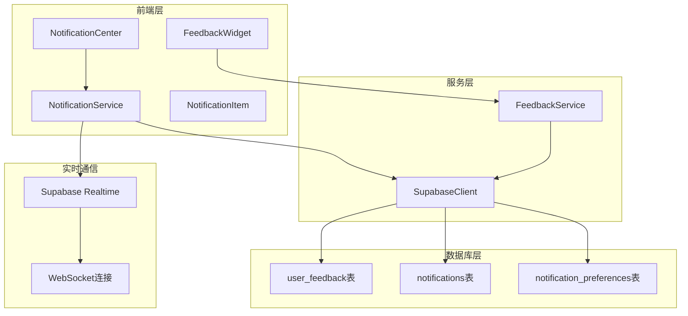
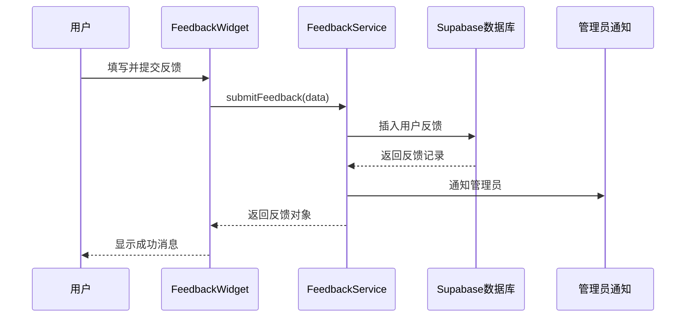
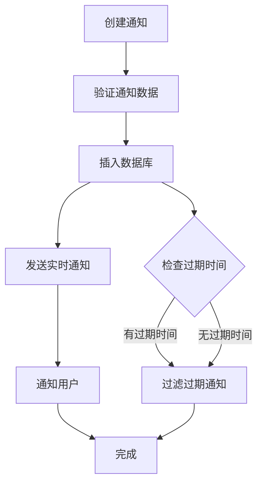
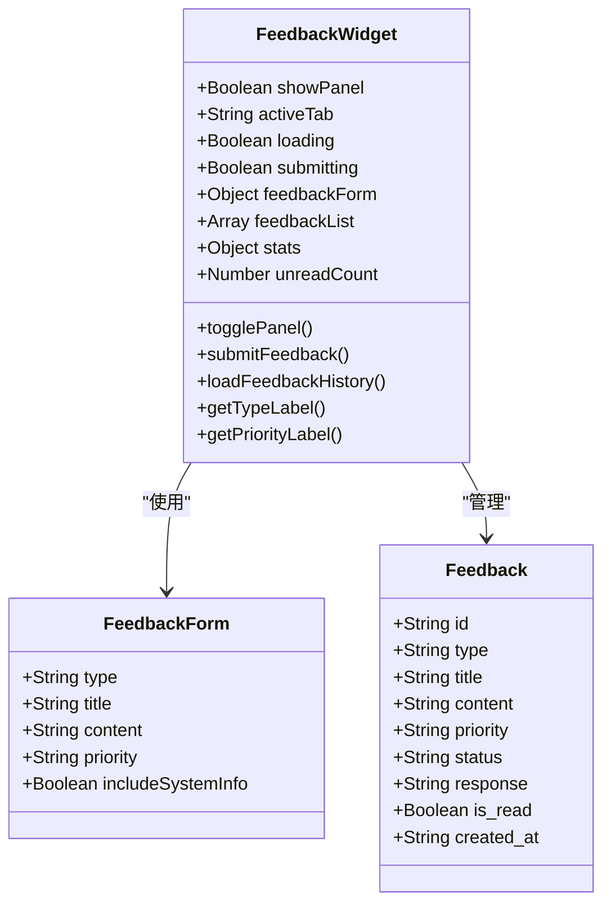
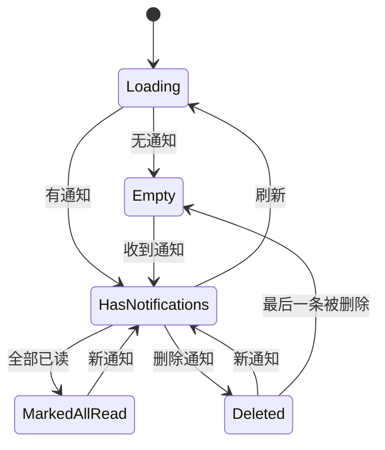
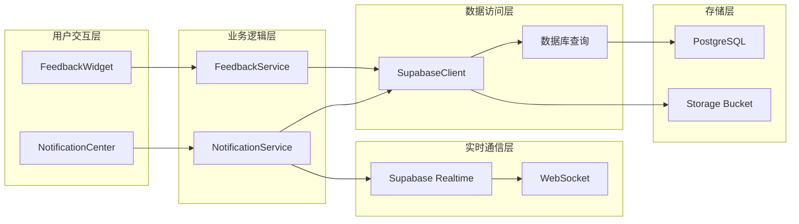
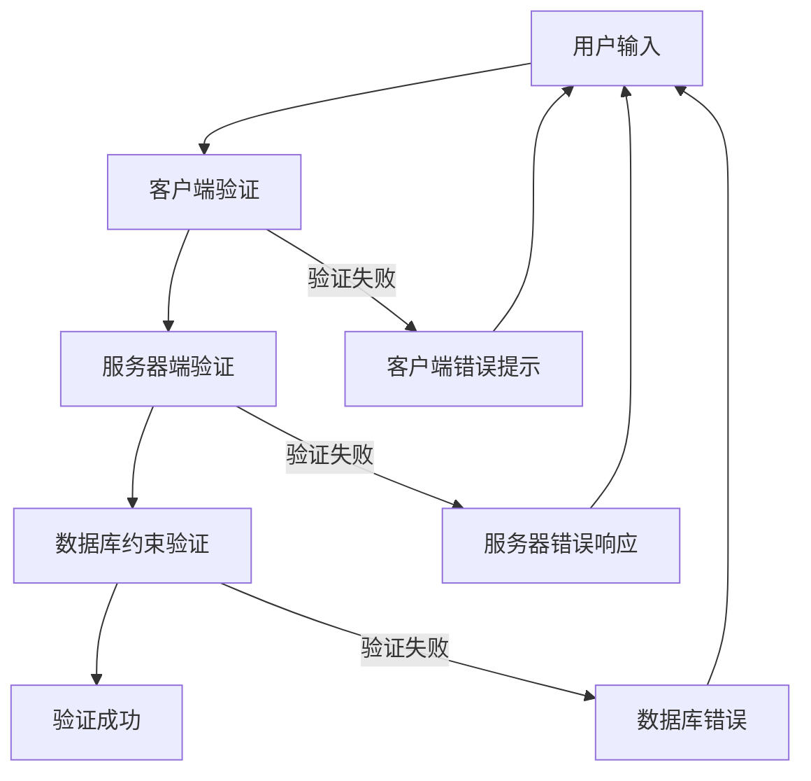
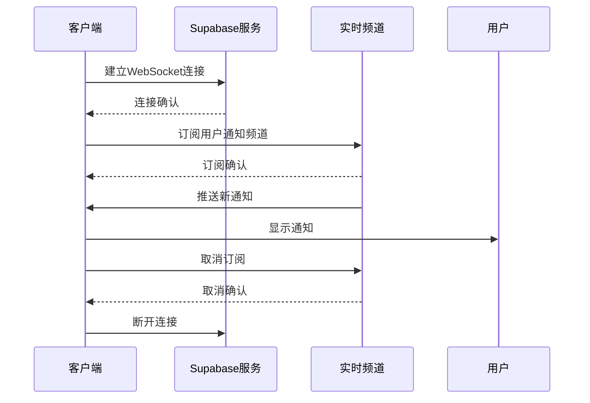
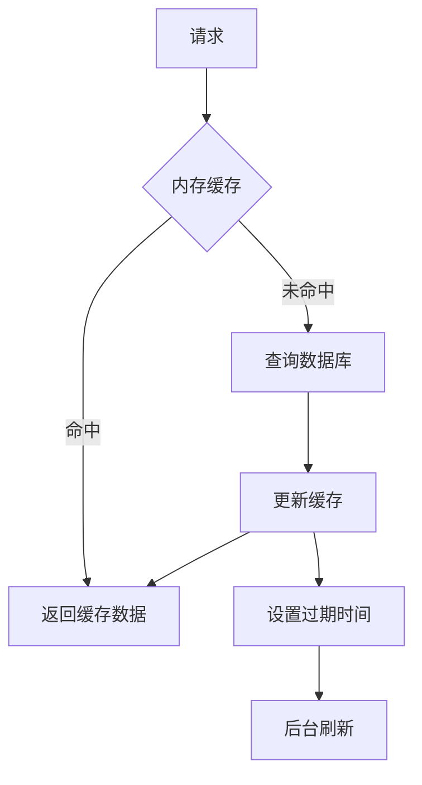

# 反馈与通知API文档

<cite>
**本文档引用的文件**
- [feedbackService.ts](file://src/services/feedbackService.ts)
- [notificationService.ts](file://src\services\notificationService.ts)
- [FeedbackWidget.vue](file://src\components\feedback\FeedbackWidget.vue)
- [NotificationCenter.vue](file://src\components\notifications\NotificationCenter.vue)
- [NotificationItem.vue](file://src\components\notifications\NotificationItem.vue)
- [NotificationSettings.vue](file://src\components\notifications\NotificationSettings.vue)
- [supabaseClient.ts](file://src\lib\supabaseClient.ts)
- [user_feedback.sql](file://supabase\migrations\20241227000001_user_feedback.sql)
- [validation.ts](file://src\utils\validation.ts)
- [services.test.ts](file://src\tests\integration\services.test.ts)
</cite>

## 目录
1. [简介](#简介)
2. [项目架构概览](#项目架构概览)
3. [反馈服务详解](#反馈服务详解)
4. [通知服务详解](#通知服务详解)
5. [前端组件分析](#前端组件分析)
6. [数据流与架构设计](#数据流与架构设计)
7. [实时通信机制](#实时通信机制)
8. [数据验证与安全](#数据验证与安全)
9. [性能优化策略](#性能优化策略)
10. [故障排除指南](#故障排除指南)
11. [总结](#总结)

## 简介

本文档全面介绍了Advanced Tools Navigation项目中的反馈系统和通知服务的API设计与实现。该系统采用现代化的Vue 3 + TypeScript架构，结合Supabase作为后端服务，提供了完整的用户反馈收集、管理和通知推送功能。

系统的核心特性包括：
- 多维度的反馈分类和优先级管理
- 实时通知推送和状态同步
- 智能的通知过滤和个性化设置
- 强大的数据分析和统计功能
- 完善的安全控制和权限管理

## 项目架构概览



**图表来源**
- [FeedbackWidget.vue](file://src\components\feedback\FeedbackWidget.vue#L1-L50)
- [NotificationCenter.vue](file://src\components\notifications\NotificationCenter.vue#L1-L50)
- [feedbackService.ts](file://src\services\feedbackService.ts#L1-L30)
- [notificationService.ts](file://src\services\notificationService.ts#L1-L30)

## 反馈服务详解

### 核心接口定义

反馈服务提供了完整的用户反馈管理功能，支持多种反馈类型和优先级设置：

```typescript
// 反馈数据接口
export interface FeedbackData {
  type: "bug" | "feature" | "improvement" | "question" | "other";
  title: string;
  content: string;
  priority: "low" | "medium" | "high" | "urgent";
  user_id: string;
  system_info?: {
    userAgent: string;
    platform: string;
    language: string;
    screenResolution: string;
    timestamp: string;
  };
}
```

### 主要服务方法

#### 1. 提交反馈 (submitFeedback)



**图表来源**
- [FeedbackWidget.vue](file://src\components\feedback\FeedbackWidget.vue#L250-L280)
- [feedbackService.ts](file://src\services\feedbackService.ts#L65-L107)

#### 2. 获取用户反馈列表 (getUserFeedbacks)

该方法支持分页、筛选和排序功能：

```typescript
async getUserFeedbacks(
  userId: string,
  page = 1,
  limit = 10,
  filters: FeedbackFilters = {},
): Promise<FeedbackListResult>
```

#### 3. 回复反馈 (respondToFeedback)

管理员可以对用户反馈进行回复，系统会自动发送通知：

```typescript
async respondToFeedback(
  feedbackId: string,
  response: string,
  responseBy: string,
  status?: string,
): Promise<Feedback>
```

#### 4. 反馈统计 (getFeedbackStats)

提供详细的反馈分析数据：

```typescript
interface FeedbackStats {
  total: number;
  pending: number;
  in_progress: number;
  resolved: number;
  closed: number;
  response_rate: number;
  avg_response_time: number;
  by_type: Record<string, number>;
  by_priority: Record<string, number>;
  recent_count: number;
}
```

**章节来源**
- [feedbackService.ts](file://src\services\feedbackService.ts#L65-L506)

## 通知服务详解

### 通知数据模型

```typescript
interface Notification {
  id: string;
  user_id: string;
  type: "info" | "success" | "warning" | "error" | "system" | "product" | "order";
  title: string;
  message: string;
  action_url?: string;
  action_text?: string;
  is_read: boolean;
  is_important: boolean;
  expires_at?: string;
  metadata?: Record<string, any>;
  created_at: string;
  updated_at: string;
}
```

### 核心功能模块

#### 1. 通知管理



**图表来源**
- [notificationService.ts](file://src\services\notificationService.ts#L120-L160)

#### 2. 实时通知订阅

通知服务支持实时订阅机制，确保用户能够及时收到新通知：

```typescript
subscribeToNotifications(
  userId: string,
  callback: (notification: Notification) => void,
): () => void
```

#### 3. 通知偏好管理

用户可以自定义通知接收偏好：

```typescript
interface NotificationPreferences {
  email_notifications: boolean;
  push_notifications: boolean;
  system_notifications: boolean;
  product_notifications: boolean;
  order_notifications: boolean;
  marketing_notifications: boolean;
  notification_frequency: "immediate" | "daily" | "weekly" | "never";
  quiet_hours_start?: string;
  quiet_hours_end?: string;
}
```

**章节来源**
- [notificationService.ts](file://src\services\notificationService.ts#L1-L514)

## 前端组件分析

### FeedbackWidget 组件

FeedbackWidget是一个多功能的反馈收集组件，提供以下功能：

#### 功能特性
- **多标签界面**：支持提交反馈、查看历史和统计分析
- **智能表单验证**：实时验证反馈内容和格式
- **系统信息收集**：可选收集用户设备和浏览器信息
- **状态指示器**：显示未读反馈数量

#### 组件架构



**图表来源**
- [FeedbackWidget.vue](file://src\components\feedback\FeedbackWidget.vue#L200-L300)

### NotificationCenter 组件

NotificationCenter提供了完整的通知管理界面：

#### 核心功能
- **实时通知**：即时显示新通知
- **智能过滤**：支持按类型、重要性和状态筛选
- **批量操作**：支持批量标记已读和删除
- **个性化设置**：允许用户自定义通知偏好

#### 通知状态管理



**图表来源**
- [NotificationCenter.vue](file://src\components\notifications\NotificationCenter.vue#L100-L200)

**章节来源**
- [FeedbackWidget.vue](file://src\components\feedback\FeedbackWidget.vue#L1-L400)
- [NotificationCenter.vue](file://src\components\notifications\NotificationCenter.vue#L1-L200)

## 数据流与架构设计

### 整体数据流架构



**图表来源**
- [supabaseClient.ts](file://src\lib\supabaseClient.ts#L1-L50)
- [feedbackService.ts](file://src\services\feedbackService.ts#L1-L30)
- [notificationService.ts](file://src\services\notificationService.ts#L1-L30)

### 数据验证流程

系统实现了多层次的数据验证机制：



**图表来源**
- [validation.ts](file://src\utils\validation.ts#L1-L100)

**章节来源**
- [supabaseClient.ts](file://src\lib\supabaseClient.ts#L1-L200)
- [validation.ts](file://src\utils\validation.ts#L1-L200)

## 实时通信机制

### Supabase Realtime 集成

系统利用Supabase的实时功能实现高效的通知推送：

#### 实时订阅机制

```typescript
// 订阅通知变化
const unsubscribe = notificationService.subscribeToNotifications(
  userId,
  (notification) => {
    // 处理新通知
    updateNotificationList(notification);
  }
);

// 取消订阅
unsubscribe();
```

#### 实时事件类型

- **INSERT**: 新通知创建
- **UPDATE**: 通知状态更新
- **DELETE**: 通知删除

### WebSocket 连接管理



**图表来源**
- [notificationService.ts](file://src\services\notificationService.ts#L280-L320)

**章节来源**
- [notificationService.ts](file://src\services\notificationService.ts#L280-L350)

## 数据验证与安全

### 输入验证规则

系统实现了严格的输入验证机制：

```typescript
// 反馈类型验证
const feedbackTypeValidator = new Validator()
  .addRule('type', {
    required: true,
    pattern: /^(bug|feature|improvement|question|other)$/,
    message: '无效的反馈类型'
  });

// 优先级验证
const priorityValidator = new Validator()
  .addRule('priority', {
    required: true,
    pattern: /^(low|medium|high|urgent)$/,
    message: '无效的优先级'
  });
```

### 数据库安全策略

#### 行级安全策略 (RLS)

```sql
-- 用户只能查看自己的反馈
CREATE POLICY "用户可以查看自己的反馈" ON user_feedback
    FOR SELECT USING (auth.uid() = user_id);

-- 管理员可以查看所有反馈
CREATE POLICY "管理员可以查看所有反馈" ON user_feedback
    FOR SELECT USING (
        EXISTS (
            SELECT 1 FROM user_profiles 
            WHERE user_id = auth.uid() AND role = 'admin'
        )
    );
```

### 敏感信息处理

#### 系统信息收集

当用户选择包含系统信息时，系统会收集以下数据：

```typescript
interface SystemInfo {
  userAgent: string;           // 浏览器用户代理字符串
  platform: string;           // 操作系统平台
  language: string;           // 浏览器语言
  screenResolution: string;   // 屏幕分辨率
  timestamp: string;          // 时间戳
}
```

#### 数据脱敏策略

- 敏感个人信息在传输过程中加密
- 日志记录中移除敏感字段
- 数据备份采用加密存储

**章节来源**
- [validation.ts](file://src\utils\validation.ts#L1-L200)
- [user_feedback.sql](file://supabase\migrations\20241227000001_user_feedback.sql#L150-L200)

## 性能优化策略

### 数据库优化

#### 索引策略

```sql
-- 复合索引优化查询性能
CREATE INDEX IF NOT EXISTS idx_user_feedback_user_status 
ON user_feedback(user_id, status);

CREATE INDEX IF NOT EXISTS idx_user_feedback_type_priority 
ON user_feedback(type, priority);

-- 分页查询优化
CREATE INDEX IF NOT EXISTS idx_user_feedback_created_at 
ON user_feedback(created_at DESC);
```

#### 查询优化

- 使用LIMIT和OFFSET进行分页
- 实现延迟加载机制
- 缓存频繁访问的数据

### 前端性能优化

#### 组件懒加载

```typescript
// 按需加载通知组件
const NotificationItem = defineAsyncComponent(() =>
  import('./NotificationItem.vue')
);
```

#### 内存管理

- 及时取消实时订阅
- 清理定时器和事件监听器
- 实现虚拟滚动优化长列表

### 缓存策略



**章节来源**
- [user_feedback.sql](file://supabase\migrations\20241227000001_user_feedback.sql#L10-L50)

## 故障排除指南

### 常见问题及解决方案

#### 1. 反馈提交失败

**症状**: 用户无法提交反馈，出现错误提示

**可能原因**:
- 网络连接问题
- 数据验证失败
- 后端服务不可用

**解决方案**:
```typescript
// 检查网络连接
if (!navigator.onLine) {
  alert('请检查您的网络连接');
  return;
}

// 验证反馈数据
const validationResult = validateFeedbackData(feedbackData);
if (!validationResult.isValid) {
  displayValidationErrors(validationResult.errors);
  return;
}
```

#### 2. 通知接收延迟

**症状**: 用户收到通知但延迟较高

**可能原因**:
- WebSocket连接不稳定
- 实时订阅配置错误
- 服务器负载过高

**解决方案**:
```typescript
// 重新建立实时连接
const reconnect = () => {
  if (unsubscribe) {
    unsubscribe();
  }
  
  unsubscribe = notificationService.subscribeToNotifications(
    userId,
    handleNewNotification
  );
};
```

#### 3. 数据一致性问题

**症状**: 前后端数据不一致

**可能原因**:
- 并发更新冲突
- 数据库事务处理不当
- 缓存失效策略问题

**解决方案**:
```typescript
// 使用乐观锁防止并发更新
const updateWithOptimisticLock = async (id: string, data: any) => {
  const { data: existing } = await supabase
    .from('user_feedback')
    .select('version')
    .eq('id', id)
    .single();
    
  const { error } = await supabase
    .from('user_feedback')
    .update({ ...data, version: existing.version + 1 })
    .eq('id', id)
    .eq('version', existing.version);
    
  if (error) {
    throw new Error('更新失败，请重试');
  }
};
```

### 监控和日志

#### 关键指标监控

- **反馈提交成功率**: 监控反馈提交的成功率
- **通知送达率**: 跟踪通知的实际送达情况
- **系统响应时间**: 监控API响应时间
- **错误率**: 统计各类错误的发生频率

#### 日志记录最佳实践

```typescript
// 结构化日志记录
const logFeedbackEvent = (event: string, data: any) => {
  console.log(JSON.stringify({
    timestamp: new Date().toISOString(),
    event,
    userId: data.userId,
    feedbackId: data.feedbackId,
    level: 'INFO',
    message: `Feedback ${event} processed`,
    metadata: {
      type: data.type,
      priority: data.priority,
      duration: data.duration
    }
  }));
};
```

**章节来源**
- [services.test.ts](file://src\tests\integration\services.test.ts#L1-L100)

## 总结

Advanced Tools Navigation项目的反馈与通知系统展现了现代Web应用的最佳实践。通过精心设计的架构和完善的组件，系统实现了以下核心价值：

### 技术优势

1. **模块化设计**: 清晰的服务边界和组件职责分离
2. **实时通信**: 基于Supabase的高效实时通知机制
3. **数据安全**: 多层次的安全控制和隐私保护
4. **性能优化**: 智能缓存和数据库优化策略
5. **用户体验**: 直观的界面设计和流畅的操作体验

### 架构亮点

- **前后端分离**: 前端专注于用户体验，后端负责业务逻辑
- **实时同步**: 确保用户界面与服务器状态的一致性
- **可扩展性**: 支持未来功能的平滑扩展
- **容错能力**: 完善的错误处理和降级机制

### 未来发展方向

1. **AI辅助**: 集成AI技术进行反馈分类和自动回复
2. **移动端优化**: 针对移动设备的特殊优化
3. **国际化支持**: 多语言和本地化功能扩展
4. **高级分析**: 更深入的数据分析和可视化功能

该系统不仅满足了当前的功能需求，更为未来的功能扩展奠定了坚实的基础，是一个值得学习和借鉴的优秀案例。