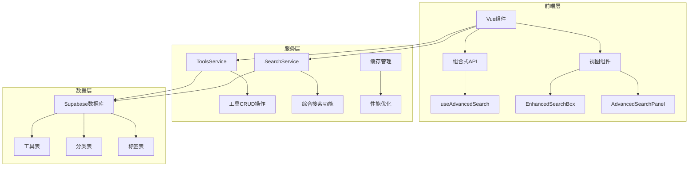
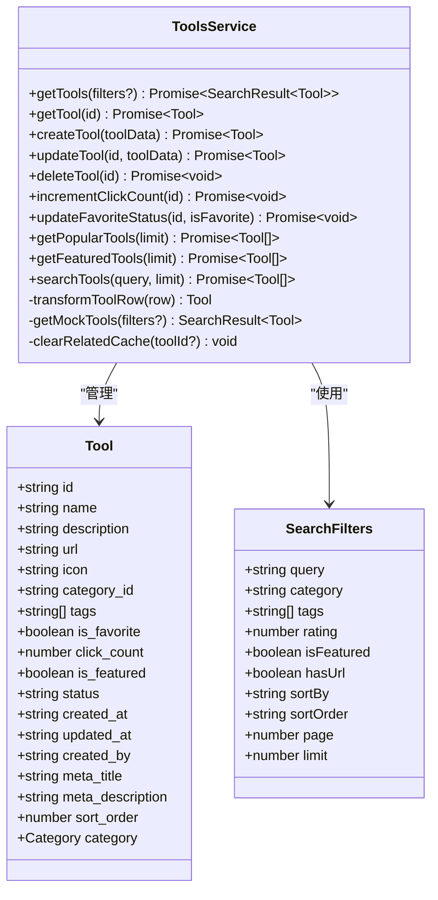
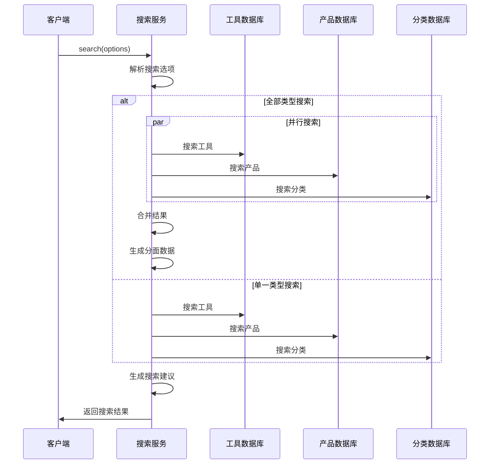
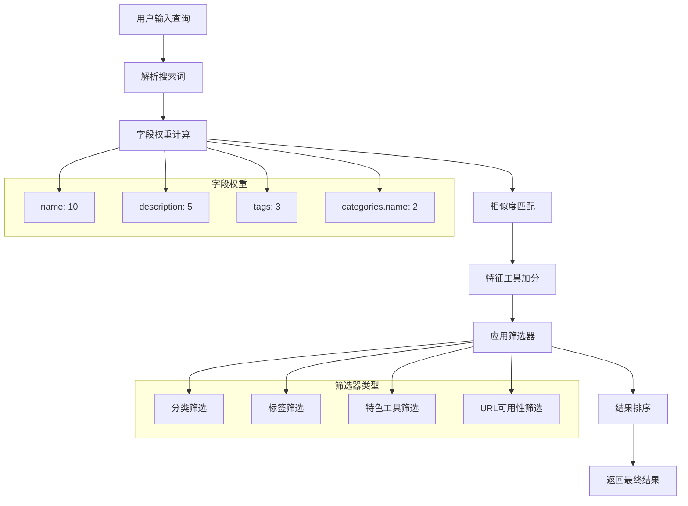
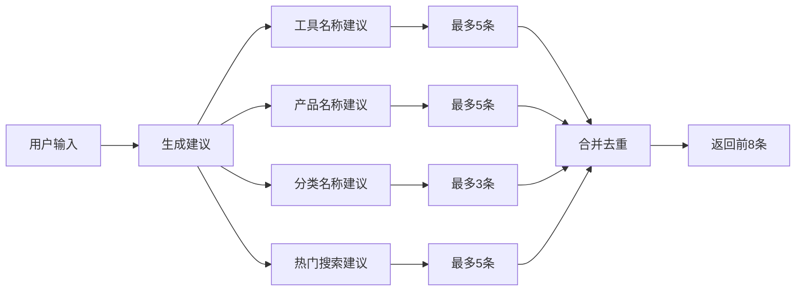
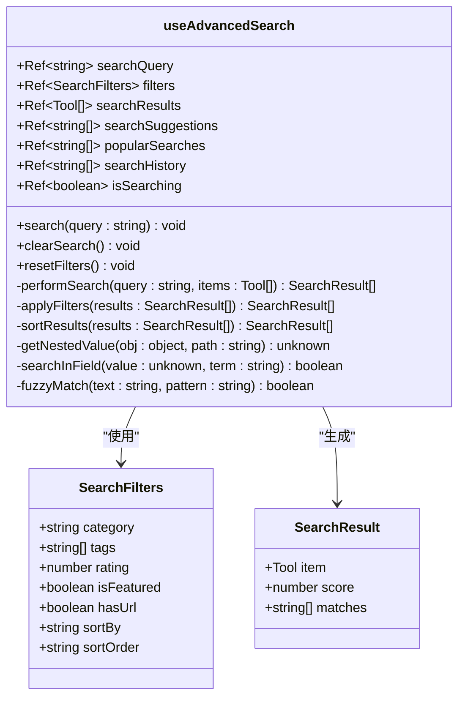
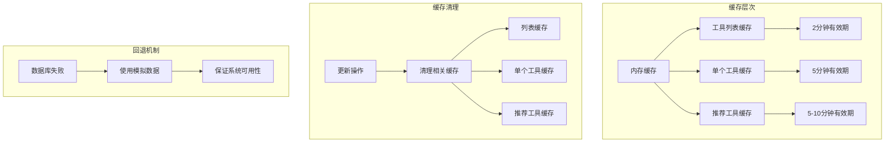

# 工具与搜索API文档

<cite>
**本文档引用的文件**
- [toolsService.ts](file://src/services/toolsService.ts)
- [searchService.ts](file://src/services/searchService.ts)
- [useAdvancedSearch.ts](file://src/composables/useAdvancedSearch.ts)
- [EnhancedSearchBox.vue](file://src/components/search/EnhancedSearchBox.vue)
- [AdvancedSearchPanel.vue](file://src/components/search/AdvancedSearchPanel.vue)
- [tools.ts](file://src/stores/tools.ts)
- [index.ts](file://src/types/index.ts)
</cite>

## 目录
1. [简介](#简介)
2. [项目结构概览](#项目结构概览)
3. [核心服务分析](#核心服务分析)
4. [高级搜索功能](#高级搜索功能)
5. [组合式API使用](#组合式api使用)
6. [性能优化策略](#性能优化策略)
7. [典型使用场景](#典型使用场景)
8. [故障排除指南](#故障排除指南)
9. [总结](#总结)

## 简介

本项目是一个现代化的工具导航平台，提供了完整的工具管理和搜索功能。系统采用Vue 3 + TypeScript技术栈，结合Supabase数据库，实现了高效的工具发现、搜索和管理功能。

主要功能包括：
- 工具的完整CRUD操作
- 高级搜索和过滤功能
- 智能搜索建议
- 缓存优化机制
- 性能监控和分析

## 项目结构概览



**图表来源**
- [toolsService.ts](file://src/services/toolsService.ts#L1-L50)
- [searchService.ts](file://src/services/searchService.ts#L1-L50)

## 核心服务分析

### ToolsService - 工具服务

ToolsService是工具管理的核心服务，提供了完整的工具生命周期管理功能。



**图表来源**
- [toolsService.ts](file://src/services/toolsService.ts#L20-L100)
- [index.ts](file://src/types/index.ts#L1-L50)

#### 核心方法详解

**1. getTools方法**
```typescript
static async getTools(filters?: SearchFilters): Promise<SearchResult<Tool>>
```
- **功能**: 获取工具列表，支持全文搜索、分类过滤、排序和分页
- **缓存策略**: 2分钟缓存，提升频繁查询性能
- **特点**: 支持多种搜索条件组合，返回完整的分页信息

**2. createTool方法**
```typescript
static async createTool(toolData: ToolInput): Promise<Tool>
```
- **功能**: 创建新工具，自动验证必需字段
- **数据转换**: 自动处理分类ID和元数据
- **错误处理**: 完整的错误捕获和日志记录

**3. 智能缓存机制**
- **列表缓存**: 2分钟有效期，减少数据库查询
- **单个工具缓存**: 5分钟有效期，适用于详情页面
- **推荐工具缓存**: 5-10分钟有效期，根据更新频率调整

**节来源**
- [toolsService.ts](file://src/services/toolsService.ts#L25-L150)

### SearchService - 搜索服务

SearchService提供了强大的综合搜索功能，支持多类型内容的统一搜索。



**图表来源**
- [searchService.ts](file://src/services/searchService.ts#L40-L120)

#### 搜索类型支持

1. **工具搜索** (`tools`)
   - 全文搜索：名称、描述、元数据
   - 分类筛选：精确匹配分类ID
   - 标签筛选：多标签组合
   - 相关性排序：特色工具优先，点击次数次之

2. **产品搜索** (`products`)
   - 价格范围筛选：支持区间查询
   - 产品特性：短描述、特性列表
   - 排序选项：价格、创建时间、相关性

3. **分类搜索** (`categories`)
   - 分类层级：支持父子分类
   - 激活状态：只显示有效分类
   - 排序：按排序字段和创建时间

**节来源**
- [searchService.ts](file://src/services/searchService.ts#L80-L200)

## 高级搜索功能

### 搜索算法实现

高级搜索功能通过useAdvancedSearch组合式API实现，提供了智能的客户端搜索算法。



**图表来源**
- [useAdvancedSearch.ts](file://src/composables/useAdvancedSearch.ts#L30-L100)

#### 智能搜索算法

**1. 字段权重系统**
- 名称匹配：权重10
- 描述匹配：权重5  
- 标签匹配：权重3
- 分类名称：权重2

**2. 模糊匹配**
- 使用Fuzzy Match算法进行近似匹配
- 支持部分关键词匹配
- 优先级：完全匹配 > 模糊匹配

**3. 特征工具优先级**
- 特色工具额外+1分
- 不考虑评分系统，使用点击次数替代

**节来源**
- [useAdvancedSearch.ts](file://src/composables/useAdvancedSearch.ts#L30-L80)

### 搜索建议系统



**图表来源**
- [searchService.ts](file://src/services/searchService.ts#L400-L450)

#### 建议类型

1. **查询建议** (`query`)
   - 基于工具名称模糊匹配
   - 基于产品名称模糊匹配
   - 基于分类名称模糊匹配

2. **类别建议** (`category`)
   - 激活状态的分类
   - 支持实时搜索

3. **标签建议** (`tag`)
   - 所有标签的快速访问
   - 支持自定义标签输入

**节来源**
- [searchService.ts](file://src/services/searchService.ts#L400-L500)

## 组合式API使用

### useAdvancedSearch API

useAdvancedSearch是一个专门的组合式API，为前端组件提供高级搜索功能。



**图表来源**
- [useAdvancedSearch.ts](file://src/composables/useAdvancedSearch.ts#L15-L50)

#### API使用示例

**1. 基础搜索**
```typescript
// 组件中使用
const { search, searchQuery, searchResults } = useAdvancedSearch();

// 触发搜索
search('Vue.js');

// 监听搜索结果
watchEffect(() => {
  console.log('搜索结果:', searchResults.value);
});
```

**2. 高级筛选**
```typescript
// 设置筛选条件
const { filters } = useAdvancedSearch();

filters.value = {
  category: 'frontend',
  tags: ['framework', 'javascript'],
  isFeatured: true,
  sortBy: 'clicks',
  sortOrder: 'desc'
};
```

**3. 结果展示**
```vue
<template>
  <div v-if="searchResults.length > 0">
    <div v-for="result in searchResults" :key="result.item.id">
      <h3>{{ result.item.name }} (得分: {{ result.score }})</h3>
      <p>{{ result.item.description }}</p>
      <p>匹配字段: {{ result.matches.join(', ') }}</p>
    </div>
  </div>
</template>
```

**节来源**
- [useAdvancedSearch.ts](file://src/composables/useAdvancedSearch.ts#L100-L200)

## 性能优化策略

### 缓存策略

系统采用了多层次的缓存策略来提升性能：



**图表来源**
- [toolsService.ts](file://src/services/toolsService.ts#L30-L50)

#### 缓存配置

1. **工具列表缓存**
   - **键**: `tools_${JSON.stringify(filters)}`
   - **有效期**: 2分钟
   - **适用场景**: 列表页面、搜索结果页

2. **单个工具缓存**
   - **键**: `tool_${id}`
   - **有效期**: 5分钟
   - **适用场景**: 工具详情页

3. **推荐工具缓存**
   - **键**: `popular_tools_${limit}` 或 `featured_tools_${limit}`
   - **有效期**: 5-10分钟
   - **适用场景**: 首页推荐、侧边栏推荐

**节来源**
- [toolsService.ts](file://src/services/toolsService.ts#L30-L60)

### 数据库优化

**1. 索引策略**
- 工具表：主键索引、状态索引、分类索引
- 全文搜索：ILIKE索引支持模糊匹配
- 排序字段：点击次数、创建时间索引

**2. 查询优化**
- 使用SELECT明确字段，避免SELECT *
- 并行查询多个表的数据
- 分页查询减少内存占用

**3. RLS策略**
- Row Level Security确保数据安全
- 基于用户角色的权限控制
- 动态权限检查

### 前端优化

**1. 虚拟滚动**
- 大列表使用虚拟滚动
- 只渲染可见区域的内容
- 显著提升性能

**2. 懒加载**
- 图片懒加载
- 组件懒加载
- 减少初始加载时间

**3. 防抖和节流**
- 搜索输入防抖处理
- 滚动事件节流
- 避免频繁触发

## 典型使用场景

### 场景1：工具发现页面

```vue
<template>
  <div class="tools-discovery">
    <!-- 搜索框 -->
    <EnhancedSearchBox 
      @search="performSearch"
      @suggestions="updateSuggestions"
    />
    
    <!-- 高级筛选面板 -->
    <AdvancedSearchPanel
      v-model:filters="filters"
      :isOpen="showAdvanced"
      @close="showAdvanced = false"
      @search="performSearch"
    />
    
    <!-- 搜索结果 -->
    <div v-if="searchResults.length > 0">
      <ToolCard 
        v-for="tool in searchResults" 
        :key="tool.id"
        :tool="tool"
      />
    </div>
  </div>
</template>

<script setup lang="ts">
import { ref, reactive } from 'vue';
import { useAdvancedSearch } from '@/composables/useAdvancedSearch';
import { searchService } from '@/services/searchService';

const { search, filters, searchResults } = useAdvancedSearch();
const showAdvanced = ref(false);

// 执行搜索
async function performSearch(query: string) {
  search(query);
  
  // 同时执行服务端搜索
  const results = await searchService.search({
    query,
    type: 'tools',
    limit: 20
  });
  
  console.log('搜索结果:', results);
}
</script>
```

### 场景2：工具详情页

```vue
<script setup lang="ts">
import { ref, onMounted } from 'vue';
import { useRoute } from 'vue-router';
import { toolsService } from '@/services/toolsService';

const route = useRoute();
const tool = ref(null);
const loading = ref(true);

onMounted(async () => {
  try {
    const toolId = route.params.id as string;
    tool.value = await toolsService.getTool(toolId);
    
    // 增加点击计数
    await toolsService.incrementClickCount(toolId);
  } catch (error) {
    console.error('获取工具失败:', error);
  } finally {
    loading.value = false;
  }
});
</script>
```

### 场景3：管理后台

```vue
<script setup lang="ts">
import { ref, computed } from 'vue';
import { toolsService } from '@/services/toolsService';
import { useToolsStore } from '@/stores/tools';

const store = useToolsStore();
const editingTool = ref(null);
const showForm = ref(false);

// 获取工具列表
async function loadTools() {
  try {
    const filters = {
      category: selectedCategory.value,
      sortBy: 'created_at',
      sortOrder: 'desc'
    };
    
    const result = await toolsService.getTools(filters);
    store.setTools(result.items);
  } catch (error) {
    console.error('加载工具失败:', error);
  }
}

// 创建新工具
async function createTool(toolData: any) {
  try {
    const newTool = await toolsService.createTool(toolData);
    store.addTool(newTool);
    showForm.value = false;
  } catch (error) {
    console.error('创建工具失败:', error);
  }
}
</script>
```

## 故障排除指南

### 常见问题及解决方案

**1. 搜索结果为空**
- **原因**: 数据库连接问题或查询条件过于严格
- **解决方案**: 
  - 检查网络连接
  - 尝试更宽松的查询条件
  - 查看控制台错误日志

**2. 缓存失效**
- **原因**: 缓存键生成错误或缓存清理策略不当
- **解决方案**:
  - 检查缓存键生成逻辑
  - 验证缓存清理时机
  - 使用调试模式查看缓存状态

**3. 性能问题**
- **原因**: 查询过于复杂或缺少索引
- **解决方案**:
  - 优化查询条件
  - 添加必要的数据库索引
  - 使用分页减少数据量

**4. 数据一致性**
- **原因**: 缓存与数据库不同步
- **解决方案**:
  - 实施缓存失效策略
  - 定期检查数据同步
  - 使用事务保证一致性

### 调试工具

**1. 开发者工具**
```typescript
// 启用调试模式
localStorage.setItem('debug:tools', 'true');

// 查看缓存状态
console.log('缓存命中率:', apiCache.getStats());

// 监控API调用
toolsService.getTools = new Proxy(toolsService.getTools, {
  apply(target, thisArg, argArray) {
    console.log('API调用:', target.name, argArray);
    return Reflect.apply(target, thisArg, argArray);
  }
});
```

**2. 性能监控**
```typescript
// 监控搜索性能
const startTime = performance.now();
const results = await searchService.search(options);
const endTime = performance.now();
console.log(`搜索耗时: ${endTime - startTime}ms`);
```

**节来源**
- [toolsService.ts](file://src/services/toolsService.ts#L600-L642)
- [searchService.ts](file://src/services/searchService.ts#L600-L641)

## 总结

本项目提供了一套完整的工具管理和搜索解决方案，具有以下特点：

### 技术优势

1. **模块化设计**: 清晰的服务层和组件层分离
2. **性能优化**: 多层次缓存和数据库优化
3. **用户体验**: 智能搜索建议和高级筛选功能
4. **可维护性**: 完善的错误处理和日志记录

### 功能亮点

1. **统一搜索**: 支持工具、产品、分类的综合搜索
2. **智能算法**: 基于权重的相关性排序和模糊匹配
3. **实时反馈**: 搜索建议和历史记录
4. **灵活配置**: 支持多种搜索条件和排序方式

### 扩展建议

1. **搜索引擎**: 集成Elasticsearch提升搜索能力
2. **推荐系统**: 基于用户行为的个性化推荐
3. **多语言支持**: 国际化的搜索和显示
4. **移动端优化**: 移动端专用的搜索界面

这套系统为工具导航平台提供了坚实的技术基础，能够满足现代Web应用对搜索功能的各种需求。