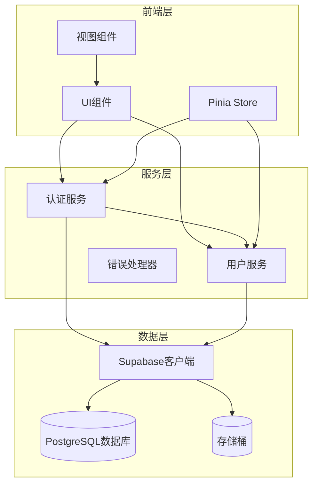
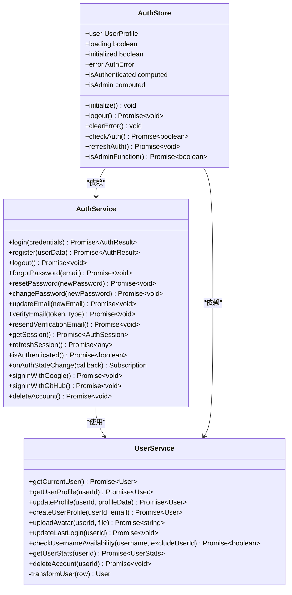
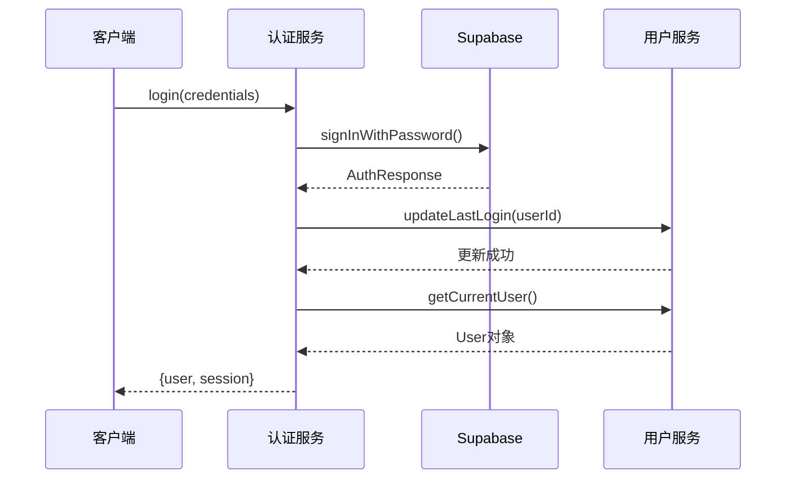
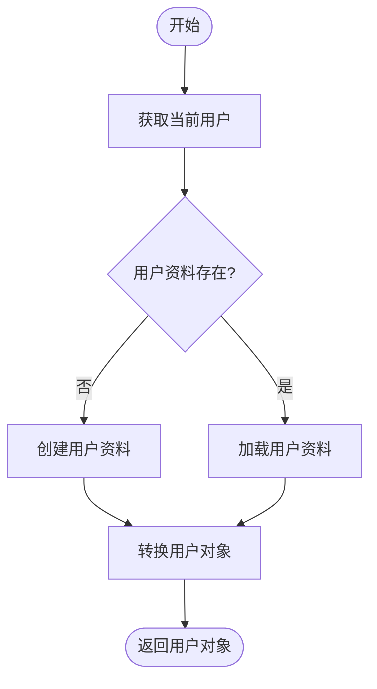
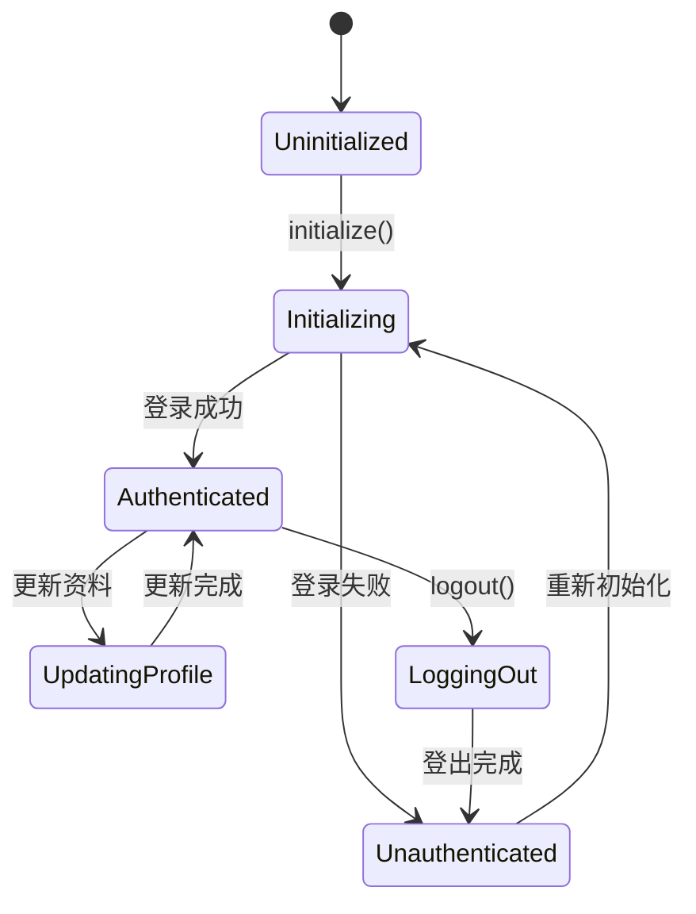
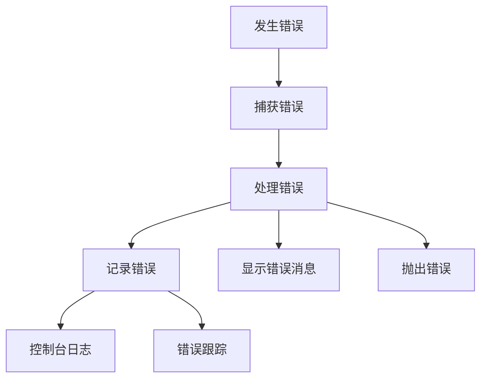

# 用户API详细文档

<cite>
**本文档引用的文件**
- [authService.ts](file://src/services/authService.ts)
- [userService.ts](file://src/services/userService.ts)
- [auth.ts](file://src/stores/auth.ts)
- [index.ts](file://src/types/index.ts)
- [LoginForm.vue](file://src/components/auth/LoginForm.vue)
- [LoginView.vue](file://src/views/auth/LoginView.vue)
- [RegisterView.vue](file://src/views/auth/RegisterView.vue)
- [ProfileView.vue](file://src/views/user/ProfileView.vue)
</cite>

## 目录
1. [简介](#简介)
2. [项目架构概览](#项目架构概览)
3. [核心服务组件](#核心服务组件)
4. [认证服务详解](#认证服务详解)
5. [用户服务详解](#用户服务详解)
6. [Pinia状态管理](#pinia状态管理)
7. [组件集成示例](#组件集成示例)
8. [错误处理机制](#错误处理机制)
9. [常见问题解决方案](#常见问题解决方案)
10. [最佳实践建议](#最佳实践建议)

## 简介

本文档详细介绍了Advanced Tools Navigation项目中的用户相关API系统，涵盖了从用户认证到个人资料管理的完整功能栈。该系统基于Supabase身份验证服务构建，提供了完整的用户生命周期管理功能。

主要特性包括：
- 完整的用户认证流程（登录、注册、登出）
- 个人资料管理（更新、头像上传）
- 第三方身份验证支持（Google、GitHub）
- 会话管理和状态同步
- 错误处理和性能监控

## 项目架构概览



**图表来源**
- [authService.ts](file://src/services/authService.ts#L1-L306)
- [userService.ts](file://src/services/userService.ts#L1-L308)
- [auth.ts](file://src/stores/auth.ts#L1-L190)

## 核心服务组件

### 服务架构关系



**图表来源**
- [authService.ts](file://src/services/authService.ts#L15-L306)
- [userService.ts](file://src/services/userService.ts#L18-L308)
- [auth.ts](file://src/stores/auth.ts#L15-L190)

**章节来源**
- [authService.ts](file://src/services/authService.ts#L1-L306)
- [userService.ts](file://src/services/userService.ts#L1-L308)
- [auth.ts](file://src/stores/auth.ts#L1-L190)

## 认证服务详解

### 登录功能

`AuthService.login()` 方法负责处理用户登录流程：

```typescript
static async login(
  credentials: LoginForm,
): Promise<{ user: User; session: AuthSession }>
```

**参数类型：**
- `credentials.email`: string - 用户邮箱地址
- `credentials.password`: string - 用户密码

**返回值：**
- `user`: User - 包含用户详细信息的对象
- `session`: AuthSession - 包含认证令牌的会话信息

**实现流程：**



**图表来源**
- [authService.ts](file://src/services/authService.ts#L20-L40)
- [userService.ts](file://src/services/userService.ts#L25-L45)

### 注册功能

`AuthService.register()` 方法处理用户注册流程：

```typescript
static async register(
  userData: RegisterForm,
): Promise<{ user: User; session: AuthSession }>
```

**注册流程特点：**
1. 检查用户名可用性
2. 调用Supabase注册API
3. 创建用户资料记录
4. 更新用户信息（如果提供）

**章节来源**
- [authService.ts](file://src/services/authService.ts#L42-L90)

### 第三方认证

系统支持Google和GitHub第三方登录：

```typescript
// Google登录
static async signInWithGoogle(): Promise<void>

// GitHub登录  
static async signInWithGitHub(): Promise<void>
```

**章节来源**
- [authService.ts](file://src/services/authService.ts#L270-L290)

## 用户服务详解

### 用户资料管理

`UserService` 提供了完整的用户资料管理功能：



**图表来源**
- [userService.ts](file://src/services/userService.ts#L25-L45)

### 头像上传功能

`UserService.uploadAvatar()` 方法处理头像上传：

```typescript
static async uploadAvatar(userId: string, file: File): Promise<string>
```

**上传流程：**
1. 生成唯一的文件名
2. 删除旧头像文件
3. 上传新头像到Supabase存储
4. 返回公共访问URL

**章节来源**
- [userService.ts](file://src/services/userService.ts#L120-L150)

### 用户统计信息

`UserService.getUserStats()` 提供用户统计数据：

```typescript
static async getUserStats(userId: string): Promise<{
  favoriteToolsCount: number;
  favoriteProductsCount: number;
  ordersCount: number;
  totalSpent: number;
}>
```

**统计指标：**
- 收藏的工具数量
- 收藏的产品数量
- 订单总数
- 总消费金额

**章节来源**
- [userService.ts](file://src/services/userService.ts#L180-L220)

## Pinia状态管理

### 认证状态管理

`useAuthStore` 是核心的状态管理器：



**图表来源**
- [auth.ts](file://src/stores/auth.ts#L60-L120)

### 状态属性

```typescript
// 状态属性
const user = ref<UserProfile | null>(null);
const loading = ref(false);
const initialized = ref(false);
const error = ref<AuthError | null>(null);

// 计算属性
const isAuthenticated = computed(() => !!user.value);
const isAdmin = computed(() => {
  return user.value?.role === "admin" || user.value?.role === "super_admin";
});
```

**章节来源**
- [auth.ts](file://src/stores/auth.ts#L15-L40)

### 认证状态监听

Store通过监听Supabase认证状态变化来保持状态同步：

```typescript
const { data: { subscription } } = supabase.auth.onAuthStateChange(
  async (event, session) => {
    // 处理认证状态变化
  }
);
```

**章节来源**
- [auth.ts](file://src/stores/auth.ts#L60-L120)

## 组件集成示例

### 登录组件集成

```vue
<template>
  <form @submit.prevent="handleSubmit">
    <input v-model="form.email" type="email" required>
    <input v-model="form.password" type="password" required>
    <button type="submit" :disabled="loading">
      {{ loading ? '登录中...' : '登录' }}
    </button>
  </form>
</template>

<script setup lang="ts">
import { AuthService } from '@/services/authService';
import { useAuthStore } from '@/stores/auth';

async function handleSubmit() {
  try {
    loading.value = true;
    const result = await AuthService.login(form.value);
    
    // 强制刷新用户状态
    const authStore = useAuthStore();
    await authStore.initialize();
    
    emit('success');
  } catch (err) {
    error.value = err instanceof Error ? err.message : '登录失败';
  } finally {
    loading.value = false;
  }
}
</script>
```

**章节来源**
- [LoginForm.vue](file://src/components/auth/LoginForm.vue#L40-L80)

### 个人资料组件集成

```vue
<template>
  <form @submit.prevent="handleSave">
    <input v-model="form.fullName" type="text">
    <input v-model="form.username" type="text">
    <textarea v-model="form.bio"></textarea>
    <button type="submit" :disabled="loading">
      {{ loading ? '保存中...' : '保存更改' }}
    </button>
  </form>
</template>

<script setup lang="ts">
import { UserService } from '@/services/userService';

async function handleSave() {
  try {
    loading.value = true;
    await UserService.updateProfile(userId, form.value);
    // 更新成功处理...
  } catch (err) {
    error.value = err instanceof Error ? err.message : '保存失败';
  } finally {
    loading.value = false;
  }
}
</script>
```

**章节来源**
- [ProfileView.vue](file://src/views/user/ProfileView.vue#L200-L250)

## 错误处理机制

### 错误处理策略

系统采用统一的错误处理机制：



**图表来源**
- [authService.ts](file://src/services/authService.ts#L30-L50)
- [userService.ts](file://src/services/userService.ts#L30-L50)

### 错误类型

系统定义了多种错误类型：

```typescript
// 认证事件类型
export type AuthEvent = 
  | 'SIGNED_IN' 
  | 'SIGNED_OUT' 
  | 'TOKEN_REFRESHED' 
  | 'USER_UPDATED' 
  | 'PASSWORD_RECOVERY';

// 认证会话类型
export interface AuthSession {
  access_token: string;
  refresh_token: string;
  expires_in: number;
  expires_at?: number;
  token_type: string;
  user: User;
}
```

**章节来源**
- [index.ts](file://src/types/index.ts#L280-L300)

## 常见问题解决方案

### 认证失败处理

**问题：登录失败**
- 检查网络连接
- 验证邮箱和密码是否正确
- 查看控制台错误日志

**解决方案：**
```typescript
try {
  const result = await AuthService.login(credentials);
} catch (error) {
  if (error.code === 'PGRST116') {
    // 用户资料不存在，自动创建
    const userProfile = await UserService.createUserProfile(
      result.user.id, 
      result.user.email!
    );
  }
}
```

### 会话过期处理

**问题：会话过期导致请求失败**
- 自动刷新会话令牌
- 重新登录流程

**解决方案：**
```typescript
// 在路由守卫中检查认证状态
async function checkAuth() {
  if (!initialized.value) {
    await initialize();
  }
  return isAuthenticated.value;
}
```

### 头像上传失败

**问题：头像上传失败**
- 检查文件大小和格式
- 验证存储权限
- 网络连接问题

**解决方案：**
```typescript
// 限制文件大小和类型
const MAX_FILE_SIZE = 2 * 1024 * 1024; // 2MB
const ALLOWED_TYPES = ['image/jpeg', 'image/png'];

if (file.size > MAX_FILE_SIZE) {
  throw new Error('文件大小不能超过2MB');
}

if (!ALLOWED_TYPES.includes(file.type)) {
  throw new Error('只允许上传JPEG或PNG格式的图片');
}
```

**章节来源**
- [userService.ts](file://src/services/userService.ts#L120-L150)

## 最佳实践建议

### 安全最佳实践

1. **密码强度要求**
   - 最少8个字符
   - 包含大写字母、小写字母、数字和特殊字符
   - 使用密码强度指示器

2. **会话安全**
   - 合理设置会话过期时间
   - 实现自动登出机制
   - 监控异常登录活动

3. **数据保护**
   - 敏感数据加密存储
   - 实施适当的访问控制
   - 定期备份用户数据

### 性能优化建议

1. **缓存策略**
   - 缓存用户资料信息
   - 实现智能的重新验证机制
   - 减少不必要的API调用

2. **错误处理**
   - 实现渐进式降级
   - 提供友好的错误提示
   - 记录详细的错误日志

3. **用户体验**
   - 加载状态反馈
   - 实时验证表单输入
   - 响应式设计适配

### 开发规范

1. **类型安全**
   - 充分利用TypeScript类型
   - 定义清晰的接口契约
   - 实施严格的类型检查

2. **代码组织**
   - 模块化设计原则
   - 单一职责原则
   - 适当的抽象层次

3. **测试覆盖**
   - 单元测试覆盖关键功能
   - 集成测试验证组件交互
   - 端到端测试确保用户体验

通过遵循这些最佳实践，可以确保用户API系统的稳定性、安全性和可维护性，为用户提供优质的认证和管理体验。