# 订单与支付API文档

<cite>
**本文档引用的文件**
- [orderService.ts](file://src/services/orderService.ts)
- [paymentService.ts](file://src/services/paymentService.ts)
- [StripePayment.vue](file://src/components/StripePayment.vue)
- [AlipayPayment.vue](file://src/components/AlipayPayment.vue)
- [WechatPayment.vue](file://src/components/WechatPayment.vue)
- [PaymentView.vue](file://src/views/PaymentView.vue)
- [index.ts](file://src/types/index.ts)
</cite>

## 目录
1. [简介](#简介)
2. [项目架构概览](#项目架构概览)
3. [核心服务组件](#核心服务组件)
4. [订单管理服务](#订单管理服务)
5. [支付集成服务](#支付集成服务)
6. [支付组件实现](#支付组件实现)
7. [支付流程详解](#支付流程详解)
8. [安全最佳实践](#安全最佳实践)
9. [错误处理策略](#错误处理策略)
10. [性能优化建议](#性能优化建议)
11. [故障排除指南](#故障排除指南)
12. [总结](#总结)

## 简介

本文档详细介绍了基于Vue 3和TypeScript构建的订单管理系统与支付集成API。该系统提供了完整的订单生命周期管理，支持多种支付方式（Stripe、支付宝、微信支付），并实现了安全可靠的支付流程。

系统采用现代化的前端架构，结合Supabase数据库，为用户提供流畅的购物体验和安全的支付保障。通过模块化的服务设计，确保了系统的可维护性和扩展性。

## 项目架构概览

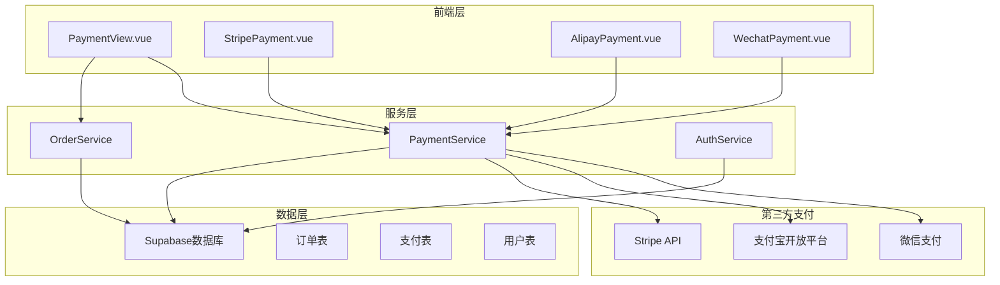

**图表来源**
- [PaymentView.vue](file://src/views/PaymentView.vue#L1-L50)
- [orderService.ts](file://src/services/orderService.ts#L1-L30)
- [paymentService.ts](file://src/services/paymentService.ts#L1-L30)

## 核心服务组件

系统的核心功能由两个主要服务类提供：

### OrderService - 订单管理服务
负责订单的创建、查询、状态管理和支付处理。

### PaymentService - 支付集成服务  
集成多种支付网关，提供统一的支付接口。

**章节来源**
- [orderService.ts](file://src/services/orderService.ts#L1-L50)
- [paymentService.ts](file://src/services/paymentService.ts#L1-L50)

## 订单管理服务

### 核心功能概述

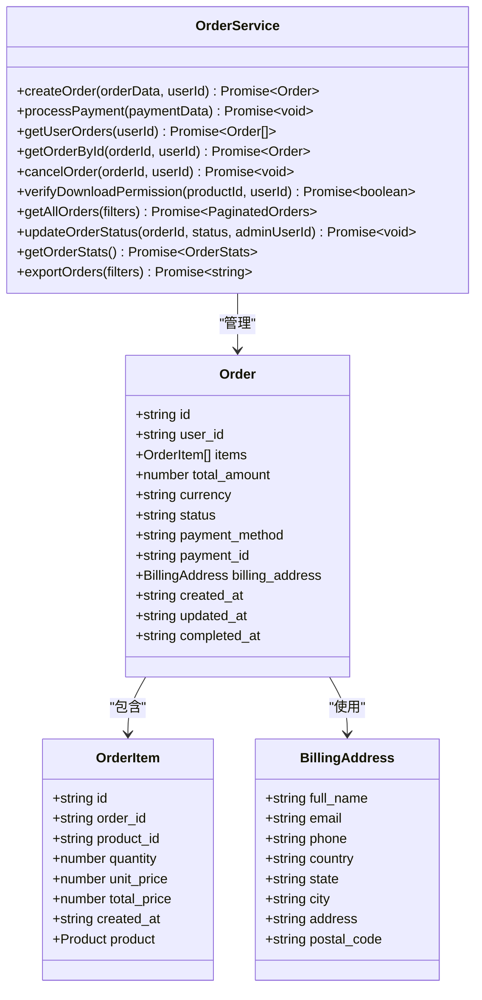

**图表来源**
- [orderService.ts](file://src/services/orderService.ts#L10-L50)
- [index.ts](file://src/types/index.ts#L100-L150)

### 订单创建流程

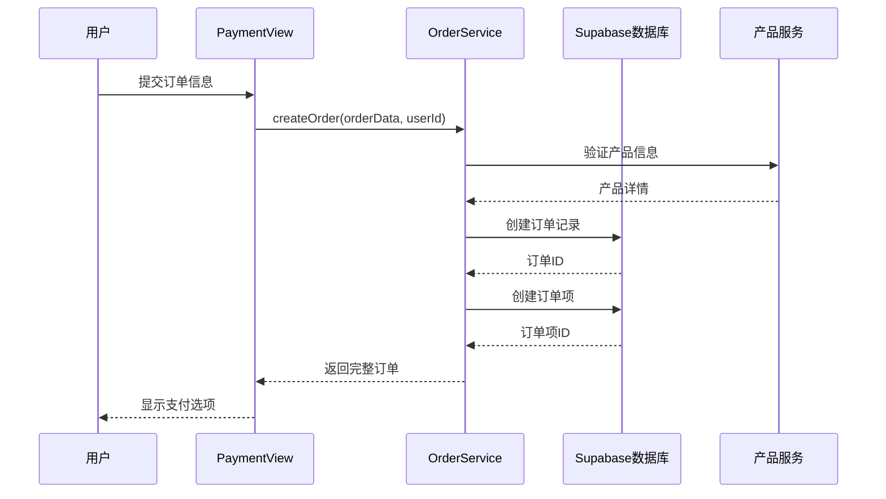

**图表来源**
- [orderService.ts](file://src/services/orderService.ts#L50-L150)
- [PaymentView.vue](file://src/views/PaymentView.vue#L250-L300)

### 支付处理机制

订单支付处理采用乐观锁机制，确保支付状态的一致性：

```typescript
// 支付处理示例
static async processPayment(paymentData: PaymentData): Promise<void> {
  try {
    const orderUpdateData: OrderUpdateData = {
      status: "paid",
      payment_method: paymentData.payment_method,
      payment_id: paymentData.payment_id,
      completed_at: new Date().toISOString(),
      updated_at: new Date().toISOString(),
    };

    // 使用状态过滤确保只更新待支付订单
    const { error } = await supabase
      .from("orders")
      .update(orderUpdateData)
      .eq("id", paymentData.order_id)
      .eq("status", "pending");

    if (error) throw error;

    // 创建支付记录
    const paymentInsertData: PaymentInsertData = {
      order_id: paymentData.order_id,
      amount: paymentData.amount,
      currency: "CNY",
      payment_method: paymentData.payment_method,
      provider_payment_id: paymentData.payment_id,
      status: "completed",
      completed_at: new Date().toISOString(),
      updated_at: new Date().toISOString(),
    };

    const { error: paymentError } = await supabase
      .from("payments")
      .insert([paymentInsertData]);

    if (paymentError) throw paymentError;
  } catch (error) {
    console.error("处理支付失败:", error);
    throw new Error("处理支付失败");
  }
}
```

**章节来源**
- [orderService.ts](file://src/services/orderService.ts#L150-L200)

## 支付集成服务

### 支付网关配置

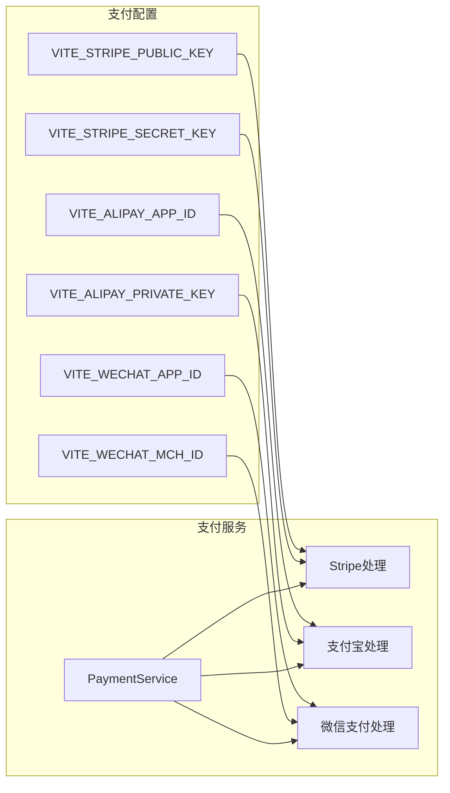

**图表来源**
- [paymentService.ts](file://src/services/paymentService.ts#L10-L50)

### 支付方式检测

系统自动检测可用的支付平台：

```typescript
// 检测可用支付平台
export const AVAILABLE_PAYMENT_METHODS = Object.entries(PAYMENT_CONFIG)
  .filter(([, config]) => config.enabled)
  .map(([method]) => method);

if (AVAILABLE_PAYMENT_METHODS.length === 0) {
  console.warn("⚠️ 没有配置任何支付平台，请设置至少一个支付平台的环境变量");
}
```

### 支付结果标准化

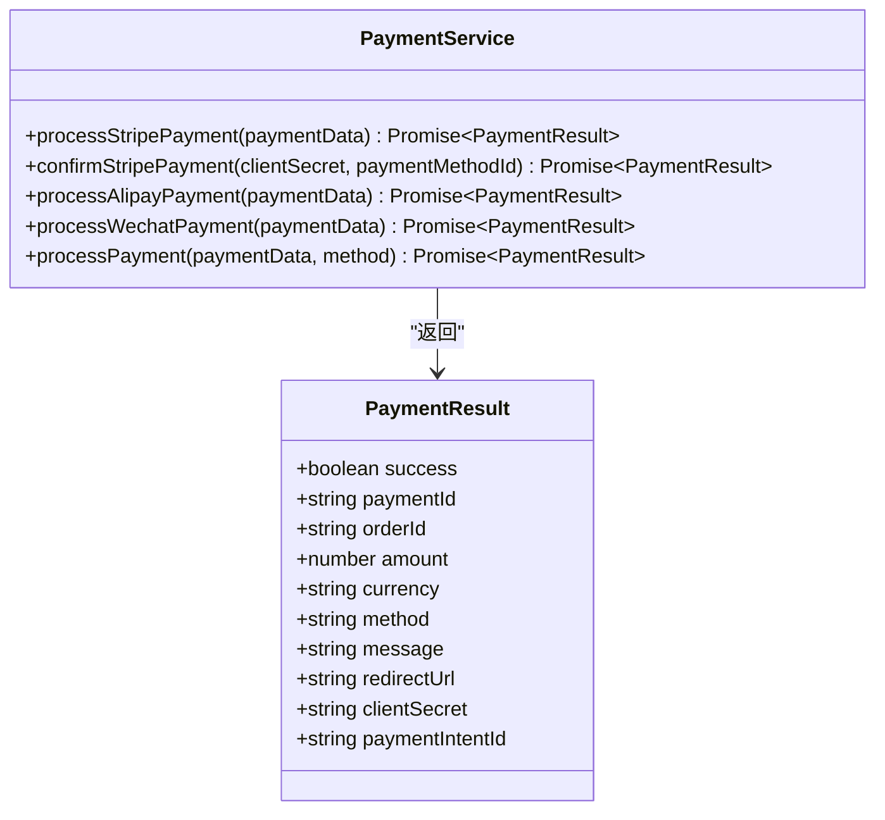

**图表来源**
- [paymentService.ts](file://src/services/paymentService.ts#L40-L80)
- [index.ts](file://src/types/index.ts#L150-L180)

**章节来源**
- [paymentService.ts](file://src/services/paymentService.ts#L1-L100)

## 支付组件实现

### Stripe支付组件

Stripe支付组件提供安全的信用卡支付体验：

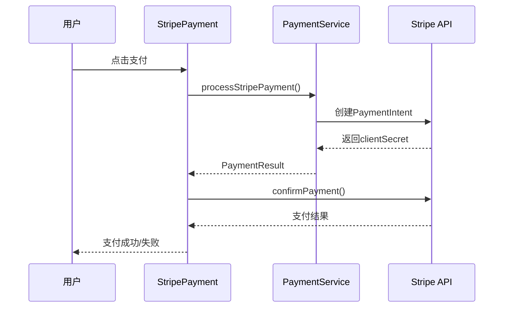

**图表来源**
- [StripePayment.vue](file://src/components/StripePayment.vue#L50-L100)
- [paymentService.ts](file://src/services/paymentService.ts#L60-L120)

### 支付宝支付组件

支付宝支付组件支持PC网站支付模式：

```typescript
// 支付宝支付处理
static async processAlipayPayment(
  paymentData: PaymentData,
): Promise<PaymentResult> {
  try {
    // 创建支付宝支付请求参数
    const alipayParams = {
      app_id: PAYMENT_CONFIG.alipay.appId,
      method: "alipay.trade.page.pay",
      charset: PAYMENT_CONFIG.alipay.charset,
      sign_type: PAYMENT_CONFIG.alipay.signType,
      timestamp: new Date().toISOString().slice(0, 19).replace("T", " "),
      version: "1.0",
      notify_url: `${window.location.origin}/api/payment/alipay/notify`,
      return_url: `${window.location.origin}/payment/success`,

      biz_content: JSON.stringify({
        out_trade_no: paymentData.order_id,
        total_amount: paymentData.amount.toFixed(2),
        subject: `订单支付 - ${paymentData.order_id}`,
        product_code: "FAST_INSTANT_TRADE_PAY",
        timeout_express: "30m",
      }),
    };

    // 生成支付URL
    const mockPaymentUrl = this.generateAlipayMockUrl(alipayParams);

    return {
      success: true,
      paymentId: `alipay_${Date.now()}`,
      orderId: paymentData.order_id,
      amount: paymentData.amount,
      currency: "CNY",
      method: "alipay",
      message: "跳转到支付宝支付页面",
      redirectUrl: mockPaymentUrl,
    };
  } catch (error) {
    return {
      success: false,
      orderId: paymentData.order_id,
      amount: paymentData.amount,
      currency: "CNY",
      method: "alipay",
      message: error instanceof Error ? error.message : "支付处理失败",
    };
  }
}
```

### 微信支付组件

微信支付组件提供二维码支付功能：

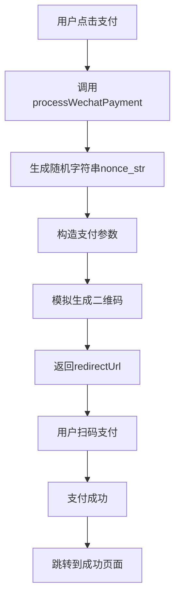

**图表来源**
- [WechatPayment.vue](file://src/components/WechatPayment.vue#L50-L100)
- [paymentService.ts](file://src/services/paymentService.ts#L200-L250)

**章节来源**
- [AlipayPayment.vue](file://src/components/AlipayPayment.vue#L1-L100)
- [WechatPayment.vue](file://src/components/WechatPayment.vue#L1-L100)

## 支付流程详解

### 完整支付流程

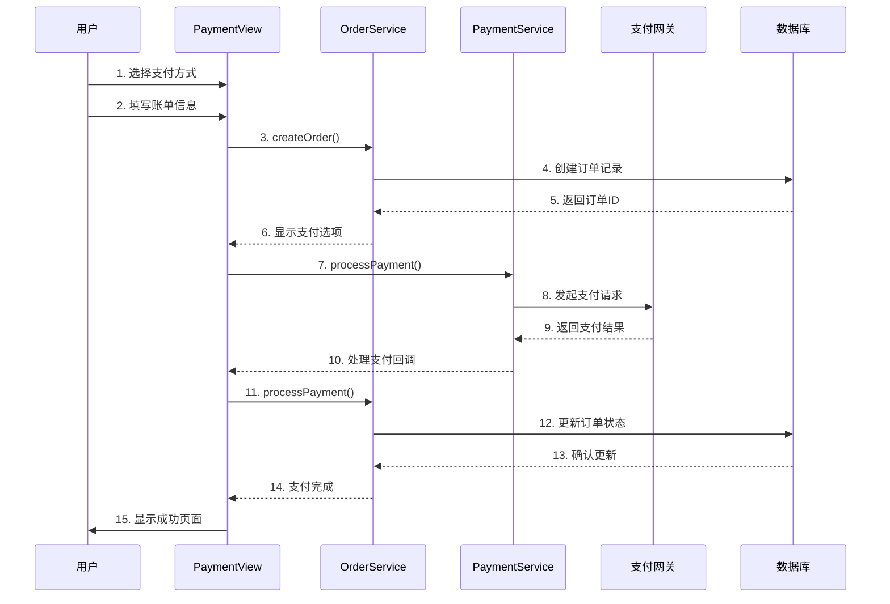

**图表来源**
- [PaymentView.vue](file://src/views/PaymentView.vue#L250-L400)
- [orderService.ts](file://src/services/orderService.ts#L150-L200)

### 支付状态管理

系统维护严格的订单状态流转：

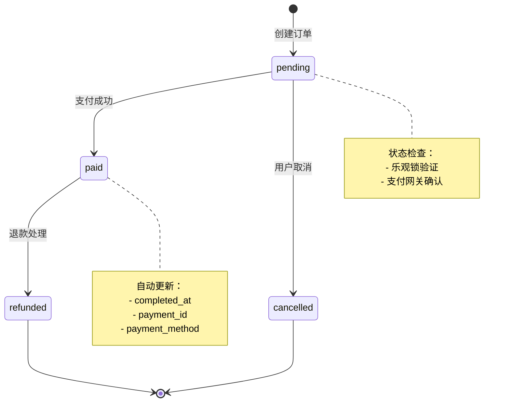

**图表来源**
- [orderService.ts](file://src/services/orderService.ts#L150-L200)

### 回调处理机制

支付网关的异步回调处理：

1. **同步回调**：用户支付完成后直接跳转
2. **异步通知**：支付网关主动通知支付结果
3. **状态验证**：双重验证确保支付结果准确性

**章节来源**
- [PaymentView.vue](file://src/views/PaymentView.vue#L200-L400)

## 安全最佳实践

### 数据传输安全

1. **HTTPS加密**：所有支付数据通过HTTPS传输
2. **Token验证**：使用JWT进行身份验证
3. **CSRF保护**：防止跨站请求伪造攻击

### 支付安全措施

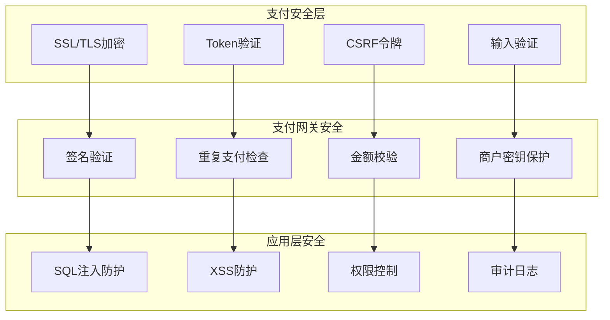

### 敏感数据保护

- **支付敏感信息**：仅在内存中临时存储
- **日志脱敏**：支付相关信息进行脱敏处理
- **访问控制**：严格限制支付相关API的访问权限

## 错误处理策略

### 分层错误处理

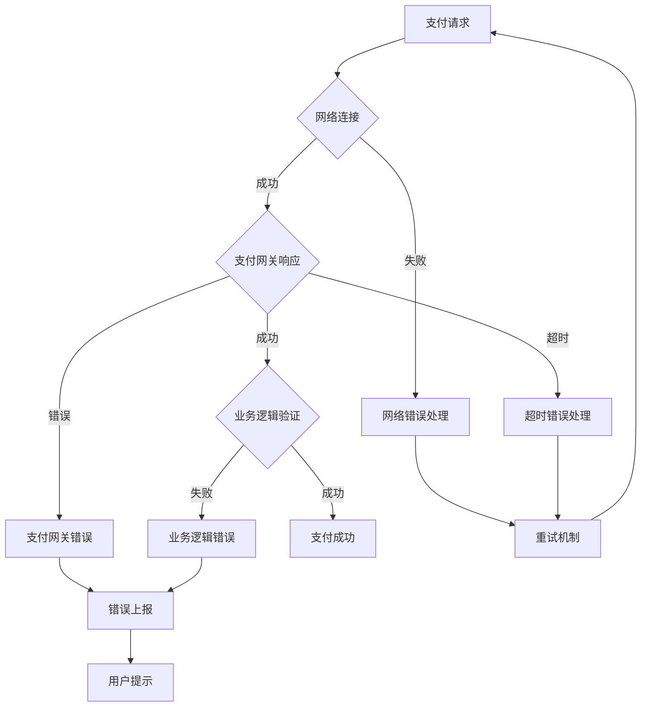

### 错误分类与处理

1. **网络错误**：自动重试机制
2. **支付网关错误**：详细错误码解析
3. **业务逻辑错误**：友好的用户提示
4. **系统错误**：记录日志并通知运维

### 降级策略

当支付网关不可用时的降级方案：

```typescript
// 支付方式降级示例
const processPaymentWithFallback = async (paymentData: PaymentData) => {
  const methods = ['stripe', 'alipay', 'wechat'];
  
  for (const method of methods) {
    try {
      return await PaymentService.processPayment(paymentData, method);
    } catch (error) {
      console.warn(`支付方式 ${method} 失败，尝试下一个`);
      continue;
    }
  }
  
  throw new Error('所有支付方式都不可用');
};
```

**章节来源**
- [paymentService.ts](file://src/services/paymentService.ts#L300-L387)

## 性能优化建议

### 缓存策略

1. **支付方式缓存**：缓存可用支付方式列表
2. **产品信息缓存**：减少数据库查询次数
3. **用户信息缓存**：提升用户体验

### 异步处理

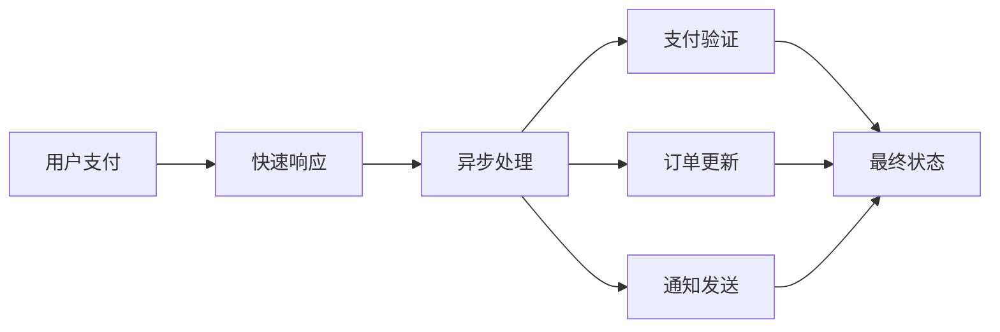

### 并发控制

- **支付并发限制**：防止重复支付
- **订单状态锁**：确保状态一致性
- **资源池管理**：优化支付网关连接

## 故障排除指南

### 常见问题诊断

1. **支付失败**
   - 检查支付网关配置
   - 验证网络连接
   - 查看错误日志

2. **订单状态异常**
   - 检查数据库事务
   - 验证支付回调
   - 确认状态机逻辑

3. **支付组件无响应**
   - 检查环境变量
   - 验证支付网关证书
   - 测试网络连通性

### 监控指标

- **支付成功率**：实时监控支付成功率
- **响应时间**：跟踪支付处理时间
- **错误率**：监控各类错误的发生频率
- **用户支付路径**：分析用户支付行为

### 日志记录

```typescript
// 支付日志记录示例
const logPaymentAttempt = (paymentData: PaymentData, method: string) => {
  console.log(`支付尝试 - 订单: ${paymentData.order_id}, 方式: ${method}, 金额: ${paymentData.amount}`);
};

const logPaymentResult = (result: PaymentResult) => {
  console.log(`支付结果 - 成功: ${result.success}, 订单: ${result.orderId}, 支付ID: ${result.paymentId}`);
};
```

**章节来源**
- [orderService.ts](file://src/services/orderService.ts#L700-L787)

## 总结

本文档详细介绍了基于Vue 3和TypeScript构建的订单管理系统与支付集成API。系统具有以下特点：

### 核心优势

1. **模块化设计**：清晰的服务分离，便于维护和扩展
2. **多支付支持**：集成Stripe、支付宝、微信支付等多种支付方式
3. **安全可靠**：完善的错误处理和安全措施
4. **用户体验**：流畅的支付流程和友好的界面设计

### 技术亮点

- **TypeScript强类型**：提供完整的类型安全保障
- **响应式设计**：适配各种设备和屏幕尺寸
- **异步处理**：高效的支付流程和状态管理
- **错误恢复**：智能的错误处理和降级策略

### 扩展建议

1. **支付方式扩展**：可根据需求添加新的支付网关
2. **功能增强**：支持更多支付场景和业务需求
3. **性能优化**：持续优化支付流程和系统性能
4. **监控完善**：建立更完善的监控和报警机制

该系统为企业级应用提供了可靠的订单管理和支付集成解决方案，能够满足现代电商应用的各种需求。