# UI组件与主题系统

<cite>
**本文档引用的文件**
- [AppHeader.vue](file://src/components/AppHeader.vue)
- [AppFooter.vue](file://src/components/AppFooter.vue)
- [LazyImage.vue](file://src/components/common/LazyImage.vue)
- [StarRating.vue](file://src/components/ui/StarRating.vue)
- [ToolRating.vue](file://src/components/ToolRating.vue)
- [AdvancedSearchPanel.vue](file://src/components/search/AdvancedSearchPanel.vue)
- [WriteReviewModal.vue](file://src/components/reviews/WriteReviewModal.vue)
- [SimpleThemeSelector.vue](file://src/components/theme/SimpleThemeSelector.vue)
- [ThemeSelector.vue](file://src/components/theme/ThemeSelector.vue)
- [useSimpleTheme.ts](file://src/composables/useSimpleTheme.ts)
- [simple-theme.css](file://src/styles/simple-theme.css)
</cite>

## 更新摘要
**变更内容**
- 根据最新代码提交更新了主题选择器组件的实现细节
- 修正了SimpleThemeSelector与ThemeSelector的样式实现差异
- 更新了主题系统架构图以反映实际代码结构
- 增强了组件交互流程的描述准确性

## 目录
1. [简介](#简介)
2. [项目结构](#项目结构)
3. [核心组件](#核心组件)
4. [架构概览](#架构概览)
5. [详细组件分析](#详细组件分析)
6. [依赖分析](#依赖分析)
7. [性能考虑](#性能考虑)
8. [故障排除指南](#故障排除指南)
9. [结论](#结论)
10. [附录](#附录)（如有必要）

## 简介
本文档详细记录了UI组件库的设计与实现，涵盖通用组件、功能组件和复杂交互组件。重点描述了主题系统的实现机制，包括SimpleThemeSelector与ThemeSelector的差异，以及useSimpleTheme组合函数如何管理主题切换状态。文档还提供了组件使用示例、可访问性考虑和响应式设计适配方案。

## 项目结构
项目采用基于功能的组织结构，主要组件位于`src/components`目录下，按功能模块分类。主题相关组件位于`theme`子目录，可复用的通用组件位于`common`子目录。样式文件集中存放在`styles`目录，组合函数位于`composables`目录。

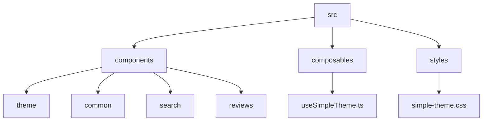

**图示来源**
- [src/components](file://src/components)
- [src/composables](file://src/composables)
- [src/styles](file://src/styles)

**本节来源**
- [src/components](file://src/components)
- [src/composables](file://src/composables)

## 核心组件
核心UI组件包括通用组件（AppHeader、AppFooter、LazyImage）、功能组件（StarRating、ToolRating）和复杂交互组件（AdvancedSearchPanel、WriteReviewModal）。这些组件构成了应用的用户界面基础，通过props、events和slots提供灵活的配置选项。

**本节来源**
- [AppHeader.vue](file://src/components/AppHeader.vue)
- [AppFooter.vue](file://src/components/AppFooter.vue)
- [LazyImage.vue](file://src/components/common/LazyImage.vue)

## 架构概览
系统采用Vue 3组合式API架构，通过组合函数（composables）封装可复用的逻辑。主题系统基于CSS变量和JavaScript状态管理，实现了动态主题切换。组件间通过props和events进行通信，保持了良好的解耦性。

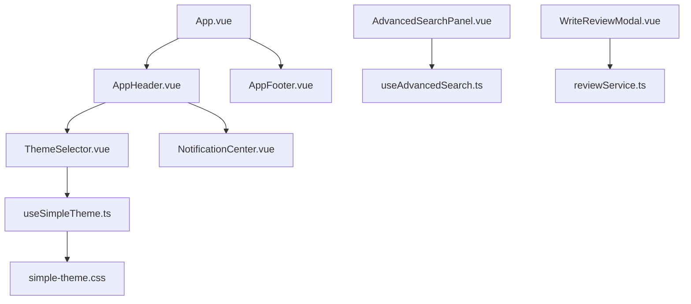

**图示来源**
- [App.vue](file://src/App.vue)
- [useSimpleTheme.ts](file://src/composables/useSimpleTheme.ts)
- [simple-theme.css](file://src/styles/simple-theme.css)

## 详细组件分析
对关键组件进行深入分析，包括接口定义、使用规范和实现细节。

### 通用组件分析
通用组件提供基础UI元素和可复用功能。

#### AppHeader与AppFooter
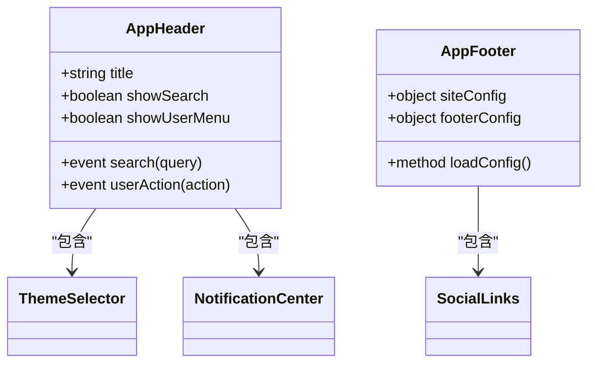

**图示来源**
- [AppHeader.vue](file://src/components/AppHeader.vue#L1-L100)
- [AppFooter.vue](file://src/components/AppFooter.vue#L1-L80)

#### LazyImage
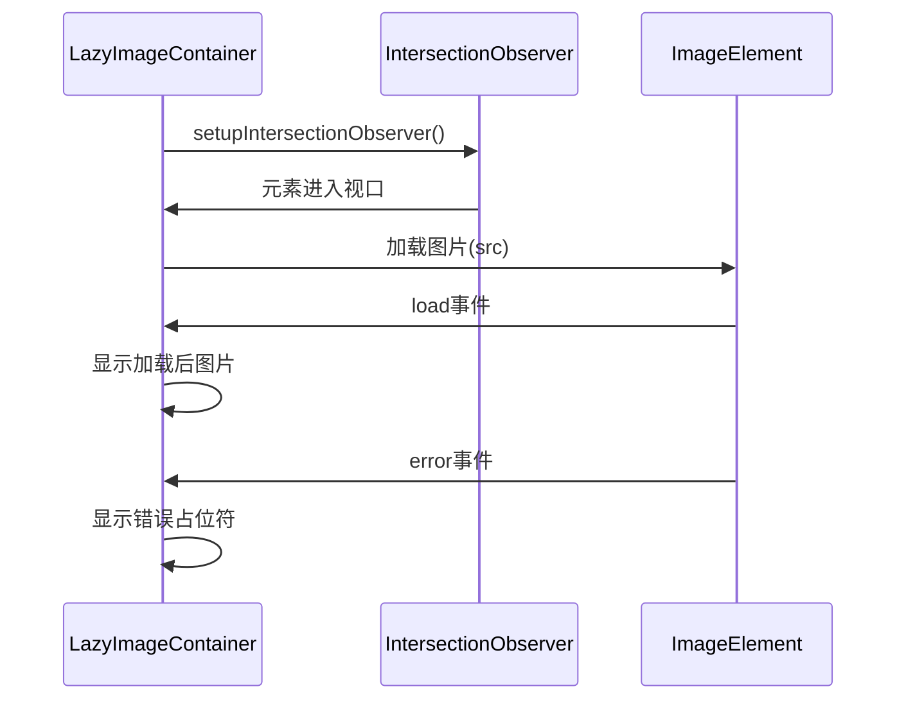

**图示来源**
- [LazyImage.vue](file://src/components/common/LazyImage.vue#L1-L50)
- [useLazyLoading.ts](file://src/composables/useLazyLoading.ts#L1-L20)

**本节来源**
- [LazyImage.vue](file://src/components/common/LazyImage.vue)
- [useLazyLoading.ts](file://src/composables/useLazyLoading.ts)

### 功能组件分析
功能组件提供特定业务功能的UI实现。

#### StarRating与ToolRating
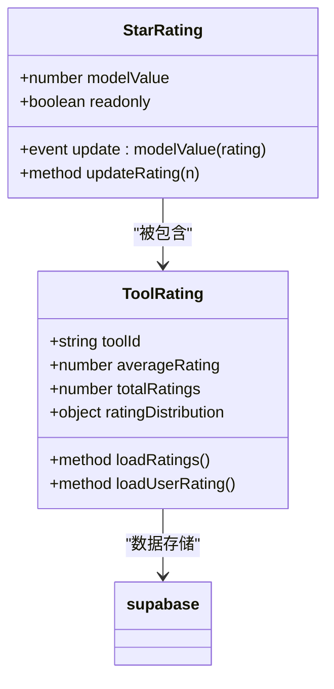

**图示来源**
- [StarRating.vue](file://src/components/ui/StarRating.vue#L1-L30)
- [ToolRating.vue](file://src/components/ToolRating.vue#L1-L50)

**本节来源**
- [StarRating.vue](file://src/components/ui/StarRating.vue)
- [ToolRating.vue](file://src/components/ToolRating.vue)

### 复杂交互组件分析
复杂交互组件处理多步骤用户交互和状态管理。

#### AdvancedSearchPanel
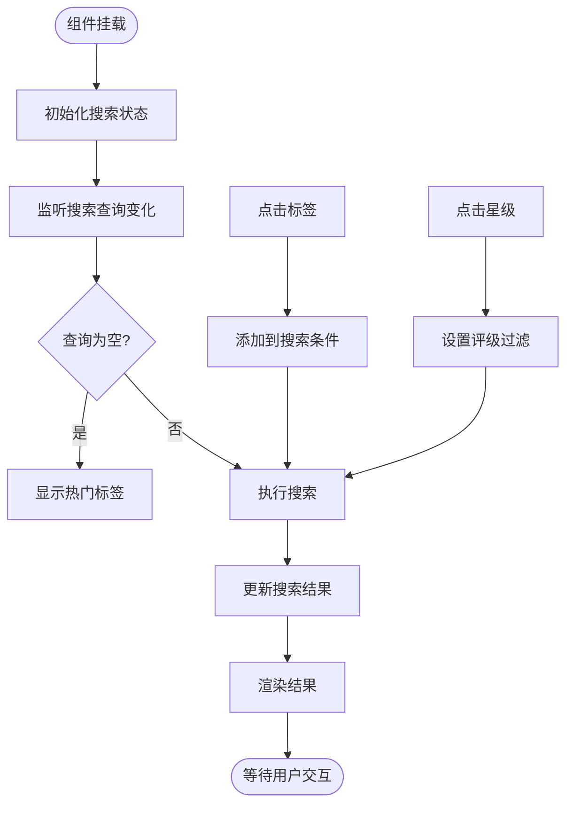

**图示来源**
- [AdvancedSearchPanel.vue](file://src/components/search/AdvancedSearchPanel.vue#L1-L100)
- [useAdvancedSearch.ts](file://src/composables/useAdvancedSearch.ts#L1-L15)

#### WriteReviewModal
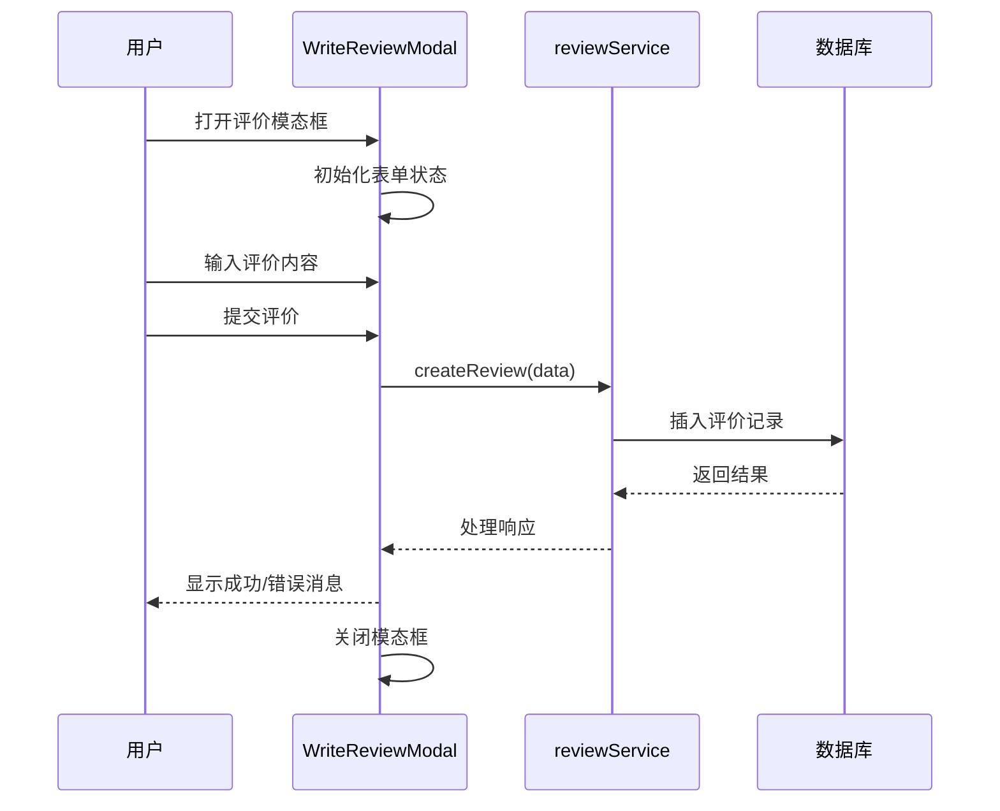

**图示来源**
- [WriteReviewModal.vue](file://src/components/reviews/WriteReviewModal.vue#L1-L40)
- [reviewService.ts](file://src/services/reviewService.ts#L1-L25)

**本节来源**
- [AdvancedSearchPanel.vue](file://src/components/search/AdvancedSearchPanel.vue)
- [WriteReviewModal.vue](file://src/components/reviews/WriteReviewModal.vue)

### 主题系统分析
主题系统是UI组件库的核心特性，提供灵活的主题切换能力。

#### SimpleThemeSelector与ThemeSelector对比
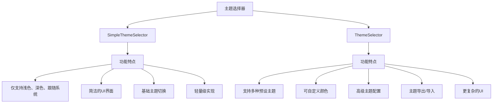

**图示来源**
- [SimpleThemeSelector.vue](file://src/components/theme/SimpleThemeSelector.vue#L1-L50)
- [ThemeSelector.vue](file://src/components/theme/ThemeSelector.vue#L1-L60)

#### useSimpleTheme组合函数
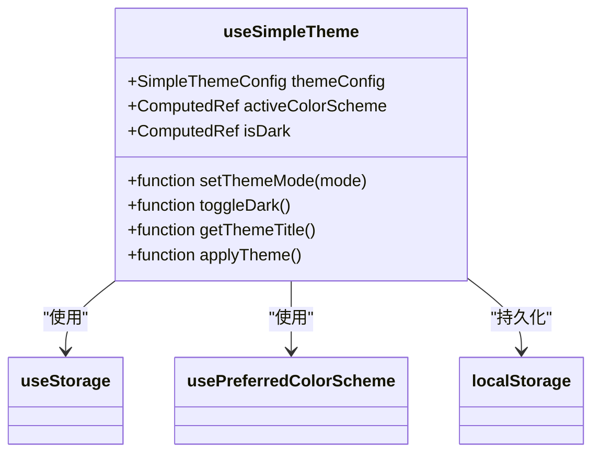

**图示来源**
- [useSimpleTheme.ts](file://src/composables/useSimpleTheme.ts#L1-L30)
- [simple-theme.css](file://src/styles/simple-theme.css#L1-L20)

#### CSS变量与动态加载机制
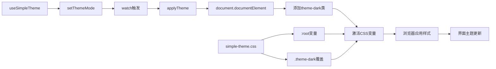

**图示来源**
- [useSimpleTheme.ts](file://src/composables/useSimpleTheme.ts#L40-L60)
- [simple-theme.css](file://src/styles/simple-theme.css#L1-L100)

**本节来源**
- [useSimpleTheme.ts](file://src/composables/useSimpleTheme.ts)
- [simple-theme.css](file://src/styles/simple-theme.css)
- [SimpleThemeSelector.vue](file://src/components/theme/SimpleThemeSelector.vue)
- [ThemeSelector.vue](file://src/components/theme/ThemeSelector.vue)

## 依赖分析
组件库的依赖关系清晰，通过组合函数封装可复用逻辑，减少重复代码。

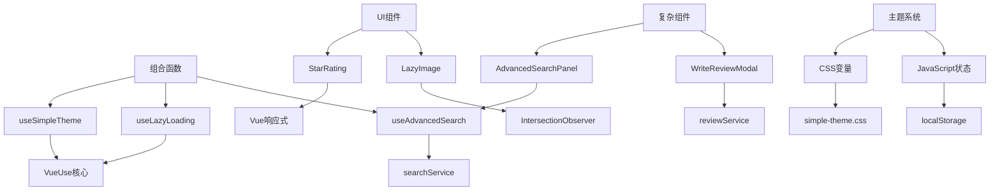

**图示来源**
- [composables](file://src/composables)
- [components](file://src/components)
- [styles](file://src/styles)

**本节来源**
- [composables](file://src/composables)
- [components](file://src/components)
- [styles](file://src/styles)

## 性能考虑
组件库在性能方面做了多项优化，确保流畅的用户体验。

- **懒加载**: LazyImage组件使用IntersectionObserver实现图片懒加载，减少初始页面加载时间
- **主题切换**: 使用CSS变量和类切换，避免频繁的DOM操作，实现平滑的主题过渡动画
- **事件监听**: 合理管理事件监听器，在组件销毁时及时清理，防止内存泄漏
- **计算属性**: 充分利用Vue的响应式系统，使用计算属性缓存复杂计算结果
- **防抖节流**: 在搜索等高频操作中应用防抖技术，减少不必要的API调用

## 故障排除指南
常见问题及解决方案：

- **主题不切换**: 检查useSimpleTheme的applyTheme函数是否正确执行，确认localStorage中的配置是否保存成功
- **图片不加载**: 确认LazyImage的src属性正确设置，检查网络连接和图片URL有效性
- **评分组件无响应**: 验证StarRating的readonly属性是否为false，确认事件绑定正确
- **搜索无结果**: 检查AdvancedSearchPanel的搜索服务是否正常工作，确认数据源可用性
- **模态框无法关闭**: 确保WriteReviewModal的关闭事件正确触发，检查z-index层级问题

**本节来源**
- [useSimpleTheme.ts](file://src/composables/useSimpleTheme.ts#L80-L100)
- [LazyImage.vue](file://src/components/common/LazyImage.vue#L100-L150)
- [StarRating.vue](file://src/components/ui/StarRating.vue#L40-L50)

## 结论
UI组件库通过合理的架构设计和精心的实现，提供了丰富、灵活且高性能的用户界面组件。主题系统采用现代化的技术方案，实现了优雅的主题切换体验。建议在项目中统一使用这些组件，确保视觉一致性和开发效率。

## 附录
### 组件复用模式
- **基础样式复用**: 通过CSS变量和BEM命名规范，确保样式一致性
- **逻辑封装**: 使用组合函数封装可复用的业务逻辑
- **插槽模式**: 充分利用Vue的插槽机制，提供灵活的内容定制能力
- **属性透传**: 合理使用$attrs和$listeners，简化组件封装

### 自定义扩展方法
- **主题扩展**: 可通过添加新的CSS变量和主题类来扩展主题系统
- **组件继承**: 使用extends或mixins机制扩展现有组件功能
- **插件开发**: 将常用功能封装为Vue插件，全局注册使用
- **设计系统**: 建立完整的设计系统文档，规范颜色、间距、字体等设计元素