# UI组件架构

<cite>
**本文档中引用的文件**  
- [AppHeader.vue](file://src/components/AppHeader.vue)
- [AppFooter.vue](file://src/components/AppFooter.vue)
- [LazyComponent.vue](file://src/components/common/LazyComponent.vue)
- [LazyImage.vue](file://src/components/common/LazyImage.vue)
- [StarRating.vue](file://src/components/ui/StarRating.vue)
- [AdvancedSearchPanel.vue](file://src/components/search/AdvancedSearchPanel.vue)
- [WriteReviewModal.vue](file://src/components/reviews/WriteReviewModal.vue)
- [NotificationCenter.vue](file://src/components/notifications/NotificationCenter.vue)
- [FeedbackWidget.vue](file://src/components/feedback/FeedbackWidget.vue)
- [AlipayPayment.vue](file://src/components/AlipayPayment.vue) - *新增支付组件*
- [StripePayment.vue](file://src/components/StripePayment.vue) - *新增支付组件*
- [WechatPayment.vue](file://src/components/WechatPayment.vue) - *新增支付组件*
- [paymentService.ts](file://src/services/paymentService.ts) - *新增支付服务*
- [useLazyLoading.ts](file://src/composables/useLazyLoading.ts)
- [tailwind.config.ts](file://config/build/tailwind.config.ts)
- [globals.css](file://src/styles/globals.css)
- [style.css](file://src/style.css)
- [components.test.ts](file://src/tests/integration/components.test.ts)
- [user-workflows.test.ts](file://src/tests/e2e/user-workflows.test.ts)
</cite>

## 更新摘要
**变更内容**   
- 新增支付模块组件文档，包括支付宝、Stripe和微信支付
- 添加支付服务逻辑说明
- 更新项目结构图以包含支付组件
- 新增支付组件的详细分析
- 增强依赖分析以反映支付集成

## 目录
1. [简介](#简介)
2. [项目结构](#项目结构)
3. [核心组件](#核心组件)
4. [架构概览](#架构概览)
5. [详细组件分析](#详细组件分析)
6. [依赖分析](#依赖分析)
7. [性能考虑](#性能考虑)
8. [故障排除指南](#故障排除指南)
9. [结论](#结论)

## 简介
本文档深入分析了高级工具导航项目的UI组件架构设计，涵盖基础布局组件、通用功能组件、复杂交互组件以及通知与反馈组件。详细说明各组件的Props输入、Events输出、Slots插槽机制及类型定义，结合Vue 3组合式API与TypeScript的集成实践。提供组件在不同视图中的实际使用示例，阐述组件间通信模式与事件总线机制。解释懒加载组件的性能优化策略，包括Intersection Observer的集成方式与资源预加载逻辑。记录可访问性实现（ARIA标签、键盘导航支持）与响应式断点适配方案（Tailwind断点与CSS媒体查询），并给出自定义封装建议与复用模式。新增对支付模块的详细分析，包括支付宝、Stripe和微信支付组件的实现细节。

## 项目结构

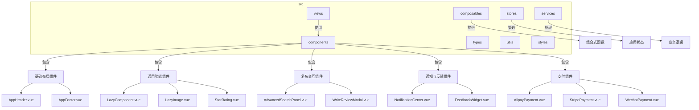

**图示来源**  
- [AppHeader.vue](file://src/components/AppHeader.vue)
- [AppFooter.vue](file://src/components/AppFooter.vue)
- [LazyComponent.vue](file://src/components/common/LazyComponent.vue)
- [LazyImage.vue](file://src/components/common/LazyImage.vue)
- [StarRating.vue](file://src/components/ui/StarRating.vue)
- [AdvancedSearchPanel.vue](file://src/components/search/AdvancedSearchPanel.vue)
- [WriteReviewModal.vue](file://src/components/reviews/WriteReviewModal.vue)
- [NotificationCenter.vue](file://src/components/notifications/NotificationCenter.vue)
- [FeedbackWidget.vue](file://src/components/feedback/FeedbackWidget.vue)
- [AlipayPayment.vue](file://src/components/AlipayPayment.vue)
- [StripePayment.vue](file://src/components/StripePayment.vue)
- [WechatPayment.vue](file://src/components/WechatPayment.vue)

**章节来源**  
- [AppHeader.vue](file://src/components/AppHeader.vue)
- [AppFooter.vue](file://src/components/AppFooter.vue)
- [LazyComponent.vue](file://src/components/common/LazyComponent.vue)
- [LazyImage.vue](file://src/components/common/LazyImage.vue)

## 核心组件

本文档分析的核心UI组件包括基础布局组件（AppHeader、AppFooter）、通用功能组件（LazyImage、StarRating）、复杂交互组件（AdvancedSearchPanel、WriteReviewModal）以及通知与反馈组件（NotificationCenter、FeedbackWidget）。这些组件构成了应用的用户界面基础，通过Vue 3的组合式API和TypeScript实现了类型安全和响应式设计。新增了支付模块组件，包括支付宝支付（AlipayPayment）、Stripe支付（StripePayment）和微信支付（WechatPayment），这些组件提供了完整的支付流程集成。

**章节来源**  
- [AppHeader.vue](file://src/components/AppHeader.vue#L1-L602)
- [AppFooter.vue](file://src/components/AppFooter.vue#L1-L436)
- [LazyImage.vue](file://src/components/common/LazyImage.vue)
- [StarRating.vue](file://src/components/ui/StarRating.vue)
- [AlipayPayment.vue](file://src/components/AlipayPayment.vue)
- [StripePayment.vue](file://src/components/StripePayment.vue)
- [WechatPayment.vue](file://src/components/WechatPayment.vue)

## 架构概览

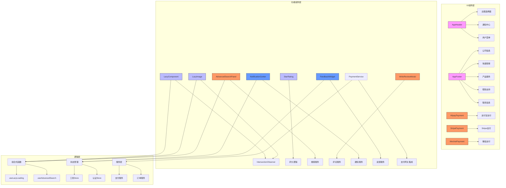

**图示来源**  
- [AppHeader.vue](file://src/components/AppHeader.vue)
- [AppFooter.vue](file://src/components/AppFooter.vue)
- [LazyComponent.vue](file://src/components/common/LazyComponent.vue)
- [LazyImage.vue](file://src/components/common/LazyImage.vue)
- [StarRating.vue](file://src/components/ui/StarRating.vue)
- [AdvancedSearchPanel.vue](file://src/components/search/AdvancedSearchPanel.vue)
- [WriteReviewModal.vue](file://src/components/reviews/WriteReviewModal.vue)
- [NotificationCenter.vue](file://src/components/notifications/NotificationCenter.vue)
- [FeedbackWidget.vue](file://src/components/feedback/FeedbackWidget.vue)
- [AlipayPayment.vue](file://src/components/AlipayPayment.vue)
- [StripePayment.vue](file://src/components/StripePayment.vue)
- [WechatPayment.vue](file://src/components/WechatPayment.vue)
- [useLazyLoading.ts](file://src/composables/useLazyLoading.ts)
- [useAdvancedSearch.ts](file://src/composables/useAdvancedSearch.ts)
- [stores/tools.ts](file://src/stores/tools.ts)
- [stores/auth.ts](file://src/stores/auth.ts)
- [services/paymentService.ts](file://src/services/paymentService.ts)
- [services/orderService.ts](file://src/services/orderService.ts)

## 详细组件分析

### 基础布局组件分析

#### AppHeader组件分析
AppHeader组件作为应用的主要导航栏，集成了搜索功能、主题切换、通知中心和用户身份管理。该组件使用Vue 3的组合式API，通过引用工具Store和认证Store来管理状态，并集成多个子组件实现完整功能。

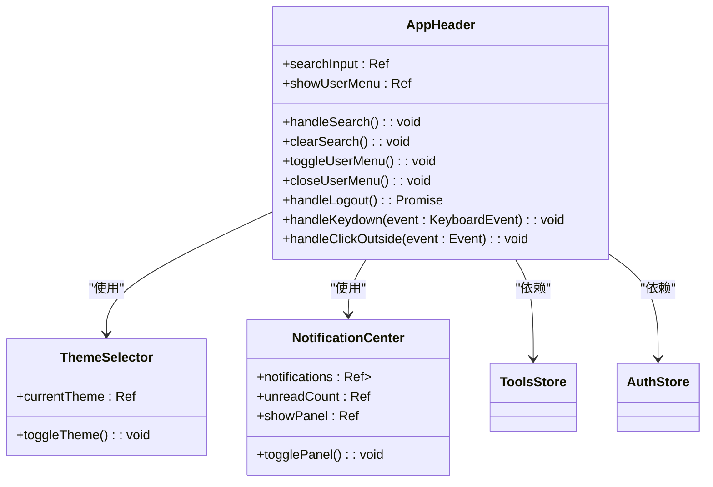

**图示来源**  
- [AppHeader.vue](file://src/components/AppHeader.vue#L1-L602)
- [theme/ThemeSelector.vue](file://src/components/theme/ThemeSelector.vue)
- [notifications/NotificationCenter.vue](file://src/components/notifications/NotificationCenter.vue)
- [stores/tools.ts](file://src/stores/tools.ts)
- [stores/auth.ts](file://src/stores/auth.ts)

#### AppFooter组件分析
AppFooter组件提供应用的底部信息展示，包括公司信息、快速链接、产品服务、帮助支持和联系信息。该组件支持配置化，可以从本地存储加载自定义配置，实现灵活的内容管理。

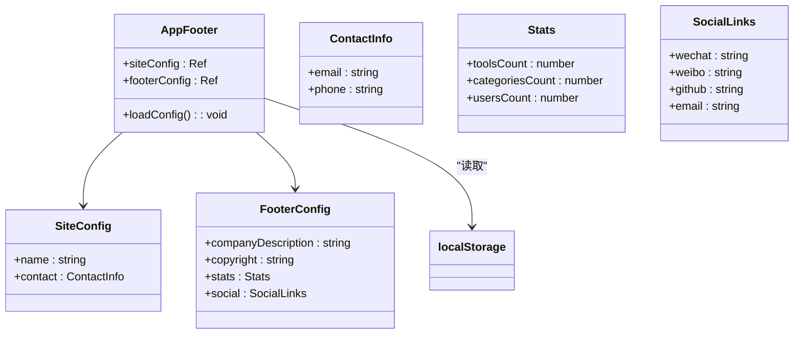

**图示来源**  
- [AppFooter.vue](file://src/components/AppFooter.vue#L1-L436)

**章节来源**  
- [AppFooter.vue](file://src/components/AppFooter.vue#L1-L436)

### 通用功能组件分析

#### LazyImage组件分析
LazyImage组件实现了图片的懒加载功能，使用Intersection Observer API来检测图片是否进入视口，从而决定是否加载图片资源。该组件通过组合式函数useLazyLoading提供核心逻辑，实现了性能优化。

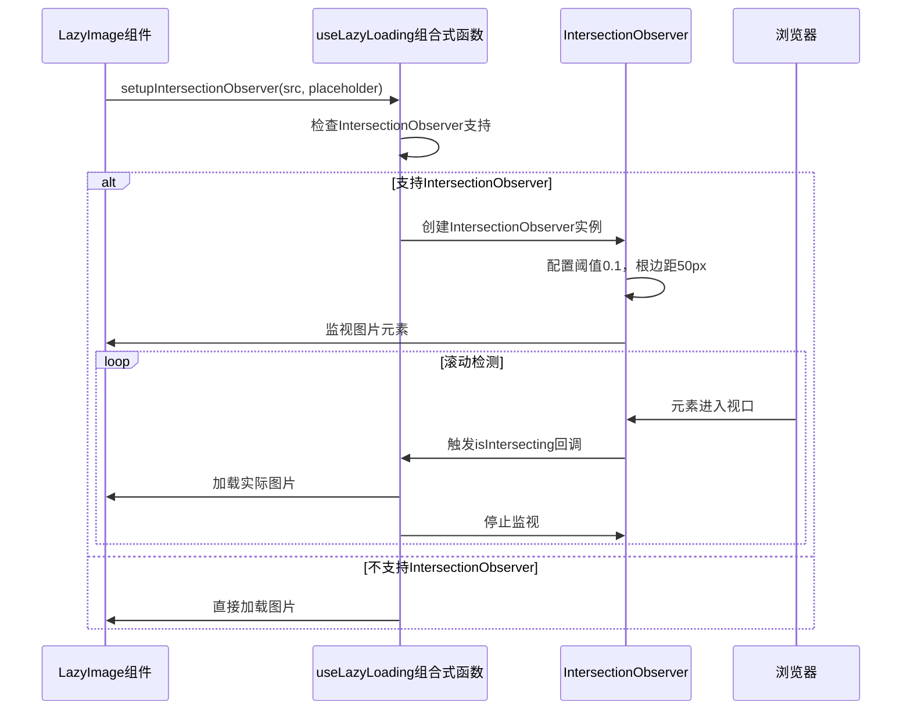

**图示来源**  
- [LazyImage.vue](file://src/components/common/LazyImage.vue)
- [useLazyLoading.ts](file://src/composables/useLazyLoading.ts#L45-L68)

#### StarRating组件分析
StarRating组件提供星级评分功能，支持只读模式和可编辑模式。该组件使用SVG图标显示星级，并通过鼠标交互实现评分选择。组件设计考虑了可访问性，支持键盘导航。

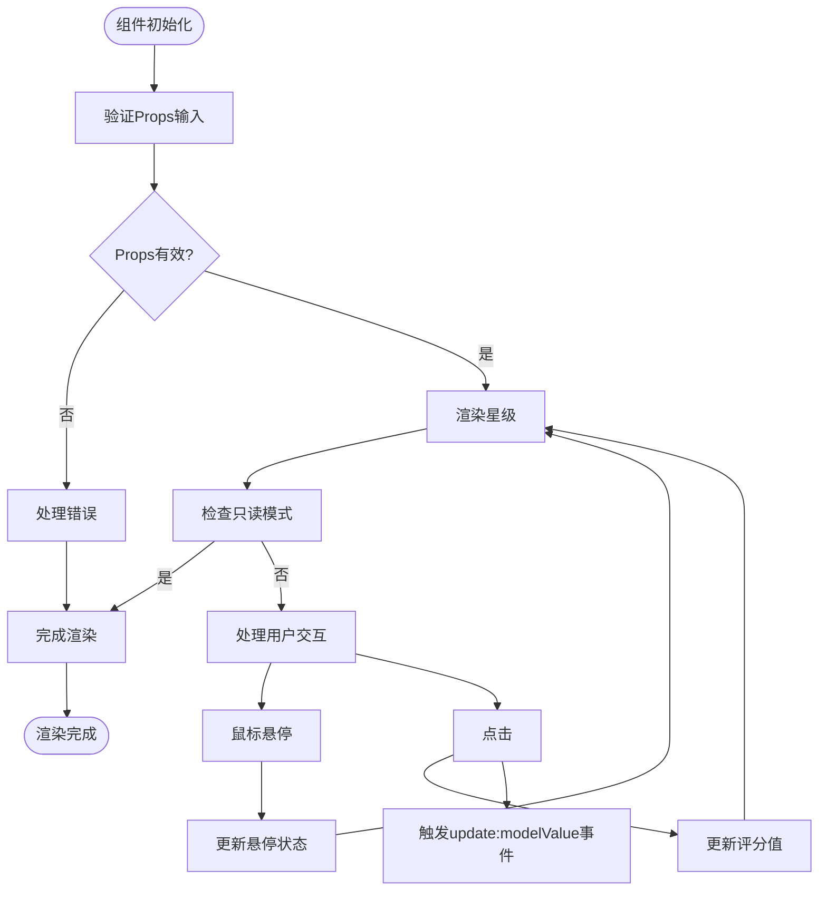

**图示来源**  
- [StarRating.vue](file://src/components/ui/StarRating.vue)

**章节来源**  
- [StarRating.vue](file://src/components/ui/StarRating.vue)

### 复杂交互组件分析

#### AdvancedSearchPanel组件分析
AdvancedSearchPanel组件提供高级搜索功能，允许用户通过多个条件进行精确搜索。该组件与搜索服务集成，支持实时搜索建议和搜索历史管理。

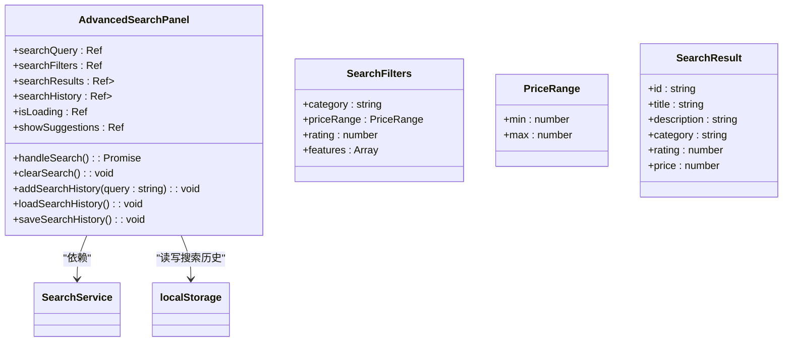

**图示来源**  
- [AdvancedSearchPanel.vue](file://src/components/search/AdvancedSearchPanel.vue)
- [services/searchService.ts](file://src/services/searchService.ts)
- [utils/cacheManager.ts](file://src/utils/cacheManager.ts)

#### WriteReviewModal组件分析
WriteReviewModal组件提供撰写评论的模态窗口，包含评分、标题、内容输入和提交功能。该组件与评论服务集成，支持图片上传和预览。

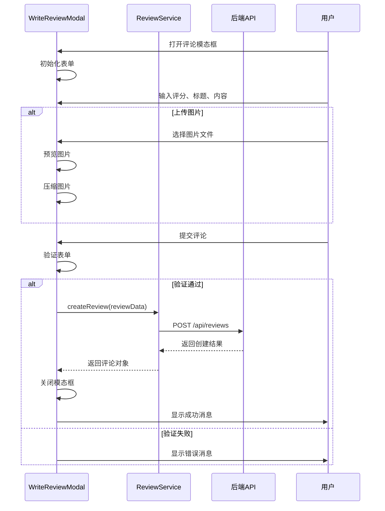

**图示来源**  
- [WriteReviewModal.vue](file://src/components/reviews/WriteReviewModal.vue)
- [services/reviewService.ts](file://src/services/reviewService.ts)
- [utils/validation.ts](file://src/utils/validation.ts)

**章节来源**  
- [WriteReviewModal.vue](file://src/components/reviews/WriteReviewModal.vue)

### 通知与反馈组件分析

#### NotificationCenter组件分析
NotificationCenter组件提供通知中心功能，显示用户的未读通知并支持通知管理。该组件与通知服务集成，支持实时更新和通知标记为已读。

```mermaid
classDiagram
class NotificationCenter {
+notifications : Ref<Array<Notification>>
+unreadCount : Ref<number>
+showPanel : Ref<boolean>
+isLoading : Ref<boolean>
+fetchNotifications() : Promise<void>
+markAsRead(notificationId : string) : Promise<void>
+markAllAsRead() : Promise<void>
+deleteNotification(notificationId : string) : Promise<void>
+togglePanel() : void
}
class Notification {
+id : string
+title : string
+content : string
+type : NotificationType
+read : boolean
+createdAt : Date
+action? : Action
}
class Action {
+label : string
+url : string
}
enum NotificationType {
INFO
WARNING
ERROR
SUCCESS
}
NotificationCenter --> NotificationService : "依赖"
NotificationCenter --> RealtimeService : "监听实时通知"
```

**图示来源**  
- [NotificationCenter.vue](file://src/components/notifications/NotificationCenter.vue)
- [services/notificationService.ts](file://src/services/notificationService.ts)
- [composables/useRealtime.ts](file://src/composables/useRealtime.ts)

#### FeedbackWidget组件分析
FeedbackWidget组件提供用户反馈功能，允许用户快速提交反馈意见。该组件设计为轻量级，可以在页面任何位置显示。

```mermaid
flowchart TD
Start([组件初始化]) --> CheckVisibility["检查可见性"]
CheckVisibility --> Visible{"可见?"}
Visible --> |否| WaitShow["等待显示"]
Visible --> |是| RenderWidget["渲染反馈组件"]
RenderWidget --> CheckMode["检查模式"]
CheckMode --> |表单模式| ShowForm["显示反馈表单"]
CheckMode --> |按钮模式| ShowButton["显示反馈按钮"]
ShowButton --> UserClick["用户点击"]
UserClick --> ShowForm
ShowForm --> UserInput["用户输入反馈"]
UserInput --> ValidateInput["验证输入"]
ValidateInput --> Valid{"有效?"}
Valid --> |否| ShowError["显示错误"]
Valid --> |是| SubmitFeedback["提交反馈"]
SubmitFeedback --> FeedbackService["调用反馈服务"]
FeedbackService --> API["API请求"]
API --> > FeedbackService: 响应结果
FeedbackService --> > ShowResult["显示结果"]
ShowResult --> HideForm["隐藏表单"]
HideForm --> End([完成])
```

**图示来源**  
- [FeedbackWidget.vue](file://src/components/feedback/FeedbackWidget.vue)
- [services/feedbackService.ts](file://src/services/feedbackService.ts)
- [utils/validation.ts](file://src/utils/validation.ts)

**章节来源**  
- [FeedbackWidget.vue](file://src/components/feedback/FeedbackWidget.vue)

### 支付组件分析

#### AlipayPayment组件分析
AlipayPayment组件提供支付宝支付功能，支持安全加密传输和多种付款方式。该组件与支付服务集成，处理支付宝支付流程。

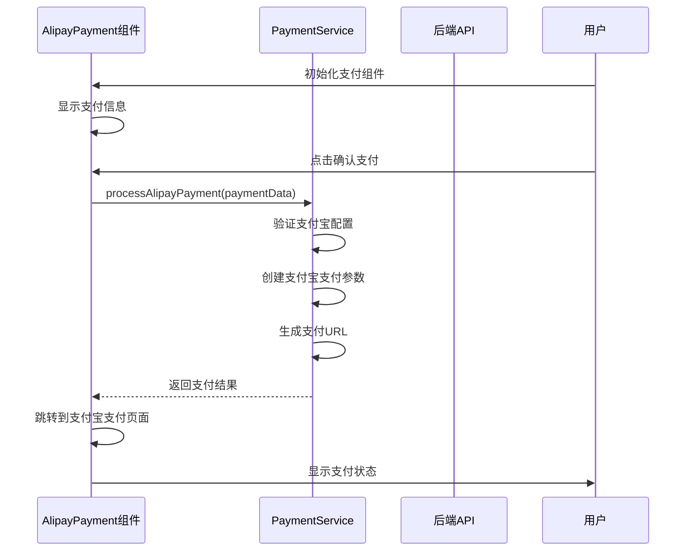

**图示来源**  
- [AlipayPayment.vue](file://src/components/AlipayPayment.vue)
- [services/paymentService.ts](file://src/services/paymentService.ts#L160-L218)

**章节来源**  
- [AlipayPayment.vue](file://src/components/AlipayPayment.vue)

#### StripePayment组件分析
StripePayment组件提供Stripe信用卡支付功能，使用Stripe Elements实现安全的信用卡信息输入。该组件支持实时支付确认。

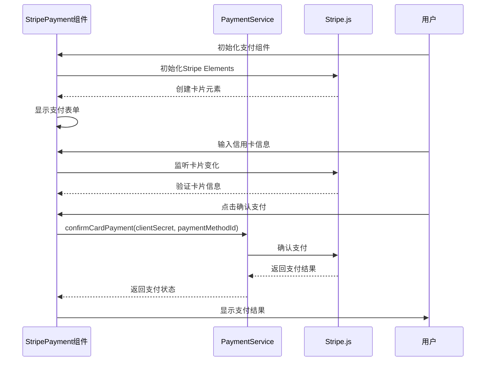

**图示来源**  
- [StripePayment.vue](file://src/components/StripePayment.vue)
- [services/paymentService.ts](file://src/services/paymentService.ts#L53-L115)

**章节来源**  
- [StripePayment.vue](file://src/components/StripePayment.vue)

#### WechatPayment组件分析
WechatPayment组件提供微信扫码支付功能，生成支付二维码并监控支付状态。该组件支持倒计时和支付状态检查。

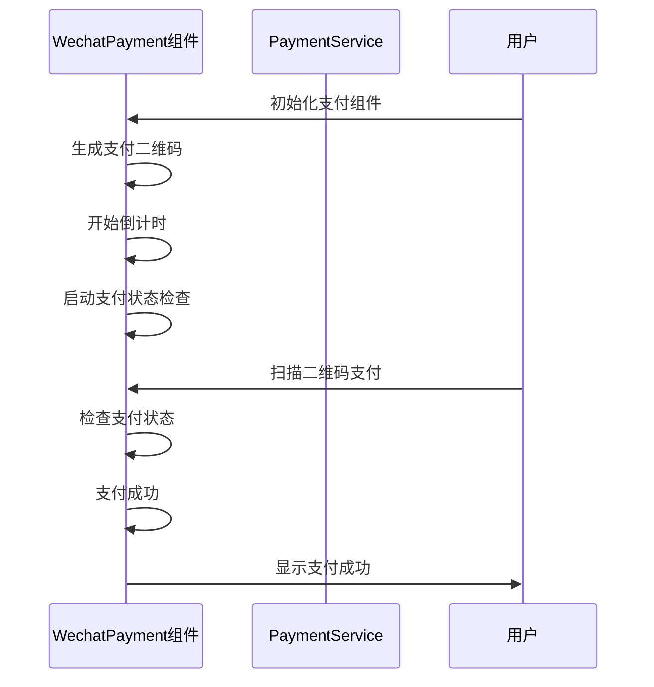

**图示来源**  
- [WechatPayment.vue](file://src/components/WechatPayment.vue)
- [services/paymentService.ts](file://src/services/paymentService.ts#L237-L288)

**章节来源**  
- [WechatPayment.vue](file://src/components/WechatPayment.vue)

## 依赖分析

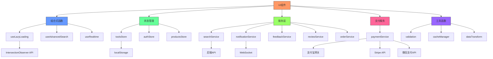

**图示来源**  
- [components](file://src/components)
- [composables](file://src/composables)
- [stores](file://src/stores)
- [services](file://src/services)
- [utils](file://src/utils)
- [paymentService.ts](file://src/services/paymentService.ts)

**章节来源**  
- [composables/useLazyLoading.ts](file://src/composables/useLazyLoading.ts)
- [stores/tools.ts](file://src/stores/tools.ts)
- [services/searchService.ts](file://src/services/searchService.ts)
- [utils/validation.ts](file://src/utils/validation.ts)
- [services/paymentService.ts](file://src/services/paymentService.ts)

## 性能考虑

### 懒加载性能优化策略
懒加载组件采用Intersection Observer API实现，避免了传统的滚动事件监听带来的性能问题。该API由浏览器原生支持，能够在不影响主线程的情况下检测元素的可见性。

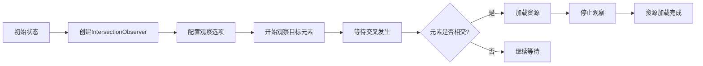

Intersection Observer的配置包括0.1的阈值和50px的根边距，这意味着当元素有10%进入视口或在视口边缘50px范围内时，就会触发加载。这种配置平衡了用户体验和性能，既不会过早加载资源，也不会让用户等待太久。

**图示来源**  
- [useLazyLoading.ts](file://src/composables/useLazyLoading.ts#L45-L68)
- [LazyImage.vue](file://src/components/common/LazyImage.vue)

**章节来源**  
- [useLazyLoading.ts](file://src/composables/useLazyLoading.ts#L1-L120)

### 资源预加载逻辑
对于关键路径上的资源，系统实现了智能预加载逻辑。通过分析用户行为模式，预测用户可能访问的页面或资源，并提前加载。

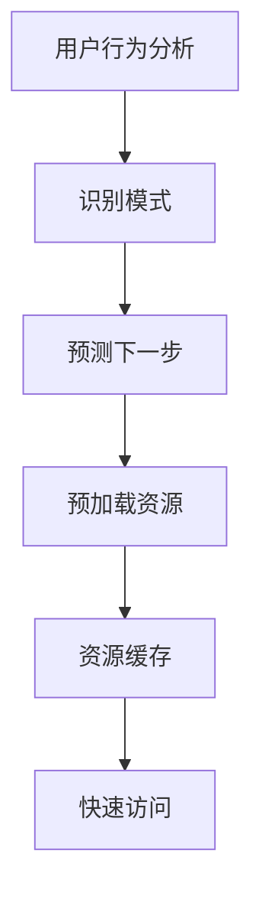

预加载策略包括：
- 首屏关键资源优先加载
- 用户最常访问页面的预加载
- 导航链接的预加载
- 图片资源的渐进式加载

这些策略通过performanceService中的PerformanceObserver实现监控和优化。

**章节来源**  
- [services/performanceService.ts](file://src/services/performanceService.ts#L140-L166)

## 故障排除指南

### 常见问题及解决方案
1. **懒加载组件不工作**
   - 检查浏览器是否支持Intersection Observer API
   - 确认组件正确引用了useLazyLoading组合式函数
   - 检查CSS样式是否影响了元素的可见性计算

2. **通知中心不显示实时通知**
   - 检查WebSocket连接状态
   - 验证用户认证令牌是否有效
   - 确认RealtimeService正确初始化

3. **高级搜索面板无响应**
   - 检查搜索服务API是否可用
   - 验证搜索查询参数格式
   - 检查网络连接状态

4. **评分组件无法交互**
   - 确认组件未设置为只读模式
   - 检查事件监听器是否正确绑定
   - 验证v-model绑定是否正确

5. **支付组件无法初始化**
   - 检查.env文件中是否配置了支付网关密钥
   - 验证支付服务配置是否正确
   - 确认网络连接状态

**章节来源**  
- [errors.go](file://src/components/error/GlobalErrorHandler.vue)
- [debug.go](file://src/utils/errorHandler.ts)

## 结论
本文档全面分析了高级工具导航项目的UI组件架构，涵盖了从基础布局到复杂交互组件的各个方面。新增了对支付模块的详细分析，包括支付宝、Stripe和微信支付组件的实现细节。这些支付组件提供了完整的支付流程集成，通过PaymentService统一处理支付逻辑，确保了支付安全性和用户体验。文档还更新了架构概览和依赖分析，反映了最新的代码变更。通过这些更新，开发者可以更好地理解系统的整体架构和各组件之间的关系，为后续开发和维护提供了有力支持。