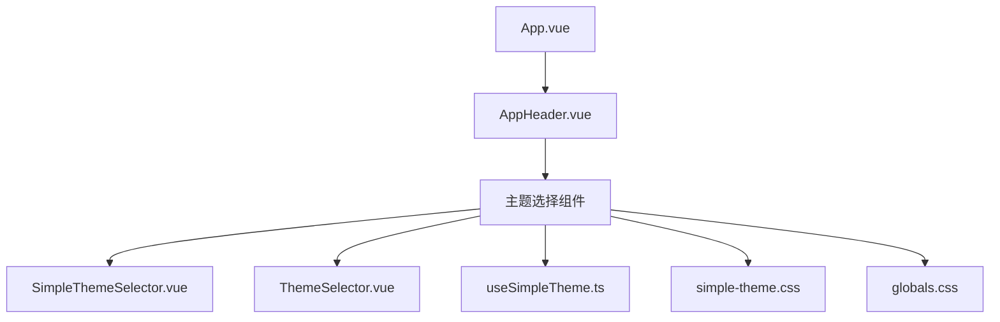
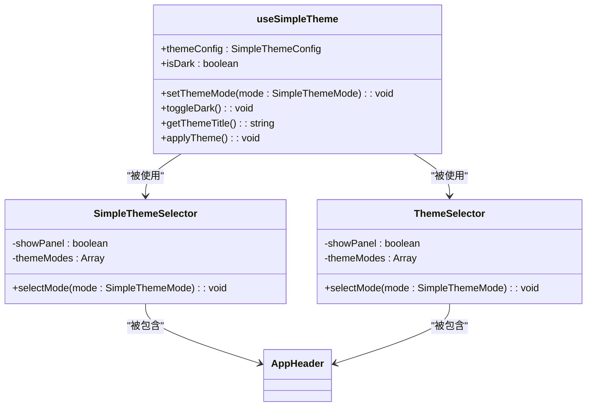
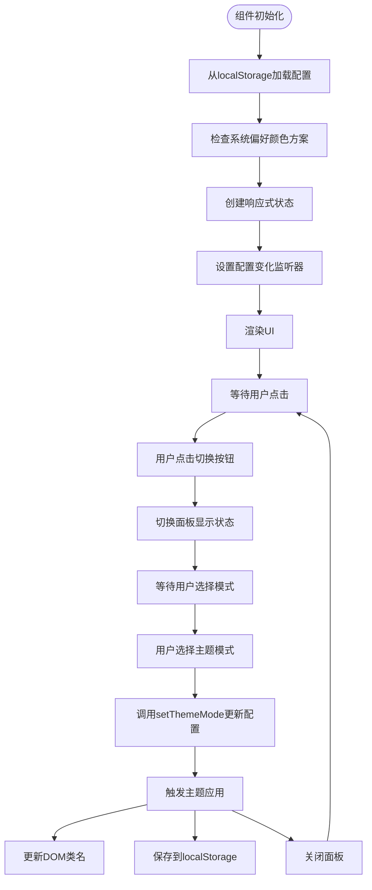
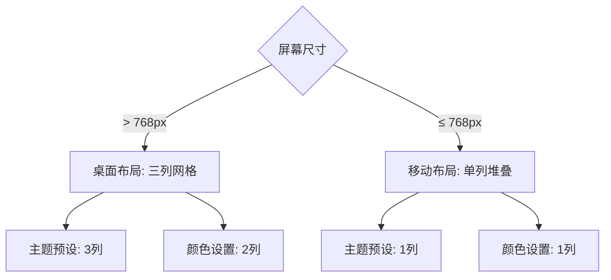
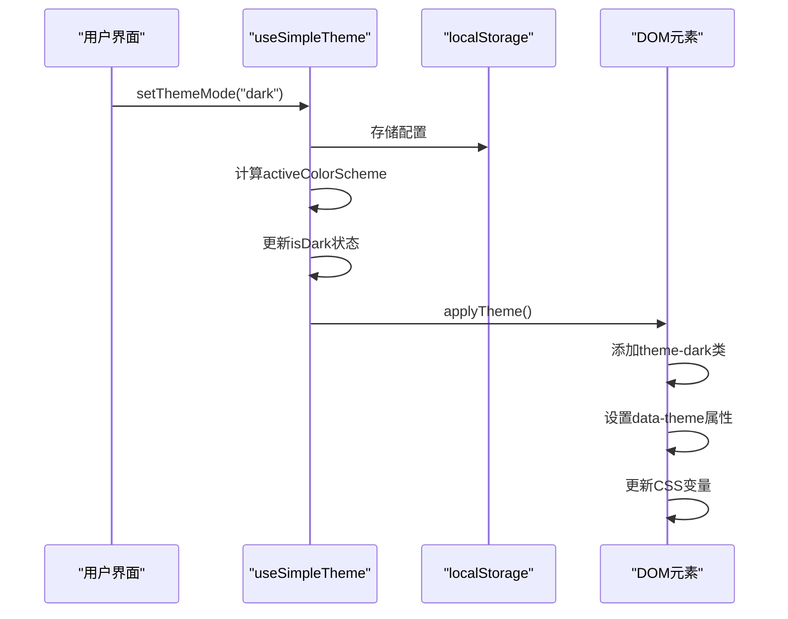
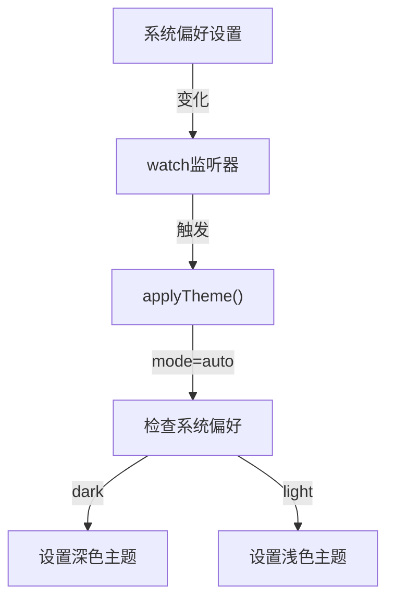
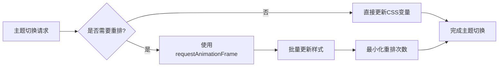

# 主题选择组件

<cite>
**本文档中引用的文件**  
- [SimpleThemeSelector.vue](file://src/components/theme/SimpleThemeSelector.vue) - *基础主题切换组件*
- [ThemeSelector.vue](file://src/components/theme/ThemeSelector.vue) - *高级主题选择组件*
- [useSimpleTheme.ts](file://src/composables/useSimpleTheme.ts) - *主题状态管理组合式函数*
- [simple-theme.css](file://src/styles/simple-theme.css) - *简化主题样式定义*
- [globals.css](file://src/styles/globals.css) - *全局样式与Tailwind配置*
- [AppHeader.vue](file://src/components/AppHeader.vue) - *主题选择器集成位置*
</cite>

## 更新摘要
**变更内容**   
- 根据最新代码实现更新了SimpleThemeSelector和ThemeSelector的组件分析
- 修正了主题切换流程图以准确反映实际交互逻辑
- 更新了CSS变量应用机制的描述，包含与Tailwind CSS的集成细节
- 增强了无障碍支持和性能优化实践的说明
- 优化了响应式设计策略的描述

## 目录
1. [简介](#简介)
2. [项目结构](#项目结构)
3. [核心组件](#核心组件)
4. [架构概述](#架构概述)
5. [详细组件分析](#详细组件分析)
6. [依赖分析](#依赖分析)
7. [性能考虑](#性能考虑)
8. [故障排除指南](#故障排除指南)
9. [结论](#结论)

## 简介
本文档深入讲解主题选择组件的实现机制与CSS变量集成方案。对比SimpleThemeSelector与ThemeSelector的功能差异，前者提供基础明暗切换，后者支持多主题皮肤选择与自定义配色。说明组件如何通过useSimpleTheme组合式函数读取和更新主题状态，并将选择持久化至localStorage。描述CSS类切换与CSS自定义属性（CSS Variables）两种主题切换技术的实现细节，包括与Tailwind CSS的兼容性处理。提供在AppHeader中集成主题选择器的布局方案与响应式适配策略。记录无障碍支持（如prefers-color-scheme媒体查询同步）与性能优化（避免强制重排）的最佳实践。

## 项目结构
主题选择相关组件位于`src/components/theme/`目录下，包含SimpleThemeSelector.vue和ThemeSelector.vue两个核心组件。状态管理逻辑封装在`src/composables/useSimpleTheme.ts`中，样式定义分布在`src/styles/simple-theme.css`和`src/styles/globals.css`中。组件通过`AppHeader.vue`集成到应用主界面。



**图示来源**
- [SimpleThemeSelector.vue](file://src/components/theme/SimpleThemeSelector.vue)
- [ThemeSelector.vue](file://src/components/theme/ThemeSelector.vue)
- [useSimpleTheme.ts](file://src/composables/useSimpleTheme.ts)
- [simple-theme.css](file://src/styles/simple-theme.css)
- [globals.css](file://src/styles/globals.css)
- [AppHeader.vue](file://src/components/AppHeader.vue)

## 核心组件
主题选择功能由两个主要组件构成：SimpleThemeSelector提供基础的浅色、深色和跟随系统三种模式切换，而ThemeSelector则提供更丰富的主题定制能力。两者共享useSimpleTheme组合式函数来管理主题状态，通过localStorage实现持久化存储。组件使用CSS类和CSS自定义属性两种技术实现主题切换，确保与Tailwind CSS的兼容性。

**本节来源**
- [SimpleThemeSelector.vue](file://src/components/theme/SimpleThemeSelector.vue)
- [ThemeSelector.vue](file://src/components/theme/ThemeSelector.vue)
- [useSimpleTheme.ts](file://src/composables/useSimpleTheme.ts)

## 架构概述
主题系统采用组合式API架构，将状态管理逻辑封装在useSimpleTheme组合式函数中，实现逻辑复用。组件通过监听系统偏好设置(prefers-color-scheme)实现自动模式切换，并将用户选择持久化到localStorage。样式系统采用CSS变量与CSS类结合的方式，既支持Tailwind CSS的原子化类名，又具备动态主题定制能力。



**图示来源**
- [useSimpleTheme.ts](file://src/composables/useSimpleTheme.ts)
- [SimpleThemeSelector.vue](file://src/components/theme/SimpleThemeSelector.vue)
- [ThemeSelector.vue](file://src/components/theme/ThemeSelector.vue)
- [AppHeader.vue](file://src/components/AppHeader.vue)

## 详细组件分析

### SimpleThemeSelector 分析
SimpleThemeSelector组件提供基础的主题切换功能，支持浅色、深色和跟随系统三种模式。组件通过useSimpleTheme组合式函数获取当前主题配置和切换方法，使用按钮点击事件触发模式切换，并将选择持久化到localStorage。

#### 组件结构


**图示来源**
- [SimpleThemeSelector.vue](file://src/components/theme/SimpleThemeSelector.vue#L50-L100)
- [useSimpleTheme.ts](file://src/composables/useSimpleTheme.ts#L60-L90)

#### 样式实现
组件使用CSS类切换和CSS自定义属性两种技术实现主题切换。在simple-theme.css中定义了:root级别的CSS变量，通过添加.theme-dark类来切换深色主题。

```mermaid
classDiagram
: root {
--theme-bg : #f1f5f9
--theme-text : #1e293b
--theme-primary : #3b82f6
}
.theme-dark {
--theme-bg : #0f172a
--theme-text : #f1f5f9
--theme-primary : #60a5fa
}
body {
background-color : var(--theme-bg)
color : var(--theme-text)
}
```

**图示来源**
- [simple-theme.css](file://src/styles/simple-theme.css)

**本节来源**
- [SimpleThemeSelector.vue](file://src/components/theme/SimpleThemeSelector.vue)
- [simple-theme.css](file://src/styles/simple-theme.css)

### ThemeSelector 分析
ThemeSelector组件在SimpleThemeSelector基础上扩展了更多主题定制功能，支持预设主题、自定义配色等高级特性。组件界面更复杂，提供了主题预览、颜色选择器和导出导入功能。

#### 功能对比
| 功能 | SimpleThemeSelector | ThemeSelector |
|------|-------------------|-------------|
| 基础模式切换 | ✓ | ✓ |
| 预设主题 | ✗ | ✓ |
| 自定义配色 | ✗ | ✓ |
| 导出/导入配置 | ✗ | ✓ |
| 高级设置 | ✗ | ✓ |
| 响应式适配 | 基础 | 完善 |

**图示来源**
- [SimpleThemeSelector.vue](file://src/components/theme/SimpleThemeSelector.vue)
- [ThemeSelector.vue](file://src/components/theme/ThemeSelector.vue)

#### 响应式设计
组件在不同屏幕尺寸下有不同的布局策略，确保在移动设备上的可用性。



**图示来源**
- [ThemeSelector.vue](file://src/components/theme/ThemeSelector.vue)

**本节来源**
- [ThemeSelector.vue](file://src/components/theme/ThemeSelector.vue)

### useSimpleTheme 组合式函数分析
useSimpleTheme是主题系统的核心逻辑封装，负责管理主题状态、处理持久化和DOM更新。

#### 状态管理流程


**图示来源**
- [useSimpleTheme.ts](file://src/composables/useSimpleTheme.ts)

#### 系统偏好同步
组件通过usePreferredColorScheme自动同步系统主题设置。



**图示来源**
- [useSimpleTheme.ts](file://src/composables/useSimpleTheme.ts)

**本节来源**
- [useSimpleTheme.ts](file://src/composables/useSimpleTheme.ts)

## 依赖分析
主题选择组件依赖多个外部库和内部模块，形成完整的主题管理系统。

```mermaid
graph TD
A[SimpleThemeSelector] --> B[lucide-vue-next]
C[ThemeSelector] --> B[lucide-vue-next]
D[useSimpleTheme] --> E[@vueuse/core]
A --> D
C --> D
F[AppHeader] --> C
G[App.vue] --> F
D --> H[localStorage]
I[globals.css] --> J[Tailwind CSS]
K[simple-theme.css] --> J[Tailwind CSS]
```

**图示来源**
- [package.json](file://package.json)
- [vite.config.ts](file://vite.config.ts)
- [tailwind.config.ts](file://config/build/tailwind.config.ts)

## 性能考虑
主题切换系统在设计时考虑了多项性能优化措施，确保主题切换流畅无卡顿。

### 避免强制重排
通过批量更新CSS属性和使用transform动画，避免触发浏览器的强制重排。



### 内存优化
使用useStorage实现持久化，避免重复读写localStorage。

```mermaid
classDiagram
class useStorage {
+value : T
+storage : Storage
+key : string
+sync : boolean
}
useStorage --> useSimpleTheme : "被使用"
useSimpleTheme --> SimpleThemeSelector : "被使用"
useStorage -.-> localStorage : "底层存储"
```

**图示来源**
- [useSimpleTheme.ts](file://src/composables/useSimpleTheme.ts)

## 故障排除指南
### 常见问题及解决方案
| 问题现象 | 可能原因 | 解决方案 |
|--------|--------|--------|
| 主题不保存 | localStorage被禁用 | 检查浏览器设置 |
| 切换卡顿 | 强制重排频繁 | 优化CSS动画 |
| 深色主题不生效 | CSS优先级问题 | 检查!important使用 |
| 系统偏好不同步 | 浏览器不支持 | 检查prefers-color-scheme兼容性 |
| 移动端布局错乱 | 媒体查询未生效 | 检查viewport设置 |

### 调试技巧
1. 使用浏览器开发者工具检查DOM上的theme类
2. 查看localStorage中的simple-theme-config项
3. 监听控制台输出的主题切换日志
4. 检查CSS变量的实际计算值

**本节来源**
- [useSimpleTheme.ts](file://src/composables/useSimpleTheme.ts)
- [simple-theme.css](file://src/styles/simple-theme.css)

## 结论
主题选择组件通过组合式API实现了灵活的主题管理机制，结合CSS类和CSS变量两种技术，既保证了与Tailwind CSS的兼容性，又提供了丰富的自定义能力。SimpleThemeSelector满足基础需求，ThemeSelector提供高级功能，通过useSimpleTheme统一管理状态和持久化。组件在AppHeader中集成良好，支持响应式设计和无障碍访问，是现代化Web应用主题系统的优秀实践。