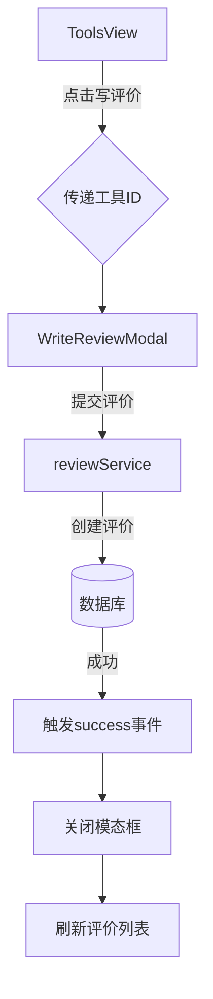

# 复杂交互组件

<cite>
**本文档引用的文件**   
- [AdvancedSearchPanel.vue](file://src/components/search/AdvancedSearchPanel.vue)
- [useAdvancedSearch.ts](file://src/composables/useAdvancedSearch.ts)
- [EnhancedSearchBox.vue](file://src/components/search/EnhancedSearchBox.vue)
- [WriteReviewModal.vue](file://src/components/reviews/WriteReviewModal.vue)
- [EditReviewModal.vue](file://src/components/reviews/EditReviewModal.vue)
- [ReplyModal.vue](file://src/components/reviews/ReplyModal.vue)
- [reviewService.ts](file://src/services/reviewService.ts)
- [ToolsView.vue](file://src/views/ToolsView.vue)
</cite>

## 目录
1. [高级搜索组件实现机制](#高级搜索组件实现机制)
2. [增强搜索框交互设计](#增强搜索框交互设计)
3. [评论模态框功能剖析](#评论模态框功能剖析)
4. [组件间状态传递示例](#组件间状态传递示例)
5. [用户体验与无障碍设计](#用户体验与无障碍设计)

## 高级搜索组件实现机制

`AdvancedSearchPanel` 组件实现了多维度筛选功能，通过分类、标签、评分等条件进行精细化过滤。组件使用 `useCategoriesStore` 和 `useToolsStore` 获取分类数据和工具信息，动态生成分类下拉菜单和热门标签列表。

搜索状态管理由 `useAdvancedSearch` 组合式函数处理，该函数定义了 `SearchFilters` 接口来规范筛选器结构，包含分类、标签、评分、特色工具、URL可用性、排序方式和排序顺序等字段。通过 `watch` 监听器实时响应外部筛选器变化，并在本地过滤器更新时自动应用筛选。

关键词高亮功能通过智能搜索算法实现，对查询词进行分词处理，为不同搜索字段（名称、描述、标签、分类）分配权重，计算匹配得分。搜索建议下拉功能基于用户输入动态生成，从工具名称和标签中提取匹配项，提供实时建议。

**Section sources**
- [AdvancedSearchPanel.vue](file://src/components/search/AdvancedSearchPanel.vue#L1-L593)
- [useAdvancedSearch.ts](file://src/composables/useAdvancedSearch.ts#L1-L310)

## 增强搜索框交互设计

`EnhancedSearchBox` 组件构建了完整的输入事件处理链，包含输入验证、自动补全触发和键盘导航支持。组件通过 `handleInput` 方法响应输入变化，使用 `useDebounceFn` 实现防抖逻辑，避免频繁请求后端服务。

输入验证在模板层面通过 `required` 属性实现基础验证，同时结合 `searchQuery` 的双向绑定确保数据一致性。自动补全功能通过 `loadSuggestions` 方法获取智能建议，包括搜索建议、搜索历史和热门搜索三部分，为用户提供上下文相关的搜索选项。

键盘导航支持通过 `handleKeydown` 方法实现，处理方向键、回车键和ESC键等关键事件。向上/向下方向键用于在建议列表中导航，回车键确认选择或执行搜索，ESC键关闭建议下拉框。这种设计提升了键盘用户的操作效率和无障碍访问性。

**Section sources**
- [EnhancedSearchBox.vue](file://src/components/search/EnhancedSearchBox.vue#L1-L799)

## 评论模态框功能剖析

评论相关模态框组件（`WriteReviewModal`、`EditReviewModal`、`ReplyModal`）实现了完整的表单验证流程和提交状态管理。所有模态框均使用 `reactive` 创建响应式表单对象，通过 `v-model` 实现双向数据绑定。

`WriteReviewModal` 和 `EditReviewModal` 共享相似的表单结构，包含评分、标题和内容字段。评分功能通过集成 `StarRating` 组件实现，该组件支持点击交互和只读模式。表单验证通过 `required` 属性和提交前检查双重保障，确保数据完整性。

提交状态管理通过 `submitting` 响应式变量实现，在请求期间禁用提交按钮并显示加载状态，防止重复提交。组件通过 `emits` 与父组件同步数据变更，`success` 事件通知父组件提交成功，`close` 事件请求关闭模态框。

`ReplyModal` 组件在回复功能基础上增加了原评价展示区域，通过 `props` 接收原评价数据，在模态框头部展示评分、标题和内容，为回复提供上下文信息。

**Section sources**
- [WriteReviewModal.vue](file://src/components/reviews/WriteReviewModal.vue#L1-L180)
- [EditReviewModal.vue](file://src/components/reviews/EditReviewModal.vue#L1-L186)
- [ReplyModal.vue](file://src/components/reviews/ReplyModal.vue#L1-L191)
- [reviewService.ts](file://src/services/reviewService.ts#L1-L610)

## 组件间状态传递示例

组件间状态传递通过事件系统和依赖注入实现。以从 `ToolsView` 触发 `WriteReviewModal` 为例，`ToolsView` 组件通过按钮点击事件打开模态框，并将工具ID作为 `props` 传递。

在 `ToolsView.vue` 中，通过 `v-model` 绑定模态框的显示状态，当用户点击"写评价"按钮时，设置 `showWriteReviewModal` 为 `true` 并将当前工具ID赋值给 `selectedToolId`。`WriteReviewModal` 组件通过 `props` 接收 `productId`，在提交评价时将其包含在请求数据中。

**Diagram sources**
- [ToolsView.vue](file://src/views/ToolsView.vue#L1-L967)
- [WriteReviewModal.vue](file://src/components/reviews/WriteReviewModal.vue#L1-L180)

## 用户体验与无障碍设计

系统实现了全面的错误边界处理和加载状态反馈机制。在搜索功能中，通过 `isSearching` 变量控制加载指示器的显示，在请求期间展示"搜索中..."提示，提升用户等待体验。错误处理通过 `try-catch` 块捕获异常，并在控制台记录错误信息，同时保持界面稳定。

无障碍交互设计体现在多个方面：搜索框的 `aria-live` 区域实时播报搜索结果数量，帮助屏幕阅读器用户了解搜索状态；键盘导航支持确保所有功能均可通过键盘访问；表单字段的 `label` 标签正确关联输入元素，提供清晰的上下文信息。

错误边界处理在组件层面通过 `try-catch` 实现，在服务层面通过统一的错误处理函数捕获和记录异常。加载状态通过响应式变量控制，在数据获取期间显示加载指示器，防止界面卡顿或空白。

**Section sources**
- [EnhancedSearchBox.vue](file://src/components/search/EnhancedSearchBox.vue#L1-L799)
- [WriteReviewModal.vue](file://src/components/reviews/WriteReviewModal.vue#L1-L180)
- [ToolsView.vue](file://src/views/ToolsView.vue#L1-L967)