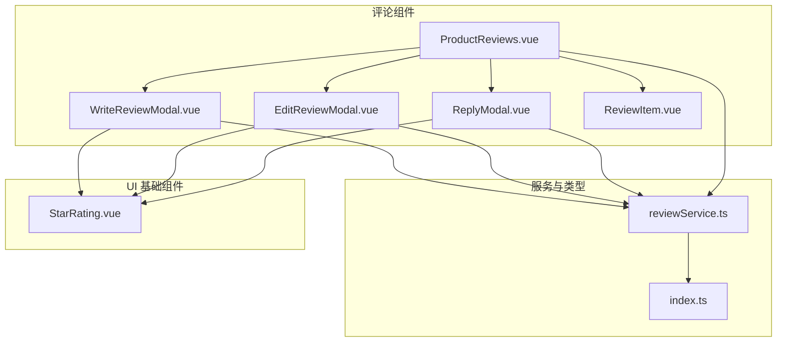
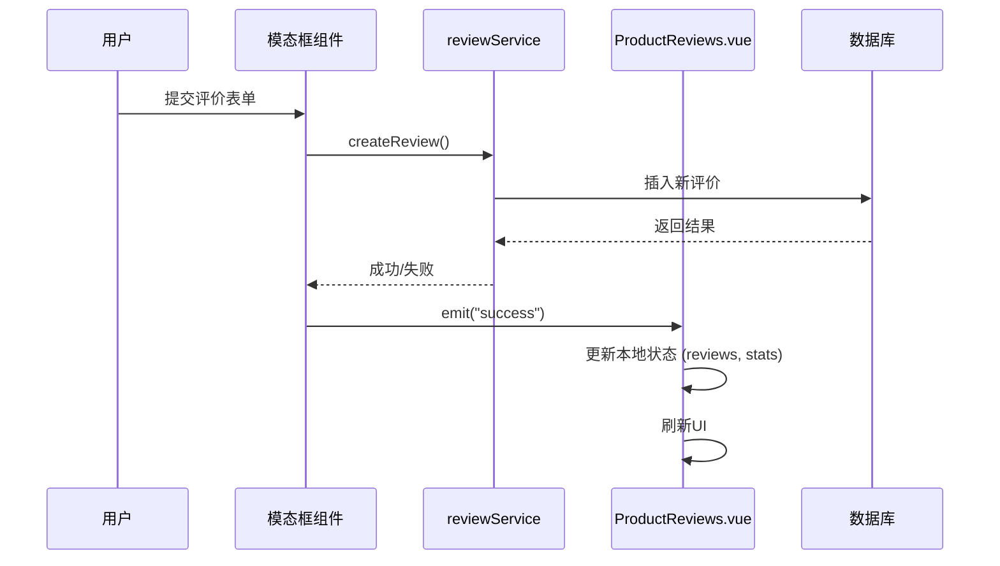
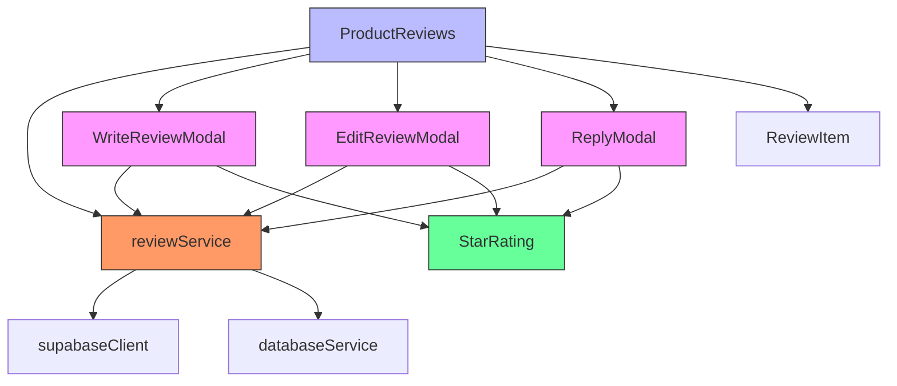

# 评论交互组件

<cite>
**本文档引用文件**  
- [WriteReviewModal.vue](file://src/components/reviews/WriteReviewModal.vue)
- [EditReviewModal.vue](file://src/components/reviews/EditReviewModal.vue)
- [ReplyModal.vue](file://src/components/reviews/ReplyModal.vue)
- [ProductReviews.vue](file://src/components/reviews/ProductReviews.vue)
- [reviewService.ts](file://src/services/reviewService.ts)
- [ToolDetailView.vue](file://src/views/ToolDetailView.vue)
- [ToolRating.vue](file://src/components/ToolRating.vue)
- [ReviewItem.vue](file://src/components/reviews/ReviewItem.vue)
- [StarRating.vue](file://src/components/ui/StarRating.vue)
- [index.ts](file://src/types/index.ts)
</cite>

## 目录
1. [简介](#简介)
2. [项目结构](#项目结构)
3. [核心组件](#核心组件)
4. [架构概览](#架构概览)
5. [详细组件分析](#详细组件分析)
6. [依赖分析](#依赖分析)
7. [性能考量](#性能考量)
8. [故障排除指南](#故障排除指南)
9. [结论](#结论)

## 简介
本文件全面解析评论相关模态框组件的交互设计与状态管理机制。重点分析 `WriteReviewModal`、`EditReviewModal` 和 `ReplyModal` 的表单结构、输入验证规则与提交流程控制。阐述组件如何通过事件与父组件进行数据同步，以及加载状态、错误反馈和无障碍设计的实现方式。

## 项目结构
评论功能模块集中于 `src/components/reviews` 目录下，包含多个独立的模态框组件和一个评价列表容器。这些组件通过 `reviewService` 与后端进行数据交互，并在 `ProductReviews.vue` 中被统一管理和调度。



**图示来源**
- [WriteReviewModal.vue](file://src/components/reviews/WriteReviewModal.vue)
- [EditReviewModal.vue](file://src/components/reviews/EditReviewModal.vue)
- [ReplyModal.vue](file://src/components/reviews/ReplyModal.vue)
- [ProductReviews.vue](file://src/components/reviews/ProductReviews.vue)
- [reviewService.ts](file://src/services/reviewService.ts)
- [index.ts](file://src/types/index.ts)
- [StarRating.vue](file://src/components/ui/StarRating.vue)

**本节来源**
- [src/components/reviews](file://src/components/reviews)

## 核心组件
核心评论模态框组件包括 `WriteReviewModal`（撰写评价）、`EditReviewModal`（编辑评价）和 `ReplyModal`（回复评价）。它们共享相似的交互模式：通过点击遮罩层或关闭按钮触发 `close` 事件来关闭模态框，并在操作成功后通过 `success` 事件通知父组件进行状态刷新。

**本节来源**
- [WriteReviewModal.vue](file://src/components/reviews/WriteReviewModal.vue)
- [EditReviewModal.vue](file://src/components/reviews/EditReviewModal.vue)
- [ReplyModal.vue](file://src/components/reviews/ReplyModal.vue)

## 架构概览
整个评论系统的数据流遵循清晰的单向数据流原则。用户在模态框中提交表单，触发服务层的 API 调用，成功后通过 `emits` 事件将结果传递回父组件 `ProductReviews.vue`，由其负责更新本地状态并重新渲染评价列表。



**图示来源**
- [WriteReviewModal.vue](file://src/components/reviews/WriteReviewModal.vue#L1-L180)
- [reviewService.ts](file://src/services/reviewService.ts#L1-L610)
- [ProductReviews.vue](file://src/components/reviews/ProductReviews.vue#L1-L610)

## 详细组件分析
本节将深入分析三个主要的评论模态框组件，解析其表单结构、验证规则和交互逻辑。

### WriteReviewModal 分析
`WriteReviewModal` 组件用于创建新的评价。它要求用户填写评分、标题和内容。

#### 表单结构与验证
该组件的表单包含三个必填字段：
1.  **评分 (rating)**：通过 `StarRating` 组件实现，使用 `v-model` 双向绑定，初始值为5。
2.  **标题 (title)**：文本输入框，带有 `required` 属性。
3.  **内容 (content)**：文本域，带有 `required` 属性。

```mermaid
classDiagram
class WriteReviewModal {
+props : productId : string
+emits : close, success
-submitting : boolean
-form : {rating, title, content}
+submitReview() : Promise~void~
}
class StarRating {
+props : modelValue, readonly
+emits : update : modelValue
}
WriteReviewModal --> StarRating : 使用
WriteReviewModal --> reviewService : 调用
```

**图示来源**
- [WriteReviewModal.vue](file://src/components/reviews/WriteReviewModal.vue#L1-L180)
- [StarRating.vue](file://src/components/ui/StarRating.vue#L1-L54)

#### 提交流程控制
提交流程通过 `submitReview` 方法控制。在提交期间，`submitting` 状态被设为 `true`，提交按钮变为禁用状态并显示“提交中...”的文本。无论成功或失败，`finally` 块都会将 `submitting` 重置为 `false`，确保按钮状态正确恢复。

**本节来源**
- [WriteReviewModal.vue](file://src/components/reviews/WriteReviewModal.vue#L1-L180)

### EditReviewModal 分析
`EditReviewModal` 组件用于修改已存在的评价。

#### 数据初始化
该组件通过 `onMounted` 钩子，将从 `props` 接收到的 `review` 对象的 `rating`、`title` 和 `content` 属性初始化到本地的 `form` 响应式对象中，实现表单的预填充。

#### 更新逻辑
`updateReview` 方法调用 `reviewService.updateReview`，传入评价的 `id` 和需要更新的字段。与 `WriteReviewModal` 类似，它也实现了加载状态管理和错误处理。

**本节来源**
- [EditReviewModal.vue](file://src/components/reviews/EditReviewModal.vue#L1-L186)

### ReplyModal 分析
`ReplyModal` 组件用于回复某条评价。

#### 上下文展示
与前两个模态框不同，`ReplyModal` 在表单上方展示了被回复的原始评价信息，包括评分、标题和内容，为用户提供上下文。

#### 提交逻辑
其提交逻辑相对简单，仅需调用 `reviewService.replyToReview` 方法，传入原始评价的 `id` 和回复内容。

**本节来源**
- [ReplyModal.vue](file://src/components/reviews/ReplyModal.vue#L1-L191)

## 依赖分析
评论组件的依赖关系清晰，遵循了良好的分层架构。



**图示来源**
- [WriteReviewModal.vue](file://src/components/reviews/WriteReviewModal.vue)
- [EditReviewModal.vue](file://src/components/reviews/EditReviewModal.vue)
- [ReplyModal.vue](file://src/components/reviews/ReplyModal.vue)
- [ProductReviews.vue](file://src/components/reviews/ProductReviews.vue)
- [reviewService.ts](file://src/services/reviewService.ts)
- [StarRating.vue](file://src/components/ui/StarRating.vue)

**本节来源**
- [src/components/reviews](file://src/components/reviews)
- [src/services/reviewService.ts](file://src/services/reviewService.ts)

## 性能考量
虽然当前代码中未明确实现懒加载或复杂的性能优化，但其设计为未来的优化提供了基础。例如，`StarRating` 组件可以被包装在 `LazyComponent` 中以实现按需加载。此外，`ProductReviews.vue` 组件实现了分页加载（`loadMore` 方法），有效避免了一次性加载大量数据，提升了初始渲染性能。

## 故障排除指南
当评论功能出现问题时，可按以下步骤排查：
1.  **检查网络请求**：打开浏览器开发者工具，查看 `reviewService` 发出的 API 请求是否成功，检查请求参数和响应数据。
2.  **检查权限**：编辑和删除操作需要验证用户权限，确保 `userId` 匹配。
3.  **检查表单验证**：确保所有必填字段（如标题、内容）都已填写。
4.  **查看控制台日志**：`reviewService` 中的 `console.error` 语句会输出详细的错误信息，是定位问题的关键。

**本节来源**
- [reviewService.ts](file://src/services/reviewService.ts#L1-L610)

## 结论
评论交互组件通过清晰的职责划分和事件驱动的通信机制，实现了高效且可维护的用户评价功能。`WriteReviewModal`、`EditReviewModal` 和 `ReplyModal` 三个模态框组件专注于各自的表单交互，而 `ProductReviews.vue` 作为容器组件，统一管理状态和数据流。这种设计模式易于扩展和维护，为应用提供了稳定可靠的评论功能。