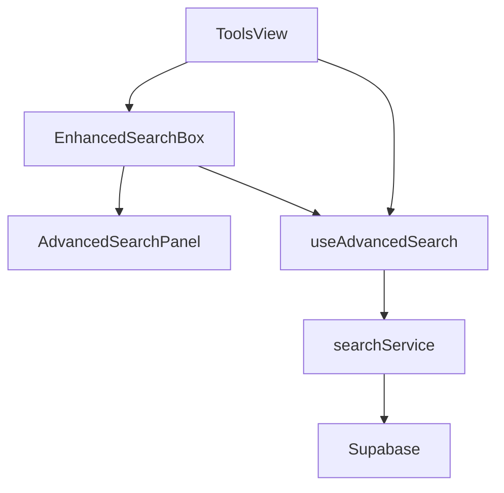
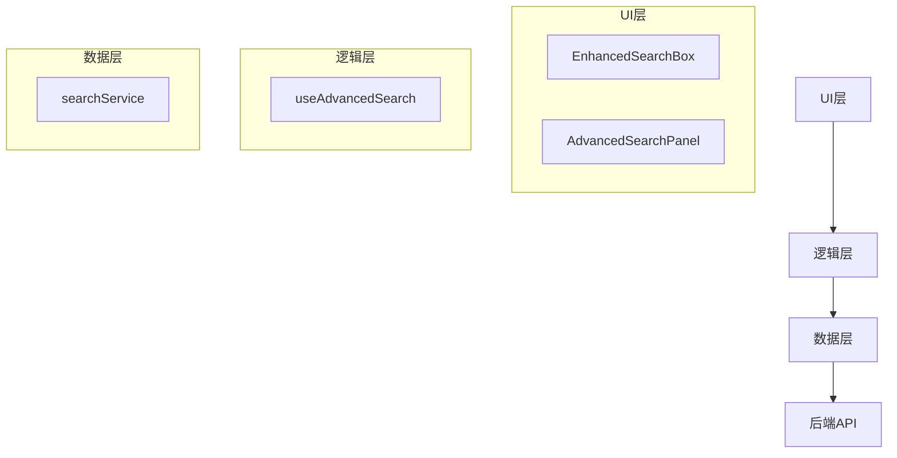
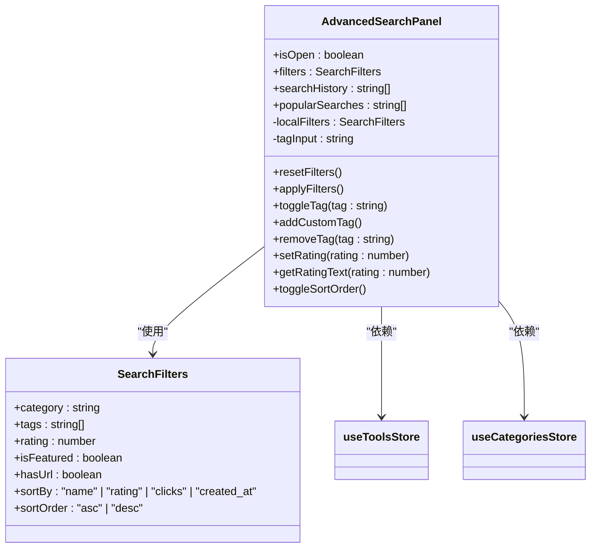
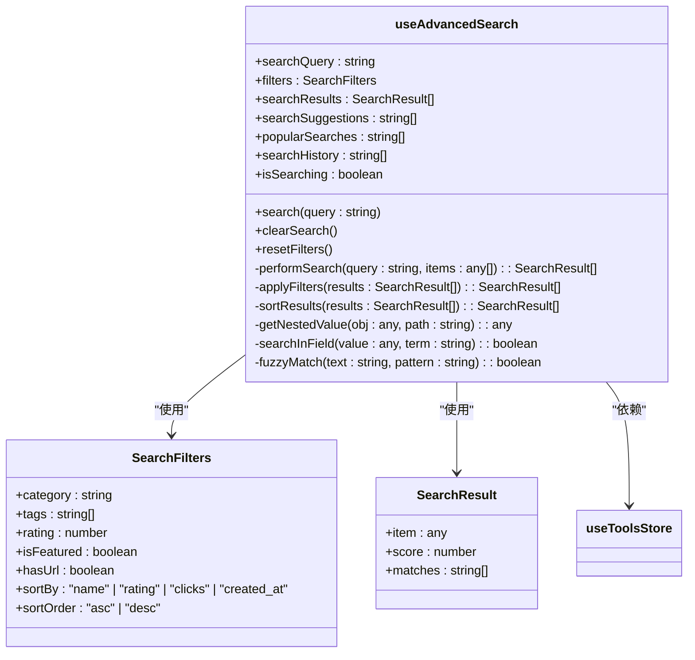

# 高级搜索组件

<cite>
**本文档引用的文件**
- [AdvancedSearchPanel.vue](file://src/components/search/AdvancedSearchPanel.vue)
- [EnhancedSearchBox.vue](file://src/components/search/EnhancedSearchBox.vue)
- [useAdvancedSearch.ts](file://src/composables/useAdvancedSearch.ts)
- [searchService.ts](file://src/services/searchService.ts)
- [ToolsView.vue](file://src/views/ToolsView.vue)
- [index.ts](file://src/types/index.ts)
- [tools.ts](file://src/stores/tools.ts)
- [supabaseClient.ts](file://src/lib/supabaseClient.ts)
</cite>

## 目录
1. [简介](#简介)
2. [项目结构](#项目结构)
3. [核心组件](#核心组件)
4. [架构概述](#架构概述)
5. [详细组件分析](#详细组件分析)
6. [依赖分析](#依赖分析)
7. [性能考虑](#性能考虑)
8. [故障排除指南](#故障排除指南)
9. [结论](#结论)

## 简介
本文档深入解析高级搜索组件的实现机制与交互逻辑。详细说明AdvancedSearchPanel如何集成多维度筛选条件（分类、评分、标签）、关键词高亮显示与搜索建议下拉功能，结合useAdvancedSearch组合式函数管理查询状态、处理防抖逻辑与搜索历史缓存。阐述EnhancedSearchBox的输入事件处理链，包括输入验证、自动补全触发机制、键盘导航支持（上下键选择、回车确认）与聚焦行为控制。提供组件间通信示例，如从ToolsView触发搜索并同步结果状态。记录错误处理策略、加载反馈设计（骨架屏或加载指示器）及无障碍访问支持（如ARIA标签与屏幕阅读器兼容性）。结合实际代码片段展示查询参数构建与响应式更新流程。

## 项目结构
高级搜索功能主要由以下几个核心文件构成：
- `src/components/search/AdvancedSearchPanel.vue`：高级搜索面板组件，提供多维度筛选功能
- `src/components/search/EnhancedSearchBox.vue`：增强型搜索框组件，包含搜索建议和高级搜索入口
- `src/composables/useAdvancedSearch.ts`：组合式函数，管理搜索状态和逻辑
- `src/services/searchService.ts`：搜索服务，处理实际的搜索请求和数据获取
- `src/views/ToolsView.vue`：工具视图，集成搜索功能的主视图



**Diagram sources**
- [EnhancedSearchBox.vue](file://src/components/search/EnhancedSearchBox.vue)
- [AdvancedSearchPanel.vue](file://src/components/search/AdvancedSearchPanel.vue)
- [useAdvancedSearch.ts](file://src/composables/useAdvancedSearch.ts)
- [searchService.ts](file://src/services/searchService.ts)
- [ToolsView.vue](file://src/views/ToolsView.vue)

**Section sources**
- [EnhancedSearchBox.vue](file://src/components/search/EnhancedSearchBox.vue)
- [AdvancedSearchPanel.vue](file://src/components/search/AdvancedSearchPanel.vue)
- [useAdvancedSearch.ts](file://src/composables/useAdvancedSearch.ts)
- [searchService.ts](file://src/services/searchService.ts)
- [ToolsView.vue](file://src/views/ToolsView.vue)

## 核心组件
高级搜索组件的核心由`AdvancedSearchPanel`和`EnhancedSearchBox`两个Vue组件构成，通过`useAdvancedSearch`组合式函数进行状态管理。`AdvancedSearchPanel`提供多维度筛选功能，包括分类、标签、评分等；`EnhancedSearchBox`则提供搜索输入、建议下拉和高级搜索入口。两者通过事件和props进行通信，实现完整的搜索体验。

**Section sources**
- [AdvancedSearchPanel.vue](file://src/components/search/AdvancedSearchPanel.vue)
- [EnhancedSearchBox.vue](file://src/components/search/EnhancedSearchBox.vue)
- [useAdvancedSearch.ts](file://src/composables/useAdvancedSearch.ts)

## 架构概述
高级搜索组件采用分层架构设计，从UI层到服务层逐层解耦。UI层由`EnhancedSearchBox`和`AdvancedSearchPanel`组成，负责用户交互和界面展示；逻辑层由`useAdvancedSearch`组合式函数构成，管理搜索状态和业务逻辑；数据层由`searchService`服务实现，负责与后端API通信。这种分层设计使得组件易于维护和扩展。



**Diagram sources**
- [EnhancedSearchBox.vue](file://src/components/search/EnhancedSearchBox.vue)
- [AdvancedSearchPanel.vue](file://src/components/search/AdvancedSearchPanel.vue)
- [useAdvancedSearch.ts](file://src/composables/useAdvancedSearch.ts)
- [searchService.ts](file://src/services/searchService.ts)

## 详细组件分析
### AdvancedSearchPanel 分析
`AdvancedSearchPanel`组件提供多维度筛选功能，包括分类、标签、评分等。它通过props接收筛选条件和搜索历史，通过事件与父组件通信。组件内部使用`useToolsStore`和`useCategoriesStore`获取工具和分类数据，实现动态的筛选选项。



**Diagram sources**
- [AdvancedSearchPanel.vue](file://src/components/search/AdvancedSearchPanel.vue)
- [useAdvancedSearch.ts](file://src/composables/useAdvancedSearch.ts)
- [tools.ts](file://src/stores/tools.ts)
- [index.ts](file://src/types/index.ts)

### EnhancedSearchBox 分析
`EnhancedSearchBox`组件提供增强型搜索功能，包括搜索输入、建议下拉和高级搜索入口。它通过`useDebounceFn`实现防抖，优化搜索性能。组件内部管理多个状态，包括搜索查询、搜索类型、筛选条件等，并通过事件与父组件通信。

```mermaid
classDiagram
class EnhancedSearchBox {
+placeholder : string
+autoFocus : boolean
+showAdvanced : boolean
+defaultType : string
-query : string
-searchType : string
-isFocused : boolean
-isExpanded : boolean
-showSuggestions : boolean
-showAdvanced : boolean
-isSearching : boolean
-selectedIndex : number
-suggestions : SearchSuggestion[]
-searchHistory : SearchHistory[]
-popularSearches : string[]
-filters : SearchFilters
-selectedTags : Tag[]
-tagQuery : string
-availableTags : Tag[]
-lastSearchResult : SearchResult<any>
+handleFocus()
+handleBlur()
+handleInput()
+handleKeydown(event : KeyboardEvent)
+loadSuggestions()
+debouncedLoadSuggestions()
+selectSuggestion(text : string)
+performSearch()
+clearSearch()
+clearHistory()
+toggleAdvanced()
+resetFilters()
+applyFilters()
+searchTags()
+addTag(tag : Tag)
+removeTag(tag : Tag)
+getSuggestionIcon(type : string)
+getSuggestionTypeText(type : string)
+formatTime(date : Date)
}
class SearchSuggestion {
+text : string
+type : "query" | "category" | "tag" | "tool" | "product"
+count? : number
}
class SearchHistory {
+id : string
+query : string
+type : string
+timestamp : Date
+results_count : number
}
class SearchResult {
+items : T[]
+total : number
+query : string
+suggestions : string[]
+facets : SearchFacets
+searchTime : number
}
class SearchFacets {
+categories : { name : string; count : number }[]
+tags : { name : string; count : number }[]
+priceRanges : { range : string; count : number }[]
}
EnhancedSearchBox --> SearchSuggestion : "使用"
EnhancedSearchBox --> SearchHistory : "使用"
EnhancedSearchBox --> SearchResult : "使用"
EnhancedSearchBox --> SearchFacets : "使用"
EnhancedSearchBox --> searchService : "依赖"
EnhancedSearchBox --> useCategoriesStore : "依赖"
```

**Diagram sources**
- [EnhancedSearchBox.vue](file://src/components/search/EnhancedSearchBox.vue)
- [searchService.ts](file://src/services/searchService.ts)
- [index.ts](file://src/types/index.ts)
- [supabaseClient.ts](file://src/lib/supabaseClient.ts)

### useAdvancedSearch 组合式函数分析
`useAdvancedSearch`组合式函数是高级搜索的核心逻辑层，负责管理搜索状态和业务逻辑。它提供搜索、筛选、排序等功能，并通过计算属性实现响应式更新。函数内部实现智能搜索算法，包括全文搜索、模糊匹配和权重计算。



**Diagram sources**
- [useAdvancedSearch.ts](file://src/composables/useAdvancedSearch.ts)
- [tools.ts](file://src/stores/tools.ts)
- [index.ts](file://src/types/index.ts)

## 依赖分析
高级搜索组件依赖多个外部库和内部模块。主要依赖包括：
- Vue 3：框架基础
- @vueuse/core：提供`useDebounceFn`等实用函数
- lucide-vue-next：图标库
- Supabase：后端服务

```mermaid
graph TD
A[AdvancedSearchPanel] --> B[Vue 3]
A --> C[lucide-vue-next]
D[EnhancedSearchBox] --> B
D --> C
D --> E[@vueuse/core]
F[useAdvancedSearch] --> B
G[searchService] --> B
G --> H[Supabase]
```

**Diagram sources**
- [AdvancedSearchPanel.vue](file://src/components/search/AdvancedSearchPanel.vue)
- [EnhancedSearchBox.vue](file://src/components/search/EnhancedSearchBox.vue)
- [useAdvancedSearch.ts](file://src/composables/useAdvancedSearch.ts)
- [searchService.ts](file://src/services/searchService.ts)
- [package.json](file://package.json)

**Section sources**
- [AdvancedSearchPanel.vue](file://src/components/search/AdvancedSearchPanel.vue)
- [EnhancedSearchBox.vue](file://src/components/search/EnhancedSearchBox.vue)
- [useAdvancedSearch.ts](file://src/composables/useAdvancedSearch.ts)
- [searchService.ts](file://src/services/searchService.ts)
- [package.json](file://package.json)

## 性能考虑
高级搜索组件在性能方面做了多项优化：
1. 使用防抖（debounce）减少搜索请求频率
2. 采用计算属性实现响应式更新，避免不必要的重新渲染
3. 在客户端实现部分筛选和排序逻辑，减少后端压力
4. 使用虚拟滚动（virtual scrolling）处理大量搜索结果

这些优化措施确保了搜索功能在大数据量下的流畅体验。

## 故障排除指南
### 常见问题
1. **搜索无结果**：检查搜索查询是否包含特殊字符，或尝试清除搜索历史
2. **高级搜索面板不显示**：确保`showAdvanced`属性正确设置
3. **搜索建议不更新**：检查`useDebounceFn`的防抖时间设置
4. **筛选条件不生效**：确认`filters`对象的属性名与后端API匹配

### 调试技巧
1. 使用浏览器开发者工具检查网络请求
2. 在`searchService`中添加日志输出
3. 检查Vuex store中的状态变化
4. 验证Supabase查询语句的正确性

**Section sources**
- [searchService.ts](file://src/services/searchService.ts)
- [useAdvancedSearch.ts](file://src/composables/useAdvancedSearch.ts)
- [EnhancedSearchBox.vue](file://src/components/search/EnhancedSearchBox.vue)
- [AdvancedSearchPanel.vue](file://src/components/search/AdvancedSearchPanel.vue)

## 结论
高级搜索组件通过`AdvancedSearchPanel`、`EnhancedSearchBox`和`useAdvancedSearch`的协同工作，实现了功能丰富且用户体验良好的搜索功能。组件采用分层架构设计，具有良好的可维护性和扩展性。通过防抖、计算属性等技术优化了性能，确保了在大数据量下的流畅体验。未来可以考虑增加更多筛选维度、优化搜索算法和增强无障碍访问支持。