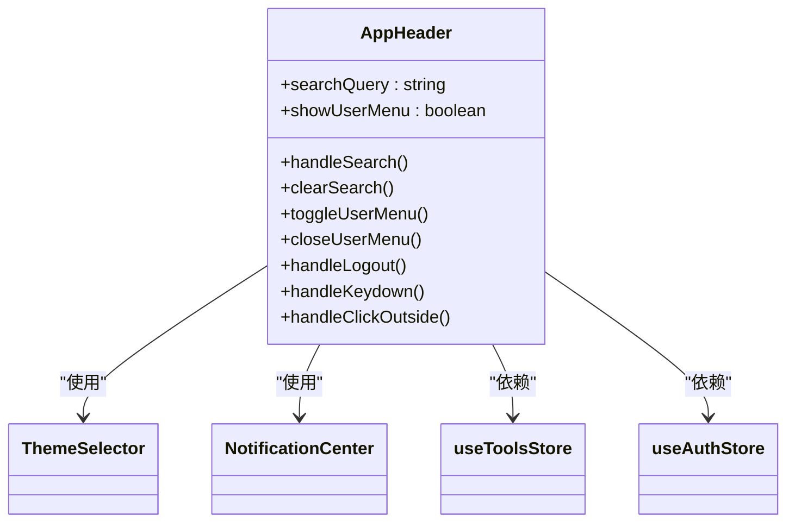
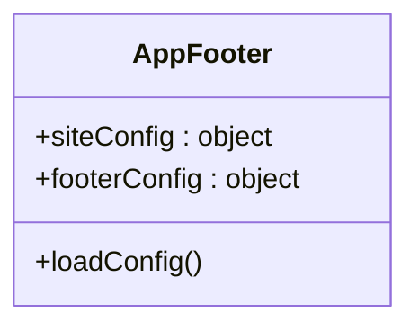
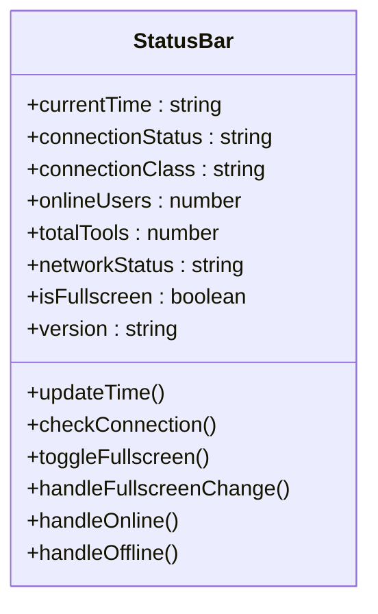
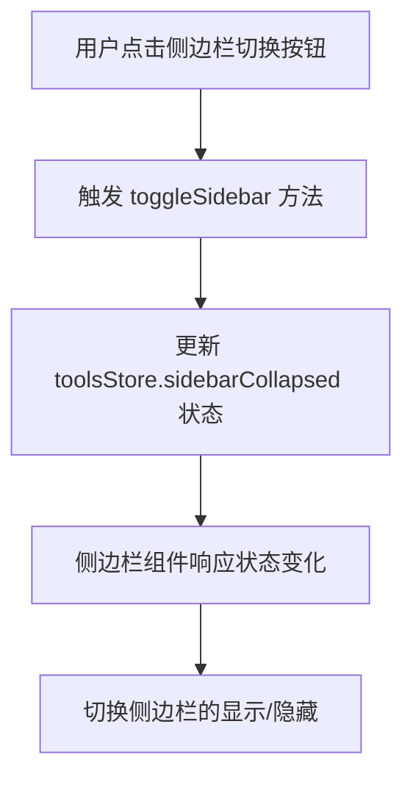
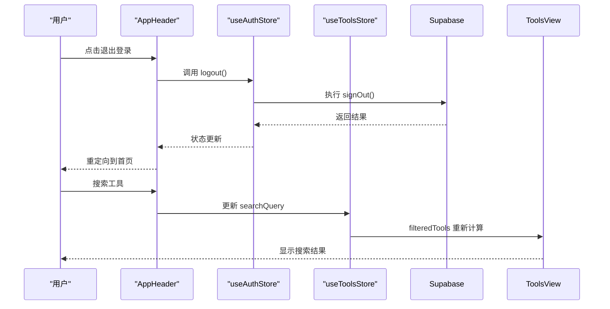

# 布局组件

<cite>
**本文档中引用的文件**  
- [AppHeader.vue](file://src/components/AppHeader.vue)
- [AppFooter.vue](file://src/components/AppFooter.vue)
- [StatusBar.vue](file://src/components/StatusBar.vue)
- [App.vue](file://src/App.vue)
- [auth.ts](file://src/stores/auth.ts)
- [tools.ts](file://src/stores/tools.ts)
- [HomeView.vue](file://src/views/HomeView.vue)
- [ToolsView.vue](file://src/views/ToolsView.vue)
- [ThemeSelector.vue](file://src/components/theme/ThemeSelector.vue)
</cite>

## 目录
1. [布局组件概述](#布局组件概述)
2. [页眉组件（AppHeader）](#页眉组件appheader)
3. [页脚组件（AppFooter）](#页脚组件appfooter)
4. [状态栏组件（StatusBar）](#状态栏组件statusbar)
5. [响应式导航实现](#响应式导航实现)
6. [插槽与内容定制](#插槽与内容定制)
7. [可访问性与SEO优化](#可访问性与seo优化)
8. [状态管理集成](#状态管理集成)
9. [组件复用示例](#组件复用示例)

## 布局组件概述

布局组件构成了应用的整体结构框架，包括页眉（AppHeader）、页脚（AppFooter）和状态栏（StatusBar）。这些组件在 `App.vue` 中被统一引入，形成一致的页面布局。它们分别负责导航、全局信息展示和实时状态提示，共同构建了用户友好的界面体验。

**Section sources**
- [App.vue](file://src/App.vue#L1-L70)

## 页眉组件（AppHeader）

`AppHeader` 组件实现了应用的全局导航功能，包含品牌标识、搜索框、主题切换、通知中心和用户菜单。其设计遵循响应式原则，适配不同屏幕尺寸。

组件通过 `useToolsStore` 和 `useAuthStore` 与 Pinia 状态管理器交互，实现侧边栏切换、搜索查询和用户认证状态的同步。搜索功能支持键盘快捷键（Ctrl+K）和回车确认，提升了操作效率。

用户菜单在认证状态下显示，提供个人资料、收藏、订单等快捷入口，并根据用户角色动态显示管理后台链接。菜单的展开与关闭通过点击外部区域或按下 ESC 键实现，增强了交互的直观性。

**Diagram sources**
- [AppHeader.vue](file://src/components/AppHeader.vue#L1-L601)

**Section sources**
- [AppHeader.vue](file://src/components/AppHeader.vue#L1-L601)
- [auth.ts](file://src/stores/auth.ts#L1-L151)
- [tools.ts](file://src/stores/tools.ts#L1-L341)

## 页脚组件（AppFooter）

`AppFooter` 组件提供了网站的全局信息和导航链接，包括公司信息、快速导航、产品服务、帮助支持和联系信息。其设计采用网格布局，在桌面端显示多列信息，在移动端自动堆叠为单列。

组件包含动态统计数据（工具数量、分类数量、用户数量）和社交媒体链接，支持通过本地存储加载自定义配置。页脚的视觉设计采用渐变背景，与整体品牌风格保持一致。

**Diagram sources**
- [AppFooter.vue](file://src/components/AppFooter.vue#L1-L435)

**Section sources**
- [AppFooter.vue](file://src/components/AppFooter.vue#L1-L435)

## 状态栏组件（StatusBar）

`StatusBar` 组件作为全局状态指示器，固定在页面底部，提供实时的系统和用户信息。它显示数据库连接状态、在线用户数、工具总数、当前时间、网络状态和应用版本。

组件通过 `onMounted` 和 `onUnmounted` 生命周期钩子管理定时器和事件监听器，确保资源的正确释放。时间显示每秒更新一次，连接状态通过监听 `online` 和 `offline` 事件动态调整。

状态栏支持全屏切换功能，通过 `requestFullscreen` API 实现。其设计考虑了响应式需求，在小屏幕上隐藏部分信息以适应有限的显示空间。

**Diagram sources**
- [StatusBar.vue](file://src/components/StatusBar.vue#L1-L278)

**Section sources**
- [StatusBar.vue](file://src/components/StatusBar.vue#L1-L278)

## 响应式导航实现

应用的响应式导航通过 Tailwind CSS 的断点系统实现。在桌面端，`AppHeader` 显示完整的搜索框和用户菜单；在移动端（`max-width: 768px`），标题副文本和搜索快捷键提示被隐藏，以节省空间。

汉堡菜单的交互逻辑通过 `sidebarCollapsed` 状态在 `toolsStore` 中管理。点击侧边栏切换按钮会触发 `toggleSidebar` 方法，改变侧边栏的展开状态。这种设计确保了在小屏幕上也能高效地访问导航功能。

**Diagram sources**
- [AppHeader.vue](file://src/components/AppHeader.vue#L1-L601)
- [tools.ts](file://src/stores/tools.ts#L1-L341)

**Section sources**
- [AppHeader.vue](file://src/components/AppHeader.vue#L1-L601)
- [tools.ts](file://src/stores/tools.ts#L1-L341)

## 插槽与内容定制

虽然当前实现中未直接使用 Vue 的 `<slot>` 语法，但通过在 `App.vue` 中组合布局组件，实现了类似插槽的内容定制功能。`RouterView` 组件作为主内容区域的"插槽"，动态渲染不同视图。

在 `HomeView` 和 `ToolsView` 中，通过不同的内容结构和组件组合，展示了布局组件的灵活性。例如，`HomeView` 包含英雄区域和工具网格，而 `ToolsView` 则包含过滤器栏和工具列表。

**Section sources**
- [App.vue](file://src/App.vue#L1-L70)
- [HomeView.vue](file://src/views/HomeView.vue#L1-L598)
- [ToolsView.vue](file://src/views/ToolsView.vue#L1-L966)

## 可访问性与SEO优化

布局组件在设计时考虑了可访问性（a11y）要求。使用语义化的 HTML 标签（如 `header`、`footer`、`nav`），并为图标按钮提供 `title` 属性或屏幕阅读器友好的文本。

键盘导航支持通过 `@keydown` 事件处理实现，如搜索框的 Ctrl+K 快捷键和用户菜单的 ESC 键关闭。焦点管理确保用户可以通过 Tab 键在界面元素间流畅移动。

对于 SEO 优化，组件支持服务端渲染（SSR）兼容性，确保关键内容（如品牌信息、导航链接）能在初始 HTML 中呈现。`AppFooter` 中的链接结构有助于搜索引擎爬虫发现网站内容。

**Section sources**
- [AppHeader.vue](file://src/components/AppHeader.vue#L1-L601)
- [AppFooter.vue](file://src/components/AppFooter.vue#L1-L435)

## 状态管理集成

布局组件与 Pinia 状态管理器深度集成。`AppHeader` 通过 `useAuthStore` 访问用户认证状态和角色信息，动态渲染用户菜单和管理链接。

`AppHeader` 和 `ToolsView` 共享 `useToolsStore` 中的 `searchQuery` 状态，实现跨组件的搜索功能同步。`StatusBar` 虽然主要显示静态信息，但其设计模式支持未来集成更多实时状态数据。

事件分发通过 Pinia 的 action 方法实现，如 `logout` 和 `toggleSidebar`，确保状态变更的可追踪性和可调试性。

**Diagram sources**
- [AppHeader.vue](file://src/components/AppHeader.vue#L1-L601)
- [auth.ts](file://src/stores/auth.ts#L1-L151)
- [tools.ts](file://src/stores/tools.ts#L1-L341)

**Section sources**
- [AppHeader.vue](file://src/components/AppHeader.vue#L1-L601)
- [auth.ts](file://src/stores/auth.ts#L1-L151)
- [tools.ts](file://src/stores/tools.ts#L1-L341)

## 组件复用示例

布局组件在 `HomeView` 和 `ToolsView` 中被一致地复用，确保了用户体验的统一性。在 `HomeView` 中，除了标准布局外，还集成了增强搜索框和浮动元素，创造了更具吸引力的首页体验。

在 `ToolsView` 中，布局组件与高级搜索面板、过滤器和排序功能结合，提供了强大的工具发现能力。这种复用模式降低了维护成本，同时保证了品牌和交互的一致性。

**Section sources**
- [HomeView.vue](file://src/views/HomeView.vue#L1-L598)
- [ToolsView.vue](file://src/views/ToolsView.vue#L1-L966)