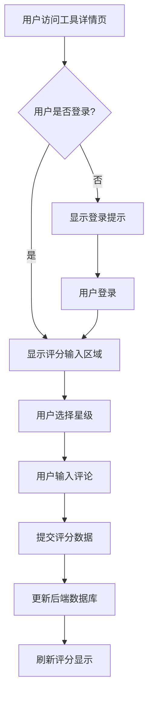
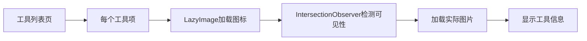
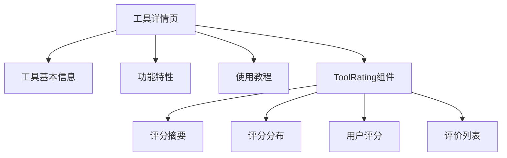

# 通用功能组件

<cite>
**本文档引用文件**  
- [LazyImage.vue](file://src/components/common/LazyImage.vue)
- [LazyComponent.vue](file://src/components/common/LazyComponent.vue)
- [useLazyLoading.ts](file://src/composables/useLazyLoading.ts)
- [StarRating.vue](file://src/components/ui/StarRating.vue)
- [ToolRating.vue](file://src/components/ToolRating.vue)
- [ToolsView.vue](file://src/views/ToolsView.vue)
- [ToolDetailView.vue](file://src/views/ToolDetailView.vue)
</cite>

## 目录
1. [简介](#简介)
2. [懒加载组件设计原理](#懒加载组件设计原理)
3. [评分组件交互实现](#评分组件交互实现)
4. [组件集成与使用示例](#组件集成与使用示例)
5. [封装通用性与扩展性策略](#封装通用性与扩展性策略)

## 简介
本文档深入解析项目中通用功能组件的设计原理与性能优化实践。重点阐述LazyImage与LazyComponent如何利用Intersection Observer实现懒加载，减少初始渲染负载并提升LCP指标。同时分析StarRating与ToolRating组件的交互细节，包括鼠标悬停反馈、半星评分支持与只读模式控制。文档还提供在产品列表页与工具详情页中的集成示例，并讨论封装通用性与扩展性的平衡策略。

## 懒加载组件设计原理

### LazyImage组件实现机制
LazyImage组件通过Intersection Observer API实现图片懒加载，有效减少初始渲染负载，提升LCP（最大内容绘制）指标。组件在视口内可见时才加载图片资源，避免不必要的网络请求。

组件支持多种配置选项：
- **阈值配置**：通过`threshold`属性设置交叉观察器的触发阈值，默认值为0.1
- **根边距**：通过`rootMargin`属性设置观察区域的边距，默认值为'50px'
- **占位图策略**：提供`skeleton-loading`动画占位符，在图片加载完成前显示流畅的加载体验
- **错误回退机制**：当图片加载失败时，显示错误占位符并提供重试功能

组件还实现了图片质量优化功能，根据`quality`属性自动添加CDN优化参数，并优先使用WebP格式以提升加载性能。

```mermaid
sequenceDiagram
participant 浏览器
participant LazyImage
participant IntersectionObserver
participant 图片资源
LazyImage->>IntersectionObserver : 初始化观察器
IntersectionObserver->>LazyImage : 元素进入视口
LazyImage->>图片资源 : 发起图片请求
图片资源-->>LazyImage : 返回图片数据
LazyImage-->>浏览器 : 渲染图片
alt 浏览器 : 显示加载完成的图片
```

**图表来源**
- [LazyImage.vue](file://src/components/common/LazyImage.vue#L1-L324)

**本节来源**
- [LazyImage.vue](file://src/components/common/LazyImage.vue#L1-L324)
- [useLazyLoading.ts](file://src/composables/useLazyLoading.ts#L1-L104)

### LazyComponent组件实现机制
LazyComponent组件实现了组件级别的懒加载，适用于复杂组件或路由组件的按需加载。与LazyImage类似，它也基于Intersection Observer API，但针对组件加载场景进行了优化。

关键特性包括：
- **预加载距离**：通过`preloadDistance`属性设置预加载距离，默认100px
- **异步组件加载**：使用Vue的`defineAsyncComponent`实现真正的异步加载
- **加载状态管理**：提供加载中、加载完成、加载错误等多种状态的UI反馈
- **重试机制**：支持配置最大重试次数，增强用户体验

组件通过`componentLoader`属性接收一个返回Promise的函数，实现动态组件加载，有效分割代码包，提升首屏加载速度。

```mermaid
sequenceDiagram
participant 浏览器
participant LazyComponent
participant IntersectionObserver
participant 组件资源
LazyComponent->>IntersectionObserver : 初始化观察器
IntersectionObserver->>LazyComponent : 组件进入预加载区域
LazyComponent->>组件资源 : 发起组件请求
组件资源-->>LazyComponent : 返回组件定义
LazyComponent-->>浏览器 : 渲染组件
alt 浏览器 : 显示加载完成的组件
```

**图表来源**
- [LazyComponent.vue](file://src/components/common/LazyComponent.vue#L1-L268)
- [useLazyLoading.ts](file://src/composables/useLazyLoading.ts#L101-L157)

**本节来源**
- [LazyComponent.vue](file://src/components/common/LazyComponent.vue#L1-L268)
- [useLazyLoading.ts](file://src/composables/useLazyLoading.ts#L101-L157)

## 评分组件交互实现

### StarRating组件设计
StarRating组件实现了基础的星级评分功能，支持鼠标悬停反馈和只读模式控制。组件采用Vue 3的Composition API和TypeScript，确保类型安全。

核心功能特性：
- **双向绑定**：通过`v-model`实现评分值的双向绑定
- **只读模式**：通过`readonly`属性控制组件是否可交互
- **鼠标悬停反馈**：悬停时显示半星效果，提升用户体验
- **类型校验**：通过TypeScript接口定义评分值的合法性规则

组件使用简单的Unicode星号字符作为图标，通过CSS类控制填充状态，实现轻量级的视觉反馈。

```mermaid
classDiagram
class StarRating {
+modelValue : number
+readonly : boolean
-updateRating(n : number) : void
}
StarRating --> "1" Event : emits
Event : update : modelValue
```

**图表来源**
- [StarRating.vue](file://src/components/ui/StarRating.vue#L1-L54)

**本节来源**
- [StarRating.vue](file://src/components/ui/StarRating.vue#L1-L54)

### ToolRating组件设计
ToolRating组件是StarRating的高级应用，提供了完整的工具评价系统。组件整合了评分、评论、用户身份验证等多种功能。

主要功能模块：
- **评分分布展示**：可视化显示各星级的评价数量分布
- **用户评分功能**：已登录用户可提交或修改评分
- **评论系统**：支持用户添加文字评论和匿名评价
- **评价列表**：显示所有用户的评价内容

组件通过`tool-id`属性接收工具ID，自动加载对应的评分数据，并与Supabase后端服务集成，实现数据持久化。



**图表来源**
- [ToolRating.vue](file://src/components/ToolRating.vue#L1-L482)

**本节来源**
- [ToolRating.vue](file://src/components/ToolRating.vue#L1-L482)
- [StarRating.vue](file://src/components/ui/StarRating.vue#L1-L54)

## 组件集成与使用示例

### 在工具列表页中的集成
在工具列表页(ToolsView.vue)中，LazyImage组件被用于工具图标的懒加载，确保大量工具项不会影响初始渲染性能。



**本节来源**
- [ToolsView.vue](file://src/views/ToolsView.vue#L1-L799)

### 在工具详情页中的集成
在工具详情页(ToolDetailView.vue)中，ToolRating组件被直接集成，为用户提供完整的评价功能。



**本节来源**
- [ToolDetailView.vue](file://src/views/ToolDetailView.vue#L1-L510)

## 封装通用性与扩展性策略

### 通用性设计原则
组件设计遵循高内聚低耦合原则，通过props暴露必要的配置项，如`size`、`color`、`disabled`等，确保组件在不同场景下的适用性。

- **LazyImage**：通过`width`、`height`、`quality`等属性支持不同尺寸和质量需求
- **StarRating**：通过`readonly`属性支持只读和可编辑两种模式
- **ToolRating**：通过`tool-id`属性实现与具体工具的解耦

### 扩展性实现
组件通过插槽(slot)机制提供扩展点，允许用户自定义占位符、错误界面等内容。

- **占位符插槽**：允许自定义加载中的占位内容
- **错误插槽**：允许自定义错误界面和重试逻辑
- **事件系统**：通过emits实现双向绑定和状态通知

### 主题系统集成
组件设计考虑了主题系统的动态适配，通过CSS变量和类名控制样式，支持主题切换。

- **CSS变量**：使用CSS自定义属性实现主题颜色的动态调整
- **类名策略**：通过BEM命名规范确保样式隔离
- **响应式设计**：支持不同屏幕尺寸的适配

**本节来源**
- [LazyImage.vue](file://src/components/common/LazyImage.vue#L1-L324)
- [LazyComponent.vue](file://src/components/common/LazyComponent.vue#L1-L268)
- [StarRating.vue](file://src/components/ui/StarRating.vue#L1-L54)
- [ToolRating.vue](file://src/components/ToolRating.vue#L1-L482)