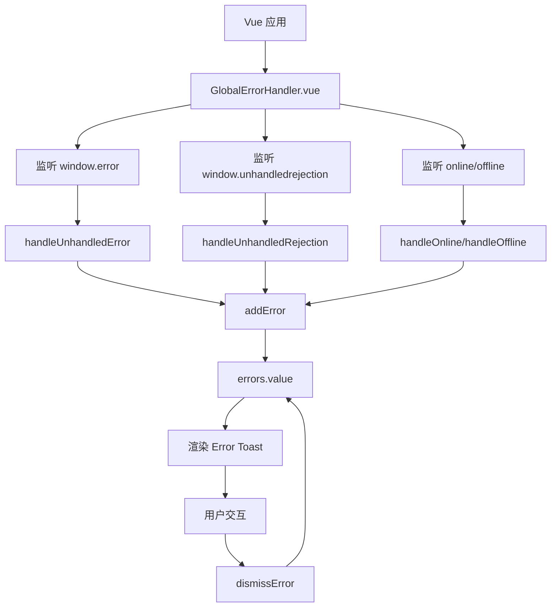
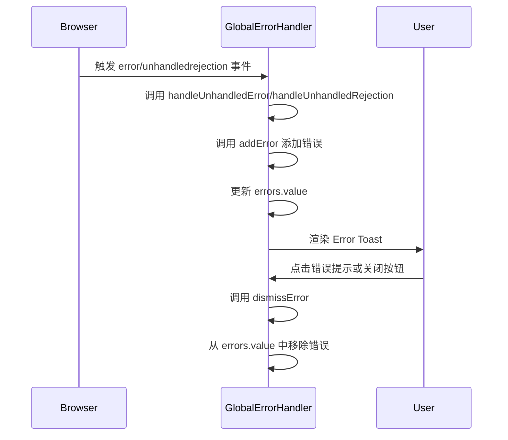
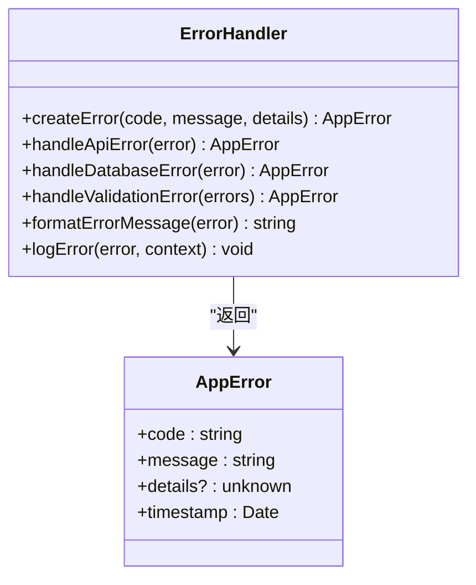
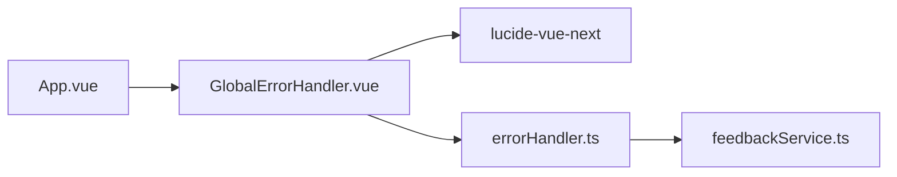

# 全局错误处理器

<cite>
**本文档中引用的文件**
- [GlobalErrorHandler.vue](file://src/components/error/GlobalErrorHandler.vue)
- [errorHandler.ts](file://src/utils/errorHandler.ts)
- [feedbackService.ts](file://src/services/feedbackService.ts)
- [App.vue](file://src/App.vue)
</cite>

## 目录
1. [简介](#简介)
2. [核心组件](#核心组件)
3. [架构概述](#架构概述)
4. [详细组件分析](#详细组件分析)
5. [依赖分析](#依赖分析)
6. [性能考虑](#性能考虑)
7. [故障排除指南](#故障排除指南)
8. [结论](#结论)

## 简介
`GlobalErrorHandler.vue` 是本应用的核心错误处理组件，作为根组件的错误边界，负责捕获和处理未处理的运行时异常。该组件通过集成 Vue 的错误处理机制和自定义错误处理逻辑，实现了全面的异常捕获、用户友好的错误提示、错误信息上报和恢复机制。它不仅处理 JavaScript 运行时错误和未处理的 Promise 拒绝，还监控网络状态变化，为用户提供实时的连接状态反馈。通过与 `errorHandler` 工具类和 `feedbackService` 的协同工作，该组件构建了一个完整的错误处理生态系统，确保了应用的健壮性和用户体验。

## 核心组件
`GlobalErrorHandler.vue` 组件是应用的全局错误处理中心，主要负责捕获未处理的异常并以用户友好的方式展示。它通过 `teleport` 将错误提示渲染到 `body` 元素中，确保在任何页面状态下都能正确显示。组件维护一个响应式的错误队列，支持多种类型的错误提示（错误、警告、信息、成功），并为关键错误提供恢复操作（如刷新页面）。同时，它还集成了网络状态监控功能，当用户网络断开时，会显示相应的离线提示。

**Section sources**
- [GlobalErrorHandler.vue](file://src/components/error/GlobalErrorHandler.vue#L1-L337)

## 架构概述
`GlobalErrorHandler.vue` 作为应用的根级错误边界，通过监听全局事件来捕获各类异常。其架构设计遵循分层处理原则，将错误捕获、处理、展示和上报等职责分离。组件在 `onMounted` 生命周期中注册全局事件监听器，捕获 `error` 和 `unhandledrejection` 事件，然后通过 `addError` 方法将错误添加到内部状态中，触发视图更新。错误信息经过标准化处理后，以 Toast 通知的形式展示给用户，并在一定时间后自动消失。对于关键错误，提供明确的恢复操作指引。

**Diagram sources**
- [GlobalErrorHandler.vue](file://src/components/error/GlobalErrorHandler.vue#L145-L206)

## 详细组件分析

### GlobalErrorHandler.vue 分析
`GlobalErrorHandler.vue` 是一个基于 Vue 3 Composition API 的组件，使用 `<script setup>` 语法糖简化代码结构。它通过 `ref` 创建响应式数据 `errors` 和 `isOnline`，分别用于存储错误列表和网络状态。组件的核心功能是通过 `onMounted` 和 `onUnmounted` 生命周期钩子管理全局事件监听器，确保在组件挂载时添加监听器，在卸载时移除，避免内存泄漏。

#### 错误捕获机制
组件通过监听 `window` 对象的 `error` 和 `unhandledrejection` 事件来捕获未处理的异常。`handleUnhandledError` 函数处理 JavaScript 运行时错误，`handleUnhandledRejection` 函数处理未捕获的 Promise 拒绝。这两个函数都将原始错误信息转换为结构化的错误对象，并调用 `addError` 方法将其添加到错误队列中。

**Diagram sources**
- [GlobalErrorHandler.vue](file://src/components/error/GlobalErrorHandler.vue#L145-L206)

#### 错误信息标准化处理
虽然 `GlobalErrorHandler.vue` 本身不直接处理错误的标准化，但它依赖于 `errorHandler.ts` 工具类来实现这一功能。`errorHandler.ts` 中的 `ErrorHandler` 类提供了 `handleApiError`、`handleDatabaseError` 等静态方法，能够根据错误类型（如 Axios 错误、数据库错误）提取错误码、堆栈跟踪和上下文信息，并将其转换为统一的 `AppError` 接口格式。`formatErrorMessage` 方法则负责将技术性错误信息转换为用户友好的提示语。

**Diagram sources**
- [errorHandler.ts](file://src/utils/errorHandler.ts#L0-L60)

#### 用户友好提示展示逻辑
组件通过 `transition-group` 实现错误提示的动画效果，每个错误以 `error-toast` 的形式从屏幕右侧滑入。错误提示的样式根据类型（`error`、`warning`、`info`、`success`）变化，通过左侧的边框颜色和图标进行区分。消息内容避免暴露敏感的技术细节，而是使用预定义的、易于理解的文本。例如，网络错误显示为“网络连接失败，请检查网络设置”，而不是原始的错误堆栈。

#### 错误自动上报机制
`GlobalErrorHandler.vue` 本身不直接执行错误上报，而是通过 `errorHandler.ts` 中的 `logError` 方法间接实现。`logError` 方法在控制台输出错误日志的同时，预留了 `sendToMonitoring` 方法的接口，可用于将错误摘要发送至服务端进行监控分析。虽然当前实现中该方法被注释，但其设计为未来集成 Sentry 等外部监控工具提供了便利。

#### 错误恢复选项
对于关键错误，组件提供了明确的恢复选项。在 `handleUnhandledError` 和 `handleUnhandledRejection` 处理函数中，都定义了 `actions` 数组，包含“刷新页面”或“重试”按钮。当用户点击这些按钮时，会触发 `window.location.reload()`，从而重新加载页面，尝试恢复应用状态。

### 与外部监控工具的集成
`errorHandler.ts` 中的 `sendToMonitoring` 方法是与外部监控工具（如 Sentry）集成的关键点。虽然当前代码中该方法被注释，但其设计清晰地指明了集成路径：将格式化后的错误数据通过 `fetch` API 发送到指定的监控服务端点。开发者只需取消注释并配置正确的 API 地址和认证信息，即可实现错误的自动上报。

**Section sources**
- [GlobalErrorHandler.vue](file://src/components/error/GlobalErrorHandler.vue#L1-L337)
- [errorHandler.ts](file://src/utils/errorHandler.ts#L0-L327)
- [feedbackService.ts](file://src/services/feedbackService.ts#L0-L508)

## 依赖分析
`GlobalErrorHandler.vue` 组件依赖于多个外部模块和工具类。它直接依赖于 `lucide-vue-next` 图标库来渲染错误图标。在逻辑上，它与 `errorHandler.ts` 工具类紧密耦合，依赖其进行错误的标准化处理和日志记录。虽然不直接调用，但其错误上报功能的设计与 `feedbackService.ts` 服务存在潜在的集成关系。在应用层面，`App.vue` 作为根组件引入并使用 `GlobalErrorHandler.vue`，使其成为整个应用错误处理的入口。

**Diagram sources**
- [App.vue](file://src/App.vue#L0-L51)
- [GlobalErrorHandler.vue](file://src/components/error/GlobalErrorHandler.vue#L1-L337)

## 性能考虑
`GlobalErrorHandler.vue` 的设计考虑了性能因素。错误提示使用 `teleport` 渲染到 `body`，避免了对主应用组件树的频繁更新。错误队列的管理通过 `ref` 实现响应式，确保视图更新的高效性。`setTimeout` 用于实现错误提示的自动消失，避免了持续的定时器开销。事件监听器在组件卸载时被正确移除，防止了内存泄漏。整体上，该组件对应用性能的影响极小。

## 故障排除指南
当 `GlobalErrorHandler.vue` 未能正常工作时，可按以下步骤排查：
1.  **检查组件引入**：确认 `App.vue` 中已正确引入并使用 `GlobalErrorHandler` 组件。
2.  **检查事件监听**：确认 `onMounted` 钩子中的 `addEventListener` 调用是否成功执行。
3.  **检查错误触发**：尝试手动抛出一个错误（如 `throw new Error('test')`）或触发一个未处理的 Promise 拒绝，观察是否能捕获。
4.  **检查样式问题**：如果错误提示未显示，检查 CSS 类名是否正确，以及 `teleport` 是否成功将元素插入到 `body` 中。
5.  **检查网络状态**：模拟网络断开，验证离线提示是否正常显示。

**Section sources**
- [GlobalErrorHandler.vue](file://src/components/error/GlobalErrorHandler.vue#L1-L337)
- [App.vue](file://src/App.vue#L0-L51)

## 结论
`GlobalErrorHandler.vue` 组件通过精心的设计和与其他工具类的协同，构建了一个健壮、用户友好的全局错误处理系统。它有效地捕获了各类运行时异常，提供了清晰的用户反馈和恢复路径，并为错误监控和分析奠定了基础。其模块化的设计和清晰的职责分离，使得该组件易于维护和扩展，是保障应用稳定性和提升用户体验的关键组件。