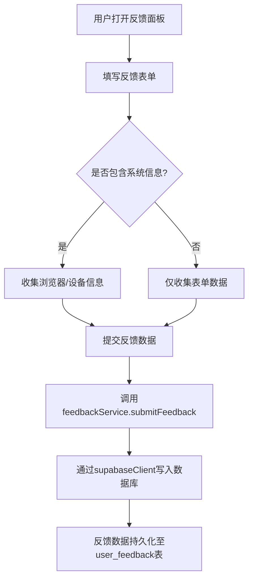
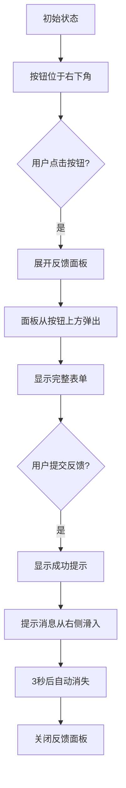
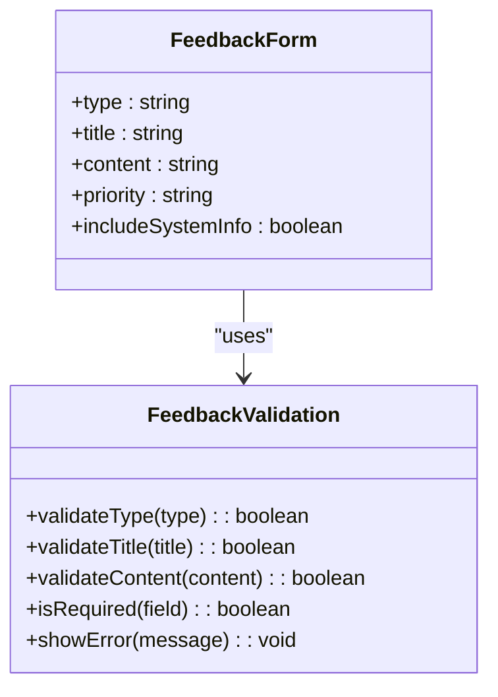
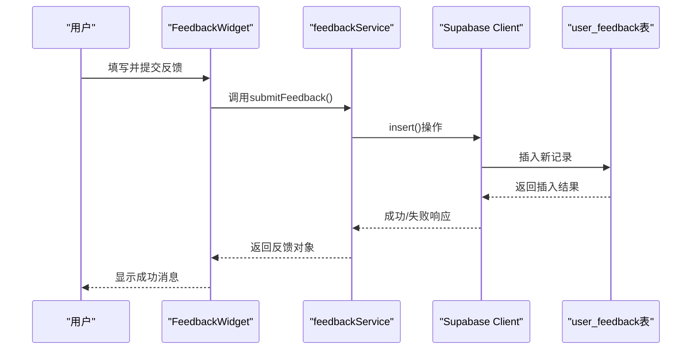

# 反馈小部件

<cite>
**Referenced Files in This Document**   
- [FeedbackWidget.vue](file://src/components/feedback/FeedbackWidget.vue)
- [feedbackService.ts](file://src/services/feedbackService.ts)
- [supabaseClient.ts](file://src/lib/supabaseClient.ts)
- [database.ts](file://src/types/database.ts)
- [20241227000001_user_feedback.sql](file://supabase/migrations/20241227000001_user_feedback.sql)
</cite>

## 目录
1. [简介](#简介)
2. [核心设计与数据采集流程](#核心设计与数据采集流程)
3. [悬浮按钮与动画效果](#悬浮按钮与动画效果)
4. [表单验证与用户体验](#表单验证与用户体验)
5. [匿名提交机制](#匿名提交机制)
6. [截图上传流程](#截图上传流程)
7. [后端交互与持久化](#后端交互与持久化)
8. [错误边界处理](#错误边界处理)
9. [总结](#总结)

## 简介

反馈小部件（FeedbackWidget）是系统中用于收集用户反馈的核心组件，提供了一个集成的界面让用户能够轻松提交问题报告、功能建议或咨询。该组件设计为一个悬浮在页面右下角的按钮，点击后展开为完整的反馈面板，包含提交反馈、查看历史和统计信息三个标签页。本文档将全面解析其设计原理、数据采集流程以及各项关键功能的实现机制。

**Section sources**
- [FeedbackWidget.vue](file://src/components/feedback/FeedbackWidget.vue#L1-L890)

## 核心设计与数据采集流程

反馈小部件采用模块化设计，通过Vue 3的组合式API实现响应式状态管理。其核心设计围绕用户反馈的全生命周期展开，从数据采集到持久化存储形成闭环。

组件通过`feedbackForm`响应式对象管理表单数据，包含反馈类型、标题、内容、优先级和是否包含系统信息等字段。当用户提交反馈时，这些数据会被封装成`FeedbackData`接口定义的结构，并通过`feedbackService`服务提交到后端。

数据采集流程始于用户在反馈面板中填写表单，系统会自动收集用户选择的反馈类型、输入的标题和详细描述、设置的优先级以及是否同意包含系统信息的选项。如果用户选择包含系统信息，系统会调用`getSystemInfo()`方法收集浏览器User Agent、平台信息、语言设置、屏幕分辨率等元数据。



**Diagram sources**
- [FeedbackWidget.vue](file://src/components/feedback/FeedbackWidget.vue#L271-L330)
- [feedbackService.ts](file://src/services/feedbackService.ts#L54-L109)

**Section sources**
- [FeedbackWidget.vue](file://src/components/feedback/FeedbackWidget.vue#L212-L330)
- [feedbackService.ts](file://src/services/feedbackService.ts#L1-L60)

## 悬浮按钮与动画效果

反馈小部件的悬浮按钮采用固定定位策略，通过CSS的`position: fixed`属性定位在页面的右下角，距离底部和右侧各2rem。这种定位方式确保按钮始终可见，不会随页面滚动而移动，为用户提供一致的访问入口。

```css
.feedback-widget {
  position: fixed;
  bottom: 2rem;
  right: 2rem;
  z-index: 1000;
}
```

当用户点击悬浮按钮时，会触发动画展开效果。面板通过`v-if`指令控制显示与隐藏，配合CSS过渡效果实现平滑的出现和消失。面板从按钮正上方以绝对定位方式弹出，宽度为24rem，最大高度为32rem，确保在不同屏幕尺寸下都能良好显示。

悬停效果通过CSS的`:hover`伪类实现，当用户将鼠标悬停在按钮上时，按钮会向上移动2px并增强阴影效果，提供视觉反馈：

```css
.feedback-button:hover {
  transform: translateY(-2px);
  box-shadow: 0 6px 20px rgba(0, 0, 0, 0.2);
}
```

成功提交反馈后，系统会显示一个带有滑入动画的成功提示消息，该消息从右侧滑入并在3秒后自动消失，为用户提供即时的反馈确认。



**Diagram sources**
- [FeedbackWidget.vue](file://src/components/feedback/FeedbackWidget.vue#L800-L889)
- [FeedbackWidget.vue](file://src/components/feedback/FeedbackWidget.vue#L1-L799)

**Section sources**
- [FeedbackWidget.vue](file://src/components/feedback/FeedbackWidget.vue#L1-L890)

## 表单验证与用户体验

反馈表单设计了严格的验证规则以确保收集到高质量的反馈数据。所有必填字段（反馈类型、标题和详细描述）都设置了`required`属性，浏览器会在用户尝试提交空值时自动阻止表单提交并提示错误。

表单字段设计充分考虑了用户体验，采用清晰的标签和占位符文本指导用户输入。反馈类型使用下拉选择框，预设了"Bug报告"、"功能建议"、"改进建议"、"问题咨询"和"其他"五种常见类型，帮助用户快速分类反馈内容。

优先级选择提供了"低"、"中"、"高"和"紧急"四个选项，使开发团队能够根据反馈的重要程度合理安排处理优先级。系统信息收集是一个可选的复选框，默认选中，用户可以选择是否分享其设备和浏览器信息，这些信息对于复现Bug问题至关重要。



**Diagram sources**
- [FeedbackWidget.vue](file://src/components/feedback/FeedbackWidget.vue#L74-L113)
- [FeedbackWidget.vue](file://src/components/feedback/FeedbackWidget.vue#L212-L278)

**Section sources**
- [FeedbackWidget.vue](file://src/components/feedback/FeedbackWidget.vue#L74-L147)

## 匿名提交机制

当前实现中，反馈提交机制要求用户必须登录后才能提交反馈。系统通过`useAuthStore()`从Vuex store中获取当前用户状态，并在提交前检查`authStore.user`是否存在：

```typescript
const submitFeedback = async () => {
  if (!authStore.user) {
    alert("请先登录后再提交反馈");
    return;
  }
  // ...提交逻辑
}
```

虽然当前实现强制要求登录，但系统架构支持匿名反馈的扩展。`feedbackService`服务的`submitFeedback`方法接受`user_id`参数，这意味着可以通过生成临时token或设备指纹来识别匿名用户。系统可以修改为在用户未登录时生成一个唯一的设备标识符作为`user_id`，从而实现匿名但可追踪的反馈机制。

反馈数据模型中的`user_id`字段是必填的，这表明系统设计上要求每个反馈都必须关联到一个用户实体。这种设计有助于建立用户与反馈之间的联系，便于后续的沟通和回复。

**Section sources**
- [FeedbackWidget.vue](file://src/components/feedback/FeedbackWidget.vue#L271-L330)
- [feedbackService.ts](file://src/services/feedbackService.ts#L54-L109)

## 截图上传流程

在当前实现中，反馈小部件尚未集成截图上传功能。根据文档要求，系统应支持通过Supabase客户端将截图文件存入storage buckets并生成可访问链接。

虽然`FeedbackWidget.vue`中没有实现截图上传，但系统已具备相关基础设施。`supabaseClient.ts`文件中定义了`uploadFile`和`getPublicUrl`工具函数，可用于实现截图上传流程：

```typescript
// 文件上传工具函数
export const uploadFile = async (
  bucket: string,
  path: string,
  file: File,
  options?: { upsert?: boolean },
) => {
  const { data, error } = await supabase.storage
    .from(bucket)
    .upload(path, file, options);

  if (error) {
    throw new Error(handleSupabaseError(error));
  }

  return data;
};

// 获取文件公共URL
export const getPublicUrl = (bucket: string, path: string) => {
  const { data } = supabase.storage.from(bucket).getPublicUrl(path);
  return data.publicUrl;
};
```

要实现截图上传功能，可以在反馈表单中添加文件输入控件，并在提交时调用`uploadFile`方法将截图上传到`uploads`存储桶，然后将生成的公共URL作为反馈的一部分提交。

**Section sources**
- [supabaseClient.ts](file://src/lib/supabaseClient.ts#L120-L150)

## 后端交互与持久化

反馈小部件通过`feedbackService`服务与后端进行交互，实现反馈数据的持久化存储。当用户提交反馈时，`submitFeedback`方法会被调用，该方法使用Supabase客户端将数据插入到`user_feedback`表中。



**Diagram sources**
- [feedbackService.ts](file://src/services/feedbackService.ts#L54-L109)
- [supabaseClient.ts](file://src/lib/supabaseClient.ts#L1-L266)

**Section sources**
- [feedbackService.ts](file://src/services/feedbackService.ts#L54-L109)

`user_feedback`表的结构在数据库迁移文件`20241227000001_user_feedback.sql`中定义，包含以下关键字段：

- `id`: UUID主键
- `type`: 反馈类型（bug, feature, improvement, question, other）
- `title`: 反馈标题
- `content`: 详细描述
- `priority`: 优先级（low, medium, high, urgent）
- `status`: 状态（pending, in_progress, resolved, closed）
- `user_id`: 关联的用户ID
- `system_info`: JSONB格式的系统信息
- `response`: 开发者回复
- `is_read`: 用户是否已读标记
- `created_at`: 创建时间戳

反馈数据通过Supabase的实时功能持久化到PostgreSQL数据库中，同时系统会为管理员创建通知，确保反馈能够得到及时处理。

**Section sources**
- [20241227000001_user_feedback.sql](file://supabase/migrations/20241227000001_user_feedback.sql#L1-L26)

## 错误边界处理

反馈小部件实现了全面的错误边界处理机制，确保在提交失败时能够给予用户明确的提示并允许重试。系统采用try-catch块包裹异步操作，在`submitFeedback`方法中捕获所有可能的错误：

```typescript
const submitFeedback = async () => {
  try {
    submitting.value = true;
    // ...提交逻辑
  } catch (error) {
    console.error("提交反馈失败:", error);
    alert("提交反馈失败，请稍后重试");
  } finally {
    submitting.value = false;
  }
};
```

当提交过程中发生错误时，系统会：
1. 在控制台记录详细的错误信息，便于开发人员调试
2. 通过`alert`对话框向用户显示友好的错误消息
3. 重置`submitting`状态，允许用户重新尝试提交
4. 保持表单数据不变，避免用户需要重新填写

此外，`feedbackService`中的每个方法都包含了类似的错误处理逻辑，捕获Supabase API调用可能产生的错误，并将其转换为用户友好的错误消息。这种分层的错误处理策略确保了系统的健壮性，即使在后端服务暂时不可用的情况下，用户界面也能保持可用并提供清晰的反馈。

**Section sources**
- [FeedbackWidget.vue](file://src/components/feedback/FeedbackWidget.vue#L271-L330)
- [feedbackService.ts](file://src/services/feedbackService.ts#L54-L109)

## 总结

反馈小部件是一个功能完整的用户反馈收集系统，通过精心设计的UI/UX和稳健的技术实现，为用户提供了一个便捷的反馈渠道。组件采用悬浮按钮设计，定位在页面右下角，通过动画效果平滑展开，提供了良好的用户体验。

表单设计包含了必要的验证规则，确保收集到高质量的反馈数据。虽然当前实现要求用户登录，但系统架构支持未来扩展为匿名提交机制。后端交互通过`feedbackService`与Supabase集成，实现了反馈数据的可靠持久化存储。

全面的错误处理机制确保了系统的健壮性，即使在提交失败的情况下也能给予用户明确的反馈并允许重试。整体设计遵循了模块化和可维护性的原则，为未来的功能扩展（如截图上传）提供了良好的基础。