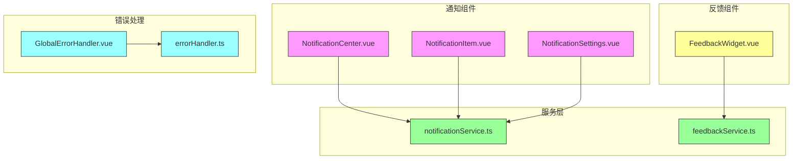
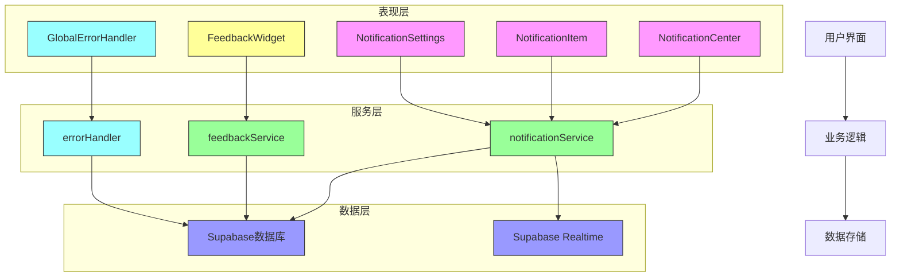
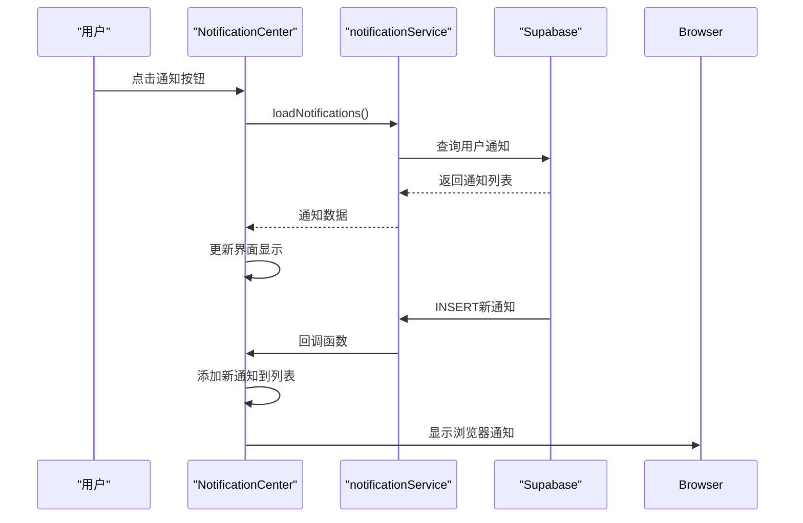
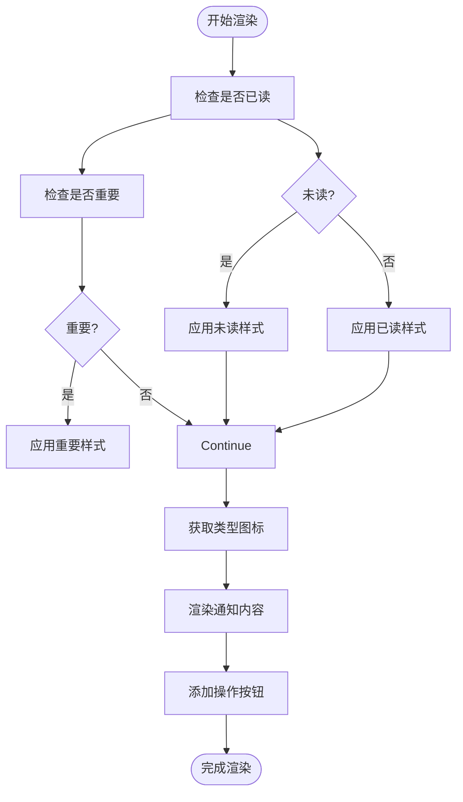
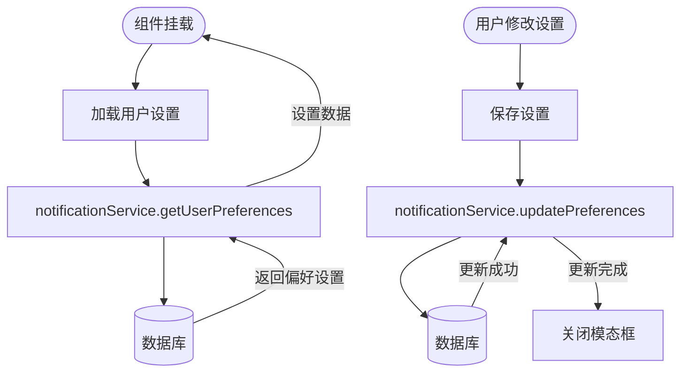
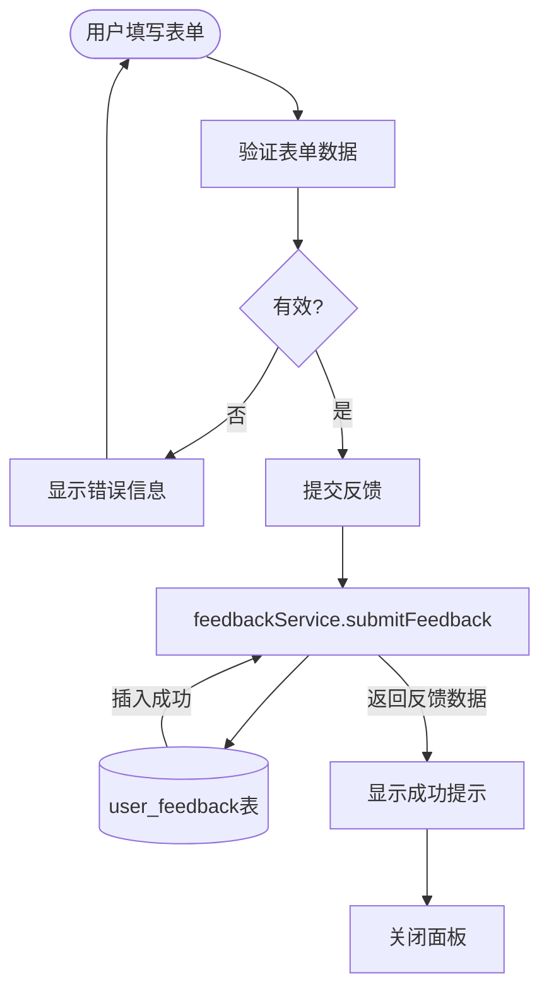
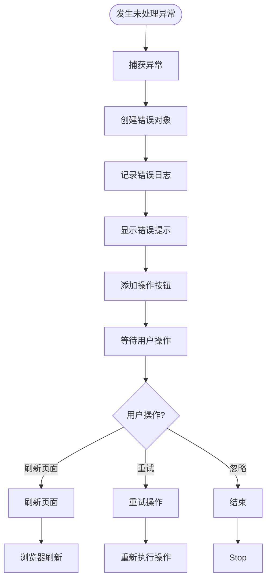
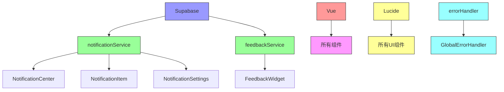

# 通知与反馈组件

<cite>
**本文档引用的文件**   
- [NotificationCenter.vue](file://src/components/notifications/NotificationCenter.vue)
- [NotificationItem.vue](file://src/components/notifications/NotificationItem.vue)
- [NotificationSettings.vue](file://src/components/notifications/NotificationSettings.vue)
- [notificationService.ts](file://src/services/notificationService.ts)
- [FeedbackWidget.vue](file://src/components/feedback/FeedbackWidget.vue)
- [feedbackService.ts](file://src/services/feedbackService.ts)
- [GlobalErrorHandler.vue](file://src/components/error/GlobalErrorHandler.vue)
- [errorHandler.ts](file://src/utils/errorHandler.ts)
- [App.vue](file://src/App.vue)
</cite>

## 目录
1. [简介](#简介)
2. [项目结构](#项目结构)
3. [核心组件](#核心组件)
4. [架构概述](#架构概述)
5. [详细组件分析](#详细组件分析)
6. [依赖分析](#依赖分析)
7. [性能考虑](#性能考虑)
8. [故障排除指南](#故障排除指南)
9. [结论](#结论)

## 简介
本文档系统阐述了通知与反馈组件的架构设计与实时交互模式。详细说明了NotificationCenter如何通过notificationService订阅Supabase Realtime事件流，实现新通知的即时推送与未读计数更新，包括连接状态管理与重连机制。描述了NotificationItem的渲染逻辑，支持多种通知类型（系统、评论、订单）的模板差异化展示与操作按钮渲染。解释了NotificationSettings如何持久化用户偏好至数据库或localStorage。分析了FeedbackWidget的悬浮按钮行为、表单提交流程与匿名数据收集策略。说明了GlobalErrorHandler如何捕获未处理异常、记录错误日志并展示友好提示。提供了组件在用户会话生命周期中的集成时序图与错误恢复策略。

## 项目结构
本项目采用模块化设计，将通知与反馈功能分别组织在独立的组件目录中。通知相关组件位于`src/components/notifications/`目录下，包括通知中心、通知项和通知设置三个核心组件。反馈功能则集中在`src/components/feedback/`目录中，主要由FeedbackWidget构成。服务层位于`src/services/`目录，提供了notificationService和feedbackService两个核心服务，负责与后端数据库交互。错误处理组件位于`src/components/error/`目录，通过GlobalErrorHandler实现全局错误捕获与处理。

**图示来源**
- [NotificationCenter.vue](file://src/components/notifications/NotificationCenter.vue)
- [NotificationItem.vue](file://src/components/notifications/NotificationItem.vue)
- [NotificationSettings.vue](file://src/components/notifications/NotificationSettings.vue)
- [notificationService.ts](file://src/services/notificationService.ts)
- [FeedbackWidget.vue](file://src/components/feedback/FeedbackWidget.vue)
- [feedbackService.ts](file://src/services/feedbackService.ts)
- [GlobalErrorHandler.vue](file://src/components/error/GlobalErrorHandler.vue)
- [errorHandler.ts](file://src/utils/errorHandler.ts)

**章节来源**
- [src/components/notifications](file://src/components/notifications)
- [src/components/feedback](file://src/components/feedback)
- [src/services](file://src/services)
- [src/components/error](file://src/components/error)
- [src/utils](file://src/utils)

## 核心组件
通知与反馈系统由多个核心组件构成，每个组件都有明确的职责分工。NotificationCenter作为通知系统的入口，负责展示通知列表、管理通知状态和提供用户交互界面。它通过notificationService与后端进行数据交互，并利用Supabase Realtime实现即时通知推送。NotificationItem组件负责单个通知的渲染，根据通知类型显示不同的样式和操作按钮。NotificationSettings组件允许用户自定义通知偏好，这些偏好被持久化存储在数据库中。

反馈系统的核心是FeedbackWidget组件，它以悬浮按钮的形式出现在页面右下角，用户点击后可提交反馈。该组件提供了反馈表单、历史记录查看和统计信息展示等功能。GlobalErrorHandler组件作为全局错误处理中心，捕获未处理的异常并以友好的方式提示用户，同时记录详细的错误日志供开发人员分析。

**章节来源**
- [NotificationCenter.vue](file://src/components/notifications/NotificationCenter.vue#L1-L715)
- [NotificationItem.vue](file://src/components/notifications/NotificationItem.vue#L1-L213)
- [NotificationSettings.vue](file://src/components/notifications/NotificationSettings.vue#L1-L295)
- [FeedbackWidget.vue](file://src/components/feedback/FeedbackWidget.vue#L1-L799)
- [GlobalErrorHandler.vue](file://src/components/error/GlobalErrorHandler.vue#L1-L336)

## 架构概述
通知与反馈系统的架构设计遵循分层原则，分为表现层、服务层和数据层。表现层由Vue组件构成，负责用户界面的展示和交互。服务层提供业务逻辑处理，封装了与后端API的通信细节。数据层基于Supabase实现，利用其数据库和实时功能提供数据存储和即时推送能力。

系统通过事件驱动的方式实现组件间的通信。当有新通知产生时，后端会触发Supabase Realtime事件，notificationService订阅该事件并通知NotificationCenter更新界面。同样，用户提交反馈时，FeedbackWidget调用feedbackService的API，后者将数据写入数据库并触发相应的业务流程。

**图示来源**
- [NotificationCenter.vue](file://src/components/notifications/NotificationCenter.vue)
- [NotificationItem.vue](file://src/components/notifications/NotificationItem.vue)
- [NotificationSettings.vue](file://src/components/notifications/NotificationSettings.vue)
- [FeedbackWidget.vue](file://src/components/feedback/FeedbackWidget.vue)
- [GlobalErrorHandler.vue](file://src/components/error/GlobalErrorHandler.vue)
- [notificationService.ts](file://src/services/notificationService.ts)
- [feedbackService.ts](file://src/services/feedbackService.ts)
- [errorHandler.ts](file://src/utils/errorHandler.ts)
- [Supabase文档](https://supabase.com/docs)

**章节来源**
- [src/components](file://src/components)
- [src/services](file://src/services)
- [src/utils](file://src/utils)

## 详细组件分析

### 通知中心分析
NotificationCenter组件是通知系统的核心，它通过notificationService与后端进行数据交互，并利用Supabase Realtime实现即时通知推送。组件在挂载时会订阅用户的实时通知通道，当有新通知到达时，立即更新界面并显示浏览器通知。

#### 组件交互时序图

**图示来源**
- [NotificationCenter.vue](file://src/components/notifications/NotificationCenter.vue#L1-L715)
- [notificationService.ts](file://src/services/notificationService.ts#L1-L513)

**章节来源**
- [NotificationCenter.vue](file://src/components/notifications/NotificationCenter.vue#L1-L715)
- [notificationService.ts](file://src/services/notificationService.ts#L1-L513)

### 通知项分析
NotificationItem组件负责单个通知的渲染，根据通知类型显示不同的样式和操作按钮。组件支持多种通知类型，包括系统、产品和订单等，每种类型都有独特的图标和颜色标识。

#### 渲染逻辑流程图

**图示来源**
- [NotificationItem.vue](file://src/components/notifications/NotificationItem.vue#L1-L213)

**章节来源**
- [NotificationItem.vue](file://src/components/notifications/NotificationItem.vue#L1-L213)

### 通知设置分析
NotificationSettings组件允许用户自定义通知偏好，这些偏好被持久化存储在数据库中。组件在挂载时加载用户的当前设置，并提供表单供用户修改。

#### 设置持久化流程

**图示来源**
- [NotificationSettings.vue](file://src/components/notifications/NotificationSettings.vue#L1-L295)
- [notificationService.ts](file://src/services/notificationService.ts#L1-L513)

**章节来源**
- [NotificationSettings.vue](file://src/components/notifications/NotificationSettings.vue#L1-L295)
- [notificationService.ts](file://src/services/notificationService.ts#L1-L513)

### 反馈组件分析
FeedbackWidget组件以悬浮按钮的形式出现在页面右下角，用户点击后可提交反馈。该组件提供了反馈表单、历史记录查看和统计信息展示等功能。

#### 表单提交流程

**图示来源**
- [FeedbackWidget.vue](file://src/components/feedback/FeedbackWidget.vue#L1-L799)
- [feedbackService.ts](file://src/services/feedbackService.ts#L1-L507)

**章节来源**
- [FeedbackWidget.vue](file://src/components/feedback/FeedbackWidget.vue#L1-L799)
- [feedbackService.ts](file://src/services/feedbackService.ts#L1-L507)

### 错误处理分析
GlobalErrorHandler组件作为全局错误处理中心，捕获未处理的异常并以友好的方式提示用户，同时记录详细的错误日志供开发人员分析。

#### 错误处理流程

**图示来源**
- [GlobalErrorHandler.vue](file://src/components/error/GlobalErrorHandler.vue#L1-L336)
- [errorHandler.ts](file://src/utils/errorHandler.ts#L1-L270)

**章节来源**
- [GlobalErrorHandler.vue](file://src/components/error/GlobalErrorHandler.vue#L1-L336)
- [errorHandler.ts](file://src/utils/errorHandler.ts#L1-L270)

## 依赖分析
通知与反馈组件系统依赖于多个外部库和内部模块。主要依赖包括Supabase客户端库，用于数据库操作和实时功能；Vue框架，提供组件化开发能力；以及Lucide图标库，用于界面图标展示。

系统内部依赖关系清晰，表现层组件依赖服务层，服务层依赖数据层。这种分层架构降低了组件间的耦合度，提高了代码的可维护性和可测试性。通过依赖注入的方式，组件可以轻松替换服务实现，便于单元测试。

**图示来源**
- [package.json](file://package.json)
- [notificationService.ts](file://src/services/notificationService.ts)
- [feedbackService.ts](file://src/services/feedbackService.ts)
- [App.vue](file://src/App.vue)

**章节来源**
- [package.json](file://package.json#L1-L50)
- [src/services](file://src/services)
- [src/components](file://src/components)

## 性能考虑
通知与反馈组件在设计时充分考虑了性能优化。通知列表采用分页加载策略，避免一次性加载大量数据导致页面卡顿。实时通知使用Supabase的变更订阅功能，仅在数据变化时更新界面，减少了不必要的网络请求。

FeedbackWidget组件在用户未登录时不会加载反馈历史，减少了不必要的数据库查询。错误处理系统采用批量日志记录策略，避免频繁的磁盘I/O操作影响性能。

对于大数据量的通知和反馈，系统支持筛选和搜索功能，帮助用户快速定位所需信息，提升用户体验。

## 故障排除指南
当通知与反馈功能出现问题时，可按照以下步骤进行排查：

1. **检查网络连接**：确保客户端与服务器之间的网络连接正常
2. **验证认证状态**：确认用户已正确登录，拥有访问相关资源的权限
3. **检查数据库连接**：确认Supabase数据库连接正常，相关表存在且结构正确
4. **查看浏览器控制台**：检查是否有JavaScript错误或网络请求失败
5. **验证实时功能**：确认Supabase Realtime服务正常运行，订阅通道已正确建立

对于常见的连接问题，系统实现了自动重连机制。当检测到连接断开时，会按照指数退避策略尝试重新连接，确保服务的可靠性。

**章节来源**
- [notificationService.ts](file://src/services/notificationService.ts#L1-L513)
- [feedbackService.ts](file://src/services/feedbackService.ts#L1-L507)
- [errorHandler.ts](file://src/utils/errorHandler.ts#L1-L270)

## 结论
通知与反馈组件系统通过合理的架构设计和精心的实现，为用户提供了一套完整、可靠的消息交互解决方案。系统采用分层架构，各组件职责明确，依赖关系清晰，便于维护和扩展。

实时通知功能利用Supabase的实时能力，实现了低延迟的消息推送。用户反馈机制提供了便捷的沟通渠道，有助于产品持续改进。全局错误处理系统提升了应用的健壮性，为用户提供友好的错误体验。

未来可考虑增加通知的智能分类、反馈的自动分析等功能，进一步提升系统的智能化水平。