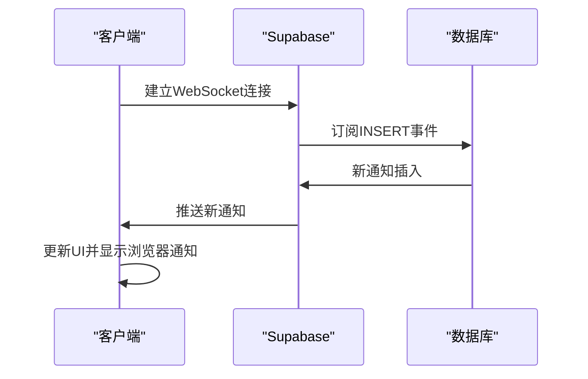
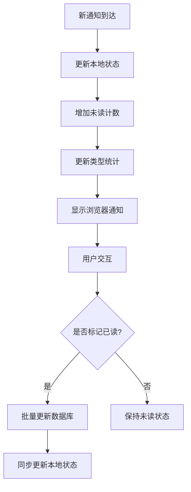
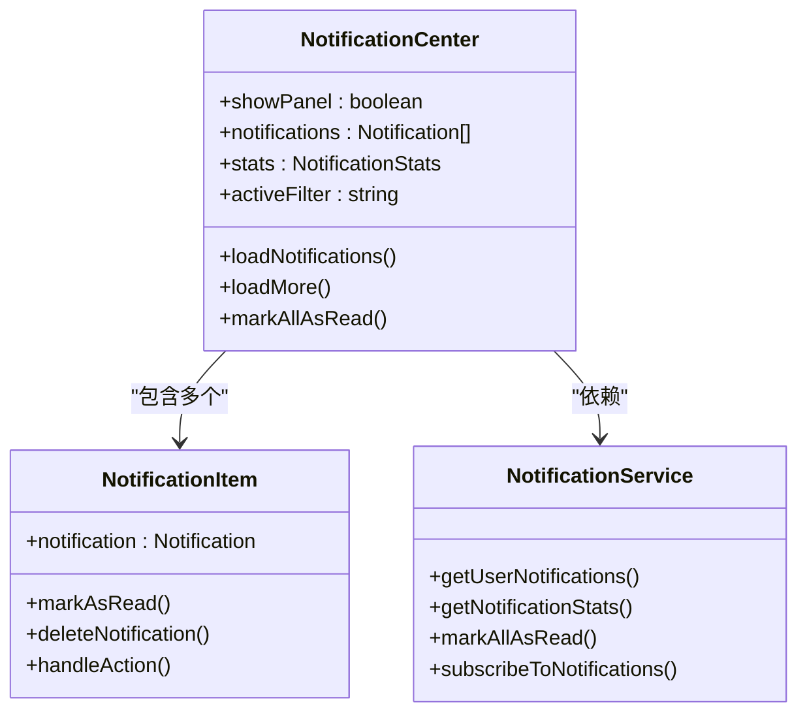
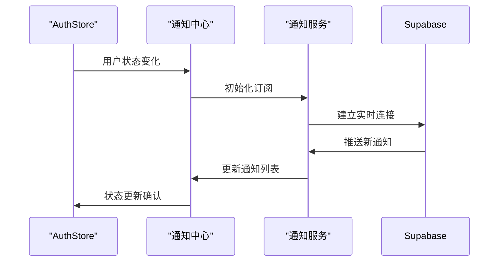
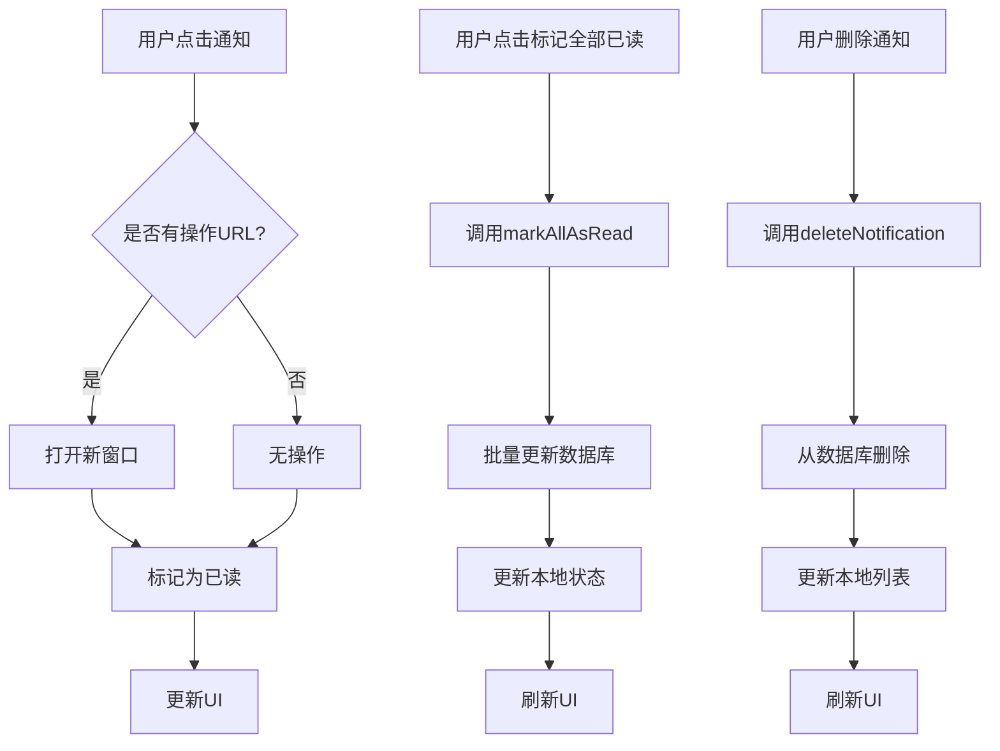
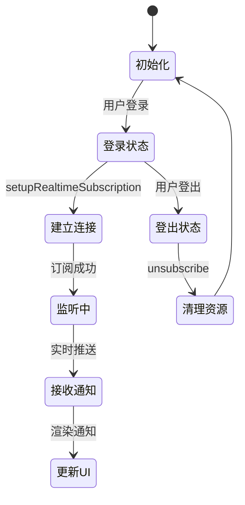

# 通知中心组件

<cite>
**本文档引用的文件**
- [NotificationCenter.vue](file://src/components/notifications/NotificationCenter.vue)
- [notificationService.ts](file://src/services/notificationService.ts)
- [supabaseClient.ts](file://src/lib/supabaseClient.ts)
- [NotificationItem.vue](file://src/components/notifications/NotificationItem.vue)
- [NotificationSettings.vue](file://src/components/notifications/NotificationSettings.vue)
- [auth.ts](file://src/stores/auth.ts)
</cite>

## 目录
1. [架构设计与实时通信机制](#架构设计与实时通信机制)
2. [未读通知计数与性能优化](#未读通知计数与性能优化)
3. [通知列表渲染机制](#通知列表渲染机制)
4. [Pinia状态同步机制](#pinia状态同步机制)
5. [用户交互流程](#用户交互流程)
6. [生命周期管理](#生命周期管理)

## 架构设计与实时通信机制

`NotificationCenter.vue` 组件通过 `notificationService` 集成 Supabase Realtime API，实现了高效的实时通信机制。该组件采用事件驱动架构，利用 Supabase 的实时数据库功能建立 WebSocket 长连接。

在初始化时，组件通过 `setupRealtimeSubscription` 方法创建实时订阅，使用 `supabase.channel()` 方法建立以用户ID为标识的专用通信频道 `notifications:${userId}`。该订阅监听数据库 `notifications` 表的 `INSERT` 事件，当有新通知插入时，会立即触发回调函数。

**Diagram sources**
- [NotificationCenter.vue](file://src/components/notifications/NotificationCenter.vue#L348-L405)
- [notificationService.ts](file://src/services/notificationService.ts#L401-L455)

**Section sources**
- [NotificationCenter.vue](file://src/components/notifications/NotificationCenter.vue#L301-L472)
- [notificationService.ts](file://src/services/notificationService.ts#L401-L455)

## 未读通知计数与性能优化

未读通知计数的实时更新逻辑通过本地状态管理和服务端统计相结合的方式实现。当用户接收到新通知时，组件不仅会将通知添加到列表中，还会立即更新本地的统计状态，包括总通知数、未读通知数、重要通知数以及按类型分类的统计。

性能优化方案包括批量更新和节流处理机制。在标记全部已读操作中，采用了批量更新策略，通过 `markAllAsRead` 方法一次性更新数据库中的多个记录，减少网络请求次数。同时，组件在处理大量通知时采用了分页加载机制，每次只加载20条通知，避免一次性加载过多数据导致性能下降。

**Diagram sources**
- [notificationService.ts](file://src/services/notificationService.ts#L254-L311)
- [NotificationCenter.vue](file://src/components/notifications/NotificationCenter.vue#L348-L405)

**Section sources**
- [notificationService.ts](file://src/services/notificationService.ts#L155-L208)
- [NotificationCenter.vue](file://src/components/notifications/NotificationCenter.vue#L348-L405)

## 通知列表渲染机制

通知列表采用虚拟化渲染策略，通过分页加载和懒加载机制支持大规模通知的高效渲染。组件实现了无限滚动功能，当用户滚动到列表底部时，会自动加载更多通知。

列表渲染采用了响应式设计，支持多种筛选条件，包括全部、未读、重要以及按类型（系统、产品、订单）分类。每个通知项通过 `NotificationItem.vue` 组件独立渲染，确保了渲染性能和可维护性。

**Diagram sources**
- [NotificationCenter.vue](file://src/components/notifications/NotificationCenter.vue#L1-L715)
- [NotificationItem.vue](file://src/components/notifications/NotificationItem.vue#L1-L363)

**Section sources**
- [NotificationCenter.vue](file://src/components/notifications/NotificationCenter.vue#L1-L715)
- [NotificationItem.vue](file://src/components/notifications/NotificationItem.vue#L1-L363)

## Pinia状态同步机制

组件与 Pinia store 的数据同步机制确保了跨组件状态的一致性。通过 `useAuthStore()` 获取用户认证状态，组件能够根据用户登录状态动态调整行为。

当用户登录时，组件自动初始化实时订阅并加载通知数据；当用户登出时，组件会正确销毁连接并清空本地状态。这种双向同步机制保证了用户状态变化时通知中心能够及时响应。

**Diagram sources**
- [auth.ts](file://src/stores/auth.ts#L1-L151)
- [NotificationCenter.vue](file://src/components/notifications/NotificationCenter.vue#L400-L472)

**Section sources**
- [auth.ts](file://src/stores/auth.ts#L1-L151)
- [NotificationCenter.vue](file://src/components/notifications/NotificationCenter.vue#L400-L472)

## 用户交互流程

用户交互流程涵盖了通知点击跳转、标记已读、批量清除等操作的完整事件处理链路。每个操作都经过精心设计，确保用户体验流畅。

- **通知点击**：点击通知会触发 `handleNotificationAction` 方法，如果通知包含操作URL，则在新窗口打开；同时自动将通知标记为已读。
- **标记已读**：通过 `handleNotificationRead` 方法更新单个通知的阅读状态，并同步更新本地统计。
- **批量清除**：通过 `markAllAsRead` 方法实现批量标记已读功能，支持按类型筛选后批量操作。

**Diagram sources**
- [NotificationCenter.vue](file://src/components/notifications/NotificationCenter.vue#L301-L352)
- [NotificationItem.vue](file://src/components/notifications/NotificationItem.vue#L1-L363)

**Section sources**
- [NotificationCenter.vue](file://src/components/notifications/NotificationCenter.vue#L301-L352)
- [NotificationItem.vue](file://src/components/notifications/NotificationItem.vue#L1-L363)

## 生命周期管理

组件的生命周期管理确保了在用户登录后自动初始化监听，在登出时正确销毁连接。`onMounted` 钩子中调用 `setupRealtimeSubscription` 方法建立实时连接，并在 `onUnmounted` 钩子中通过 `unsubscribe` 函数清理资源。

通过 `watch` 监听用户状态变化，组件能够响应用户登录和登出事件，实现连接的自动建立和销毁。这种精细化的生命周期管理避免了内存泄漏和不必要的网络连接。

**Diagram sources**
- [NotificationCenter.vue](file://src/components/notifications/NotificationCenter.vue#L400-L472)
- [notificationService.ts](file://src/services/notificationService.ts#L401-L455)

**Section sources**
- [NotificationCenter.vue](file://src/components/notifications/NotificationCenter.vue#L400-L472)
- [notificationService.ts](file://src/services/notificationService.ts#L401-L455)