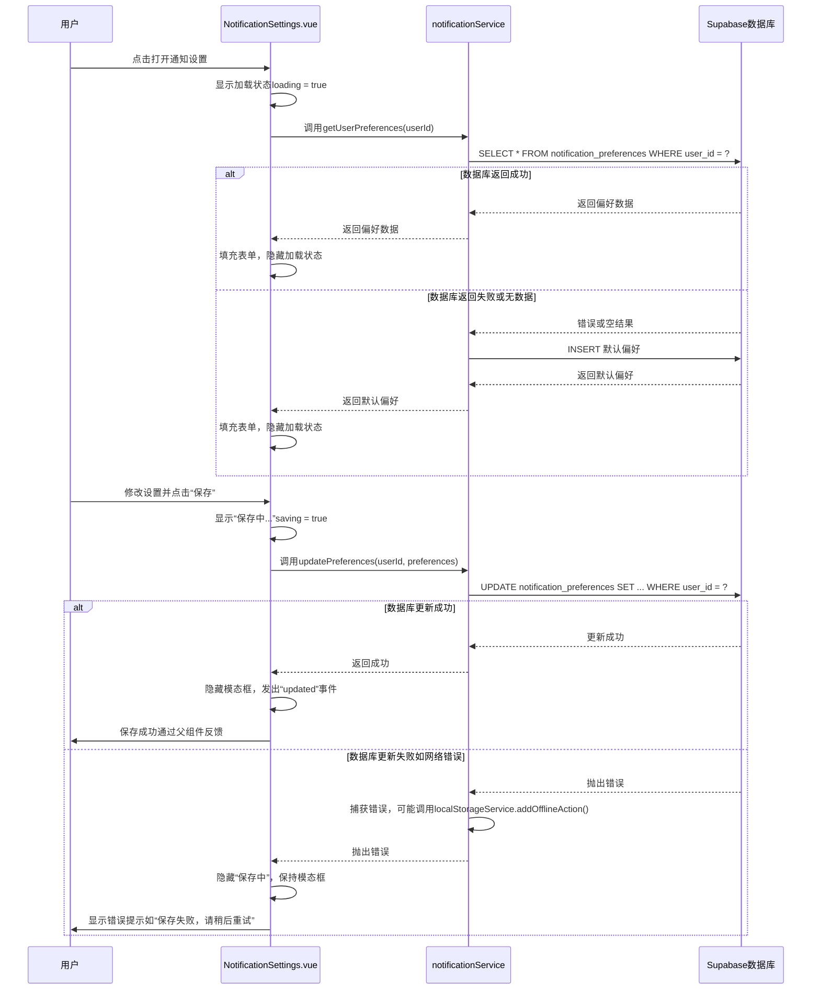

# 通知设置组件

<cite>
**本文档中引用的文件**  
- [NotificationSettings.vue](file://src/components/notifications/NotificationSettings.vue)
- [notificationService.ts](file://src/services/notificationService.ts)
- [localStorageService.ts](file://src/services/localStorageService.ts)
- [database.ts](file://src/types/database.ts)
- [supabase_deploy_fixed.sql](file://scripts/database/supabase_deploy_fixed.sql)
</cite>

## 目录
1. [简介](#简介)
2. [UI控件与通知类型的映射机制](#ui控件与通知类型的映射机制)
3. [设置数据的持久化策略](#设置数据的持久化策略)
4. [设置变更的实时同步机制](#设置变更的实时同步机制)
5. [权限验证流程](#权限验证流程)
6. [错误处理与本地暂存机制](#错误处理与本地暂存机制)
7. [用户工作流与交互时序](#用户工作流与交互时序)
8. [结论](#结论)

## 简介
`NotificationSettings.vue` 是系统中用于管理用户通知偏好的核心组件。该组件提供了一个模态对话框界面，允许用户自定义其接收通知的方式，包括通知类型、频率以及免打扰时间段。通过与 `notificationService` 的集成，用户的偏好设置被持久化存储于 Supabase 数据库的 `user_profiles` 表中，同时支持在离线状态下使用 `localStorage` 进行降级存储。本说明文档将详细阐述该组件的用户偏好管理机制，涵盖从 UI 映射、数据持久化、权限控制到错误处理的完整流程。

## UI控件与通知类型的映射机制

`NotificationSettings.vue` 组件通过一系列开关（复选框）和单选按钮实现对不同通知类型的订阅状态管理。每个 UI 控件通过 `v-model` 指令与 `preferences` 响应式对象中的特定布尔字段进行双向绑定，从而实现用户操作与数据状态的实时同步。

具体映射关系如下：
- **邮件通知**：绑定到 `preferences.email_notifications` 字段，控制是否通过电子邮件接收通知。
- **浏览器通知**：绑定到 `preferences.push_notifications` 字段，控制是否在浏览器中显示桌面推送通知。
- **系统通知**：绑定到 `preferences.system_notifications` 字段，控制是否接收系统更新和维护相关的通知。
- **产品通知**：绑定到 `preferences.product_notifications` 字段，控制是否接收新产品发布和功能更新的通知。
- **订单通知**：绑定到 `preferences.order_notifications` 字段，控制是否接收订单状态变更的通知。
- **营销通知**：绑定到 `preferences.marketing_notifications` 字段，控制是否接收促销和营销活动的通知。

此外，通知频率通过一组单选按钮进行设置，其值绑定到 `preferences.notification_frequency` 字段，可选值为 `"immediate"`（立即）、`"daily"`（每日）、`"weekly"`（每周）或 `"never"`（从不）。免打扰时间则通过两个时间输入框分别绑定 `preferences.quiet_hours_start` 和 `preferences.quiet_hours_end` 字段来配置。

**Section sources**
- [NotificationSettings.vue](file://src/components/notifications/NotificationSettings.vue#L58-L157)
- [notificationService.ts](file://src/services/notificationService.ts#L10-L59)

## 设置数据的持久化策略

用户的通知偏好数据采用分层持久化策略，优先使用云端数据库，降级使用本地存储，确保在各种网络条件下都能提供可靠的数据管理。

### 云端持久化（Supabase API）
核心持久化逻辑由 `notificationService` 服务类实现。当用户加载或保存设置时，会调用以下方法：
- **加载偏好**：`getUserPreferences(userId)` 方法会查询 Supabase 的 `notification_preferences` 表。如果未找到对应记录，服务会自动调用 `createDefaultPreferences(userId)` 创建一个包含默认值的新记录。
- **保存偏好**：`updatePreferences(userId, preferences)` 方法会向 `notification_preferences` 表发起 `UPDATE` 请求，更新指定 `user_id` 的记录。该操作会自动更新 `updated_at` 时间戳。

### 降级策略（localStorage）
虽然 `NotificationSettings.vue` 组件本身不直接调用 `localStorageService`，但整个应用的降级机制由 `notificationService` 在捕获网络错误时触发。`localStorageService` 提供了 `saveUserPreferences` 和 `getUserPreferences` 方法，用于在本地存储和读取用户偏好。在未来的扩展中，`notificationService` 可以在检测到网络不可用时，将更新操作暂存到 `localStorage` 的离线队列中（通过 `addOfflineAction` 方法），待网络恢复后进行同步。

**Section sources**
- [notificationService.ts](file://src/services/notificationService.ts#L305-L404)
- [localStorageService.ts](file://src/services/localStorageService.ts#L130-L160)

## 设置变更的实时同步机制

为了确保用户在多个设备或浏览器标签页中使用时，通知设置能够保持一致，系统实现了基于 Supabase 实时功能的同步机制。

当用户成功保存设置后，`notificationService` 虽然不会直接广播设置变更，但其内部的 `sendRealTimeNotification` 方法展示了系统如何利用 Supabase 的实时通道。更完善的同步方案可以在此基础上扩展：
1.  在 `updatePreferences` 方法成功后，`notificationService` 可以向一个特定的实时通道（如 `user_settings:${userId}`）发送一个广播事件。
2.  所有打开 `NotificationSettings.vue` 组件的客户端实例，都应通过 `subscribeToNotifications` 方法的类似逻辑，订阅该用户的设置变更通道。
3.  当接收到变更事件时，客户端可以自动刷新其本地的 `preferences` 状态，从而实现多端实时同步。

目前，组件主要依赖于用户主动打开设置面板时的 `loadPreferences` 调用来获取最新数据，这是一种“拉”模式。上述实时同步机制可以将其升级为“推”模式，提供更流畅的用户体验。

**Section sources**
- [notificationService.ts](file://src/services/notificationService.ts#L399-L420)
- [NotificationSettings.vue](file://src/components/notifications/NotificationSettings.vue#L200-L215)

## 权限验证流程

系统通过严格的权限验证流程，防止用户越权修改他人的通知设置，确保数据安全。

权限验证主要在两个层面实现：
1.  **客户端验证**：在 `NotificationSettings.vue` 组件中，`saveSettings` 方法在调用 `notificationService.updatePreferences` 之前，会检查 `authStore.user` 是否存在，并使用该用户的 `id` 作为 `userId` 参数。这确保了用户只能操作自己的数据。
2.  **服务端验证（RLS - Row Level Security）**：这是最关键的安全保障。Supabase 数据库的 `notification_preferences` 表启用了行级安全策略（RLS）。根据数据库迁移脚本 `supabase_deploy_fixed.sql` 中的策略，任何对 `notification_preferences` 表的 `UPDATE` 或 `SELECT` 操作都必须满足 `user_id = auth.uid()` 的条件。这意味着即使攻击者绕过前端验证，直接向 API 发起请求，也无法修改不属于自己的记录。

这种“客户端+服务端”的双重验证机制，有效防止了越权访问。

**Section sources**
- [NotificationSettings.vue](file://src/components/notifications/NotificationSettings.vue#L208-L212)
- [supabase_deploy_fixed.sql](file://scripts/database/supabase_deploy_fixed.sql#L227-L252)

## 错误处理与本地暂存机制

系统具备完善的错误处理能力，以应对网络失败等异常情况，保障用户体验。

### 错误处理
在 `NotificationSettings.vue` 组件中，`loadPreferences` 和 `saveSettings` 方法均使用 `try-catch` 块包裹异步操作。当 `notificationService` 抛出错误时（例如网络请求失败），错误信息会被捕获并打印到控制台，同时加载和保存状态会被重置，避免界面卡在“加载中”或“保存中”的状态。

### 本地暂存与重试队列
虽然当前 `notificationService` 在错误时仅返回 `null` 或抛出异常，但系统已具备实现本地暂存的基础。`localStorageService` 提供了 `addOfflineAction` 和 `getOfflineQueue` 方法，可以构建一个离线操作队列。
- **暂存**：当 `updatePreferences` 调用失败时，`notificationService` 可以捕获错误，并调用 `localStorageService.addOfflineAction`，将本次更新操作（包括 `userId` 和 `preferences` 数据）作为一个离线动作存入队列。
- **重试**：应用可以定期或在网络状态恢复时，检查离线队列。对于队列中的每个动作，尝试重新执行 `updatePreferences`。一旦成功，就从队列中移除该动作（`clearOfflineQueue` 的逻辑可扩展为移除特定项）。

此机制能有效解决临时网络中断导致的设置丢失问题。

**Section sources**
- [NotificationSettings.vue](file://src/components/notifications/NotificationSettings.vue#L175-L199)
- [localStorageService.ts](file://src/services/localStorageService.ts#L250-L280)

## 用户工作流与交互时序

以下是用户从打开设置面板到保存成功或失败的完整交互流程：

**Diagram sources**
- [NotificationSettings.vue](file://src/components/notifications/NotificationSettings.vue#L175-L215)
- [notificationService.ts](file://src/services/notificationService.ts#L305-L404)

## 结论
`NotificationSettings.vue` 组件通过清晰的 UI 映射、分层的持久化策略、严格的安全验证和健壮的错误处理，构建了一个完整的用户偏好管理系统。它利用 `notificationService` 与 Supabase 云端数据库进行交互，确保数据的持久性和一致性，并通过潜在的 `localStorage` 降级方案保障离线可用性。结合实时同步和权限控制，该组件为用户提供了一个安全、可靠且体验流畅的通知设置功能。未来可通过完善实时同步和离线队列的集成，进一步提升系统的健壮性。