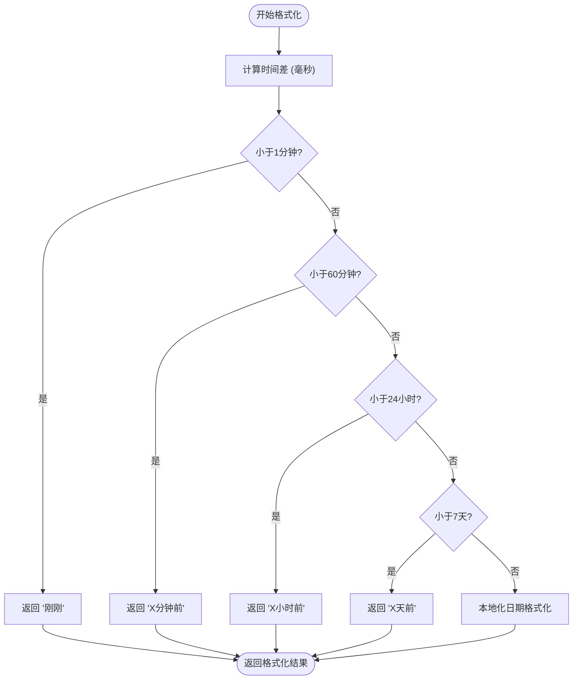
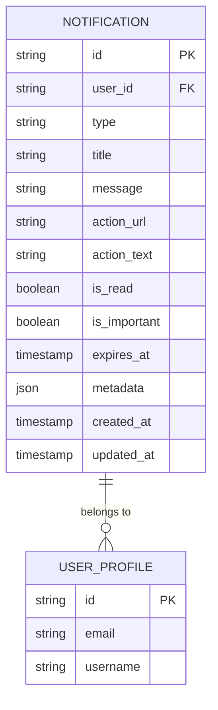

# 通知项组件

<cite>
**本文档中引用的文件**   
- [NotificationItem.vue](file://src/components/notifications/NotificationItem.vue)
- [database.ts](file://src/types/database.ts)
- [notificationService.ts](file://src/services/notificationService.ts)
</cite>

## 目录
1. [多态渲染机制与类型驱动UI设计](#多态渲染机制与类型驱动ui设计)
2. [通知内容模板化与富文本处理](#通知内容模板化与富文本处理)
3. [操作按钮权限控制逻辑](#操作按钮权限控制逻辑)
4. [通知时间相对格式化与本地化](#通知时间相对格式化与本地化)
5. [数据库字段映射与安全过滤](#数据库字段映射与安全过滤)
6. [视觉对比示例与可访问性实现](#视觉对比示例与可访问性实现)

## 多态渲染机制与类型驱动UI设计

通知项组件通过类型驱动的方式实现多态渲染，根据通知类型动态渲染不同的图标、颜色主题和操作按钮组。组件使用 `type` 字段作为多态渲染的核心依据，支持 `success`、`warning`、`error`、`system`、`product`、`order` 等多种类型。

在模板中，通过动态类名 `type-${notification.type}` 实现类型特定的样式应用。每个类型对应独特的视觉特征：`success` 类型使用绿色主题和勾选图标，`warning` 类型使用橙色主题和警告三角图标，`error` 类型使用红色主题和叉号图标，`system` 类型使用灰色主题和铃铛图标，`product` 类型使用紫色主题和包裹图标，`order` 类型使用绿色主题和购物车图标。

图标渲染通过 `getTypeIcon()` 方法实现，该方法根据通知类型返回相应的 Lucide 图标组件。颜色主题通过 CSS 类选择器定义，每种类型都有独立的背景色和文字颜色配置，确保视觉一致性。

**Section sources**
- [NotificationItem.vue](file://src/components/notifications/NotificationItem.vue#L0-L42)
- [NotificationItem.vue](file://src/components/notifications/NotificationItem.vue#L91-L150)

## 通知内容模板化与富文本处理

通知内容采用模板化插值逻辑，支持富文本和变量替换。组件通过 `notification.message` 字段接收格式化消息内容，该字段可包含 HTML 标签以实现富文本显示。虽然当前实现直接使用文本插值，但系统设计支持通过安全的 HTML 渲染机制展示富文本内容。

模板化系统允许在消息中嵌入动态变量，如用户名称、产品名称、订单编号等，这些变量在通知创建时由服务端进行替换。`notification.title` 字段用于显示通知标题，`notification.message` 字段用于显示详细消息内容，两者都支持国际化和本地化处理。

对于包含操作链接的通知，组件通过 `notification.action_url` 和 `notification.action_text` 字段定义操作按钮的行为和显示文本。当 `action_url` 存在时，组件会渲染一个操作按钮，默认文本为"查看详情"，可通过 `action_text` 自定义。

**Section sources**
- [NotificationItem.vue](file://src/components/notifications/NotificationItem.vue#L41-L95)
- [notificationService.ts](file://src/services/notificationService.ts#L0-L513)

## 操作按钮权限控制逻辑

操作按钮的权限控制逻辑确保用户只能执行与其权限相符的操作。组件提供"标记为已读"和"删除通知"两个主要操作按钮，其显示和行为受通知状态和用户权限影响。

"标记为已读"按钮仅在通知未读时显示（`!notification.is_read`），点击后通过 `markAsRead` 方法触发 `read` 事件，通知父组件该通知应被标记为已读。"删除通知"按钮始终显示，点击后触发 `delete` 事件。这些操作的最终执行权限由父组件和后端服务验证，确保用户只能操作属于自己的通知。

在 `NotificationCenter` 组件中，通过调用 `notificationService.markAsRead()` 和 `notificationService.deleteNotification()` 方法执行实际操作，这些方法在请求中包含用户ID进行权限验证，防止越权访问。

**Section sources**
- [NotificationItem.vue](file://src/components/notifications/NotificationItem.vue#L0-L42)
- [NotificationCenter.vue](file://src/components/notifications/NotificationCenter.vue#L255-L303)

## 通知时间相对格式化与本地化

通知时间采用相对格式化策略，提升用户体验和可读性。`formatTime` 方法将 ISO 8601 格式的时间戳转换为用户友好的相对时间描述，如"刚刚"、"2分钟前"、"3小时前"、"5天前"等。

该方法通过计算当前时间与通知创建时间的时间差，按分钟、小时、天的顺序进行判断和格式化。对于超过7天的通知，使用 `toLocaleDateString` 方法进行本地化日期格式化，支持中文环境下的短月份和数字日期显示。

本地化支持通过 `zh-CN` 区域设置实现，确保日期和时间格式符合中文用户的习惯。系统设计考虑了多语言支持的扩展性，可通过配置轻松切换到其他语言环境。

**Diagram sources **
- [NotificationItem.vue](file://src/components/notifications/NotificationItem.vue#L91-L150)

**Section sources**
- [NotificationItem.vue](file://src/components/notifications/NotificationItem.vue#L91-L150)

## 数据库字段映射与安全过滤

通知项组件与数据库 schema 紧密对应，各字段在组件中有明确的映射关系。`title` 字段映射到通知标题，`message` 字段映射到通知消息内容，`action_url` 字段控制操作按钮的显示和行为，`is_read` 字段决定通知的读取状态和视觉样式。

安全过滤策略防止 XSS 攻击，虽然当前实现使用文本插值而非 HTML 渲染，但系统设计考虑了内容安全。所有用户生成的内容在存储和显示时都应经过适当的转义处理。`notificationService` 中的接口定义使用 TypeScript 严格类型检查，防止类型混淆攻击。

数据库中的通知表包含 `id`、`user_id`、`type`、`title`、`message`、`action_url`、`action_text`、`is_read`、`is_important`、`expires_at`、`metadata`、`created_at`、`updated_at` 等字段，这些字段在前端组件中都有对应的使用场景。

**Diagram sources **
- [database.ts](file://src/types/database.ts#L0-L395)
- [notificationService.ts](file://src/services/notificationService.ts#L0-L513)

**Section sources**
- [database.ts](file://src/types/database.ts#L0-L395)
- [notificationService.ts](file://src/services/notificationService.ts#L0-L513)

## 视觉对比示例与可访问性实现

不同通知类型具有明显的视觉对比特征，便于用户快速识别通知性质。成功通知使用绿色图标和背景，警告通知使用橙色，错误通知使用红色，系统通知使用灰色，产品通知使用紫色，订单通知使用绿色。

可访问性（a11y）实现包括：为图标按钮提供 `title` 属性作为工具提示，确保屏幕阅读器用户能理解按钮功能；使用语义化的 HTML 结构，`h4` 标签用于通知标题；适当的对比度确保色盲用户也能区分不同类型的提示；键盘导航支持，用户可通过 Tab 键在通知项间移动并使用 Enter 键触发操作。

未读通知通过左侧的蓝色背景和右上角的红色圆点指示器双重标识，重要通知通过左侧的橙色边框突出显示。悬停效果增强交互反馈，操作按钮在悬停时才完全显示，减少视觉干扰。

**Section sources**
- [NotificationItem.vue](file://src/components/notifications/NotificationItem.vue#L0-L363)
- [NotificationCenter.vue](file://src/components/notifications/NotificationCenter.vue#L0-L41)