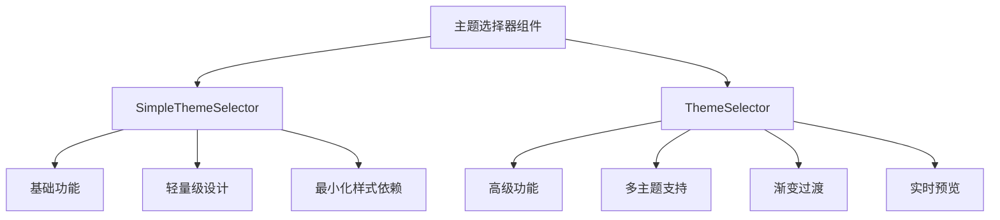
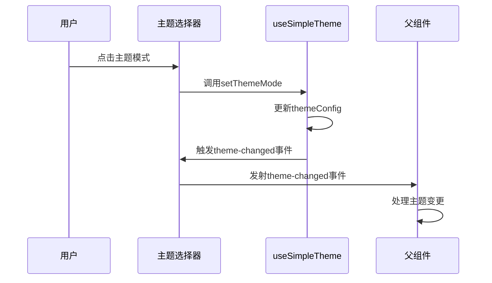

# 主题UI组件

<cite>
**本文档中引用的文件**
- [SimpleThemeSelector.vue](file://src/components/theme/SimpleThemeSelector.vue)
- [ThemeSelector.vue](file://src/components/theme/ThemeSelector.vue)
- [useSimpleTheme.ts](file://src/composables/useSimpleTheme.ts)
- [SimpleSettingsView.vue](file://src/views/SimpleSettingsView.vue)
- [TestSettingsView.vue](file://src/views/TestSettingsView.vue)
</cite>

## 目录
1. [简介](#简介)
2. [组件实现差异分析](#组件实现差异分析)
3. [轻量级设计：SimpleThemeSelector](#轻量级设计simplethemeselector)
4. [高级功能实现：ThemeSelector](#高级功能实现themeselector)
5. [Props输入与事件发射](#props输入与事件发射)
6. [插槽使用方式](#插槽使用方式)
7. [视图集成示例](#视图集成示例)
8. [适用场景与用户体验考量](#适用场景与用户体验考量)
9. [常见集成问题及解决方案](#常见集成问题及解决方案)
10. [结论](#结论)

## 简介
本文档详细记录了`SimpleThemeSelector`与`ThemeSelector`两个主题选择UI组件的实现差异。通过分析其模板结构、交互逻辑、样式依赖及功能特性，阐述它们在不同应用场景下的适用性。文档还提供了在`SimpleSettingsView`和`TestSettingsView`中集成这两个组件的具体示例，并讨论了常见的集成问题及其解决方案。

## 组件实现差异分析
`SimpleThemeSelector`和`ThemeSelector`虽然共享相似的基础功能——允许用户切换主题模式（浅色、深色、跟随系统），但它们在设计复杂度、功能范围和用户体验上存在显著差异。`SimpleThemeSelector`采用轻量级设计，专注于核心主题切换需求，而`ThemeSelector`则提供更丰富的自定义选项，包括多主题预设、颜色定制和实时预览等高级功能。

**图示来源**
- [SimpleThemeSelector.vue](file://src/components/theme/SimpleThemeSelector.vue)
- [ThemeSelector.vue](file://src/components/theme/ThemeSelector.vue)

## 轻量级设计：SimpleThemeSelector
`SimpleThemeSelector`的设计目标是满足基础主题切换需求，同时保持代码简洁和性能高效。该组件通过简单的按钮交互和有限的样式依赖实现了这一目标。

### 模板结构
`SimpleThemeSelector`的模板结构由一个主题切换按钮和一个可展开的主题面板组成。按钮根据当前主题模式显示相应的图标（太阳、月亮或显示器）。点击按钮会显示或隐藏主题面板，面板内包含三个主题模式选项，每个选项都有图标、标签和描述。

### 按钮交互逻辑
按钮的交互逻辑非常直观：点击按钮切换面板的显示状态。面板内的每个主题模式选项都是一个按钮，点击后调用`selectMode`方法更新主题模式，并关闭面板。这种设计确保了用户可以快速完成主题切换操作。

### 最小化样式依赖
`SimpleThemeSelector`的样式主要依赖于内联的CSS类和少量的全局样式。它使用了固定的像素值和颜色代码，而不是CSS变量，这使得组件更加独立，减少了对外部样式系统的依赖。此外，组件通过`:global`选择器为深色主题定义了特定的样式规则，确保在不同主题下都能正常显示。

**本节来源**
- [SimpleThemeSelector.vue](file://src/components/theme/SimpleThemeSelector.vue#L1-L302)
- [useSimpleTheme.ts](file://src/composables/useSimpleTheme.ts#L1-L110)

## 高级功能实现：ThemeSelector
`ThemeSelector`在`SimpleThemeSelector`的基础上进行了扩展，增加了多主题支持、渐变过渡效果和实时预览等功能，提供了更丰富的用户体验。

### 下拉面板与主题卡片渲染
`ThemeSelector`的下拉面板比`SimpleThemeSelector`更宽大，容纳了更多的内容。面板中不仅有主题模式选择，还包括主题预设卡片、颜色设置和高级选项。主题预设卡片以网格形式排列，每个卡片展示了一个预设主题的视觉效果，用户可以通过点击卡片快速应用该主题。

### 视觉反馈机制
为了增强用户体验，`ThemeSelector`在多个方面提供了视觉反馈。例如，当用户悬停在主题预设卡片上时，卡片会有轻微的上移动画和边框颜色变化；选中的卡片会显示一个半透明的高亮边框。这些细节提升了界面的互动性和吸引力。

### 渐变过渡与实时预览
`ThemeSelector`支持主题切换时的渐变过渡效果，使界面变化更加平滑自然。此外，组件还实现了实时预览功能，用户在调整颜色设置时，可以立即看到界面的变化，无需保存即可预览效果。

**本节来源**
- [ThemeSelector.vue](file://src/components/theme/ThemeSelector.vue#L1-L485)
- [useSimpleTheme.ts](file://src/composables/useSimpleTheme.ts#L1-L110)

## Props输入与事件发射
两个组件都通过`props`接收外部配置，并通过事件发射与父组件通信。`SimpleThemeSelector`和`ThemeSelector`都使用了`themeConfig`作为输入，该配置对象包含了当前的主题模式。当用户选择新的主题模式时，组件会调用`setThemeMode`方法更新配置，并通过`theme-changed`事件通知父组件。

**图示来源**
- [SimpleThemeSelector.vue](file://src/components/theme/SimpleThemeSelector.vue#L1-L302)
- [ThemeSelector.vue](file://src/components/theme/ThemeSelector.vue#L1-L485)
- [useSimpleTheme.ts](file://src/composables/useSimpleTheme.ts#L1-L110)

## 插槽使用方式
`SimpleThemeSelector`和`ThemeSelector`均未使用插槽，所有内容都在组件内部定义。这种设计简化了组件的使用，但也限制了其灵活性。如果需要在主题选择器中添加自定义内容，可能需要修改组件源码或创建新的组件。

## 视图集成示例
### SimpleSettingsView中的集成
在`SimpleSettingsView`中，`SimpleThemeSelector`被用作一个简单的主题切换工具，帮助用户快速调整网站的整体外观。由于`SimpleSettingsView`主要关注网站内容的设置，因此使用轻量级的`SimpleThemeSelector`更为合适。

### TestSettingsView中的集成
`TestSettingsView`则集成了`ThemeSelector`，以测试其高级功能。在这个视图中，用户不仅可以切换基本的主题模式，还可以尝试不同的主题预设和自定义颜色，从而全面评估`ThemeSelector`的功能和性能。

**本节来源**
- [SimpleSettingsView.vue](file://src/views/SimpleSettingsView.vue#L1-L498)
- [TestSettingsView.vue](file://src/views/TestSettingsView.vue#L1-L318)

## 适用场景与用户体验考量
`SimpleThemeSelector`适用于那些对主题切换功能要求不高、追求简洁和高效的场景。它的轻量级设计使其加载速度快，占用资源少，适合在移动设备或性能受限的环境中使用。相比之下，`ThemeSelector`更适合需要高度自定义和丰富视觉效果的应用，如设计工具或个性化平台。尽管`ThemeSelector`功能强大，但其复杂的界面和较多的交互元素可能会增加用户的认知负担，因此在设计时应权衡功能与易用性。

## 常见集成问题及解决方案
### 样式覆盖
在集成`SimpleThemeSelector`或`ThemeSelector`时，可能会遇到样式被其他CSS规则覆盖的问题。解决方法是在组件的样式表中使用更高的特异性或`!important`声明，或者将组件的样式封装在`<style scoped>`标签中，以避免全局污染。

### z-index层级冲突
由于主题选择器的面板通常需要覆盖页面上的其他元素，因此可能会出现z-index层级冲突。为了避免这种情况，应确保面板的`z-index`值足够高，并且在必要时调整其他元素的`z-index`值。此外，可以使用CSS自定义属性来动态控制`z-index`，以便更好地管理层级关系。

**本节来源**
- [SimpleThemeSelector.vue](file://src/components/theme/SimpleThemeSelector.vue#L1-L302)
- [ThemeSelector.vue](file://src/components/theme/ThemeSelector.vue#L1-L485)

## 结论
`SimpleThemeSelector`和`ThemeSelector`分别代表了轻量级和高级主题选择器的设计理念。前者通过简洁的结构和最小化的依赖满足了基本需求，后者则通过丰富的功能和细腻的交互提供了卓越的用户体验。开发者应根据具体的应用场景和用户需求选择合适的组件，并注意处理集成过程中可能出现的问题。