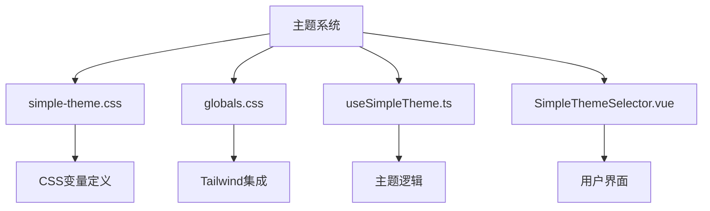
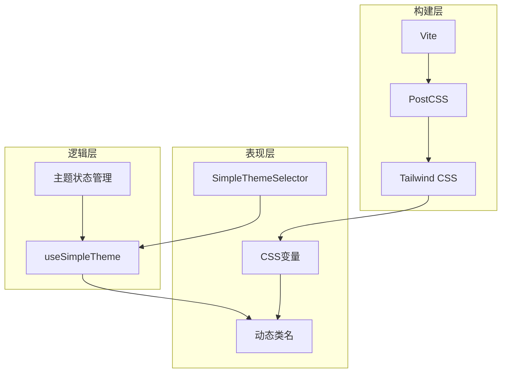
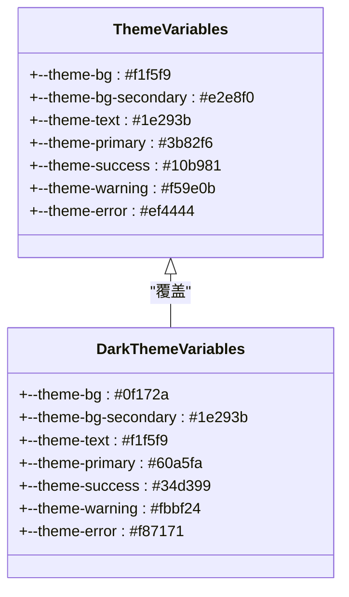
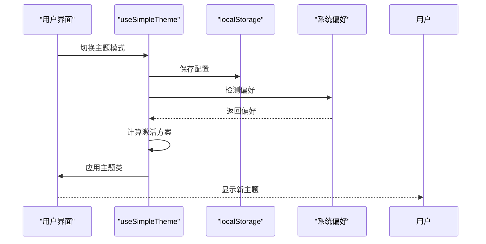
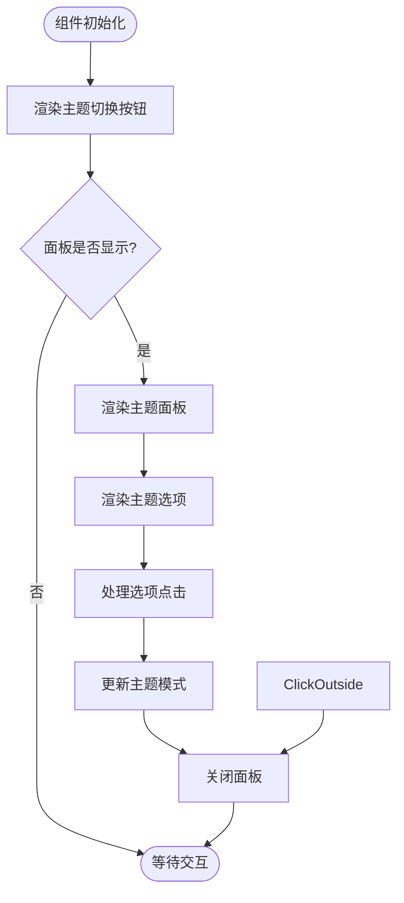
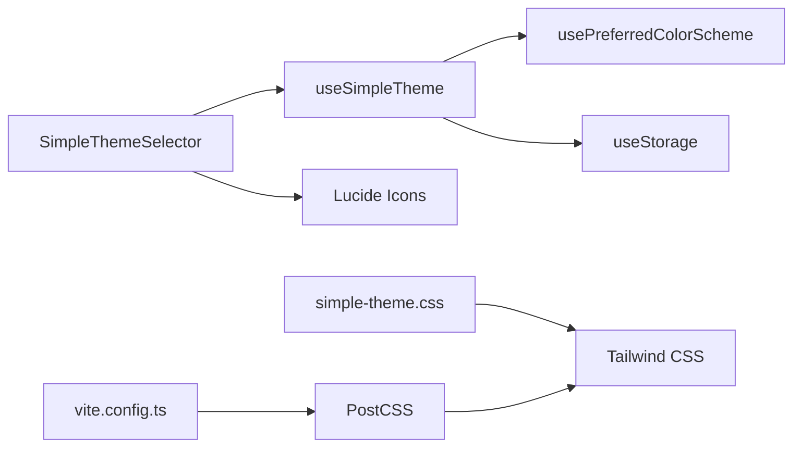

# 主题样式实现

<cite>
**本文档引用文件**  
- [simple-theme.css](file://src/styles/simple-theme.css)
- [globals.css](file://src/styles/globals.css)
- [useSimpleTheme.ts](file://src/composables/useSimpleTheme.ts)
- [SimpleThemeSelector.vue](file://src/components/theme/SimpleThemeSelector.vue)
- [vite.config.ts](file://vite.config.ts)
- [tailwind.config.ts](file://config/build/tailwind.config.ts)
- [style.css](file://src/style.css)
</cite>

## 目录
1. [简介](#简介)
2. [项目结构](#项目结构)
3. [核心组件](#核心组件)
4. [架构概述](#架构概述)
5. [详细组件分析](#详细组件分析)
6. [依赖分析](#依赖分析)
7. [性能考虑](#性能考虑)
8. [故障排除指南](#故障排除指南)
9. [结论](#结论)

## 简介
本项目实现了一套完整的主题样式系统，支持浅色、深色和跟随系统三种主题模式。系统基于CSS自定义属性和Tailwind CSS构建，通过Vite构建流程进行样式加载和处理。主题系统包含CSS变量定义、动态类名应用、构建流程集成和用户界面组件等多个方面。

## 项目结构
项目中的主题相关文件主要分布在`src/styles`目录下，包括`simple-theme.css`和`globals.css`两个核心样式文件。主题逻辑由`src/composables/useSimpleTheme.ts`提供，用户界面由`src/components/theme/SimpleThemeSelector.vue`实现。

**Diagram sources**
- [simple-theme.css](file://src/styles/simple-theme.css)
- [globals.css](file://src/styles/globals.css)
- [useSimpleTheme.ts](file://src/composables/useSimpleTheme.ts)
- [SimpleThemeSelector.vue](file://src/components/theme/SimpleThemeSelector.vue)

**Section sources**
- [simple-theme.css](file://src/styles/simple-theme.css)
- [globals.css](file://src/styles/globals.css)

## 核心组件
主题系统的核心组件包括CSS变量定义、主题逻辑实现和用户界面组件。CSS变量在`:root`选择器中定义，通过动态类名切换主题，使用组合式API实现主题逻辑。

**Section sources**
- [simple-theme.css](file://src/styles/simple-theme.css)
- [useSimpleTheme.ts](file://src/composables/useSimpleTheme.ts)
- [SimpleThemeSelector.vue](file://src/components/theme/SimpleThemeSelector.vue)

## 架构概述
主题系统采用分层架构，底层是CSS变量定义，中间层是主题逻辑处理，上层是用户界面交互。构建流程通过Vite和PostCSS集成Tailwind CSS，确保样式正确加载和优先级处理。

**Diagram sources**
- [vite.config.ts](file://vite.config.ts)
- [tailwind.config.ts](file://config/build/tailwind.config.ts)
- [useSimpleTheme.ts](file://src/composables/useSimpleTheme.ts)
- [SimpleThemeSelector.vue](file://src/components/theme/SimpleThemeSelector.vue)

## 详细组件分析

### CSS变量定义分析
主题系统使用CSS自定义属性定义颜色变量，通过`:root`选择器组织变量集。浅色主题变量定义在`:root`中，深色主题变量通过`.theme-dark`类覆盖。

**Diagram sources**
- [simple-theme.css](file://src/styles/simple-theme.css#L1-L48)

**Section sources**
- [simple-theme.css](file://src/styles/simple-theme.css#L1-L100)

### 主题逻辑分析
主题逻辑通过组合式API实现，使用`usePreferredColorScheme`检测系统偏好，`useStorage`持久化主题配置，通过计算属性确定激活的主题方案。

**Diagram sources**
- [useSimpleTheme.ts](file://src/composables/useSimpleTheme.ts#L1-L110)

**Section sources**
- [useSimpleTheme.ts](file://src/composables/useSimpleTheme.ts#L1-L110)

### 用户界面分析
主题选择器组件提供用户友好的界面，包含主题切换按钮和主题选择面板，支持点击外部关闭面板。

**Diagram sources**
- [SimpleThemeSelector.vue](file://src/components/theme/SimpleThemeSelector.vue#L1-L302)

**Section sources**
- [SimpleThemeSelector.vue](file://src/components/theme/SimpleThemeSelector.vue#L1-L302)

## 依赖分析
主题系统依赖多个外部库和内部模块，包括VueUse的`usePreferredColorScheme`和`useStorage`，Lucide图标库，以及Tailwind CSS。

**Diagram sources**
- [package.json](file://package.json)
- [vite.config.ts](file://vite.config.ts)
- [tailwind.config.ts](file://config/build/tailwind.config.ts)

**Section sources**
- [package.json](file://package.json)
- [vite.config.ts](file://vite.config.ts)

## 性能考虑
主题系统在性能方面做了多项优化，包括使用CSS变量减少重绘重排，通过`requestAnimationFrame`优化主题切换动画，以及使用`useStorage`的防抖功能减少存储操作频率。

## 故障排除指南
当主题样式未生效或优先级错乱时，可以使用浏览器开发者工具检查元素的计算样式，验证CSS变量是否正确应用，检查类名是否正确添加。

**Section sources**
- [simple-theme.css](file://src/styles/simple-theme.css)
- [useSimpleTheme.ts](file://src/composables/useSimpleTheme.ts)

## 结论
本主题系统实现了完整的主题切换功能，通过CSS变量、组合式API和用户界面组件的协同工作，提供了良好的用户体验。系统设计合理，易于扩展和维护。