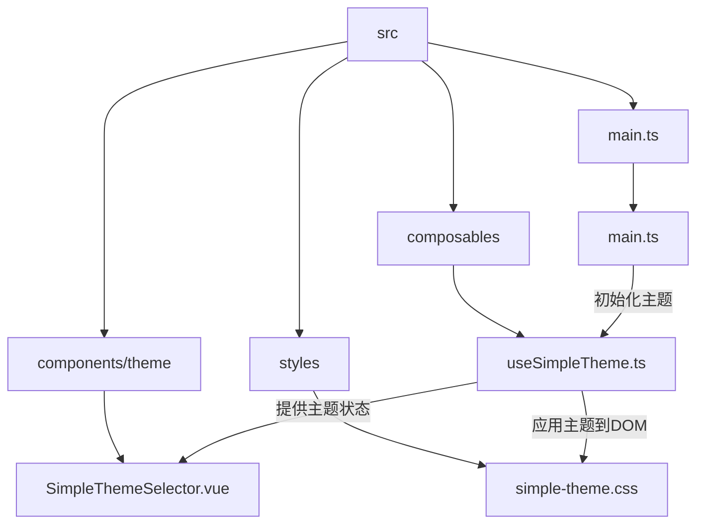
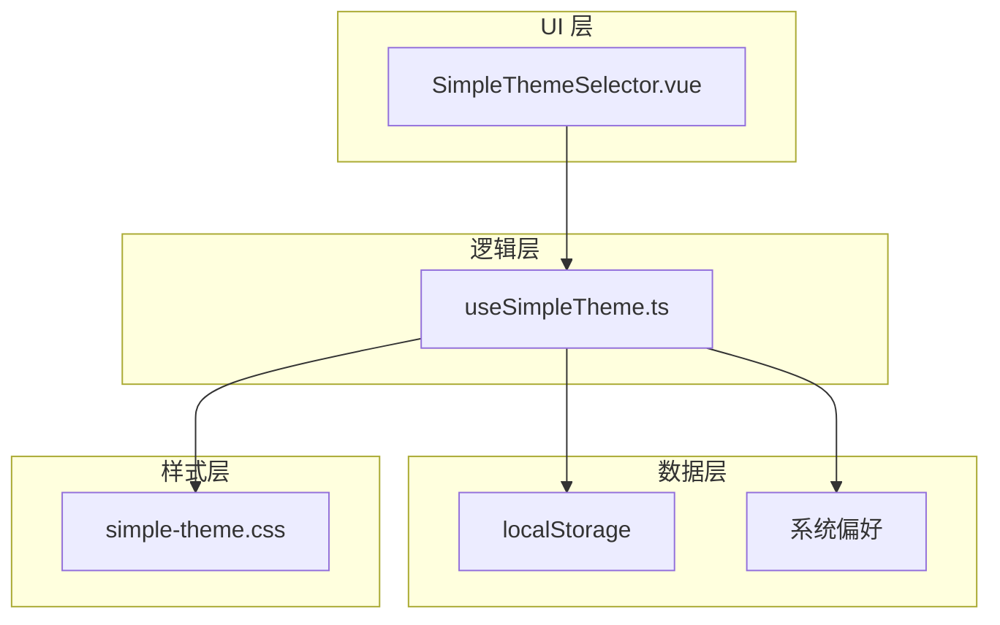
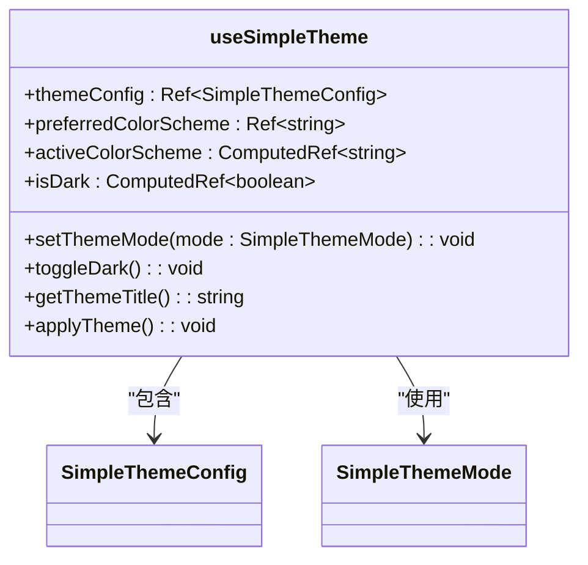
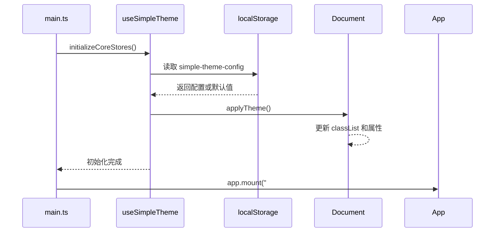
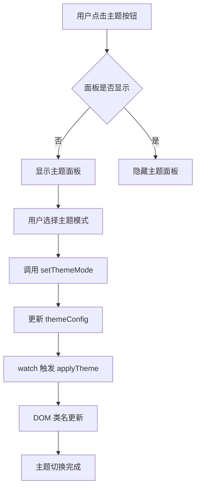

# 主题状态管理

<cite>
**本文档引用的文件**
- [useSimpleTheme.ts](file://src/composables/useSimpleTheme.ts)
- [SimpleThemeSelector.vue](file://src/components/theme/SimpleThemeSelector.vue)
- [main.ts](file://src/main.ts)
- [simple-theme.css](file://src/styles/simple-theme.css)
- [style.css](file://src/style.css)
</cite>

## 目录
1. [简介](#简介)
2. [项目结构](#项目结构)
3. [核心组件](#核心组件)
4. [架构概述](#架构概述)
5. [详细组件分析](#详细组件分析)
6. [依赖分析](#依赖分析)
7. [性能考虑](#性能考虑)
8. [故障排除指南](#故障排除指南)
9. [结论](#结论)

## 简介
本文档深入解析 `useSimpleTheme` 组合函数的设计与实现机制，详细说明其如何利用 Vue 的响应式系统管理主题状态，并通过 `provide/inject` 模式实现跨层级组件通信。文档涵盖主题持久化、系统偏好检测、DOM 类切换等核心功能的实现原理，并提供实际使用示例和常见问题的优化策略。

## 项目结构
项目采用标准的 Vue 3 + TypeScript 架构，主题相关功能集中于特定目录。核心主题逻辑封装在组合式函数中，样式文件独立管理，组件实现简洁高效。



**Diagram sources**
- [useSimpleTheme.ts](file://src/composables/useSimpleTheme.ts)
- [SimpleThemeSelector.vue](file://src/components/theme/SimpleThemeSelector.vue)
- [simple-theme.css](file://src/styles/simple-theme.css)
- [main.ts](file://src/main.ts)

**Section sources**
- [useSimpleTheme.ts](file://src/composables/useSimpleTheme.ts)
- [SimpleThemeSelector.vue](file://src/components/theme/SimpleThemeSelector.vue)
- [simple-theme.css](file://src/styles/simple-theme.css)
- [main.ts](file://src/main.ts)

## 核心组件
`useSimpleTheme` 组合函数是主题系统的核心，它封装了主题状态管理的所有逻辑，包括响应式状态创建、系统偏好检测、本地存储持久化和 DOM 更新。该函数通过返回一组状态和方法，为上层组件提供简洁的 API。

**Section sources**
- [useSimpleTheme.ts](file://src/composables/useSimpleTheme.ts)

## 架构概述
主题系统采用分层架构设计，组合函数负责状态管理，组件负责用户交互，样式文件负责视觉呈现，主入口文件负责系统初始化。这种分离确保了代码的可维护性和可扩展性。



**Diagram sources**
- [useSimpleTheme.ts](file://src/composables/useSimpleTheme.ts)
- [SimpleThemeSelector.vue](file://src/components/theme/SimpleThemeSelector.vue)
- [simple-theme.css](file://src/styles/simple-theme.css)

## 详细组件分析

### useSimpleTheme 组合函数分析
`useSimpleTheme` 函数实现了完整的主题管理解决方案，其设计充分体现了 Vue 组合式 API 的优势。

#### 响应式状态与计算属性
函数使用 `ref` 创建响应式状态，并通过 `computed` 属性动态计算当前激活的主题方案。`activeColorScheme` 计算属性根据用户设置和系统偏好决定最终的主题，`isDark` 属性则提供布尔值判断。



**Diagram sources**
- [useSimpleTheme.ts](file://src/composables/useSimpleTheme.ts#L15-L80)

#### 主题应用与 DOM 操作
`applyTheme` 方法负责将当前主题状态同步到 DOM，通过操作 `documentElement` 和 `body` 的 classList 实现主题切换。该方法移除旧的类名并添加新的类名，同时设置 data 属性和 colorScheme 属性。

**Section sources**
- [useSimpleTheme.ts](file://src/composables/useSimpleTheme.ts#L45-L75)

#### 持久化与初始化逻辑
主题配置通过 `useStorage` 从 localStorage 持久化，确保用户偏好在页面刷新后得以保留。在 `main.ts` 中，应用初始化时即调用 `applyTheme`，确保主题状态在组件渲染前已正确应用，避免了内容闪烁问题。



**Diagram sources**
- [main.ts](file://src/main.ts#L25-L50)
- [useSimpleTheme.ts](file://src/composables/useSimpleTheme.ts#L30-L45)

### SimpleThemeSelector 组件分析
`SimpleThemeSelector` 组件提供用户界面，允许用户选择和切换主题模式。它通过 `useSimpleTheme` 获取主题状态和操作方法，实现了与组合函数的无缝集成。

#### 用户交互流程
组件通过按钮点击事件触发面板显示，用户选择主题模式后调用 `setThemeMode` 方法更新状态。`watch` 监听器确保状态变化时自动更新 UI，`getThemeTitle` 方法提供按钮的提示文本。



**Diagram sources**
- [SimpleThemeSelector.vue](file://src/components/theme/SimpleThemeSelector.vue#L20-L50)
- [useSimpleTheme.ts](file://src/composables/useSimpleTheme.ts#L75-L85)

**Section sources**
- [SimpleThemeSelector.vue](file://src/components/theme/SimpleThemeSelector.vue)
- [useSimpleTheme.ts](file://src/composables/useSimpleTheme.ts)

## 依赖分析
主题系统依赖于 Vue 3 的响应式系统和 VueUse 库提供的实用函数。`usePreferredColorScheme` 检测系统偏好，`useStorage` 处理本地存储，这些依赖确保了功能的完整性和可靠性。

```mermaid
dependencyDiagram
useSimpleTheme --> vue : "import { ref, computed, watch, onMounted }"
useSimpleTheme --> vueuse/core : "import { usePreferredColorScheme, useStorage }"
SimpleThemeSelector --> useSimpleTheme : "import { useSimpleTheme }"
SimpleThemeSelector --> lucide-vue-next : "图标组件"
main.ts --> useSimpleTheme : "初始化调用"
```

**Diagram sources**
- [useSimpleTheme.ts](file://src/composables/useSimpleTheme.ts#L1-L5)
- [SimpleThemeSelector.vue](file://src/components/theme/SimpleThemeSelector.vue#L4-L5)
- [main.ts](file://src/main.ts#L8-L9)

**Section sources**
- [useSimpleTheme.ts](file://src/composables/useSimpleTheme.ts)
- [SimpleThemeSelector.vue](file://src/components/theme/SimpleThemeSelector.vue)
- [main.ts](file://src/main.ts)

## 性能考虑
主题系统在设计时充分考虑了性能因素。通过 `watch` 的 `deep: true` 选项精确监听配置变化，避免不必要的重新渲染。`applyTheme` 方法集中处理 DOM 操作，减少浏览器重排和重绘次数。样式文件采用 CSS 变量，确保主题切换的高效性。

## 故障排除指南
当主题系统出现问题时，可按以下步骤排查：
1. 检查 `localStorage` 中 `simple-theme-config` 的值是否正确
2. 确认 `main.ts` 中的初始化流程是否执行
3. 验证 `simple-theme.css` 是否正确加载
4. 检查浏览器控制台是否有相关错误信息

**Section sources**
- [useSimpleTheme.ts](file://src/composables/useSimpleTheme.ts#L30-L35)
- [main.ts](file://src/main.ts#L25-L30)
- [simple-theme.css](file://src/styles/simple-theme.css)

## 结论
`useSimpleTheme` 组合函数通过优雅的设计实现了完整的主题管理功能，其响应式状态、持久化存储、系统集成和简洁 API 使其成为项目中的优秀实践案例。通过合理的架构设计和性能优化，该系统为用户提供流畅的主题切换体验。