# 主题系统实现

<cite>
**本文档引用的文件**
- [SimpleThemeSelector.vue](file://src/components/theme/SimpleThemeSelector.vue)
- [ThemeSelector.vue](file://src/components/theme/ThemeSelector.vue)
- [useSimpleTheme.ts](file://src/composables/useSimpleTheme.ts)
- [simple-theme.css](file://src/styles/simple-theme.css)
- [tailwind.config.ts](file://config/build/tailwind.config.ts)
- [style.css](file://src/style.css)
- [globals.css](file://src/styles/globals.css)
</cite>

## 目录
1. [简介](#简介)
2. [UI复杂度与功能覆盖对比](#uicomplexity-and-functionality-comparison)
3. [主题状态管理机制](#theme-state-management)
4. [CSS自定义属性与样式系统](#css-variables-and-styles)
5. [DOM类名注入与切换逻辑](#dom-class-injection)
6. [过渡动画与渲染优化](#animation-and-optimization)
7. [Tailwind CSS协同工作模式](#tailwind-integration)
8. [主题扩展指南](#theme-extension-guide)
9. [常见问题排查](#troubleshooting)
10. [性能监控建议](#performance-monitoring)

## 简介
本系统实现了基于Vue 3和Composition API的主题管理机制，提供两种主题选择器组件：`SimpleThemeSelector`和`ThemeSelector`。系统通过组合式函数`useSimpleTheme`管理主题状态，利用CSS自定义属性实现动态主题切换，并与Tailwind CSS框架深度集成。主题系统支持浅色、深色和跟随系统三种模式，具备localStorage持久化、初始化检测和过渡动画等特性。

## UI复杂度与功能覆盖对比

### SimpleThemeSelector与ThemeSelector设计差异
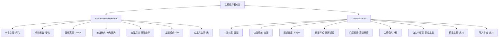

**图表来源**
- [SimpleThemeSelector.vue](file://src/components/theme/SimpleThemeSelector.vue#L0-L302)
- [ThemeSelector.vue](file://src/components/theme/ThemeSelector.vue#L0-L485)

**本节来源**
- [SimpleThemeSelector.vue](file://src/components/theme/SimpleThemeSelector.vue#L0-L302)
- [ThemeSelector.vue](file://src/components/theme/ThemeSelector.vue#L0-L485)

## 主题状态管理机制

### useSimpleTheme组合函数实现
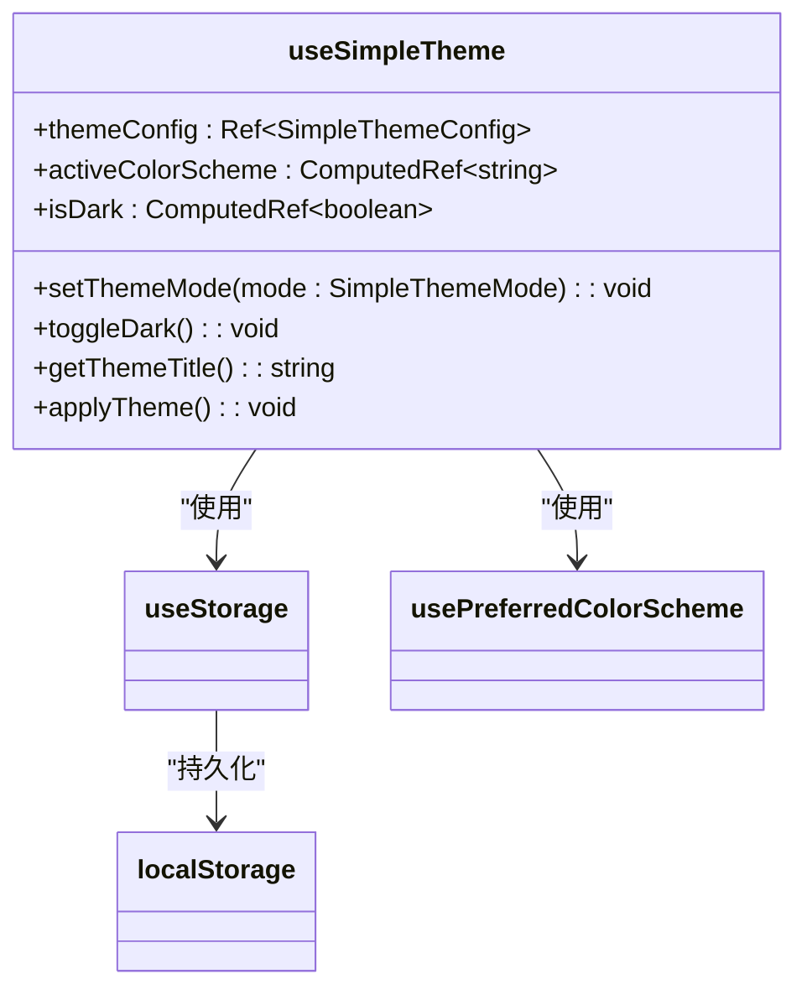

**图表来源**
- [useSimpleTheme.ts](file://src/composables/useSimpleTheme.ts#L0-L110)

### 主题状态管理流程
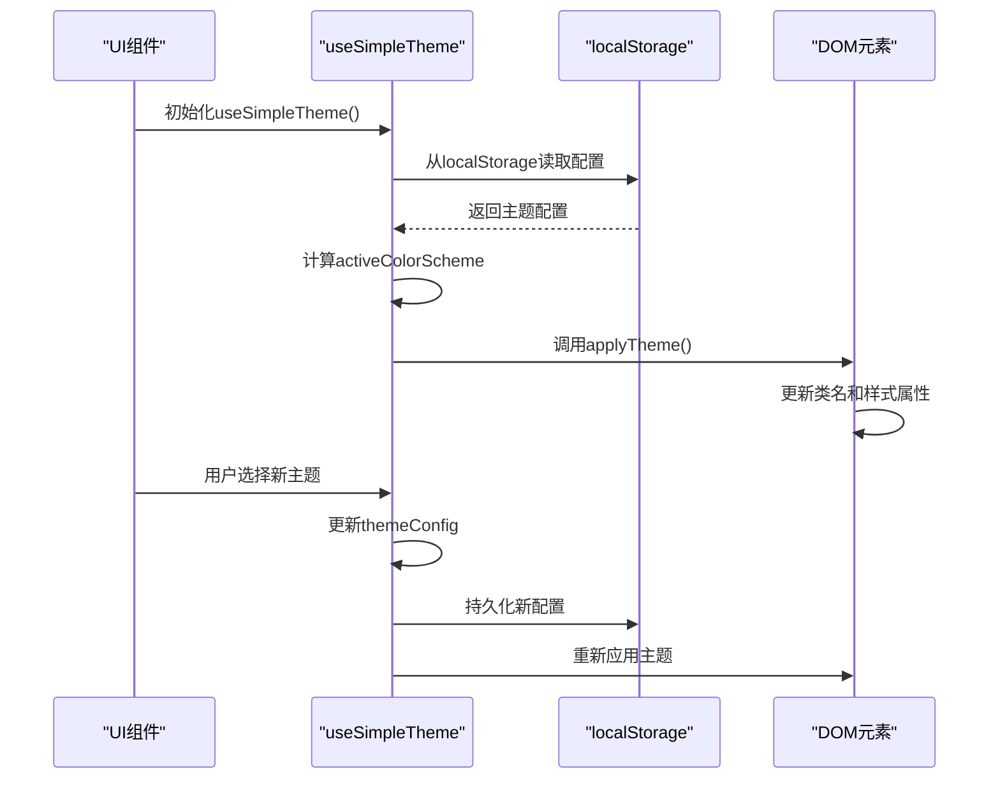

**图表来源**
- [useSimpleTheme.ts](file://src/composables/useSimpleTheme.ts#L42-L109)

**本节来源**
- [useSimpleTheme.ts](file://src/composables/useSimpleTheme.ts#L0-L110)

## CSS自定义属性与样式系统

### simple-theme.css中的CSS变量定义
```mermaid
erDiagram
:root {
--theme-bg: "#f1f5f9"
--theme-text: "#1e293b"
--theme-primary: "#3b82f6"
--theme-border: "#e2e8f0"
}
.theme-dark {
--theme-bg: "#0f172a"
--theme-text: "#f1f5f9"
--theme-primary: "#60a5fa"
--theme-border: "#475569"
}
:root ||--o{ .theme-dark : "继承并覆盖"
```

**图表来源**
- [simple-theme.css](file://src/styles/simple-theme.css#L0-L48)

### CSS变量层次结构
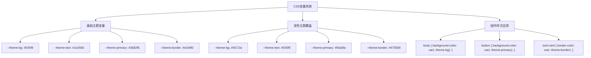

**图表来源**
- [simple-theme.css](file://src/styles/simple-theme.css#L0-L252)

**本节来源**
- [simple-theme.css](file://src/styles/simple-theme.css#L0-L252)

## DOM类名注入与切换逻辑

### 主题类名注入机制
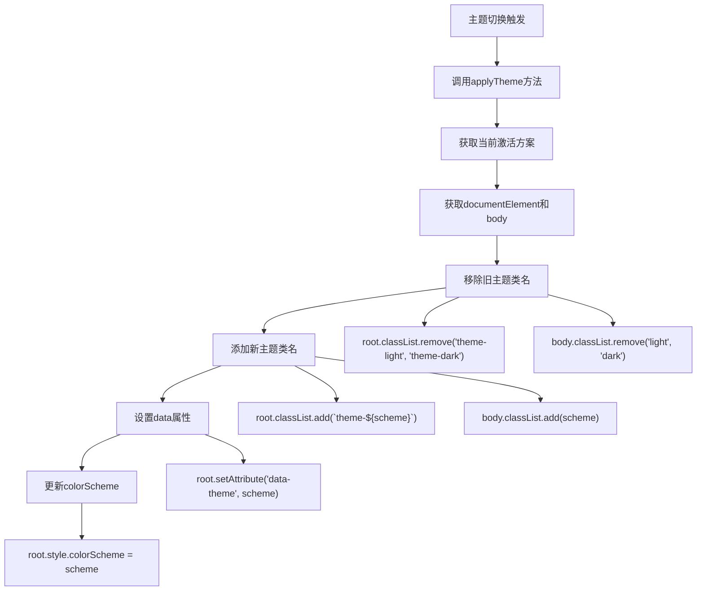

**图表来源**
- [useSimpleTheme.ts](file://src/composables/useSimpleTheme.ts#L42-L60)

### 类名切换逻辑流程
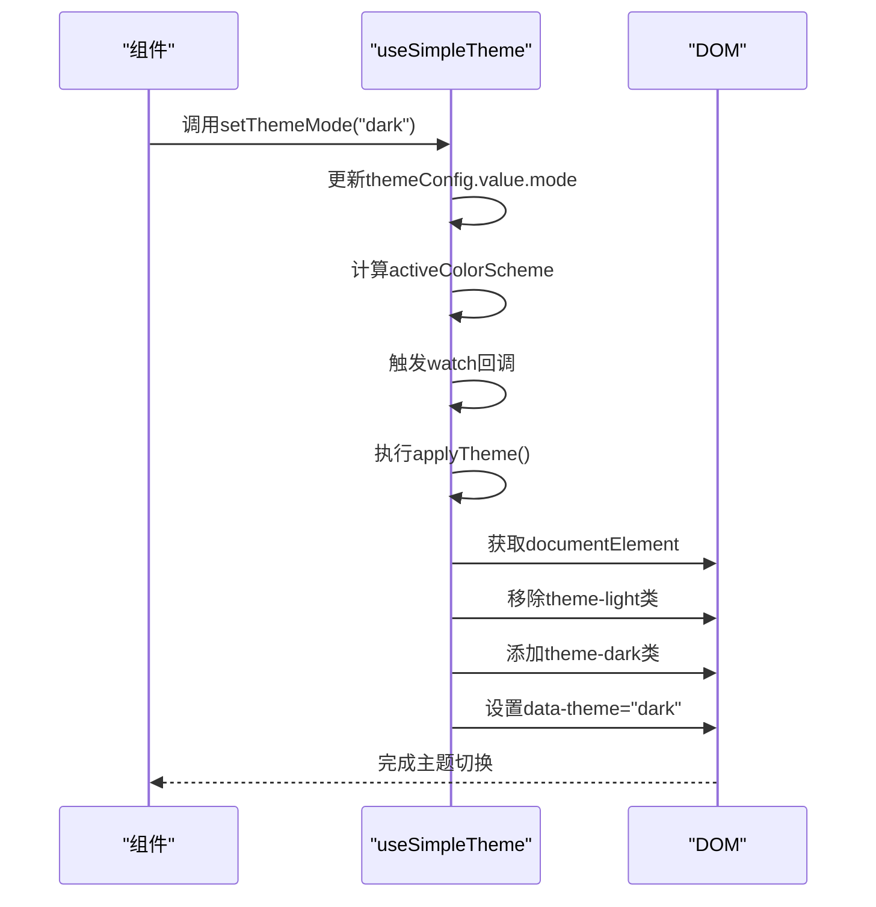

**图表来源**
- [useSimpleTheme.ts](file://src/composables/useSimpleTheme.ts#L42-L109)

**本节来源**
- [useSimpleTheme.ts](file://src/composables/useSimpleTheme.ts#L42-L109)

## 过渡动画与渲染优化

### 主题切换过渡动画
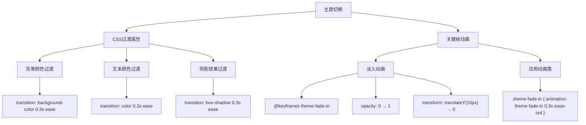

**图表来源**
- [simple-theme.css](file://src/styles/simple-theme.css#L200-L215)

### 组件重渲染优化策略
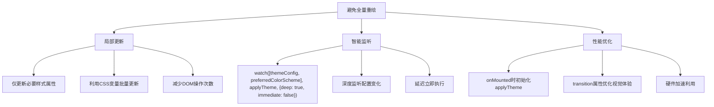

**图表来源**
- [useSimpleTheme.ts](file://src/composables/useSimpleTheme.ts#L95-L105)
- [simple-theme.css](file://src/styles/simple-theme.css#L50-L55)

**本节来源**
- [useSimpleTheme.ts](file://src/composables/useSimpleTheme.ts#L42-L109)
- [simple-theme.css](file://src/styles/simple-theme.css#L0-L252)

## Tailwind CSS协同工作模式

### Tailwind与CSS变量集成
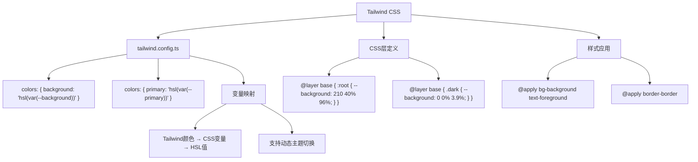

**图表来源**
- [tailwind.config.ts](file://config/build/tailwind.config.ts#L0-L88)
- [style.css](file://src/style.css#L0-L60)
- [globals.css](file://src/styles/globals.css#L0-L94)

### 协同工作架构
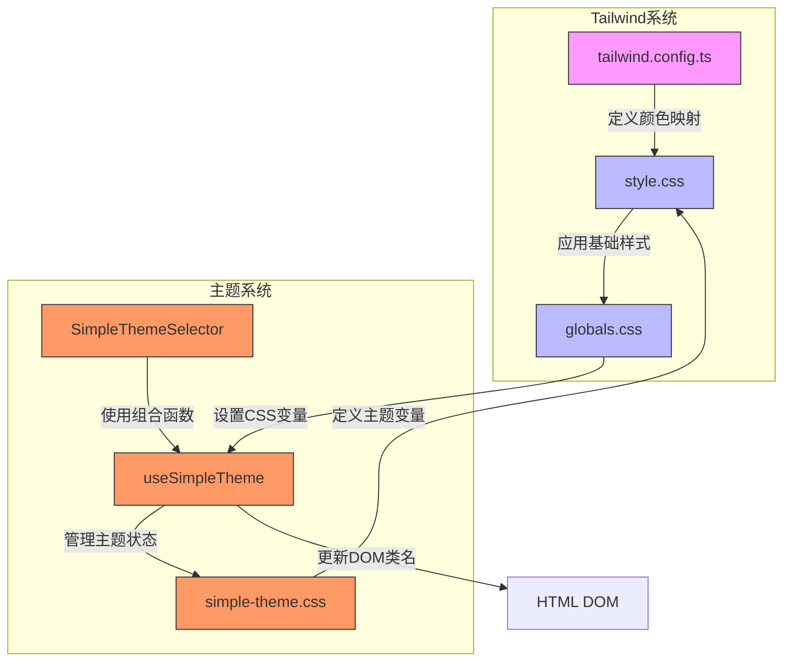

**图表来源**
- [tailwind.config.ts](file://config/build/tailwind.config.ts#L0-L88)
- [style.css](file://src/style.css#L0-L60)
- [globals.css](file://src/styles/globals.css#L0-L94)
- [useSimpleTheme.ts](file://src/composables/useSimpleTheme.ts#L0-L110)
- [simple-theme.css](file://src/styles/simple-theme.css#L0-L252)

**本节来源**
- [tailwind.config.ts](file://config/build/tailwind.config.ts#L0-L88)
- [style.css](file://src/style.css#L0-L60)
- [globals.css](file://src/styles/globals.css#L0-L94)

## 主题扩展指南

### 新增主题变量
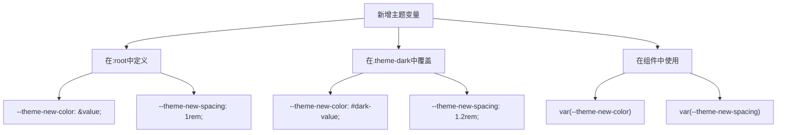

### 自定义配色方案注入
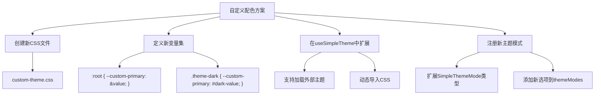

### 第三方主题包集成
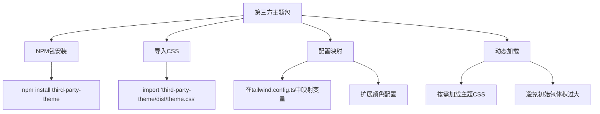

**本节来源**
- [simple-theme.css](file://src/styles/simple-theme.css#L0-L252)
- [useSimpleTheme.ts](file://src/composables/useSimpleTheme.ts#L0-L110)
- [tailwind.config.ts](file://config/build/tailwind.config.ts#L0-L88)

## 常见问题排查

### 主题不生效问题
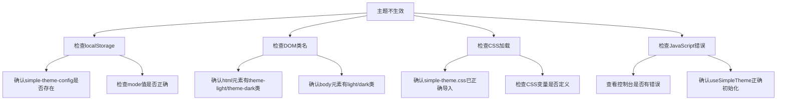

### 样式冲突问题
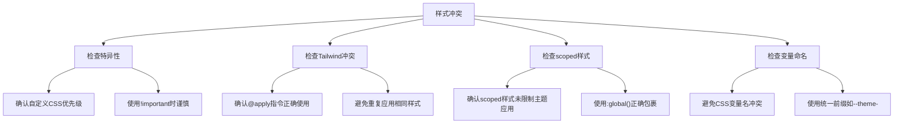

**本节来源**
- [simple-theme.css](file://src/styles/simple-theme.css#L220-L235)
- [useSimpleTheme.ts](file://src/composables/useSimpleTheme.ts#L42-L109)

## 性能监控建议

### 主题切换性能监控
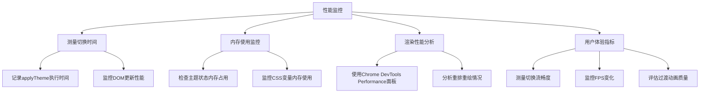

### 优化建议
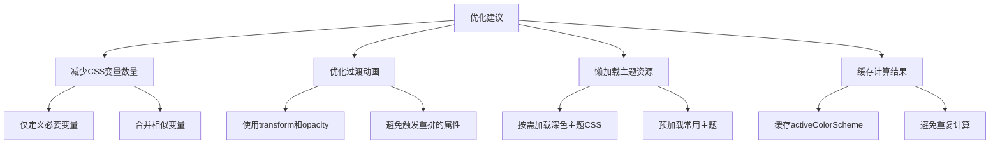

**本节来源**
- [useSimpleTheme.ts](file://src/composables/useSimpleTheme.ts#L42-L109)
- [simple-theme.css](file://src/styles/simple-theme.css#L50-L55)