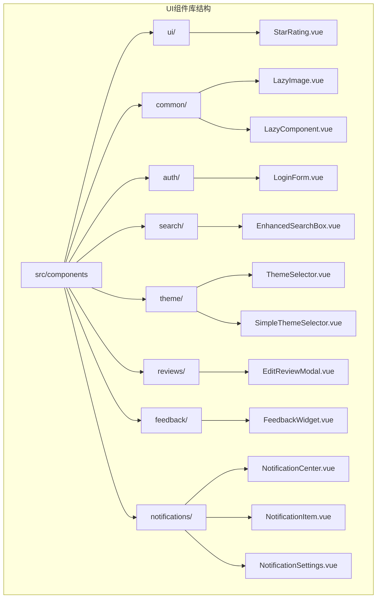
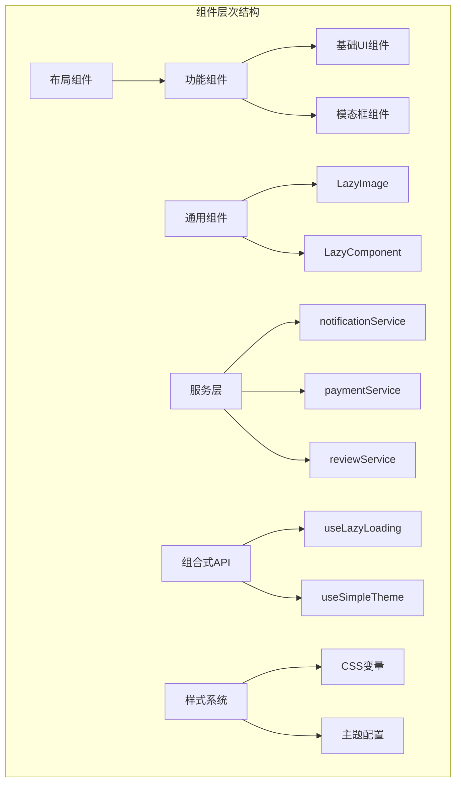
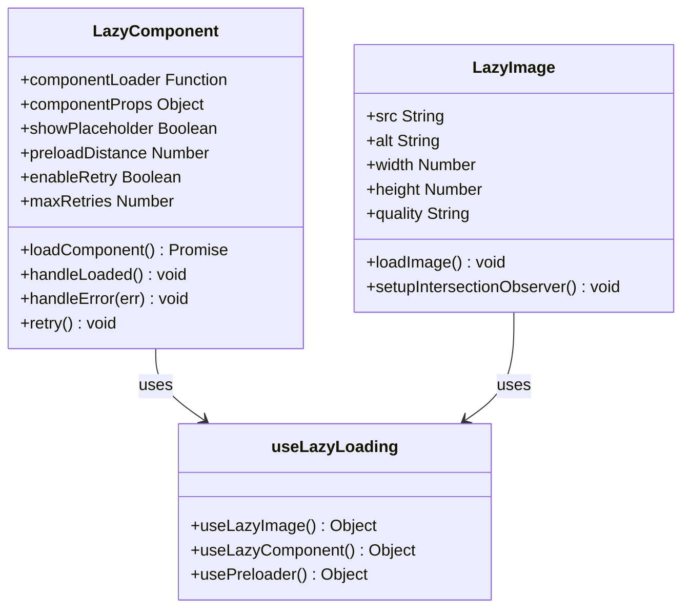
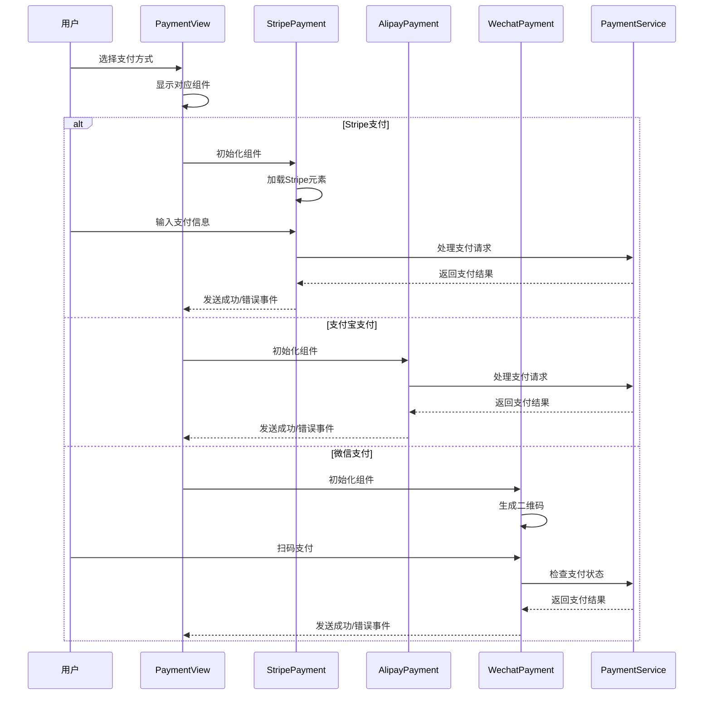
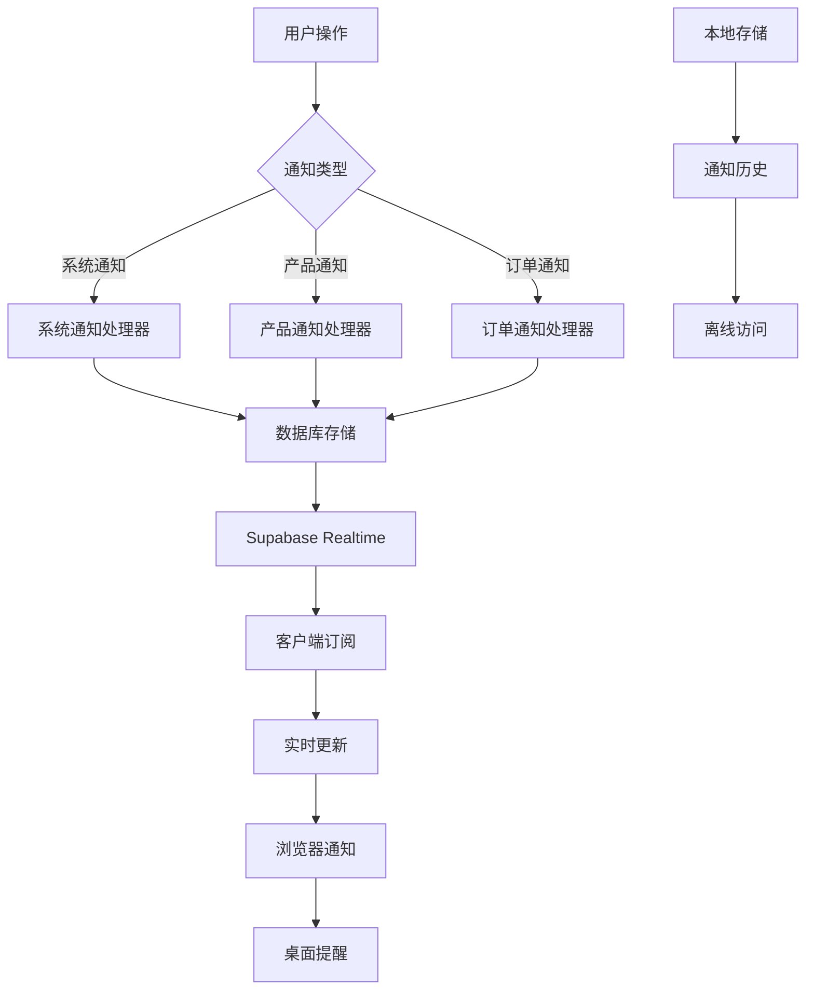
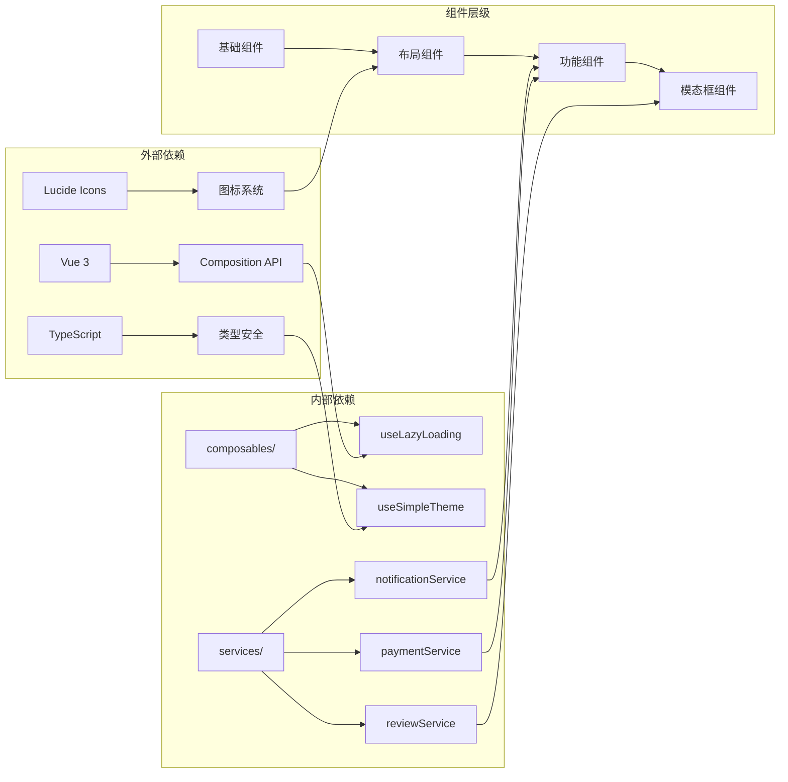

# UI组件库

<cite>
**本文档中引用的文件**
- [StarRating.vue](file://src/components/ui/StarRating.vue)
- [LazyImage.vue](file://src/components/common/LazyImage.vue)
- [LazyComponent.vue](file://src/components/common/LazyComponent.vue)
- [AuthLayout.vue](file://src/layouts/AuthLayout.vue)
- [EnhancedSearchBox.vue](file://src/components/search/EnhancedSearchBox.vue)
- [ThemeSelector.vue](file://src/components/theme/ThemeSelector.vue)
- [SimpleThemeSelector.vue](file://src/components/theme/SimpleThemeSelector.vue)
- [EditReviewModal.vue](file://src/components/reviews/EditReviewModal.vue)
- [StripePayment.vue](file://src/components/StripePayment.vue)
- [AlipayPayment.vue](file://src/components/AlipayPayment.vue)
- [WechatPayment.vue](file://src/components/WechatPayment.vue)
- [FeedbackWidget.vue](file://src/components/feedback/FeedbackWidget.vue)
- [NotificationCenter.vue](file://src/components/notifications/NotificationCenter.vue)
- [NotificationItem.vue](file://src/components/notifications/NotificationItem.vue)
- [NotificationSettings.vue](file://src/components/notifications/NotificationSettings.vue)
- [ToolRating.vue](file://src/components/ToolRating.vue)
- [useLazyLoading.ts](file://src/composables/useLazyLoading.ts)
- [useSimpleTheme.ts](file://src/composables/useSimpleTheme.ts)
</cite>

## 目录
1. [简介](#简介)
2. [项目结构](#项目结构)
3. [核心组件](#核心组件)
4. [架构概览](#架构概览)
5. [详细组件分析](#详细组件分析)
6. [依赖关系分析](#依赖关系分析)
7. [性能考虑](#性能考虑)
8. [故障排除指南](#故障排除指南)
9. [结论](#结论)

## 简介

本UI组件库是一个基于Vue 3和TypeScript构建的现代化前端组件系统，专为高级工具导航网站设计。该组件库包含基础UI组件、布局组件、功能组件和模态框组件，提供了完整的主题定制能力和可组合的组件架构。

组件库的设计理念注重：
- **可复用性**：每个组件都可以在不同场景中重复使用
- **可组合性**：组件之间可以灵活组合形成复杂界面
- **主题定制**：支持多种主题模式和颜色配置
- **响应式设计**：适配各种设备和屏幕尺寸
- **性能优化**：内置懒加载和预加载机制

## 项目结构

UI组件库采用模块化的目录结构，按功能和用途进行分类组织：



**图表来源**
- [src/components/ui/StarRating.vue](file://src/components/ui/StarRating.vue)
- [src/components/common/LazyImage.vue](file://src/components/common/LazyImage.vue)
- [src/components/search/EnhancedSearchBox.vue](file://src/components/search/EnhancedSearchBox.vue)
- [src/components/theme/ThemeSelector.vue](file://src/components/theme/ThemeSelector.vue)

**章节来源**
- [src/components/ui/StarRating.vue](file://src/components/ui/StarRating.vue#L1-L53)
- [src/components/common/LazyImage.vue](file://src/components/common/LazyImage.vue#L1-L341)
- [src/components/search/EnhancedSearchBox.vue](file://src/components/search/EnhancedSearchBox.vue#L1-L1024)

## 核心组件

### 基础UI组件

#### StarRating - 星级评分组件

StarRating是一个高度可定制的星级评分组件，支持只读模式和交互模式。

**主要特性：**
- 5星制评分系统
- 自定义颜色和大小
- 支持只读和可编辑模式
- 平滑的动画效果
- 完整的TypeScript类型支持

**属性（Props）：**
- `modelValue` (Number, 必需): 当前评分值
- `readonly` (Boolean, 默认: false): 是否只读模式

**事件（Emits）：**
- `update:modelValue` (Number): 当评分改变时触发

**使用示例：**
```vue
<template>
  <StarRating 
    v-model:modelValue="rating" 
    :readonly="false" 
    @update:modelValue="onRatingChange"
  />
</template>
```

#### LazyImage - 懒加载图片组件

LazyImage提供了高性能的图片懒加载功能，支持多种优化策略。

**主要特性：**
- Intersection Observer API实现的懒加载
- 自动图片格式优化（WebP支持）
- 占位符和错误处理
- 响应式图片支持
- 可配置的加载阈值和边距

**属性（Props）：**
- `src` (String, 必需): 图片URL
- `alt` (String, 默认: ""): 替代文本
- `width` (Number/String): 图片宽度
- `height` (Number/String): 图片高度
- `quality` (String, 默认: "medium"): 图片质量级别
- `rootMargin` (String, 默认: "50px"): 触发加载的边界
- `threshold` (Number, 默认: 0.1): 触发加载的可见度阈值

**事件（Emits）：**
- `load` (Event): 图片加载成功
- `error` (String): 图片加载失败
- `visible` (): 图片进入视口

**章节来源**
- [src/components/ui/StarRating.vue](file://src/components/ui/StarRating.vue#L1-L53)
- [src/components/common/LazyImage.vue](file://src/components/common/LazyImage.vue#L1-L341)

### 布局组件

#### AuthLayout - 认证布局组件

AuthLayout是一个专门用于认证页面的布局组件，提供统一的页面结构。

**主要特性：**
- 响应式设计
- Logo区域
- 主内容区域
- 统一的间距和排版
- 可扩展的插槽系统

**插槽（Slots）：**
- `default`: 主内容区域

**使用示例：**
```vue
<template>
  <AuthLayout>
    <div class="login-container">
      <h1>登录</h1>
      <LoginForm />
    </div>
  </AuthLayout>
</template>
```

**章节来源**
- [src/layouts/AuthLayout.vue](file://src/layouts/AuthLayout.vue#L1-L45)

### 功能组件

#### EnhancedSearchBox - 增强搜索框组件

EnhancedSearchBox是一个功能强大的搜索组件，集成了智能建议、高级筛选和历史记录功能。

**主要特性：**
- 智能搜索建议
- 高级筛选选项
- 搜索历史管理
- 热门搜索推荐
- 多种搜索类型支持
- 键盘导航支持

**属性（Props）：**
- `placeholder` (String, 默认: "搜索工具、产品、分类..."): 输入框占位符
- `autoFocus` (Boolean, 默认: false): 是否自动聚焦
- `showAdvanced` (Boolean, 默认: false): 是否显示高级搜索
- `defaultType` (String, 默认: "all"): 默认搜索类型

**事件（Emits）：**
- `search` (SearchResult): 搜索结果
- `clear` (): 清空搜索
- `focus` (): 获得焦点
- `blur` (): 失去焦点

**章节来源**
- [src/components/search/EnhancedSearchBox.vue](file://src/components/search/EnhancedSearchBox.vue#L1-L1024)

#### ThemeSelector - 主题选择器组件

ThemeSelector提供了完整的主题定制功能，支持多种主题模式和颜色配置。

**主要特性：**
- 浅色/深色/自动模式切换
- 可视化主题预览
- 颜色自定义
- 配置导出/导入
- 实时预览

**章节来源**
- [src/components/theme/ThemeSelector.vue](file://src/components/theme/ThemeSelector.vue#L1-L486)

### 模态框组件

#### EditReviewModal - 编辑评价模态框

EditReviewModal是一个用于编辑用户评价的模态框组件，集成了评分组件和表单验证。

**主要特性：**
- 嵌套的StarRating组件
- 表单验证
- 提交状态管理
- 成功/错误反馈
- 响应式设计

**属性（Props）：**
- `review` (Review, 必需): 要编辑的评价对象

**事件（Emits）：**
- `close` (): 关闭模态框
- `success` (): 编辑成功

**章节来源**
- [src/components/reviews/EditReviewModal.vue](file://src/components/reviews/EditReviewModal.vue#L1-L191)

## 架构概览

UI组件库采用分层架构设计，确保组件的可维护性和可扩展性：



**图表来源**
- [src/components/common/LazyImage.vue](file://src/components/common/LazyImage.vue#L1-L341)
- [src/composables/useLazyLoading.ts](file://src/composables/useLazyLoading.ts#L1-L170)

## 详细组件分析

### LazyComponent - 懒加载组件

LazyComponent是一个通用的懒加载容器组件，支持动态组件加载和错误处理。



**图表来源**
- [src/components/common/LazyComponent.vue](file://src/components/common/LazyComponent.vue#L56-L109)
- [src/components/common/LazyImage.vue](file://src/components/common/LazyImage.vue#L1-L341)
- [src/composables/useLazyLoading.ts](file://src/composables/useLazyLoading.ts#L1-L170)

**章节来源**
- [src/components/common/LazyComponent.vue](file://src/components/common/LazyComponent.vue#L1-L286)
- [src/composables/useLazyLoading.ts](file://src/composables/useLazyLoading.ts#L1-L170)

### Payment组件生态系统

UI组件库包含了完整的支付解决方案，支持多种支付方式：



**图表来源**
- [src/components/StripePayment.vue](file://src/components/StripePayment.vue#L1-L155)
- [src/components/AlipayPayment.vue](file://src/components/AlipayPayment.vue#L1-L66)
- [src/components/WechatPayment.vue](file://src/components/WechatPayment.vue#L1-L240)

**章节来源**
- [src/components/StripePayment.vue](file://src/components/StripePayment.vue#L1-L155)
- [src/components/AlipayPayment.vue](file://src/components/AlipayPayment.vue#L1-L66)
- [src/components/WechatPayment.vue](file://src/components/WechatPayment.vue#L1-L240)

### 通知系统架构

通知系统采用了实时推送和本地存储相结合的架构：



**图表来源**
- [src/components/notifications/NotificationCenter.vue](file://src/components/notifications/NotificationCenter.vue#L1-L454)
- [src/services/notificationService.ts](file://src/services/notificationService.ts#L60-L121)

**章节来源**
- [src/components/notifications/NotificationCenter.vue](file://src/components/notifications/NotificationCenter.vue#L1-L454)
- [src/components/notifications/NotificationItem.vue](file://src/components/notifications/NotificationItem.vue#L1-L82)
- [src/components/notifications/NotificationSettings.vue](file://src/components/notifications/NotificationSettings.vue#L1-L293)

## 依赖关系分析

UI组件库的依赖关系呈现清晰的分层结构：



**图表来源**
- [src/composables/useLazyLoading.ts](file://src/composables/useLazyLoading.ts#L1-L170)
- [src/composables/useSimpleTheme.ts](file://src/composables/useSimpleTheme.ts)

**章节来源**
- [src/composables/useLazyLoading.ts](file://src/composables/useLazyLoading.ts#L1-L170)
- [src/composables/useSimpleTheme.ts](file://src/composables/useSimpleTheme.ts)

## 性能考虑

UI组件库在设计时充分考虑了性能优化：

### 懒加载机制
- 使用Intersection Observer API减少不必要的资源加载
- 支持预加载策略提升用户体验
- 图片自动格式转换和压缩

### 组件缓存
- 使用Vue的缓存机制避免重复渲染
- 合理的组件生命周期管理
- 防止内存泄漏的清理机制

### 网络优化
- 支持CDN加速
- 图片懒加载和预加载
- 减少首屏加载时间

## 故障排除指南

### 常见问题及解决方案

#### 图片加载失败
**问题**: LazyImage组件无法加载图片
**解决方案**:
1. 检查图片URL是否有效
2. 确认网络连接正常
3. 查看控制台错误信息
4. 尝试手动刷新组件

#### 支付组件初始化失败
**问题**: Stripe/支付宝/微信支付组件无法初始化
**解决方案**:
1. 检查环境变量配置
2. 确认支付网关可用性
3. 查看浏览器控制台错误
4. 验证API密钥有效性

#### 主题切换失效
**问题**: ThemeSelector组件主题切换不生效
**解决方案**:
1. 检查CSS变量定义
2. 确认主题配置正确
3. 刷新页面重新加载主题
4. 清除浏览器缓存

**章节来源**
- [src/components/common/LazyImage.vue](file://src/components/common/LazyImage.vue#L1-L341)
- [src/components/StripePayment.vue](file://src/components/StripePayment.vue#L1-L155)
- [src/components/theme/ThemeSelector.vue](file://src/components/theme/ThemeSelector.vue#L1-L486)

## 结论

本UI组件库提供了一个完整、高效且易于使用的前端组件解决方案。通过模块化的设计和丰富的功能，它能够满足现代Web应用的各种需求。组件库的可扩展性和可维护性确保了长期的技术可持续发展。

主要优势包括：
- **完整的组件覆盖**：从基础UI到复杂业务组件的全面支持
- **优秀的性能表现**：内置的懒加载和优化机制
- **灵活的主题系统**：支持深度定制和多主题切换
- **完善的错误处理**：robust的错误处理和用户反馈机制
- **TypeScript支持**：完整的类型定义和IDE支持

未来的发展方向将集中在：
- 更多组件的添加和现有组件的优化
- 性能监控和分析工具的集成
- 更好的无障碍支持
- 国际化和本地化功能的增强