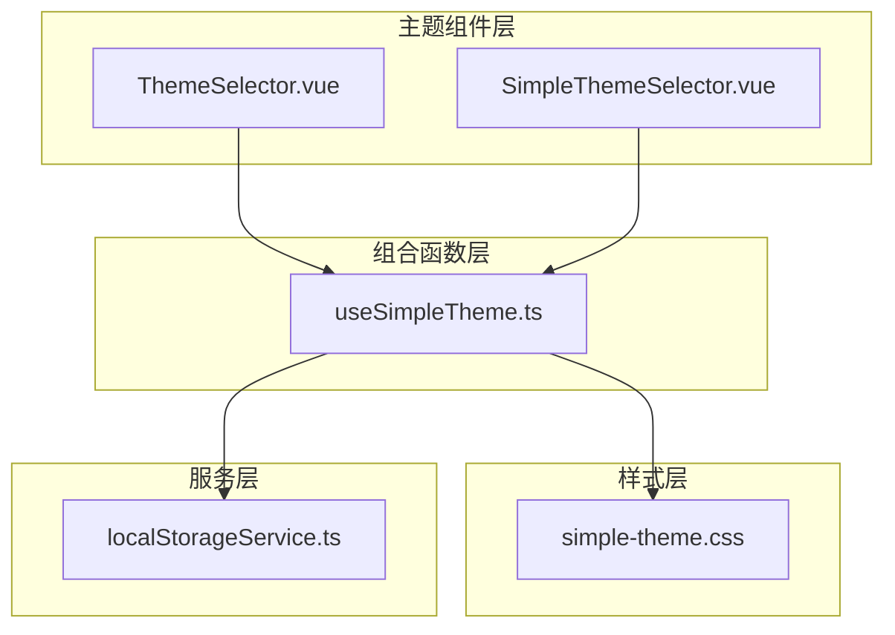
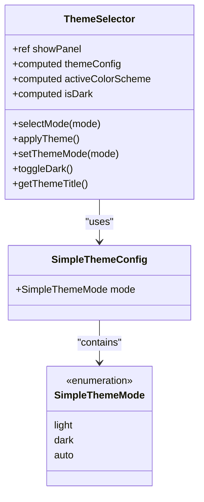
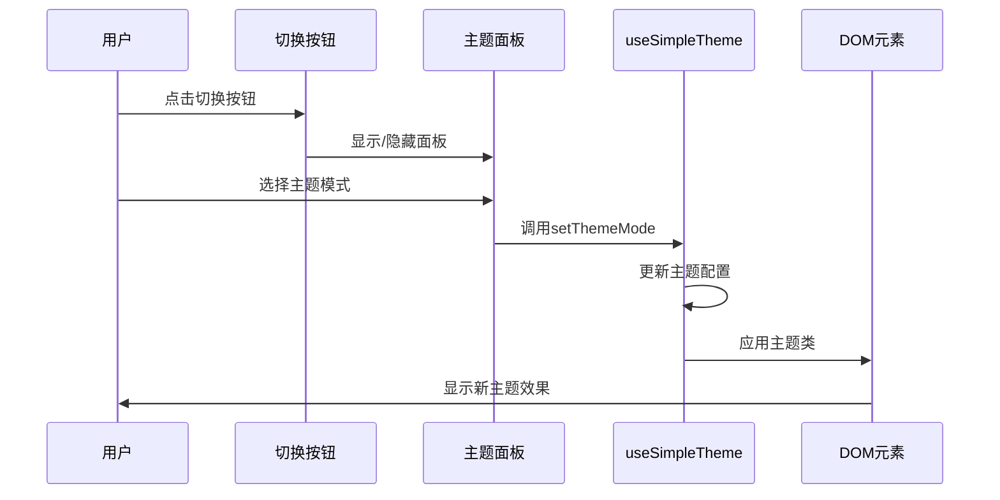
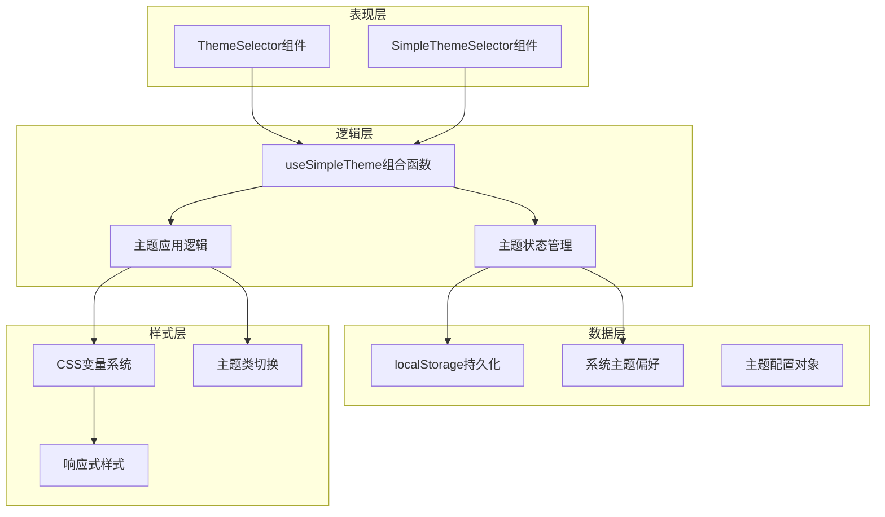
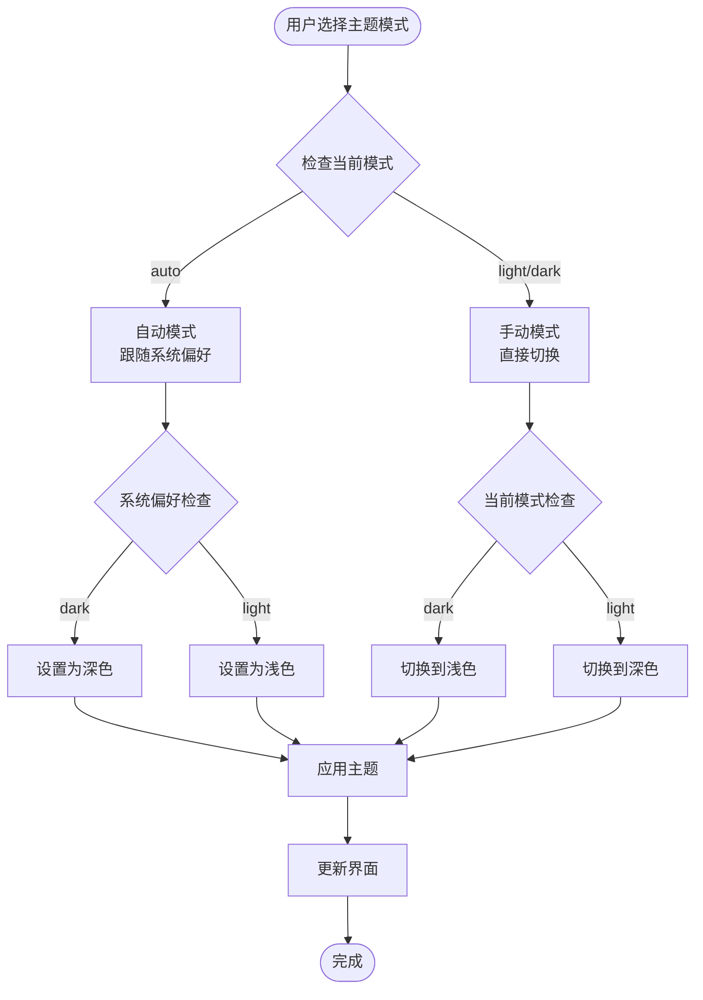

# 主题与样式组件

<cite>
**本文档中引用的文件**
- [useSimpleTheme.ts](file://src/composables/useSimpleTheme.ts)
- [ThemeSelector.vue](file://src/components/theme/ThemeSelector.vue)
- [SimpleThemeSelector.vue](file://src/components/theme/SimpleThemeSelector.vue)
- [simple-theme.css](file://src/styles/simple-theme.css)
- [localStorageService.ts](file://src/services/localStorageService.ts)
- [components.test.ts](file://src/tests/integration/components.test.ts)
</cite>

## 目录
1. [简介](#简介)
2. [项目结构](#项目结构)
3. [核心组件](#核心组件)
4. [架构概览](#架构概览)
5. [详细组件分析](#详细组件分析)
6. [主题变量系统](#主题变量系统)
7. [持久化存储](#持久化存储)
8. [性能考虑](#性能考虑)
9. [故障排除指南](#故障排除指南)
10. [结论](#结论)

## 简介

本项目实现了一套完整的主题切换系统，支持三种主题模式：浅色主题、深色主题和自动跟随系统。系统采用Vue 3 Composition API构建，提供了两个主要的主题选择器组件：完整的ThemeSelector和简化的SimpleThemeSelector，以及一套基于CSS变量的主题样式系统。

主题系统的核心特性包括：
- 支持三种主题模式：light、dark、auto
- 基于CSS自定义属性的主题变量系统
- localStorage持久化存储
- 自动检测系统主题偏好
- 动态主题切换动画
- 响应式设计适配

## 项目结构

主题相关文件组织结构清晰，主要分布在以下目录中：



**图表来源**
- [ThemeSelector.vue](file://src/components/theme/ThemeSelector.vue#L1-L486)
- [SimpleThemeSelector.vue](file://src/components/theme/SimpleThemeSelector.vue#L1-L303)
- [useSimpleTheme.ts](file://src/composables/useSimpleTheme.ts#L1-L111)

**章节来源**
- [ThemeSelector.vue](file://src/components/theme/ThemeSelector.vue#L1-L50)
- [SimpleThemeSelector.vue](file://src/components/theme/SimpleThemeSelector.vue#L1-L50)

## 核心组件

### useSimpleTheme组合函数

`useSimpleTheme`是主题系统的核心组合函数，负责管理主题状态和应用主题逻辑：

```typescript
export interface SimpleThemeConfig {
  mode: SimpleThemeMode;
}

export type SimpleThemeMode = "light" | "dark" | "auto";
```

该组合函数提供了以下核心功能：
- **主题模式管理**：支持light、dark、auto三种模式
- **系统偏好检测**：通过`usePreferredColorScheme`检测系统主题偏好
- **持久化存储**：使用`useStorage`实现localStorage持久化
- **动态主题应用**：实时应用主题到DOM元素
- **状态计算**：计算当前激活的颜色方案

### ThemeSelector组件

完整的主题选择器组件，提供丰富的主题配置选项：



**图表来源**
- [ThemeSelector.vue](file://src/components/theme/ThemeSelector.vue#L45-L103)
- [useSimpleTheme.ts](file://src/composables/useSimpleTheme.ts#L10-L15)

### SimpleThemeSelector组件

简化版的主题选择器，专注于基本的主题切换功能：



**图表来源**
- [SimpleThemeSelector.vue](file://src/components/theme/SimpleThemeSelector.vue#L1-L43)
- [useSimpleTheme.ts](file://src/composables/useSimpleTheme.ts#L50-L70)

**章节来源**
- [useSimpleTheme.ts](file://src/composables/useSimpleTheme.ts#L1-L111)
- [ThemeSelector.vue](file://src/components/theme/ThemeSelector.vue#L45-L103)
- [SimpleThemeSelector.vue](file://src/components/theme/SimpleThemeSelector.vue#L45-L111)

## 架构概览

主题系统的整体架构采用分层设计，确保了良好的可维护性和扩展性：



**图表来源**
- [useSimpleTheme.ts](file://src/composables/useSimpleTheme.ts#L15-L111)
- [simple-theme.css](file://src/styles/simple-theme.css#L1-L50)

## 详细组件分析

### useSimpleTheme组合函数详解

`useSimpleTheme`组合函数是整个主题系统的核心，实现了以下关键功能：

#### 主题状态管理

```typescript
// 系统偏好的颜色方案
const preferredColorScheme = usePreferredColorScheme();

// 持久化的主题配置
const themeConfig = useStorage<SimpleThemeConfig>(
  "simple-theme-config",
  defaultConfig,
);
```

#### 动态主题应用机制

主题应用的核心逻辑通过`applyTheme`方法实现：

```typescript
const applyTheme = () => {
  const root = document.documentElement;
  const body = document.body;
  
  // 移除所有主题类
  root.classList.remove("theme-light", "theme-dark");
  body.classList.remove("light", "dark");
  
  // 设置新的主题类
  const scheme = activeColorScheme.value;
  root.classList.add(`theme-${scheme}`);
  body.classList.add(scheme);
  
  // 设置data属性
  root.setAttribute("data-theme", scheme);
  root.style.colorScheme = scheme;
};
```

#### 主题模式切换逻辑



**图表来源**
- [useSimpleTheme.ts](file://src/composables/useSimpleTheme.ts#L20-L70)

### ThemeSelector组件功能特性

ThemeSelector组件提供了完整的主题配置界面，包含以下功能模块：

#### 主题模式选项

```typescript
const themeModes = [
  {
    value: "light" as SimpleThemeMode,
    label: "浅色",
    icon: SunIcon,
    description: "始终使用浅色主题",
  },
  {
    value: "dark" as SimpleThemeMode,
    label: "深色",
    icon: MoonIcon,
    description: "始终使用深色主题",
  },
  {
    value: "auto" as SimpleThemeMode,
    label: "跟随系统",
    icon: MonitorIcon,
    description: "根据系统设置自动切换",
  },
];
```

#### 面板交互设计

组件采用点击外部区域关闭面板的设计模式，提升了用户体验：

```html
<!-- 点击外部关闭面板 -->
<div
  v-if="showPanel"
  class="panel-overlay"
  @click="showPanel = false"
></div>
```

**章节来源**
- [useSimpleTheme.ts](file://src/composables/useSimpleTheme.ts#L15-L111)
- [ThemeSelector.vue](file://src/components/theme/ThemeSelector.vue#L45-L103)

## 主题变量系统

### CSS变量定义

主题系统基于CSS自定义属性构建，提供了完整的颜色变量体系：

```css
/* 基础主题变量 */
:root {
  /* 浅色主题 */
  --theme-bg: #f1f5f9;
  --theme-bg-secondary: #e2e8f0;
  --theme-text: #1e293b;
  --theme-border: #e2e8f0;
  
  /* 品牌色彩 */
  --theme-primary: #3b82f6;
  --theme-primary-hover: #2563eb;
  --theme-accent: #8b5cf6;
  
  /* 状态色彩 */
  --theme-success: #10b981;
  --theme-error: #ef4444;
}
```

### 深色主题变量覆盖

当切换到深色主题时，系统会自动覆盖相应的CSS变量：

```css
.theme-dark {
  --theme-bg: #0f172a;
  --theme-bg-secondary: #1e293b;
  --theme-text: #f1f5f9;
  --theme-border: #475569;
  
  /* 品牌色彩在深色主题下的调整 */
  --theme-primary: #60a5fa;
  --theme-primary-hover: #3b82f6;
}
```

### 组件级主题样式

系统为各种UI组件定义了统一的主题样式类：

```css
.theme-card {
  background-color: var(--theme-bg-secondary);
  border: 1px solid var(--theme-border);
  border-radius: 8px;
  box-shadow: 0 1px 3px var(--theme-shadow);
  transition: all 0.3s ease;
}

.theme-button {
  background-color: var(--theme-primary);
  color: white;
  border: none;
  border-radius: 6px;
  padding: 8px 16px;
  cursor: pointer;
  transition: all 0.2s ease;
}
```

**章节来源**
- [simple-theme.css](file://src/styles/simple-theme.css#L1-L253)

## 持久化存储

### localStorage集成

主题配置通过`@vueuse/core`的`useStorage`函数实现持久化：

```typescript
const themeConfig = useStorage<SimpleThemeConfig>(
  "simple-theme-config",
  defaultConfig,
);
```

### 存储键值管理

系统使用统一的存储键值常量管理不同类型的本地数据：

```typescript
export const LOCAL_STORAGE_KEYS = {
  TOOLS: "local_tools",
  CATEGORIES: "local_categories",
  USER_PREFERENCES: "user_preferences",
  THEME_CONFIG: "theme_config",
  OFFLINE_QUEUE: "offline_queue",
  LAST_SYNC: "last_sync_time",
  APP_CONFIG: "app_config",
} as const;
```

### 用户偏好设置

主题配置作为用户偏好设置的一部分，与其他设置共同管理：

```typescript
export interface UserPreferences {
  theme: "light" | "dark" | "auto";
  language: "zh-CN" | "en-US";
  sidebarCollapsed: boolean;
  defaultView: "grid" | "list";
  autoSync: boolean;
  offlineMode: boolean;
}
```

**章节来源**
- [useSimpleTheme.ts](file://src/composables/useSimpleTheme.ts#L15-L20)
- [localStorageService.ts](file://src/services/localStorageService.ts#L10-L20)

## 性能考虑

### 主题切换性能优化

1. **CSS变量的优势**：使用CSS自定义属性而非JavaScript动态修改样式，避免重排重绘
2. **类名切换优化**：通过classList API进行高效的DOM类名操作
3. **事件委托**：主题面板采用点击外部区域关闭的设计，减少事件监听器数量

### 内存管理

- 使用Vue 3的响应式系统自动管理依赖追踪
- 组合函数返回的对象只包含必要的状态和方法
- 避免在组件内部创建不必要的计算属性

### 加载性能

- 主题样式文件独立于主应用样式，按需加载
- CSS变量在页面初始化时一次性定义，避免重复计算
- 主题切换动画使用CSS过渡效果，性能优于JavaScript动画

## 故障排除指南

### 常见问题及解决方案

#### 主题不生效

**问题描述**：切换主题后界面没有变化

**可能原因**：
1. CSS变量未正确应用到根元素
2. 主题类名未正确添加到DOM
3. 浏览器缓存问题

**解决方案**：
```javascript
// 检查DOM元素是否应用了正确的主题类
console.log(document.documentElement.className);
console.log(document.body.className);

// 强制重新应用主题
useSimpleTheme().applyTheme();
```

#### 主题配置丢失

**问题描述**：刷新页面后主题设置恢复默认

**可能原因**：
1. localStorage不可用或被清除
2. 存储键值错误
3. 数据序列化/反序列化失败

**解决方案**：
```javascript
// 检查localStorage状态
console.log(localStorage.getItem('simple-theme-config'));

// 重置主题配置
localStorage.removeItem('simple-theme-config');
```

#### 系统主题检测失效

**问题描述**：自动模式下无法正确跟随系统主题

**可能原因**：
1. 浏览器不支持`prefers-color-scheme`媒体查询
2. usePreferredColorScheme组合函数异常
3. 系统主题设置变更但未触发更新

**解决方案**：
```javascript
// 检查系统主题偏好
console.log(window.matchMedia('(prefers-color-scheme: dark)').matches);

// 手动触发主题更新
window.matchMedia('(prefers-color-scheme: dark)').addEventListener('change', useSimpleTheme().applyTheme);
```

**章节来源**
- [useSimpleTheme.ts](file://src/composables/useSimpleTheme.ts#L40-L60)
- [localStorageService.ts](file://src/services/localStorageService.ts#L100-L150)

## 结论

本主题与样式组件系统提供了一套完整、高效且易于扩展的主题切换解决方案。通过Vue 3 Composition API的响应式特性、CSS自定义属性的灵活性以及localStorage的持久化能力，系统实现了以下优势：

### 技术优势

1. **模块化设计**：清晰的组件分离和职责划分
2. **响应式架构**：基于Vue 3的响应式系统，自动处理状态更新
3. **性能优化**：CSS变量和类名切换的高性能实现
4. **可维护性**：统一的CSS变量系统便于样式管理

### 功能完整性

1. **多种主题模式**：支持浅色、深色和自动跟随系统
2. **持久化存储**：localStorage确保用户偏好持久保存
3. **系统集成**：与浏览器系统主题偏好无缝集成
4. **扩展性**：基于CSS变量的样式系统易于扩展新主题

### 最佳实践建议

1. **自定义主题开发**：基于现有的CSS变量系统添加新的颜色变量
2. **主题切换动画**：利用CSS过渡效果实现平滑的主题切换
3. **响应式设计**：为主题组件添加适当的移动端适配
4. **无障碍支持**：确保主题切换对屏幕阅读器友好

这套主题系统为现代Web应用提供了优秀的用户体验，同时保持了代码的简洁性和可维护性。开发者可以根据具体需求在此基础上进行扩展和定制。