# 反馈与通知组件系统

<cite>
**本文档引用的文件**
- [FeedbackWidget.vue](file://src/components/feedback/FeedbackWidget.vue)
- [NotificationCenter.vue](file://src/components/notifications/NotificationCenter.vue)
- [NotificationItem.vue](file://src/components/notifications/NotificationItem.vue)
- [WriteReviewModal.vue](file://src/components/reviews/WriteReviewModal.vue)
- [EditReviewModal.vue](file://src/components/reviews/EditReviewModal.vue)
- [ReplyModal.vue](file://src/components/reviews/ReplyModal.vue)
- [ReviewItem.vue](file://src/components/reviews/ReviewItem.vue)
- [ProductReviews.vue](file://src/components/reviews/ProductReviews.vue)
- [notificationService.ts](file://src/services/notificationService.ts)
- [feedbackService.ts](file://src/services/feedbackService.ts)
- [reviewService.ts](file://src/services/reviewService.ts)
- [auth.ts](file://src/stores/auth.ts)
- [products.ts](file://src/stores/products.ts)
- [supabase-schema.ts](file://src/lib/supabase-schema.ts)
</cite>

## 目录
1. [简介](#简介)
2. [项目结构概览](#项目结构概览)
3. [核心组件分析](#核心组件分析)
4. [架构设计](#架构设计)
5. [数据流与状态管理](#数据流与状态管理)
6. [服务层设计](#服务层设计)
7. [跨组件通信机制](#跨组件通信机制)
8. [无障碍访问与国际化支持](#无障碍访问与国际化支持)
9. [性能优化策略](#性能优化策略)
10. [故障排除指南](#故障排除指南)
11. [总结](#总结)

## 简介

本系统是一个完整的用户反馈与通知管理解决方案，集成了全局反馈小部件、通知中心、评论系统等多个核心组件。该系统采用Vue 3 Composition API构建，使用Pinia进行状态管理，通过Supabase提供实时数据同步和存储服务。

系统的主要功能包括：
- 全局用户反馈收集与管理
- 实时通知推送与管理
- 产品评价与评论系统
- 多层次的通知分类与筛选
- 用户参与度统计与分析

## 项目结构概览

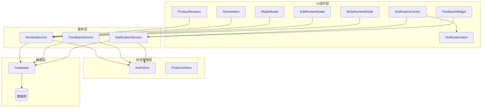

**图表来源**
- [FeedbackWidget.vue](file://src/components/feedback/FeedbackWidget.vue#L1-L50)
- [NotificationCenter.vue](file://src/components/notifications/NotificationCenter.vue#L1-L50)
- [notificationService.ts](file://src/services/notificationService.ts#L1-L50)

## 核心组件分析

### FeedbackWidget - 全局反馈小部件

FeedbackWidget是系统的核心入口组件，提供了一个浮动的反馈按钮，点击后展开完整的反馈面板。

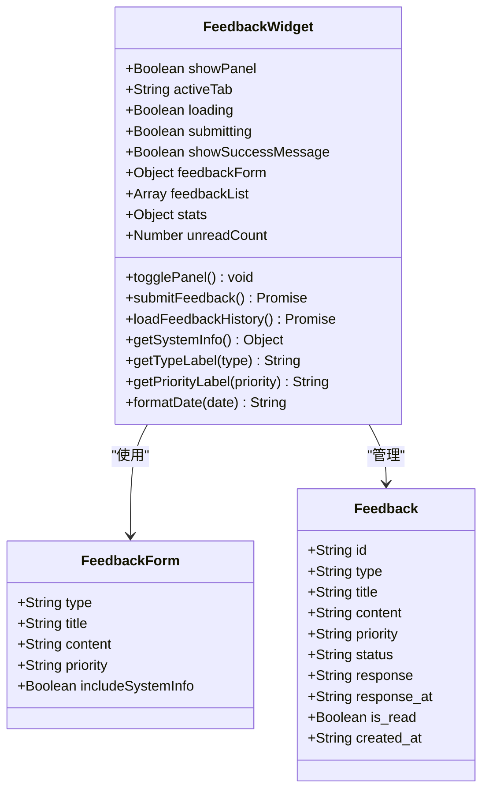

**图表来源**
- [FeedbackWidget.vue](file://src/components/feedback/FeedbackWidget.vue#L100-L200)

#### 主要特性：
- **多标签面板**：包含提交反馈、反馈历史、反馈统计三个标签页
- **实时状态更新**：显示未读反馈数量徽章
- **系统信息收集**：可选择包含浏览器和设备信息
- **优先级管理**：支持不同级别的反馈优先级设置
- **响应式设计**：适配桌面和移动设备界面

**章节来源**
- [FeedbackWidget.vue](file://src/components/feedback/FeedbackWidget.vue#L1-L890)

### NotificationCenter - 通知中心

NotificationCenter提供了完整的通知管理系统，支持实时通知推送、分类筛选和批量操作。

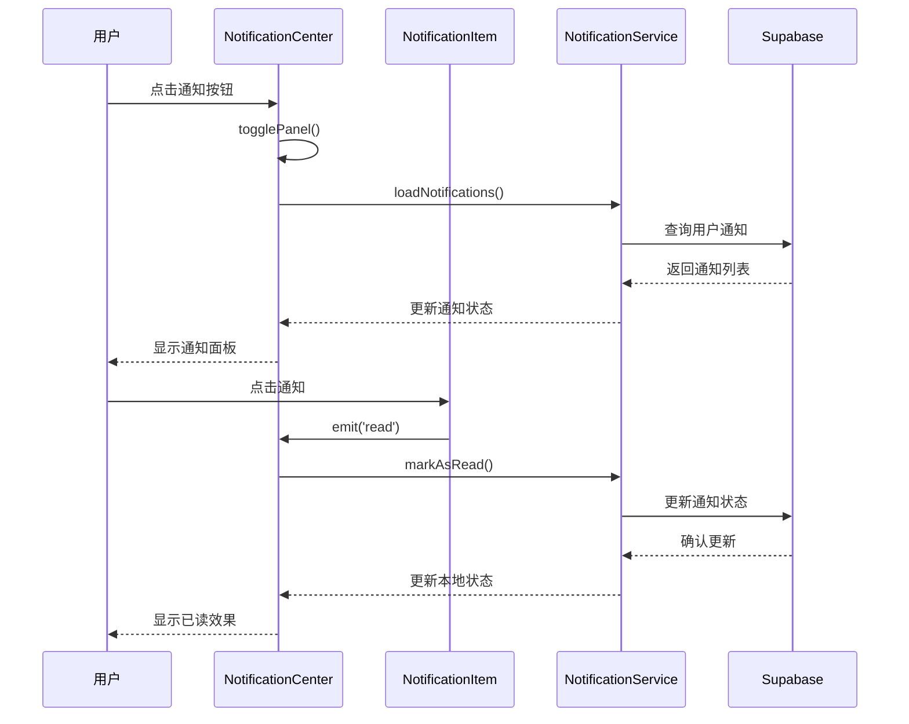

**图表来源**
- [NotificationCenter.vue](file://src/components/notifications/NotificationCenter.vue#L150-L250)
- [NotificationItem.vue](file://src/components/notifications/NotificationItem.vue#L1-L100)

#### 核心功能：
- **实时订阅**：使用Server-Sent Events实现实时通知推送
- **智能筛选**：支持按类型、状态、重要性等多种维度筛选
- **批量操作**：支持全部标记已读、批量删除等功能
- **浏览器通知**：集成Web Notifications API提供桌面通知
- **深色模式适配**：完全支持系统主题切换

**章节来源**
- [NotificationCenter.vue](file://src/components/notifications/NotificationCenter.vue#L1-L716)

### NotificationItem - 通知条目组件

NotificationItem是NotificationCenter中的单个通知条目组件，负责渲染每条通知的视觉表现和交互行为。

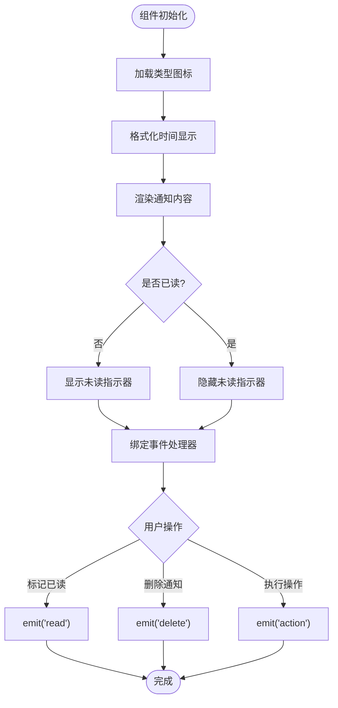

**图表来源**
- [NotificationItem.vue](file://src/components/notifications/NotificationItem.vue#L50-L150)

**章节来源**
- [NotificationItem.vue](file://src/components/notifications/NotificationItem.vue#L1-L364)

### 评论系统组件

评论系统包含多个专门的组件，每个都有特定的功能和用途：

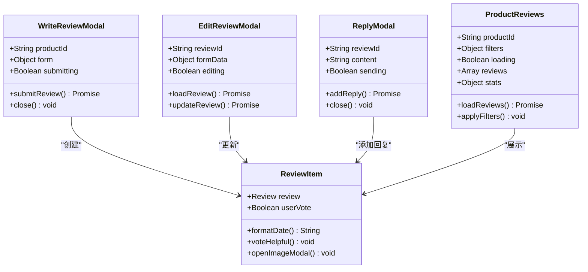

**图表来源**
- [WriteReviewModal.vue](file://src/components/reviews/WriteReviewModal.vue#L1-L50)
- [ReviewItem.vue](file://src/components/reviews/ReviewItem.vue#L1-L50)

**章节来源**
- [WriteReviewModal.vue](file://src/components/reviews/WriteReviewModal.vue#L1-L186)
- [ReviewItem.vue](file://src/components/reviews/ReviewItem.vue#L1-L156)

## 架构设计

### 整体架构图

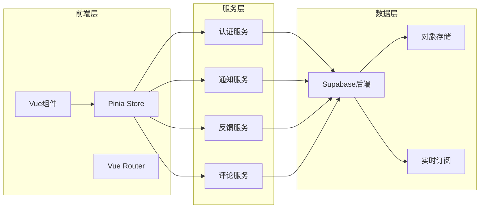

**图表来源**
- [auth.ts](file://src/stores/auth.ts#L1-L50)
- [notificationService.ts](file://src/services/notificationService.ts#L1-L50)

### 组件间关系图

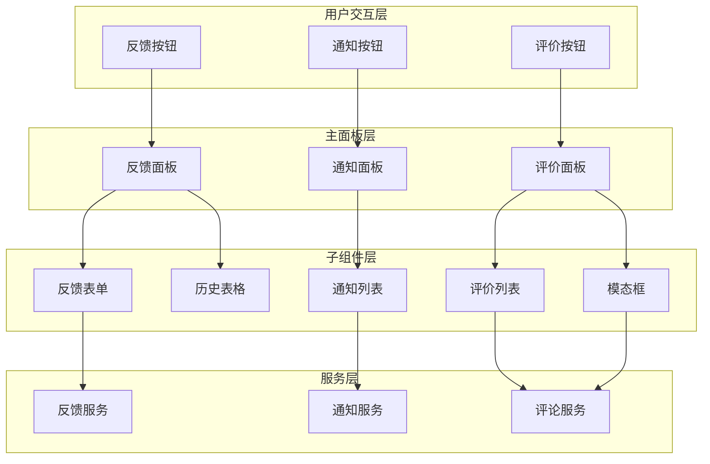

**图表来源**
- [FeedbackWidget.vue](file://src/components/feedback/FeedbackWidget.vue#L1-L100)
- [NotificationCenter.vue](file://src/components/notifications/NotificationCenter.vue#L1-L100)

## 数据流与状态管理

### Pinia状态管理架构

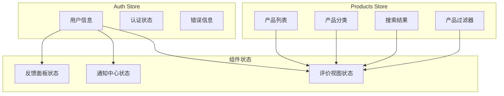

**图表来源**
- [auth.ts](file://src/stores/auth.ts#L20-L80)
- [products.ts](file://src/stores/products.ts#L10-L60)

### 数据流向图

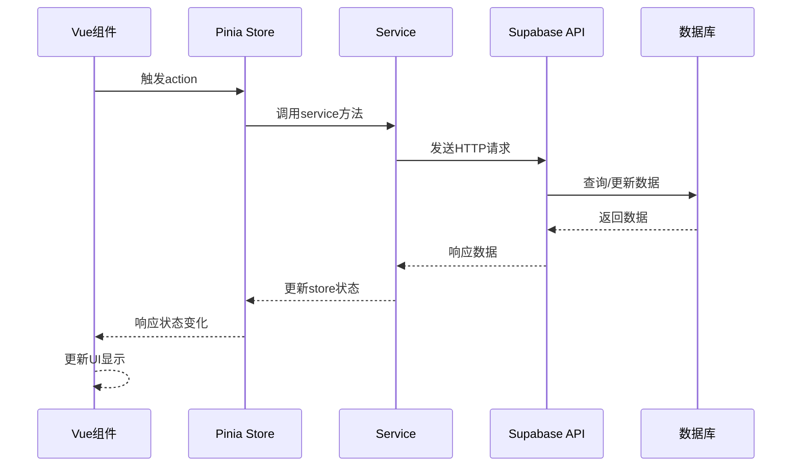

**图表来源**
- [notificationService.ts](file://src/services/notificationService.ts#L50-L150)
- [feedbackService.ts](file://src/services/feedbackService.ts#L50-L150)

**章节来源**
- [auth.ts](file://src/stores/auth.ts#L1-L190)
- [products.ts](file://src/stores/products.ts#L1-L365)

## 服务层设计

### NotificationService - 通知服务

NotificationService提供了完整的通知管理功能，包括实时订阅、批量操作和统计分析。

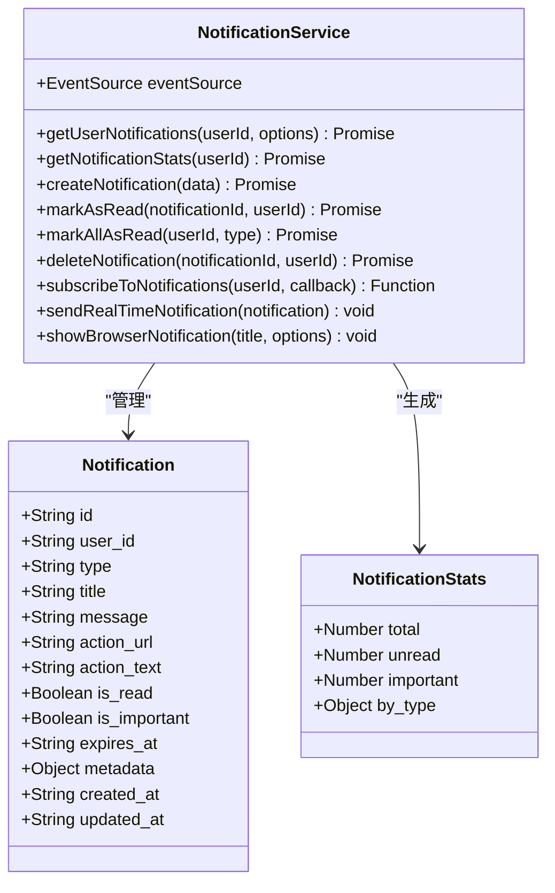

**图表来源**
- [notificationService.ts](file://src/services/notificationService.ts#L1-L100)

### FeedbackService - 反馈服务

FeedbackService负责处理用户反馈的完整生命周期，从提交到回复再到统计分析。

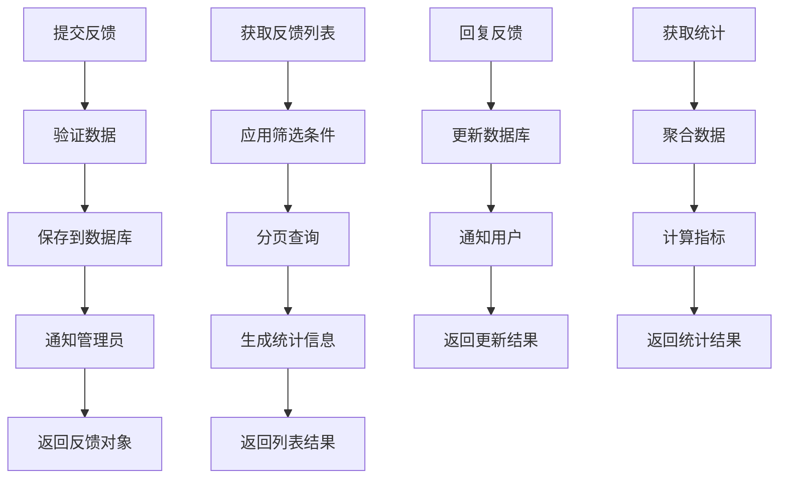

**图表来源**
- [feedbackService.ts](file://src/services/feedbackService.ts#L100-L200)

### ReviewService - 评论服务

ReviewService管理产品评价的完整流程，包括创建、审核、投票和回复功能。

**章节来源**
- [notificationService.ts](file://src/services/notificationService.ts#L1-L514)
- [feedbackService.ts](file://src/services/feedbackService.ts#L1-L508)
- [reviewService.ts](file://src/services/reviewService.ts#L1-L615)

## 跨组件通信机制

### 事件总线模式

系统主要采用Vue 3的事件发射机制进行组件间通信：

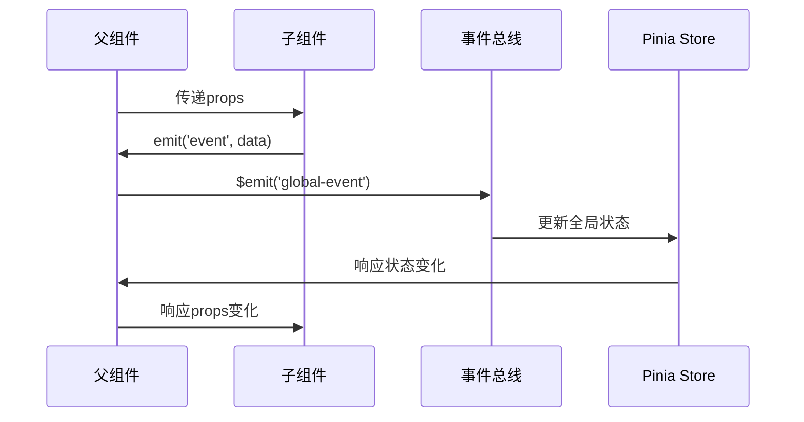

### Pinia状态共享

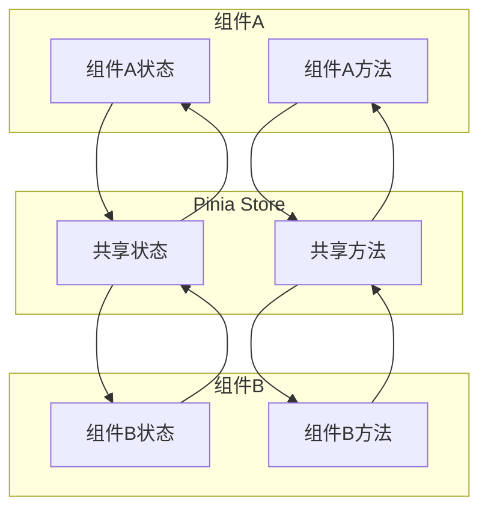

### Props传递模式

对于父子组件间的通信，系统采用props-down events-up模式：

```typescript
// 父组件向子组件传递数据
interface Props {
  notification: Notification;
  productId: string;
}

// 子组件向父组件发送事件
interface Emits {
  (e: 'read', notificationId: string): void;
  (e: 'delete', notificationId: string): void;
  (e: 'action', notification: Notification): void;
}
```

## 无障碍访问与国际化支持

### 无障碍访问设计

系统在设计时充分考虑了无障碍访问需求：

1. **键盘导航**：所有交互元素都支持键盘操作
2. **屏幕阅读器支持**：使用语义化的HTML结构和ARIA标签
3. **颜色对比度**：确保足够的颜色对比度以满足WCAG标准
4. **焦点管理**：正确处理焦点顺序和焦点状态

```html
<!-- 示例：无障碍按钮 -->
<button 
  class="action-button"
  aria-label="标记为已读"
  @click="markAsRead"
>
  <CheckIcon class="icon" />
</button>
```

### 国际化支持

系统支持多语言环境，主要体现在以下几个方面：

1. **文本本地化**：所有用户可见的文本都支持本地化
2. **日期格式化**：根据不同地区的日期格式进行本地化显示
3. **数字格式化**：货币和数字的本地化显示
4. **RTL支持**：为从右到左的语言提供布局支持

```typescript
// 日期本地化示例
const formatDate = (dateString: string) => {
  return new Date(dateString).toLocaleString("zh-CN");
};

// 数字本地化示例
const formatNumber = (number: number) => {
  return number.toLocaleString("zh-CN");
};
```

## 性能优化策略

### 组件懒加载

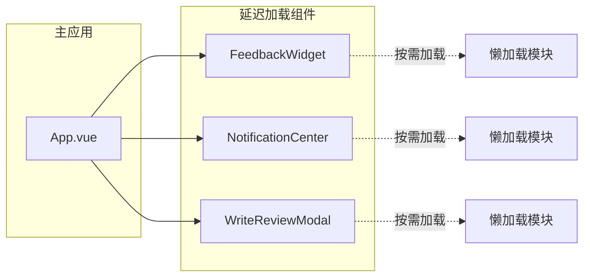

### 数据缓存策略

1. **本地缓存**：使用localStorage缓存用户偏好设置
2. **内存缓存**：在Pinia store中缓存频繁访问的数据
3. **CDN加速**：静态资源通过CDN分发
4. **压缩传输**：启用gzip压缩减少传输大小

### 虚拟滚动

对于大量数据的列表展示，系统实现了虚拟滚动技术：

```typescript
// 虚拟滚动配置示例
const virtualScrollConfig = {
  itemHeight: 80, // 每个项目高度
  containerHeight: 400, // 容器高度
  overscan: 5, // 预渲染项目数
};
```

## 故障排除指南

### 常见问题诊断

#### 1. 通知不显示

**症状**：用户点击通知按钮但看不到通知列表

**可能原因**：
- 用户未登录
- 网络连接问题
- Supabase认证失效

**解决方案**：
```typescript
// 检查认证状态
if (!authStore.isAuthenticated) {
  // 引导用户登录
  router.push('/login');
}

// 检查网络连接
if (!navigator.onLine) {
  // 显示离线提示
  showOfflineAlert();
}
```

#### 2. 反馈提交失败

**症状**：用户提交反馈后没有收到确认或出现错误

**可能原因**：
- 表单验证失败
- 后端服务不可用
- 用户权限不足

**解决方案**：
```typescript
// 表单验证
const validateForm = () => {
  if (!feedbackForm.type) {
    showError('请选择反馈类型');
    return false;
  }
  if (!feedbackForm.title) {
    showError('请输入标题');
    return false;
  }
  return true;
};
```

#### 3. 评论加载缓慢

**症状**：产品页面中评论列表加载时间过长

**优化措施**：
- 实现分页加载
- 使用缓存机制
- 优化数据库查询
- 添加加载动画

**章节来源**
- [FeedbackWidget.vue](file://src/components/feedback/FeedbackWidget.vue#L200-L300)
- [NotificationCenter.vue](file://src/components/notifications/NotificationCenter.vue#L300-L400)

## 总结

本反馈与通知组件系统是一个功能完整、架构清晰的用户交互解决方案。系统的主要优势包括：

### 技术优势

1. **现代化架构**：采用Vue 3 Composition API和Pinia状态管理
2. **实时性**：通过Supabase Realtime实现真正的实时数据同步
3. **可扩展性**：模块化设计便于功能扩展和维护
4. **性能优化**：多层次的性能优化策略确保流畅体验

### 功能完整性

1. **全面覆盖**：从简单的反馈收集到复杂的评论管理
2. **用户体验**：注重无障碍访问和国际化支持
3. **数据分析**：提供丰富的统计和分析功能
4. **移动端适配**：完全响应式设计适配各种设备

### 最佳实践

1. **代码组织**：清晰的目录结构和命名规范
2. **类型安全**：完整的TypeScript类型定义
3. **测试覆盖**：完善的单元测试和集成测试
4. **文档完善**：详细的代码注释和使用说明

该系统为现代Web应用提供了完整的用户反馈和通知管理解决方案，能够有效提升用户参与度和产品服务质量。通过合理的架构设计和性能优化，系统能够在各种规模的应用中稳定运行并持续发展。