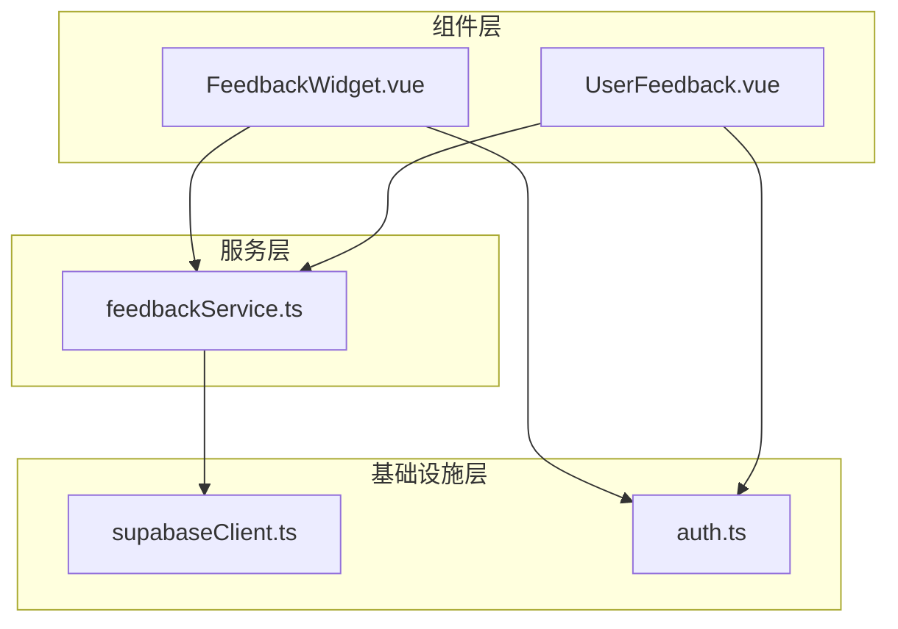
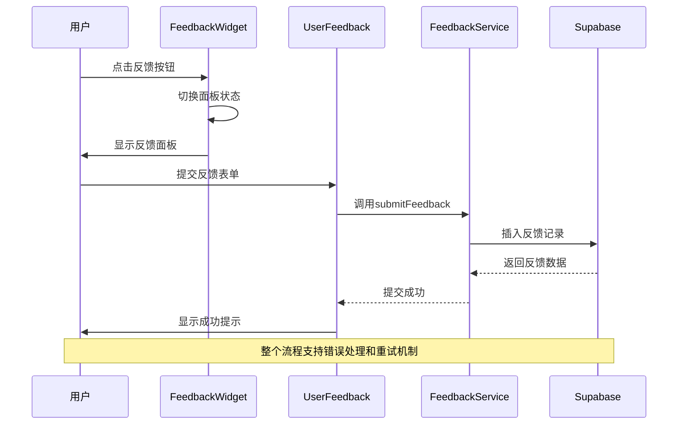
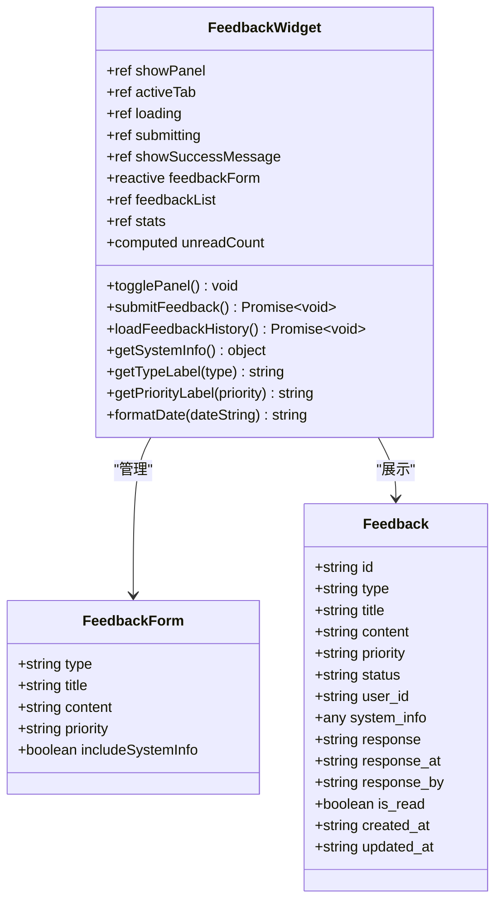
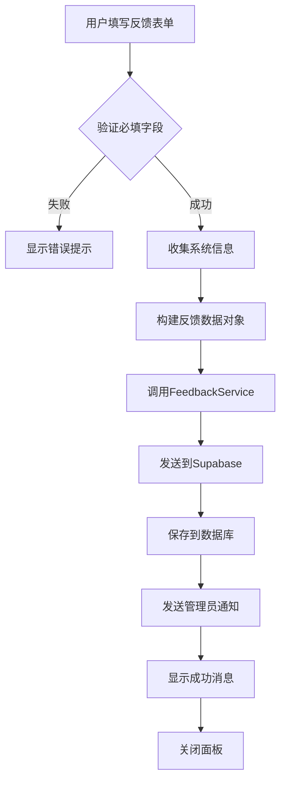
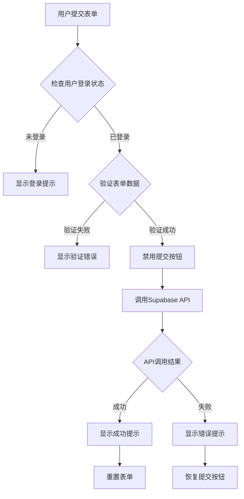
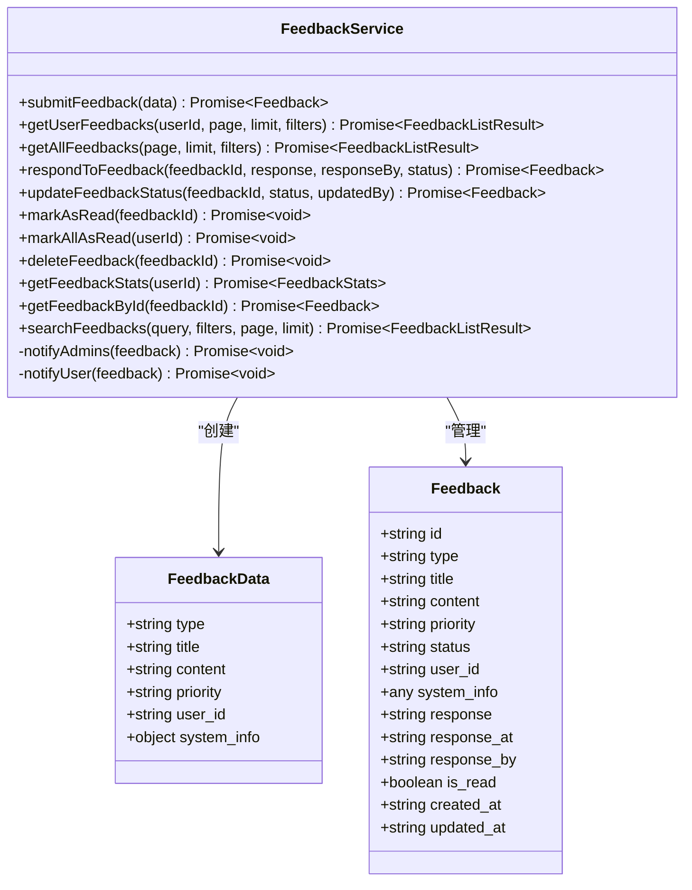
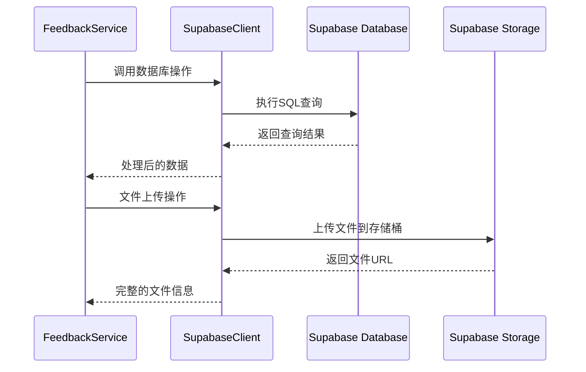
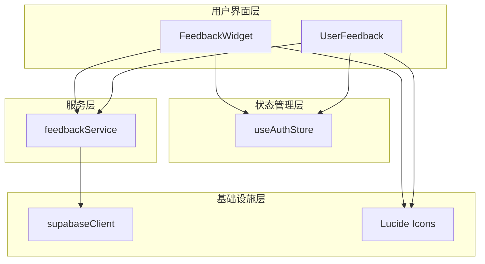

# 用户反馈组件

<cite>
**本文档引用的文件**
- [FeedbackWidget.vue](file://src/components/feedback/FeedbackWidget.vue)
- [UserFeedback.vue](file://src/components/UserFeedback.vue)
- [feedbackService.ts](file://src/services/feedbackService.ts)
- [supabaseClient.ts](file://src/lib/supabaseClient.ts)
- [auth.ts](file://src/stores/auth.ts)
</cite>

## 目录
1. [简介](#简介)
2. [项目结构](#项目结构)
3. [核心组件](#核心组件)
4. [架构概览](#架构概览)
5. [详细组件分析](#详细组件分析)
6. [服务层分析](#服务层分析)
7. [依赖关系分析](#依赖关系分析)
8. [性能考虑](#性能考虑)
9. [故障排除指南](#故障排除指南)
10. [结论](#结论)

## 简介

用户反馈功能是现代Web应用的重要组成部分，它为用户提供了一个便捷的渠道来报告问题、提出建议和分享意见。本文档全面分析了Advanced Tools Navigation项目中的用户反馈系统，重点介绍了两个核心组件：FeedbackWidget（悬浮式反馈按钮/面板）和UserFeedback（内嵌反馈表单），以及它们与后端服务的交互机制。

该系统采用了现代化的Vue 3 Composition API设计，结合TypeScript提供了强类型支持，确保了代码的可维护性和可靠性。系统支持多种反馈类型、优先级设置、自动设备信息收集，并集成了Supabase作为后端存储解决方案。

## 项目结构

用户反馈功能的文件组织遵循清晰的模块化原则：



**图表来源**
- [FeedbackWidget.vue](file://src/components/feedback/FeedbackWidget.vue#L1-L890)
- [UserFeedback.vue](file://src/components/UserFeedback.vue#L1-L350)
- [feedbackService.ts](file://src/services/feedbackService.ts#L1-L508)

**章节来源**
- [FeedbackWidget.vue](file://src/components/feedback/FeedbackWidget.vue#L1-L50)
- [UserFeedback.vue](file://src/components/UserFeedback.vue#L1-L50)

## 核心组件

### FeedbackWidget - 悬浮式反馈面板

FeedbackWidget是一个高度交互的悬浮按钮组件，提供了一种优雅的方式来访问完整的反馈系统。它采用卡片式设计，具有以下核心特性：

- **触发机制**：通过点击按钮显示/隐藏面板，支持键盘快捷键
- **动画效果**：平滑的展开/收缩动画，提升用户体验
- **标签页导航**：包含提交反馈、反馈历史和统计信息三个标签页
- **状态联动**：与全局认证状态保持同步，避免与其他模态框冲突

### UserFeedback - 内嵌反馈表单

UserFeedback组件提供了一个简洁的模态框形式的反馈入口，适合在特定页面场景下使用：

- **模态框设计**：居中显示的对话框，遮罩层防止背景交互
- **表单验证**：完整的前端验证机制，确保数据完整性
- **成功提示**：提交成功后的Toast通知，提供即时反馈
- **响应式设计**：适配移动端和桌面端的不同屏幕尺寸

**章节来源**
- [FeedbackWidget.vue](file://src/components/feedback/FeedbackWidget.vue#L1-L100)
- [UserFeedback.vue](file://src/components/UserFeedback.vue#L1-L100)

## 架构概览

用户反馈系统的整体架构采用了分层设计模式，确保了各组件间的松耦合和高内聚：



**图表来源**
- [FeedbackWidget.vue](file://src/components/feedback/FeedbackWidget.vue#L298-L351)
- [UserFeedback.vue](file://src/components/UserFeedback.vue#L80-L120)
- [feedbackService.ts](file://src/services/feedbackService.ts#L65-L107)

## 详细组件分析

### FeedbackWidget组件深度分析

#### 组件结构与状态管理



**图表来源**
- [FeedbackWidget.vue](file://src/components/feedback/FeedbackWidget.vue#L221-L296)
- [FeedbackWidget.vue](file://src/components/feedback/FeedbackWidget.vue#L298-L351)

#### 触发机制与动画效果

FeedbackWidget的触发机制采用了状态驱动的设计模式：

1. **初始状态**：显示为悬浮按钮，不显示反馈面板
2. **点击事件**：切换`showPanel`状态，触发动画效果
3. **动画展开**：使用CSS过渡效果实现平滑的展开/收缩
4. **状态同步**：当面板打开且当前标签为"历史"时，自动加载反馈数据

#### 数据收集流程



**图表来源**
- [FeedbackWidget.vue](file://src/components/feedback/FeedbackWidget.vue#L298-L351)
- [feedbackService.ts](file://src/services/feedbackService.ts#L65-L107)

#### 设备信息自动采集

系统实现了智能的设备信息收集机制：

```typescript
const getSystemInfo = () => {
  return {
    userAgent: navigator.userAgent,
    platform: navigator.platform,
    language: navigator.language,
    screenResolution: `${screen.width}x${screen.height}`,
    timestamp: new Date().toISOString(),
  };
};
```

这些信息帮助开发团队更好地理解用户环境，定位潜在的问题。

**章节来源**
- [FeedbackWidget.vue](file://src/components/feedback/FeedbackWidget.vue#L298-L351)
- [FeedbackWidget.vue](file://src/components/feedback/FeedbackWidget.vue#L352-L370)

### UserFeedback组件深度分析

#### 模态框设计与交互

UserFeedback采用了经典的模态框设计模式，具有以下特点：

- **遮罩层设计**：半透明背景遮罩，突出模态框内容
- **点击外部关闭**：点击遮罩层可关闭模态框
- **ESC键支持**：按下ESC键可快速关闭
- **焦点管理**：自动聚焦到第一个输入框

#### 表单验证与错误处理



**图表来源**
- [UserFeedback.vue](file://src/components/UserFeedback.vue#L80-L120)

#### 成功提示机制

系统实现了优雅的成功提示机制：

1. **Toast通知**：绿色背景的成功提示框
2. **动画效果**：从右向左滑入的动画
3. **自动消失**：3秒后自动隐藏
4. **视觉反馈**：图标+文字的组合形式

**章节来源**
- [UserFeedback.vue](file://src/components/UserFeedback.vue#L1-L100)
- [UserFeedback.vue](file://src/components/UserFeedback.vue#L80-L120)

## 服务层分析

### FeedbackService核心功能

FeedbackService是整个反馈系统的核心服务层，提供了完整的CRUD操作和业务逻辑：



**图表来源**
- [feedbackService.ts](file://src/services/feedbackService.ts#L65-L107)
- [feedbackService.ts](file://src/services/feedbackService.ts#L1-L63)

#### 错误重试机制

服务层实现了完善的错误处理和重试机制：

1. **异常捕获**：每个异步操作都包含try-catch块
2. **错误分类**：区分网络错误、权限错误、数据错误等
3. **用户友好**：向用户显示友好的错误消息
4. **日志记录**：详细的错误日志便于调试

#### 与Supabase的集成



**图表来源**
- [feedbackService.ts](file://src/services/feedbackService.ts#L65-L107)
- [supabaseClient.ts](file://src/lib/supabaseClient.ts#L1-L50)

**章节来源**
- [feedbackService.ts](file://src/services/feedbackService.ts#L65-L107)
- [feedbackService.ts](file://src/services/feedbackService.ts#L215-L276)

## 依赖关系分析

### 组件间依赖关系



**图表来源**
- [FeedbackWidget.vue](file://src/components/feedback/FeedbackWidget.vue#L1-L50)
- [UserFeedback.vue](file://src/components/UserFeedback.vue#L1-L50)
- [feedbackService.ts](file://src/services/feedbackService.ts#L1-L10)

### 外部依赖分析

系统的主要外部依赖包括：

1. **Vue 3 Composition API**：提供响应式状态管理和生命周期钩子
2. **Pinia**：状态管理库，用于管理认证状态
3. **Supabase**：后端即服务解决方案，提供数据库和存储服务
4. **Lucide Vue Next**：图标库，提供现代化的SVG图标
5. **TypeScript**：静态类型检查，提高代码质量

**章节来源**
- [FeedbackWidget.vue](file://src/components/feedback/FeedbackWidget.vue#L1-L50)
- [UserFeedback.vue](file://src/components/UserFeedback.vue#L1-L50)
- [feedbackService.ts](file://src/services/feedbackService.ts#L1-L10)

## 性能考虑

### 前端性能优化

1. **懒加载**：组件按需加载，减少初始包大小
2. **虚拟滚动**：对于大量反馈记录，使用虚拟滚动技术
3. **缓存策略**：合理使用浏览器缓存和内存缓存
4. **防抖节流**：对频繁触发的操作进行防抖处理

### 后端性能优化

1. **索引优化**：在关键字段上建立数据库索引
2. **查询优化**：使用高效的SQL查询语句
3. **连接池**：合理配置数据库连接池
4. **CDN加速**：静态资源使用CDN分发

## 故障排除指南

### 常见问题与解决方案

#### 反馈提交失败

**症状**：用户提交反馈后收到错误提示

**可能原因**：
1. 网络连接问题
2. 用户未登录
3. 数据库连接失败
4. 字段验证失败

**解决方案**：
1. 检查网络连接状态
2. 确认用户已登录
3. 查看服务器日志
4. 验证表单数据格式

#### 图标显示异常

**症状**：反馈按钮或模态框中的图标不显示

**可能原因**：
1. Lucide图标库未正确安装
2. CSS样式冲突
3. 图标路径错误

**解决方案**：
1. 重新安装依赖包
2. 检查CSS样式优先级
3. 验证图标导入路径

**章节来源**
- [FeedbackWidget.vue](file://src/components/feedback/FeedbackWidget.vue#L298-L351)
- [UserFeedback.vue](file://src/components/UserFeedback.vue#L80-L120)

## 结论

Advanced Tools Navigation项目的用户反馈系统展现了现代Web应用开发的最佳实践。通过精心设计的组件架构、完善的服务层和可靠的后端集成，系统为用户提供了流畅、直观的反馈体验。

### 主要优势

1. **模块化设计**：清晰的组件分离和职责划分
2. **类型安全**：完整的TypeScript支持
3. **用户体验**：优雅的动画效果和即时反馈
4. **可扩展性**：良好的架构设计便于功能扩展
5. **可靠性**：完善的错误处理和重试机制

### 改进建议

1. **国际化支持**：添加多语言支持
2. **截图功能**：集成网页截图功能
3. **AI辅助**：引入AI助手提供智能建议
4. **数据分析**：增强反馈数据分析能力
5. **移动端优化**：进一步优化移动端体验

该反馈系统不仅满足了当前的功能需求，还为未来的功能扩展奠定了坚实的基础。通过持续的优化和改进，它将成为提升产品质量和用户满意度的重要工具。