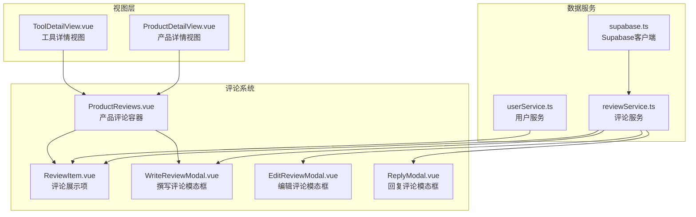
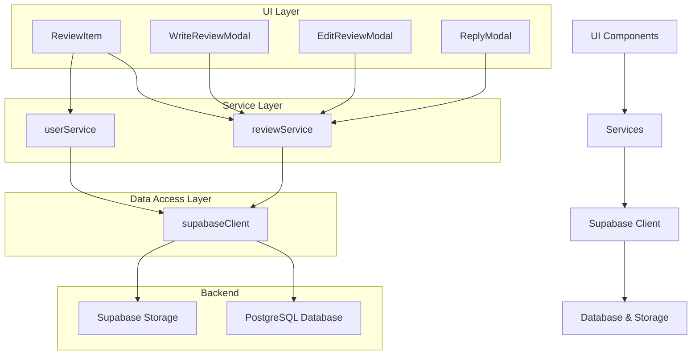
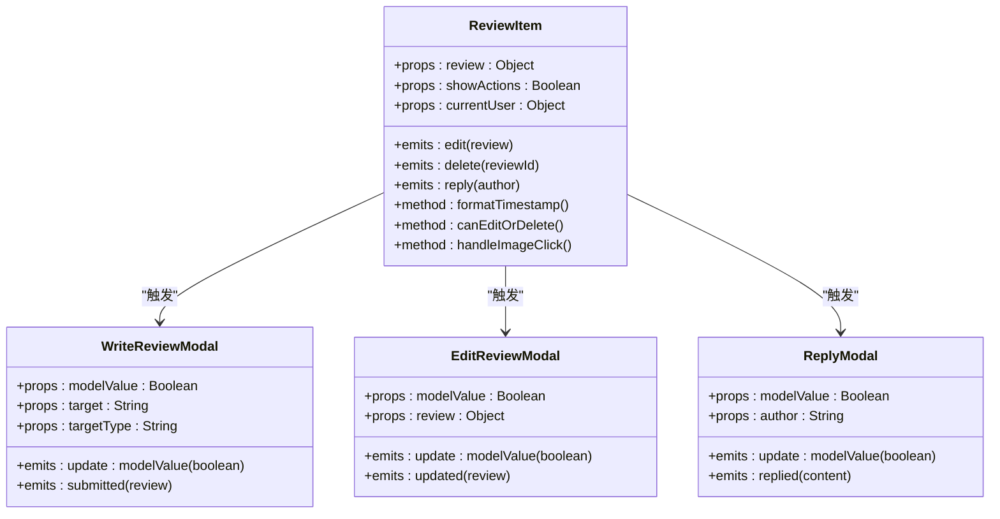
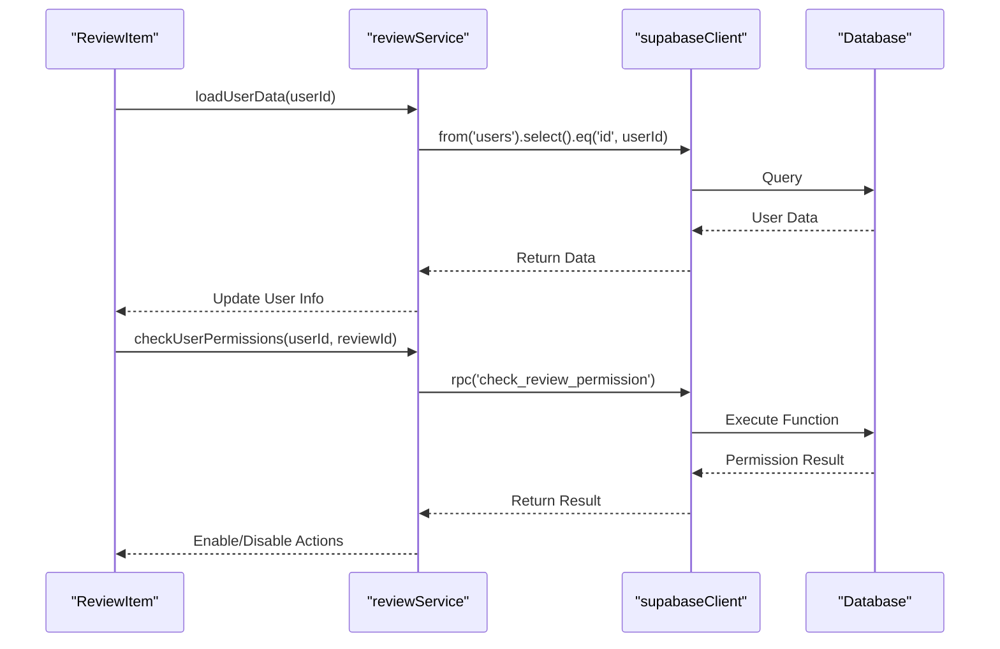
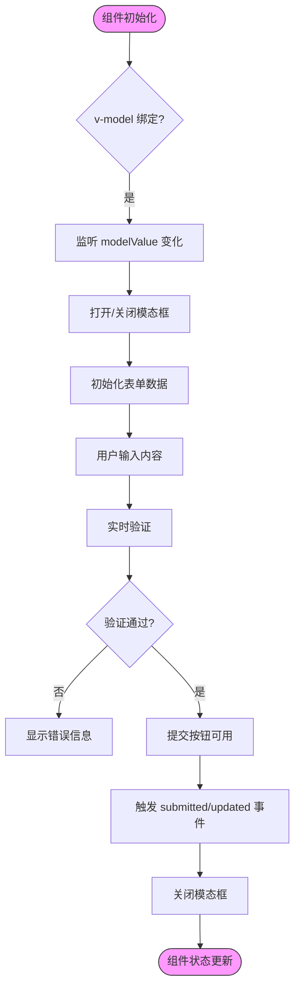
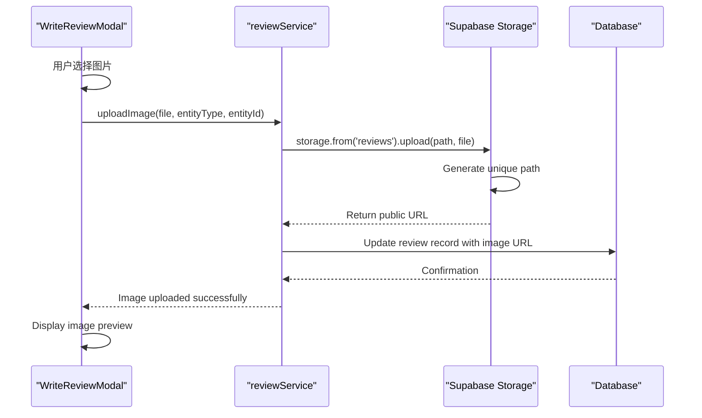

# 评论系统组件

<cite>
**本文档中引用的文件**
- [ReviewItem.vue](file://src/components/reviews/ReviewItem.vue)
- [WriteReviewModal.vue](file://src/components/reviews/WriteReviewModal.vue)
- [EditReviewModal.vue](file://src/components/reviews/EditReviewModal.vue)
- [ReplyModal.vue](file://src/components/reviews/ReplyModal.vue)
- [ProductDetailView.vue](file://src/views/ProductDetailView.vue)
- [ToolDetailView.vue](file://src/views/ToolDetailView.vue)
- [reviewService.ts](file://src/services/reviewService.ts)
- [userService.ts](file://src/services/userService.ts)
- [supabase.ts](file://src/lib/supabase.ts)
- [validation.ts](file://src/utils/validation.ts)
</cite>

## 目录
1. [简介](#简介)
2. [项目结构](#项目结构)
3. [核心组件](#核心组件)
4. [架构概述](#架构概述)
5. [详细组件分析](#详细组件分析)
6. [依赖分析](#依赖分析)
7. [性能考虑](#性能考虑)
8. [故障排除指南](#故障排除指南)
9. [结论](#结论)

## 简介
本文档详细说明了评论系统的各个UI组件实现，包括ReviewItem（评论展示项）、WriteReviewModal（撰写评论模态框）、EditReviewModal（编辑评论模态框）和ReplyModal（回复评论模态框）。文档解释了各组件的props输入、事件输出、与Pinia store的数据交互机制，以及通过v-model或emits实现的双向绑定逻辑。同时提供了实际使用示例，展示如何在ProductDetailView或ToolDetailView中集成评论功能，并说明表单验证、富文本支持、图片上传（结合Supabase Storage）等高级特性。

## 项目结构
评论系统组件位于`src/components/reviews`目录下，与其他UI组件分离，形成了独立的模块化结构。该设计使得评论功能可以轻松地在不同视图中复用。



**Diagram sources**
- [ReviewItem.vue](file://src/components/reviews/ReviewItem.vue)
- [WriteReviewModal.vue](file://src/components/reviews/WriteReviewModal.vue)
- [EditReviewModal.vue](file://src/components/reviews/EditReviewModal.vue)
- [ReplyModal.vue](file://src/components/reviews/ReplyModal.vue)
- [ProductReviews.vue](file://src/components/reviews/ProductReviews.vue)

**Section sources**
- [src/components/reviews](file://src/components/reviews)

## 核心组件
评论系统由四个核心UI组件构成：ReviewItem用于展示单条评论内容，WriteReviewModal提供新评论的撰写界面，EditReviewModal允许用户修改已有评论，ReplyModal则专门处理对评论的回复功能。这些组件通过统一的设计语言和交互模式确保用户体验的一致性。

**Section sources**
- [ReviewItem.vue](file://src/components/reviews/ReviewItem.vue#L1-L100)
- [WriteReviewModal.vue](file://src/components/reviews/WriteReviewModal.vue#L1-L100)
- [EditReviewModal.vue](file://src/components/reviews/EditReviewModal.vue#L1-L100)
- [ReplyModal.vue](file://src/components/reviews/ReplyModal.vue#L1-L100)

## 架构概述
评论系统采用分层架构设计，UI组件层负责用户界面展示和交互，服务层处理业务逻辑和数据操作，数据访问层通过Supabase与后端数据库通信。这种分层设计实现了关注点分离，提高了代码的可维护性和可测试性。



**Diagram sources**
- [reviewService.ts](file://src/services/reviewService.ts#L1-L50)
- [userService.ts](file://src/services/userService.ts#L1-L50)
- [supabase.ts](file://src/lib/supabase.ts#L1-L30)

## 详细组件分析
### ReviewItem 分析
ReviewItem组件负责渲染单条评论的所有信息，包括用户头像、用户名、评分、评论内容、时间戳以及可能的图片附件。该组件接收评论数据作为props输入，并通过事件总线与其他组件通信。

#### 组件属性与事件


**Diagram sources**
- [ReviewItem.vue](file://src/components/reviews/ReviewItem.vue#L15-L80)
- [WriteReviewModal.vue](file://src/components/reviews/WriteReviewModal.vue#L10-L60)
- [EditReviewModal.vue](file://src/components/reviews/EditReviewModal.vue#L10-L60)
- [ReplyModal.vue](file://src/components/reviews/ReplyModal.vue#L10-L60)

#### 数据交互流程


**Diagram sources**
- [ReviewItem.vue](file://src/components/reviews/ReviewItem.vue#L81-L150)
- [reviewService.ts](file://src/services/reviewService.ts#L51-L100)

### 撰写与编辑评论模态框分析
WriteReviewModal和EditReviewModal组件共享相似的结构和功能，体现了组件复用的设计原则。两者都实现了富文本编辑、图片上传和表单验证等高级特性。

#### 双向绑定机制


**Diagram sources**
- [WriteReviewModal.vue](file://src/components/reviews/WriteReviewModal.vue#L61-L150)
- [EditReviewModal.vue](file://src/components/reviews/EditReviewModal.vue#L61-L150)
- [validation.ts](file://src/utils/validation.ts#L1-L40)

#### 图片上传流程


**Diagram sources**
- [WriteReviewModal.vue](file://src/components/reviews/WriteReviewModal.vue#L151-L200)
- [reviewService.ts](file://src/services/reviewService.ts#L101-L150)
- [supabase.ts](file://src/lib/supabase.ts#L31-L60)

### 回复评论模态框分析
ReplyModal组件专为回复评论设计，具有简化的内容输入界面，同时保持与主评论一致的样式和功能特性。

#### 回复功能流程
```mermaid
flowchart LR
A[点击回复按钮] --> B{创建新回复还是<br/>引用现有评论?}
B --> |新回复| C[打开ReplyModal]
B --> |引用评论| D[预填充@用户名]
C --> E[输入回复内容]
D --> E
E --> F[检查提及用户]
F --> G[发送通知]
G --> H[提交回复]
H --> I[更新评论树]
I --> J[刷新界面]
```

**Diagram sources**
- [ReplyModal.vue](file://src/components/reviews/ReplyModal.vue#L61-L120)
- [reviewService.ts](file://src/services/reviewService.ts#L151-L180)

**Section sources**
- [WriteReviewModal.vue](file://src/components/reviews/WriteReviewModal.vue#L1-L200)
- [EditReviewModal.vue](file://src/components/reviews/EditReviewModal.vue#L1-L200)
- [ReplyModal.vue](file://src/components/reviews/ReplyModal.vue#L1-L150)

## 依赖分析
评论系统组件之间存在清晰的依赖关系，基础组件如ReviewItem被更复杂的容器组件ProductReviews所使用，而各种模态框组件则作为独立的功能单元被多个视图调用。

```mermaid
dependency-graph
direction LR
ProductDetailView --> ProductReviews
ToolDetailView --> ProductReviews
ProductReviews --> ReviewItem
ProductReviews --> WriteReviewModal
ReviewItem --> EditReviewModal
ReviewItem --> ReplyModal
WriteReviewModal --> supabaseClient
EditReviewModal --> supabaseClient
ReplyModal --> supabaseClient
reviewService --> supabaseClient
userService --> supabaseClient
```

**Diagram sources**
- [ProductDetailView.vue](file://src/views/ProductDetailView.vue#L1-L50)
- [ToolDetailView.vue](file://src/views/ToolDetailView.vue#L1-L50)
- [ProductReviews.vue](file://src/components/reviews/ProductReviews.vue#L1-L30)
- [reviewService.ts](file://src/services/reviewService.ts#L1-L20)
- [supabase.ts](file://src/lib/supabase.ts#L1-L10)

**Section sources**
- [ProductDetailView.vue](file://src/views/ProductDetailView.vue#L1-L100)
- [ToolDetailView.vue](file://src/views/ToolDetailView.vue#L1-L100)
- [ProductReviews.vue](file://src/components/reviews/ProductReviews.vue#L1-L50)

## 性能考虑
为了优化评论系统的性能，建议实施以下策略：

1. **懒加载**: 对于包含大量评论的页面，使用LazyComponent包装评论列表，仅在进入视口时加载。
2. **虚拟滚动**: 当评论数量超过一定