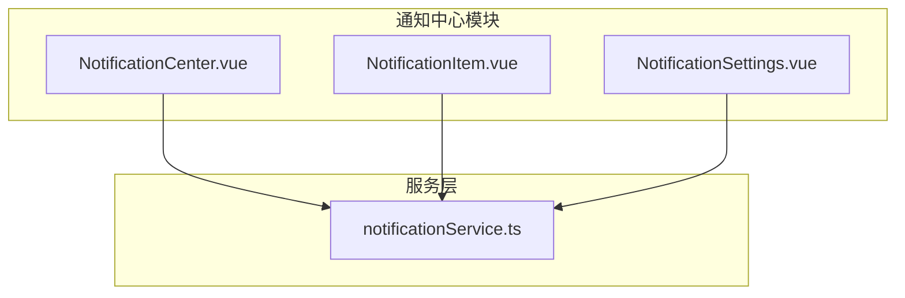
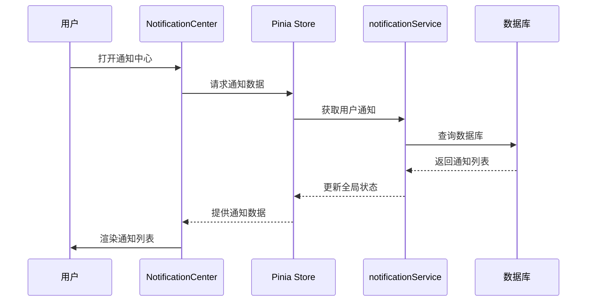
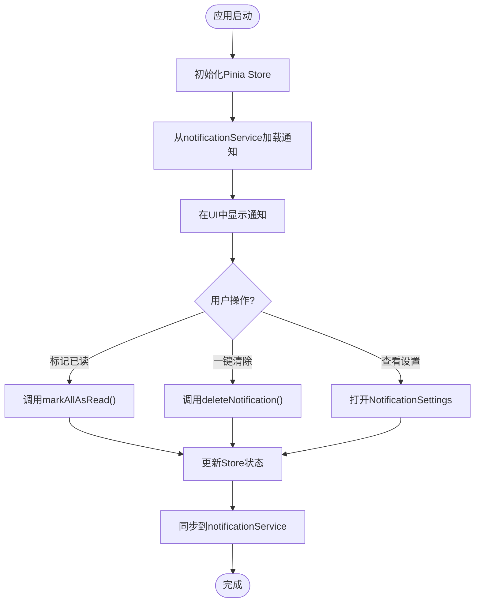
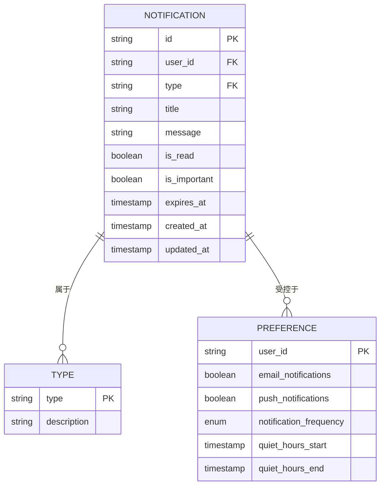
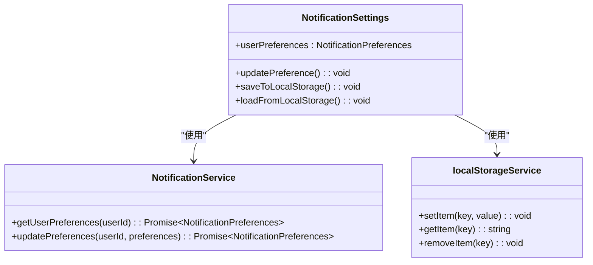
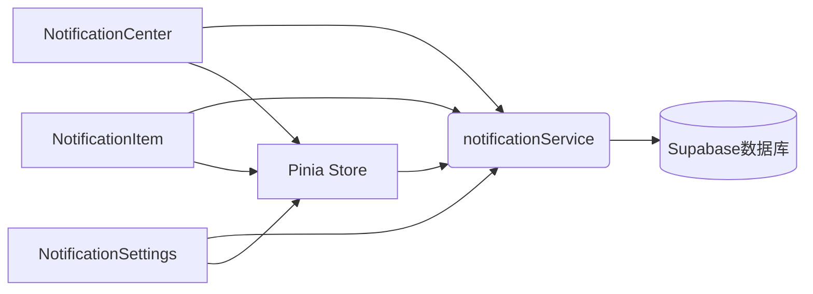

# 通知中心组件

<cite>
**本文档引用的文件**
- [NotificationCenter.vue](file://src/components/notifications/NotificationCenter.vue)
- [NotificationItem.vue](file://src/components/notifications/NotificationItem.vue)
- [NotificationSettings.vue](file://src/components/notifications/NotificationSettings.vue)
- [notificationService.ts](file://src/services/notificationService.ts)
</cite>

## 目录
1. [引言](#引言)
2. [项目结构](#项目结构)
3. [核心组件](#核心组件)
4. [架构概述](#架构概述)
5. [详细组件分析](#详细组件分析)
6. [依赖关系分析](#依赖关系分析)
7. [性能考虑](#性能考虑)
8. [故障排除指南](#故障排除指南)
9. [结论](#结论)

## 引言
本项目旨在构建一个功能完备的通知中心系统，为用户提供实时、个性化和可管理的消息服务。该系统由三个核心组件构成：NotificationCenter（主容器）、NotificationItem（单条通知展示）和NotificationSettings（通知偏好设置）。这些组件通过与后端的notificationService服务进行通信，实现消息的实时推送、未读状态管理、分类处理和过期清理等功能。

## 项目结构
通知中心系统的代码组织清晰，遵循了模块化的设计原则。所有相关组件都位于`src/components/notifications/`目录下，形成了一个独立的功能模块。这种结构不仅便于维护，也方便了新功能的扩展。

**Diagram sources**
- [NotificationCenter.vue](file://src/components/notifications/NotificationCenter.vue)
- [NotificationItem.vue](file://src/components/notifications/NotificationItem.vue)
- [NotificationSettings.vue](file://src/components/notifications/NotificationSettings.vue)
- [notificationService.ts](file://src/services/notificationService.ts)

**Section sources**
- [NotificationCenter.vue](file://src/components/notifications/NotificationCenter.vue)
- [NotificationItem.vue](file://src/components/notifications/NotificationItem.vue)
- [NotificationSettings.vue](file://src/components/notifications/NotificationSettings.vue)
- [notificationService.ts](file://src/services/notificationService.ts)

## 核心组件
通知中心的核心由三个Vue组件构成，它们协同工作以提供完整的用户体验。
- **NotificationCenter.vue**: 主容器组件，负责协调其他两个组件，是用户与通知系统交互的主要入口。
- **NotificationItem.vue**: 单条通知展示组件，负责渲染每一条通知的具体内容和样式。
- **NotificationSettings.vue**: 通知偏好设置组件，允许用户自定义接收通知的方式和类型。

**Section sources**
- [NotificationCenter.vue](file://src/components/notifications/NotificationCenter.vue)
- [NotificationItem.vue](file://src/components/notifications/NotificationItem.vue)
- [NotificationSettings.vue](file://src/components/notifications/NotificationSettings.vue)

## 架构概述
整个通知中心系统采用分层架构，前端组件通过Pinia store与后端的notificationService服务进行数据同步，实现了全局状态的统一管理。

**Diagram sources**
- [NotificationCenter.vue](file://src/components/notifications/NotificationCenter.vue)
- [notificationService.ts](file://src/services/notificationService.ts)

## 详细组件分析
### NotificationCenter 分析
NotificationCenter是通知中心的主容器，它集成了通知的显示、管理和设置功能。

#### 组件交互流程

**Diagram sources**
- [NotificationCenter.vue](file://src/components/notifications/NotificationCenter.vue)
- [notificationService.ts](file://src/services/notificationService.ts)

**Section sources**
- [NotificationCenter.vue](file://src/components/notifications/NotificationCenter.vue)

### NotificationItem 分析
NotificationItem组件负责单条通知的展示，支持多种消息类型和操作。

#### 消息分类与过期处理

**Diagram sources**
- [notificationService.ts](file://src/services/notificationService.ts)

**Section sources**
- [NotificationItem.vue](file://src/components/notifications/NotificationItem.vue)

### NotificationSettings 分析
NotificationSettings组件提供了用户个性化配置的界面，并将设置持久化存储。

#### 用户偏好设置持久化方案

**Diagram sources**
- [NotificationSettings.vue](file://src/components/notifications/NotificationSettings.vue)
- [notificationService.ts](file://src/services/notificationService.ts)

**Section sources**
- [NotificationSettings.vue](file://src/components/notifications/NotificationSettings.vue)

## 依赖关系分析
通知中心组件体系与notificationService服务之间存在紧密的依赖关系，确保了数据的一致性和实时性。

**Diagram sources**
- [notificationService.ts](file://src/services/notificationService.ts)

**Section sources**
- [NotificationCenter.vue](file://src/components/notifications/NotificationCenter.vue)
- [NotificationItem.vue](file://src/components/notifications/NotificationItem.vue)
- [NotificationSettings.vue](file://src/components/notifications/NotificationSettings.vue)
- [notificationService.ts](file://src/services/notificationService.ts)

## 性能考虑
- 使用WebSocket实现实时通信，减少轮询带来的服务器压力
- 通过Pinia store进行全局状态管理，避免重复请求
- 对通知列表进行分页加载，提升初始渲染速度
- 实现过期通知自动清理机制，保持数据库整洁

## 故障排除指南
- **问题**: 通知无法实时更新
  - **解决方案**: 检查WebSocket连接状态，确认notificationService的subscribeToNotifications方法是否正确执行
- **问题**: 用户偏好设置不保存
  - **解决方案**: 验证localStorage写入权限，检查updatePreferences服务调用是否成功
- **问题**: 通知列表加载缓慢
  - **解决方案**: 检查数据库索引，优化getUserNotifications查询性能

**Section sources**
- [notificationService.ts](file://src/services/notificationService.ts)

## 结论
通知中心组件体系设计合理，通过三个核心组件的分工协作，结合Pinia store的状态管理和notificationService的服务支持，实现了高效、实时且可定制化的通知系统。该系统具备良好的可维护性和扩展性，能够满足未来业务发展的需求。