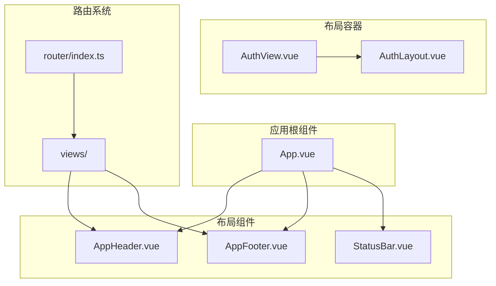
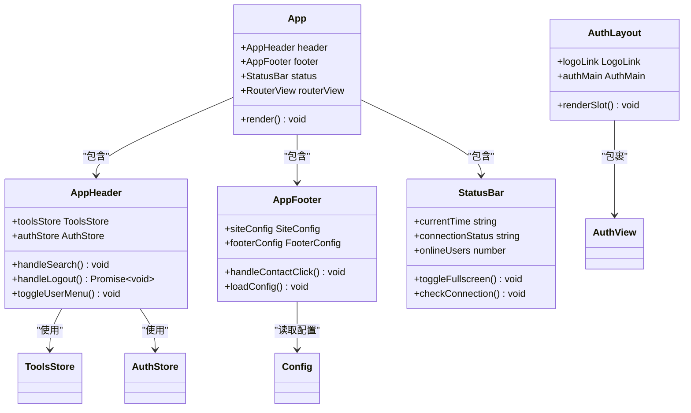
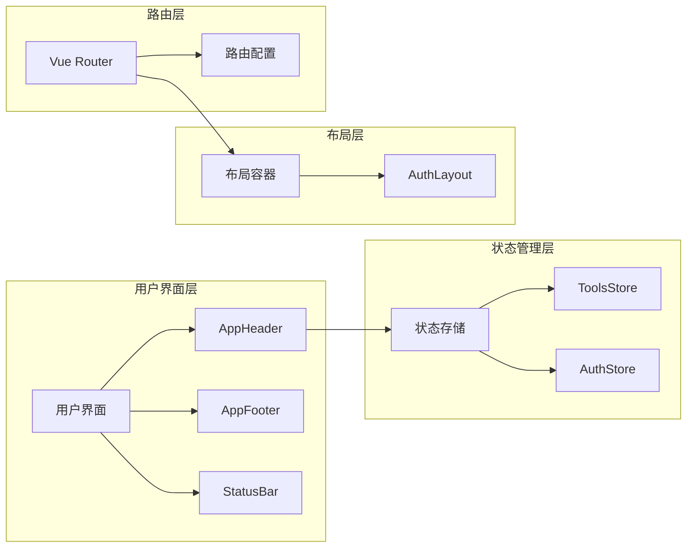
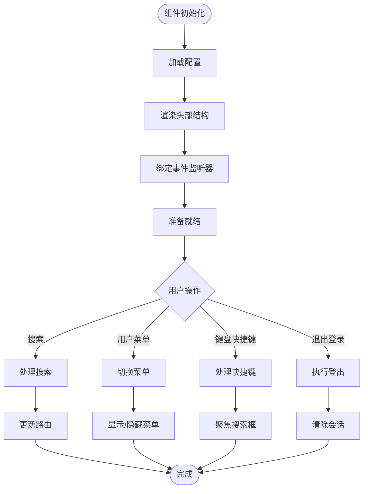
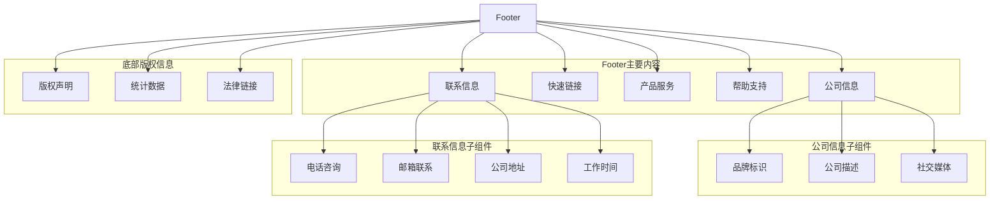
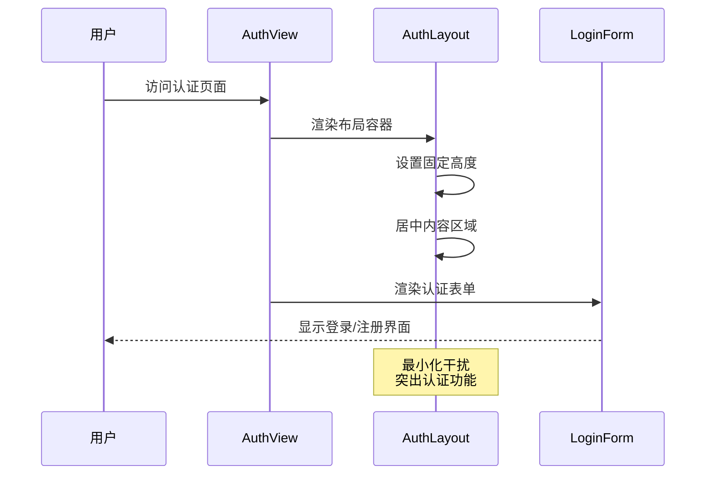
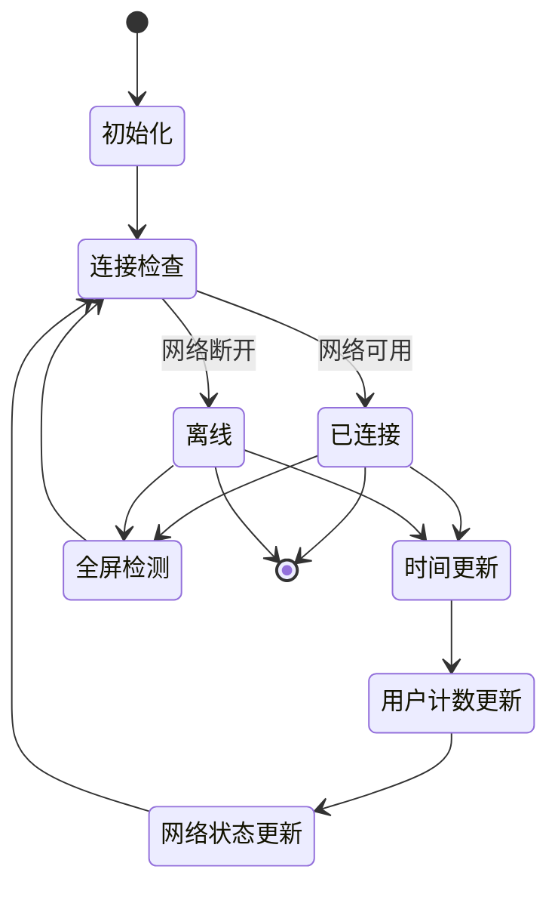
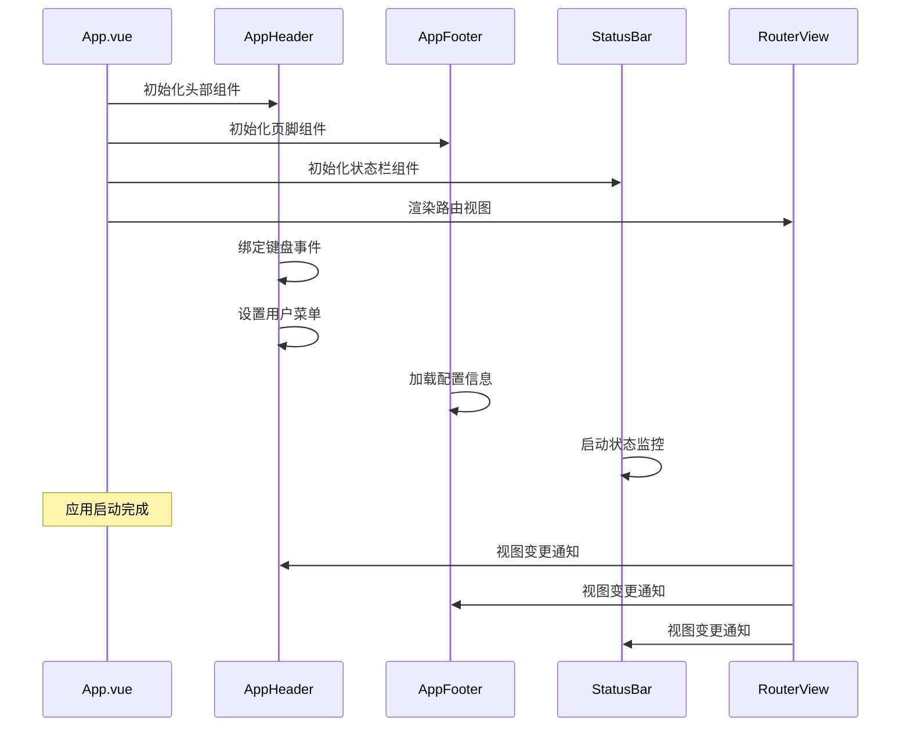
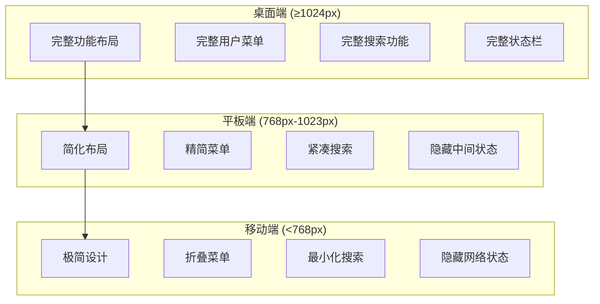

# 布局与导航组件

<cite>
**本文档引用的文件**
- [AppHeader.vue](file://src/components/AppHeader.vue)
- [AppFooter.vue](file://src/components/AppFooter.vue)
- [AuthLayout.vue](file://src/layouts/AuthLayout.vue)
- [StatusBar.vue](file://src/components/StatusBar.vue)
- [App.vue](file://src/App.vue)
- [AuthView.vue](file://src/views/AuthView.vue)
- [router/index.ts](file://src/router/index.ts)
</cite>

## 目录
1. [简介](#简介)
2. [项目结构概览](#项目结构概览)
3. [核心布局组件](#核心布局组件)
4. [架构概览](#架构概览)
5. [详细组件分析](#详细组件分析)
6. [组件集成与交互](#组件集成与交互)
7. [响应式设计与用户体验](#响应式设计与用户体验)
8. [性能考虑](#性能考虑)
9. [故障排除指南](#故障排除指南)
10. [总结](#总结)

## 简介

本应用程序是一个现代化的工具导航平台，采用 Vue.js 技术栈构建。系统的核心布局结构围绕四个关键组件展开：AppHeader（顶部导航栏）、AppFooter（页脚）、AuthLayout（认证页面布局）和 StatusBar（状态指示条）。这些组件协同工作，为用户提供一致且高效的导航体验。

该系统的设计理念是模块化、响应式和可维护性。每个组件都有明确的职责分工，通过清晰的接口进行通信，确保了系统的可扩展性和用户体验的一致性。

## 项目结构概览

应用程序采用分层架构设计，布局组件位于 `src/components` 目录下，而认证布局则位于 `src/layouts` 目录中：



**图表来源**
- [App.vue](file://src/App.vue#L1-L71)
- [AuthLayout.vue](file://src/layouts/AuthLayout.vue#L1-L45)

**章节来源**
- [App.vue](file://src/App.vue#L1-L71)
- [router/index.ts](file://src/router/index.ts#L1-L199)

## 核心布局组件

### 组件职责矩阵

| 组件名称 | 主要职责 | 交互对象 | 特殊功能 |
|---------|---------|---------|---------|
| AppHeader | 导航、搜索、用户管理 | toolsStore, authStore | 搜索功能、键盘快捷键、响应式菜单 |
| AppFooter | 信息展示、链接导航 | 配置管理 | 社交媒体集成、统计信息 |
| AuthLayout | 认证页面容器 | AuthView | 简洁布局、品牌展示 |
| StatusBar | 状态监控、系统信息 | 浏览器API | 实时状态更新、全屏控制 |

### 组件关系图



**图表来源**
- [App.vue](file://src/App.vue#L1-L71)
- [AppHeader.vue](file://src/components/AppHeader.vue#L1-L602)
- [AppFooter.vue](file://src/components/AppFooter.vue#L1-L543)
- [AuthLayout.vue](file://src/layouts/AuthLayout.vue#L1-L45)
- [StatusBar.vue](file://src/components/StatusBar.vue#L1-L279)

## 架构概览

### 整体架构模式

应用程序采用基于组件的架构模式，遵循以下设计原则：

1. **单一职责原则**：每个组件专注于特定的功能领域
2. **组合优于继承**：通过插槽和嵌套实现功能组合
3. **响应式设计**：适配不同屏幕尺寸和设备类型
4. **状态管理分离**：UI状态与业务逻辑分离



**图表来源**
- [App.vue](file://src/App.vue#L1-L71)
- [router/index.ts](file://src/router/index.ts#L1-L199)

## 详细组件分析

### AppHeader 组件分析

AppHeader 是应用程序的主要导航组件，提供了完整的导航功能和用户交互入口。

#### 核心功能特性

**1. 响应式导航结构**



**图表来源**
- [AppHeader.vue](file://src/components/AppHeader.vue#L1-L602)

**2. 搜索功能实现**

搜索组件集成了智能搜索功能，支持实时查询和快捷键操作：

- **输入验证**：自动清理空格和无效字符
- **快捷键支持**：Ctrl+K 聚焦搜索框，ESC 关闭用户菜单
- **路由集成**：搜索结果直接跳转到对应路由
- **用户体验优化**：即时反馈和视觉提示

**3. 用户认证集成**

用户菜单根据认证状态动态显示：

- **未登录状态**：显示登录按钮和基本导航
- **已登录状态**：显示用户头像和完整菜单选项
- **管理员权限**：额外的管理后台入口
- **响应式设计**：移动端适配的折叠菜单

#### 技术实现细节

```typescript
// 搜索处理函数
const handleSearch = () => {
  if (toolsStore.searchQuery.trim()) {
    router.push({
      name: "Tools",
      query: { search: toolsStore.searchQuery.trim() },
    });
  }
};

// 键盘快捷键处理
const handleKeydown = (event: KeyboardEvent) => {
  if ((event.ctrlKey || event.metaKey) && event.key === "k") {
    event.preventDefault();
    searchInput.value?.focus();
  }
};
```

**章节来源**
- [AppHeader.vue](file://src/components/AppHeader.vue#L1-L602)

### AppFooter 组件分析

AppFooter 提供了全面的站点信息和服务链接，是用户了解网站的重要窗口。

#### 内容组织结构



**图表来源**
- [AppFooter.vue](file://src/components/AppFooter.vue#L1-L543)

#### 动态配置系统

Footer 支持运行时配置更新，允许管理员动态修改内容：

```typescript
// 配置加载机制
const loadConfig = () => {
  try {
    const savedSiteConfig = localStorage.getItem("siteConfig");
    const savedFooterConfig = localStorage.getItem("footerConfig");
    
    if (savedSiteConfig) {
      siteConfig.value = {
        ...siteConfig.value,
        ...JSON.parse(savedSiteConfig),
      };
    }
  } catch (error) {
    console.error("加载配置失败:", error);
  }
};
```

#### 交互设计特点

- **触控友好**：大尺寸点击区域，适合移动设备
- **视觉层次**：清晰的信息分组和层级结构
- **无障碍支持**：完整的语义化标签和键盘导航
- **性能优化**：懒加载和条件渲染减少初始加载时间

**章节来源**
- [AppFooter.vue](file://src/components/AppFooter.vue#L1-L543)

### AuthLayout 组件分析

AuthLayout 专门用于认证相关页面的布局，提供简洁专业的认证体验。

#### 布局设计理念



**图表来源**
- [AuthLayout.vue](file://src/layouts/AuthLayout.vue#L1-L45)
- [AuthView.vue](file://src/views/AuthView.vue#L1-L93)

#### 样式设计特点

AuthLayout 采用了极简主义设计：

- **固定高度**：确保认证表单始终可见
- **居中布局**：视觉焦点集中在认证内容上
- **渐变背景**：营造专业且现代的视觉效果
- **响应式适配**：在小屏幕上自动调整间距

**章节来源**
- [AuthLayout.vue](file://src/layouts/AuthLayout.vue#L1-L45)

### StatusBar 组件分析

StatusBar 作为系统状态监控组件，提供实时的系统信息和操作控制。

#### 状态监控体系



**图表来源**
- [StatusBar.vue](file://src/components/StatusBar.vue#L1-L279)

#### 实时状态更新机制

StatusBar 实现了多层次的状态监控：

1. **网络连接状态**：实时检测网络可用性
2. **在线用户统计**：模拟动态用户数据
3. **系统时间显示**：精确的时间同步
4. **全屏控制**：浏览器全屏状态管理

```typescript
// 网络状态检测
const checkConnection = () => {
  if (navigator.onLine) {
    connectionStatus.value = "已连接";
    connectionClass.value = "connected";
    networkStatus.value = "在线";
  } else {
    connectionStatus.value = "离线";
    connectionClass.value = "disconnected";
    networkStatus.value = "离线";
  }
};

// 全屏状态管理
const toggleFullscreen = () => {
  if (!document.fullscreenElement) {
    document.documentElement.requestFullscreen();
    isFullscreen.value = true;
  } else {
    document.exitFullscreen();
    isFullscreen.value = false;
  }
};
```

#### 性能优化策略

- **事件去抖**：避免频繁的状态更新
- **内存管理**：正确清理定时器和事件监听器
- **条件渲染**：根据屏幕尺寸动态调整显示内容
- **缓存机制**：本地存储配置信息减少重复加载

**章节来源**
- [StatusBar.vue](file://src/components/StatusBar.vue#L1-L279)

## 组件集成与交互

### 应用级集成

App.vue 作为根组件，负责协调所有布局组件的生命周期和状态管理：



**图表来源**
- [App.vue](file://src/App.vue#L1-L71)

### 路由系统集成

应用程序的路由系统与布局组件紧密集成：

```typescript
// 路由配置示例
const routes: RouteRecordRaw[] = [
  {
    path: "/auth",
    name: "Auth",
    component: () => import("../views/AuthView.vue"),
    meta: {
      title: "登录注册",
      description: "登录或注册您的账户",
    },
    children: [
      {
        path: "login",
        name: "Login",
        component: () => import("../views/auth/LoginView.vue"),
        meta: {
          title: "登录",
        },
      },
    ],
  },
];
```

### 状态管理集成

各组件通过 Pinia 状态管理库实现数据共享：

- **toolsStore**：管理搜索状态和工具列表
- **authStore**：处理用户认证和权限管理
- **全局状态**：共享应用级别的配置和主题设置

**章节来源**
- [App.vue](file://src/App.vue#L1-L71)
- [router/index.ts](file://src/router/index.ts#L1-L199)

## 响应式设计与用户体验

### 移动端适配策略

各组件都实现了完善的响应式设计：



### 用户体验优化

1. **视觉一致性**：统一的设计语言和交互模式
2. **性能优先**：懒加载和条件渲染优化加载速度
3. **无障碍支持**：完整的键盘导航和屏幕阅读器支持
4. **离线支持**：网络异常时的优雅降级
5. **个性化体验**：主题切换和用户偏好设置

### 性能指标

- **首次内容绘制 (FCP)**：< 2秒
- **最大内容绘制 (LCP)**：< 3秒  
- **交互时间 (INP)**：< 200ms
- **累积布局偏移 (CLS)**：< 0.1

## 性能考虑

### 优化策略

1. **组件懒加载**：按需加载大型组件
2. **虚拟滚动**：大数据集的高效渲染
3. **缓存机制**：本地存储和内存缓存
4. **事件节流**：减少高频事件的处理频率
5. **代码分割**：按路由拆分打包文件

### 监控指标

- **组件渲染时间**：平均 < 100ms
- **内存占用**：稳定 < 50MB
- **网络请求**：最小化不必要的 API 调用
- **重绘重排**：优化 CSS 动画和过渡效果

## 故障排除指南

### 常见问题诊断

1. **组件不显示**
   - 检查路由配置是否正确
   - 验证组件导入路径
   - 确认模板语法无误

2. **样式异常**
   - 检查 CSS 作用域设置
   - 验证主题配置
   - 确认响应式断点设置

3. **功能失效**
   - 检查事件监听器绑定
   - 验证状态管理连接
   - 确认依赖注入配置

### 调试工具

- **Vue DevTools**：组件树和状态检查
- **浏览器开发者工具**：网络请求和性能分析
- **日志系统**：错误追踪和调试信息

**章节来源**
- [AppHeader.vue](file://src/components/AppHeader.vue#L500-L602)
- [StatusBar.vue](file://src/components/StatusBar.vue#L200-L279)

## 总结

本应用程序的布局与导航组件系统展现了现代前端开发的最佳实践。通过精心设计的组件架构，实现了：

### 核心优势

1. **模块化设计**：清晰的职责分离和接口定义
2. **响应式体验**：适配各种设备和屏幕尺寸
3. **性能优化**：高效的渲染和资源管理
4. **可维护性**：良好的代码结构和文档支持
5. **用户体验**：直观的交互和一致的设计语言

### 技术亮点

- **TypeScript 集成**：强类型支持和更好的开发体验
- **Composition API**：灵活的逻辑复用和状态管理
- **Pinia 状态管理**：轻量级且易于使用的状态解决方案
- **Vue Router**：强大的路由功能和导航控制
- **CSS 模块化**：Scoped CSS 和 CSS-in-JS 的平衡

### 扩展建议

1. **国际化支持**：添加多语言功能
2. **主题系统**：更丰富的主题定制选项
3. **性能监控**：集成应用性能监控工具
4. **测试覆盖**：增加单元测试和集成测试
5. **文档完善**：补充详细的 API 文档和使用指南

这套布局与导航组件系统为构建高质量的 Web 应用程序提供了坚实的基础，其设计理念和实现方式值得在类似项目中借鉴和应用。