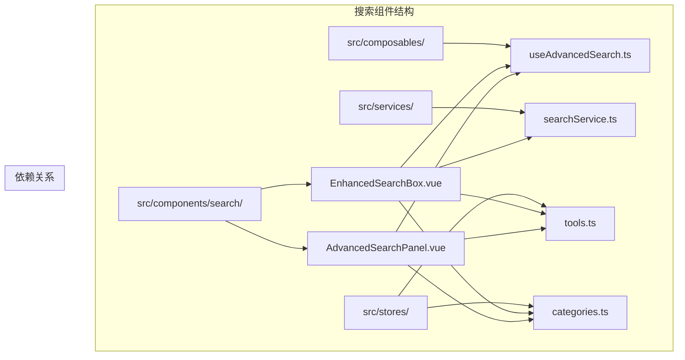
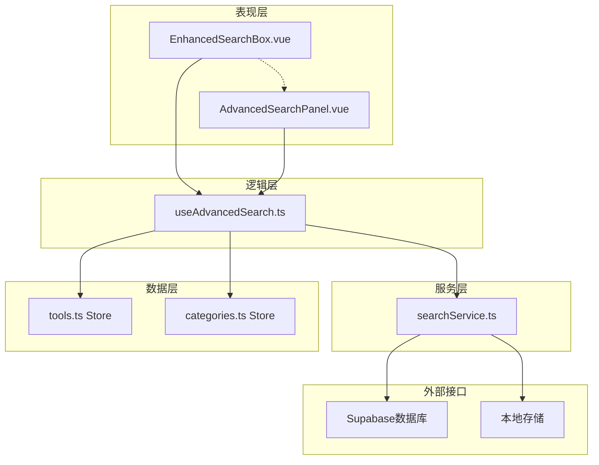
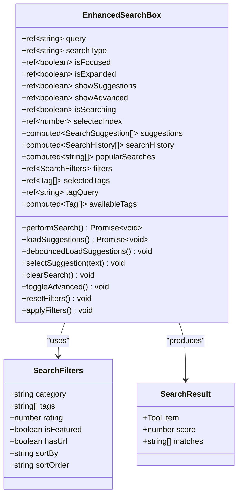
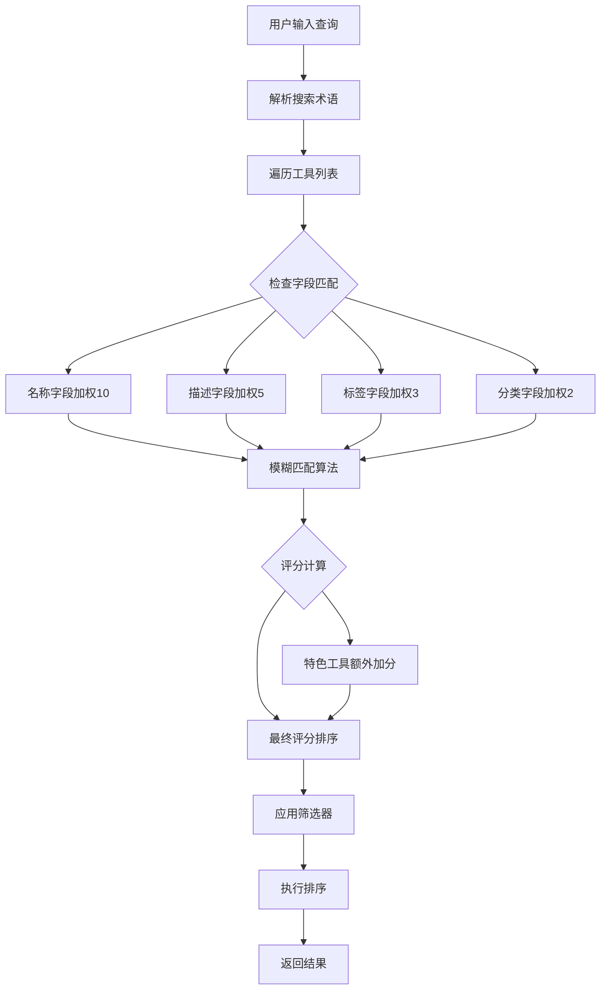
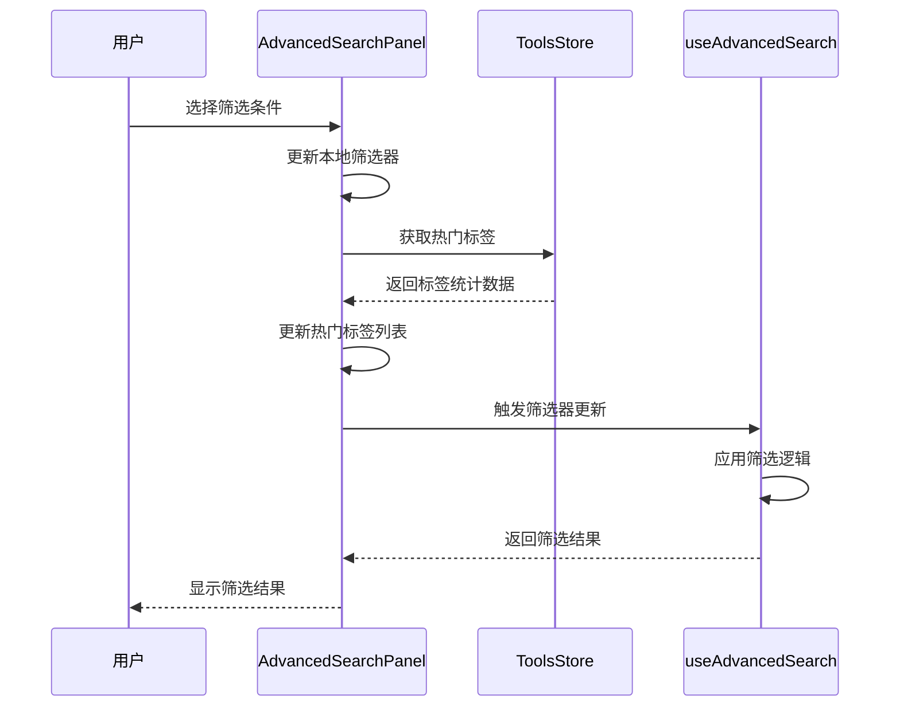
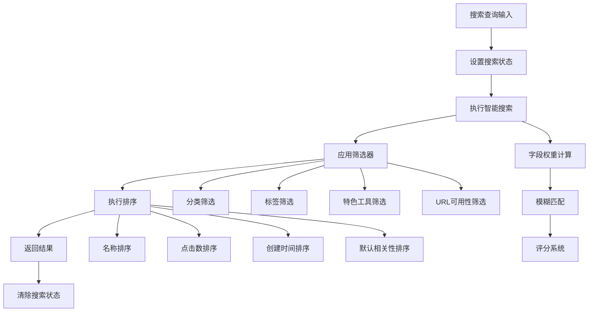

# 搜索与筛选组件

<cite>
**本文档中引用的文件**
- [useAdvancedSearch.ts](file://src/composables/useAdvancedSearch.ts)
- [EnhancedSearchBox.vue](file://src/components/search/EnhancedSearchBox.vue)
- [AdvancedSearchPanel.vue](file://src/components/advancedSearchPanel.vue)
- [searchService.ts](file://src/services/searchService.ts)
- [tools.ts](file://src/stores/tools.ts)
- [categories.ts](file://src/stores/categories.ts)
</cite>

## 目录
1. [简介](#简介)
2. [项目结构](#项目结构)
3. [核心组件](#核心组件)
4. [架构概览](#架构概览)
5. [详细组件分析](#详细组件分析)
6. [组合式API分析](#组合式api分析)
7. [性能优化策略](#性能优化策略)
8. [使用示例](#使用示例)
9. [故障排除指南](#故障排除指南)
10. [结论](#结论)

## 简介

本文档全面介绍了Advanced Tools Navigation项目中的搜索与筛选组件系统，重点关注EnhancedSearchBox（增强搜索框）和AdvancedSearchPanel（高级搜索面板）两个核心组件，以及它们背后的useAdvancedSearch组合式API。该系统提供了从简单搜索到复杂查询的完整解决方案，支持即时搜索、关键词高亮、过滤条件联动等功能。

## 项目结构

搜索功能相关的文件主要分布在以下目录结构中：



**图表来源**
- [EnhancedSearchBox.vue](file://src/components/search/EnhancedSearchBox.vue#L1-L50)
- [AdvancedSearchPanel.vue](file://src/components/advancedSearchPanel.vue#L1-L50)
- [useAdvancedSearch.ts](file://src/composables/useAdvancedSearch.ts#L1-L30)

**章节来源**
- [EnhancedSearchBox.vue](file://src/components/search/EnhancedSearchBox.vue#L1-L100)
- [AdvancedSearchPanel.vue](file://src/components/advancedSearchPanel.vue#L1-L100)
- [useAdvancedSearch.ts](file://src/composables/useAdvancedSearch.ts#L1-L50)

## 核心组件

### EnhancedSearchBox（增强搜索框）

EnhancedSearchBox是整个搜索系统的核心入口组件，提供了完整的搜索体验，包括：

- **智能搜索输入**：支持实时搜索建议和自动完成
- **多类型搜索**：支持工具、产品、分类等多种搜索类型
- **高级搜索面板**：可展开的高级筛选界面
- **搜索历史管理**：保存和展示用户搜索历史
- **热门搜索推荐**：基于用户行为的热门搜索词
- **键盘导航支持**：完整的键盘操作体验

### AdvancedSearchPanel（高级搜索面板）

AdvancedSearchPanel提供了丰富的筛选和排序选项：

- **分类筛选**：基于工具分类的精确筛选
- **标签系统**：支持多个标签的组合筛选
- **评分筛选**：基于工具评分的筛选条件
- **特殊筛选**：特色工具和可访问工具筛选
- **排序选项**：多种排序方式的支持
- **实时应用**：筛选条件变更时的实时响应

**章节来源**
- [EnhancedSearchBox.vue](file://src/components/search/EnhancedSearchBox.vue#L1-L200)
- [AdvancedSearchPanel.vue](file://src/components/advancedSearchPanel.vue#L1-L200)

## 架构概览

搜索系统采用分层架构设计，确保了组件间的清晰分离和高效协作：



**图表来源**
- [useAdvancedSearch.ts](file://src/composables/useAdvancedSearch.ts#L1-L50)
- [searchService.ts](file://src/services/searchService.ts#L1-L50)

## 详细组件分析

### EnhancedSearchBox 组件分析

EnhancedSearchBox是一个功能丰富的搜索组件，实现了以下核心特性：

#### 组件结构与状态管理



**图表来源**
- [EnhancedSearchBox.vue](file://src/components/search/EnhancedSearchBox.vue#L250-L350)
- [useAdvancedSearch.ts](file://src/composables/useAdvancedSearch.ts#L5-L15)

#### 搜索算法实现

搜索系统采用了智能的全文搜索算法，具有以下特点：



**图表来源**
- [useAdvancedSearch.ts](file://src/composables/useAdvancedSearch.ts#L30-L80)

#### 关键功能实现

1. **防抖处理**：使用`useDebounceFn`实现300ms的防抖延迟
2. **智能建议**：根据输入动态生成搜索建议
3. **搜索历史**：自动保存和管理搜索历史
4. **热门搜索**：基于频率统计的热门搜索推荐
5. **键盘导航**：支持上下箭头选择和回车确认

**章节来源**
- [EnhancedSearchBox.vue](file://src/components/search/EnhancedSearchBox.vue#L400-L600)
- [useAdvancedSearch.ts](file://src/composables/useAdvancedSearch.ts#L100-L200)

### AdvancedSearchPanel 组件分析

AdvancedSearchPanel提供了丰富的筛选和排序功能：

#### 筛选器系统



**图表来源**
- [AdvancedSearchPanel.vue](file://src/components/advancedSearchPanel.vue#L200-L300)
- [useAdvancedSearch.ts](file://src/composables/useAdvancedSearch.ts#L80-L120)

#### 标签管理系统

AdvancedSearchPanel实现了完整的标签管理功能：

- **热门标签**：基于工具使用频率的标签推荐
- **自定义标签**：支持用户添加新的标签
- **标签组合**：多个标签的AND逻辑组合
- **标签移除**：单个标签的删除功能

**章节来源**
- [AdvancedSearchPanel.vue](file://src/components/advancedSearchPanel.vue#L200-L400)

## 组合式API分析

### useAdvancedSearch 组合式API

useAdvancedSearch是整个搜索系统的逻辑核心，提供了完整的搜索状态管理和业务逻辑：

#### 核心接口定义

```typescript
export interface SearchFilters {
  category: string;
  tags: string[];
  rating: number;
  isFeatured: boolean;
  hasUrl: boolean;
  sortBy: "name" | "rating" | "clicks" | "created_at";
  sortOrder: "asc" | "desc";
}

export interface SearchResult {
  item: Tool;
  score: number;
  matches: string[];
}
```

#### 搜索流程控制



**图表来源**
- [useAdvancedSearch.ts](file://src/composables/useAdvancedSearch.ts#L150-L250)

#### 性能优化机制

1. **计算属性缓存**：使用Vue的computed实现结果缓存
2. **异步处理**：搜索操作在异步任务中执行
3. **状态管理**：通过ref和reactive管理组件状态
4. **错误处理**：完整的try-catch错误处理机制

**章节来源**
- [useAdvancedSearch.ts](file://src/composables/useAdvancedSearch.ts#L1-L306)

## 性能优化策略

### 防抖处理

搜索建议加载采用了300ms的防抖处理，有效减少了不必要的API调用：

```typescript
const debouncedLoadSuggestions = useDebounceFn(loadSuggestions, 300);
```

### 智能搜索算法

搜索算法采用了多字段加权评分系统：

- 名称字段：权重10
- 描述字段：权重5  
- 标签字段：权重3
- 分类字段：权重2

### 内存管理

- 搜索历史限制为50条记录
- 热门搜索词限制为10个
- 自动清理空闲资源

### 异步优化

- 使用async/await处理异步操作
- 合理的错误处理和状态管理
- 避免阻塞主线程的操作

## 使用示例

### 基础搜索示例

```vue
<template>
  <EnhancedSearchBox 
    placeholder="搜索工具、产品、分类..." 
    :autoFocus="true"
    @search="handleSearchResult"
  />
</template>

<script setup>
const handleSearchResult = (result) => {
  console.log('搜索结果:', result);
};
</script>
```

### 高级搜索配置

```vue
<template>
  <EnhancedSearchBox 
    :showAdvanced="true"
    :defaultType="'tools'"
    @search="handleSearchResult"
  >
    <template #advanced-panel>
      <AdvancedSearchPanel 
        :isOpen="showAdvancedPanel"
        :filters="searchFilters"
        @update:filters="updateFilters"
      />
    </template>
  </EnhancedSearchBox>
</template>
```

### 组合式API使用

```typescript
import { useAdvancedSearch } from '@/composables/useAdvancedSearch';

const {
  searchQuery,
  filters,
  searchResults,
  searchSuggestions,
  popularSearches,
  search,
  clearSearch,
  resetFilters
} = useAdvancedSearch();
```

## 故障排除指南

### 常见问题及解决方案

1. **搜索无响应**
   - 检查网络连接
   - 验证API端点可用性
   - 查看浏览器控制台错误

2. **筛选器不生效**
   - 确认store数据已正确初始化
   - 检查筛选器对象格式
   - 验证数据类型匹配

3. **性能问题**
   - 减少搜索历史长度
   - 优化搜索算法参数
   - 考虑分页加载大量数据

**章节来源**
- [useAdvancedSearch.ts](file://src/composables/useAdvancedSearch.ts#L250-L306)

## 结论

Advanced Tools Navigation项目的搜索与筛选组件系统展现了现代前端开发的最佳实践：

### 主要优势

1. **模块化设计**：清晰的组件分离和职责划分
2. **高性能实现**：合理的防抖处理和缓存策略
3. **用户体验**：丰富的交互反馈和键盘导航支持
4. **扩展性强**：灵活的筛选器和排序选项
5. **维护友好**：良好的代码组织和注释

### 技术亮点

- **智能搜索算法**：多字段加权评分和模糊匹配
- **实时响应**：即时搜索建议和筛选结果更新
- **状态管理**：Vue 3 Composition API的最佳实践
- **类型安全**：完整的TypeScript类型定义
- **性能优化**：多层次的性能优化策略

该系统为用户提供了强大而直观的搜索体验，同时保持了代码的可维护性和扩展性，是现代Web应用搜索功能的优秀范例。