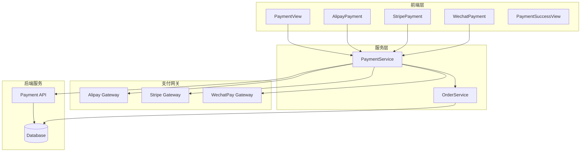
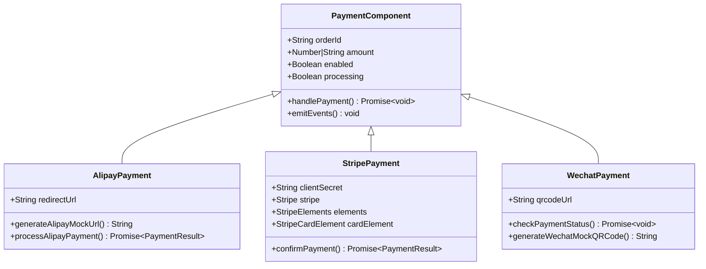
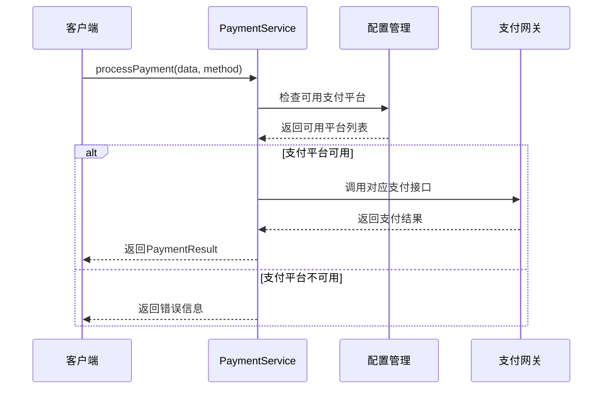
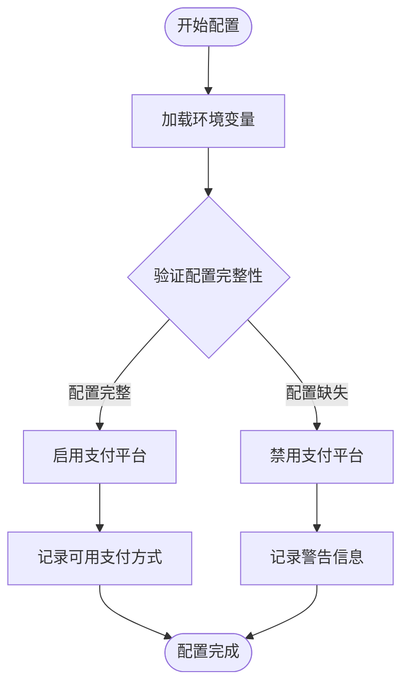
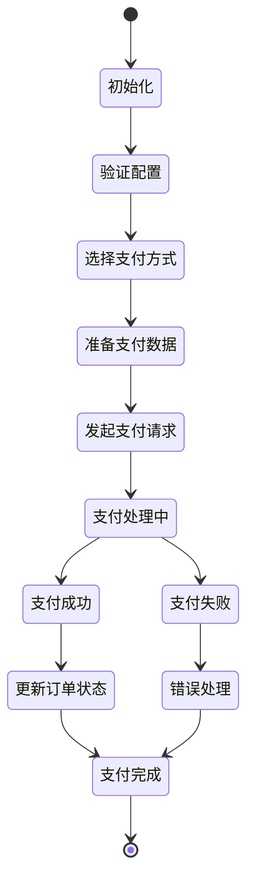
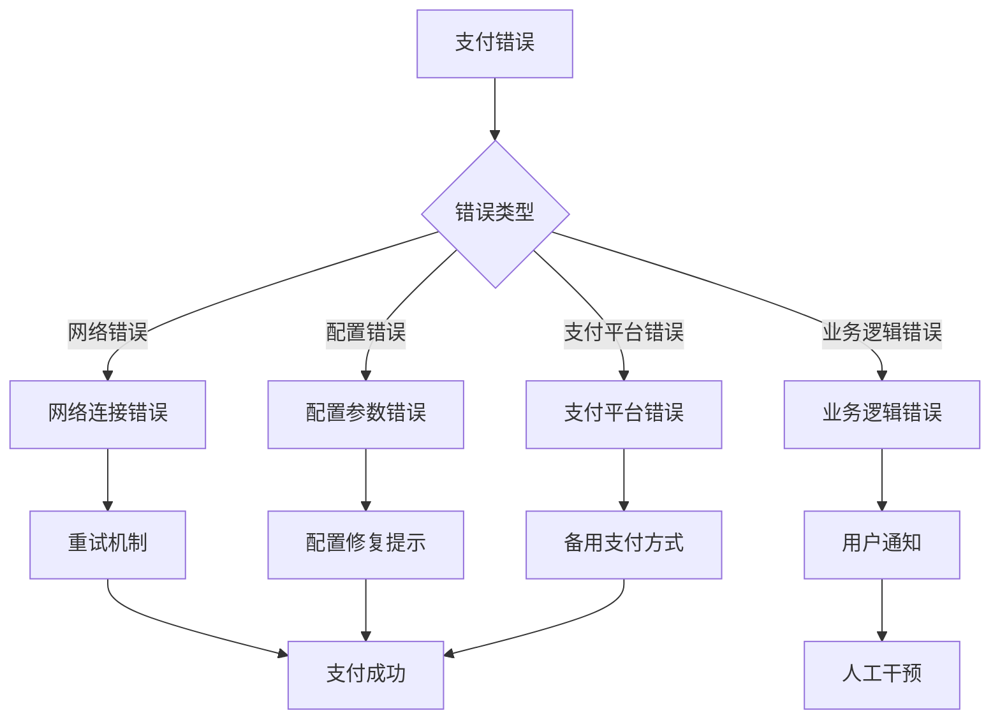
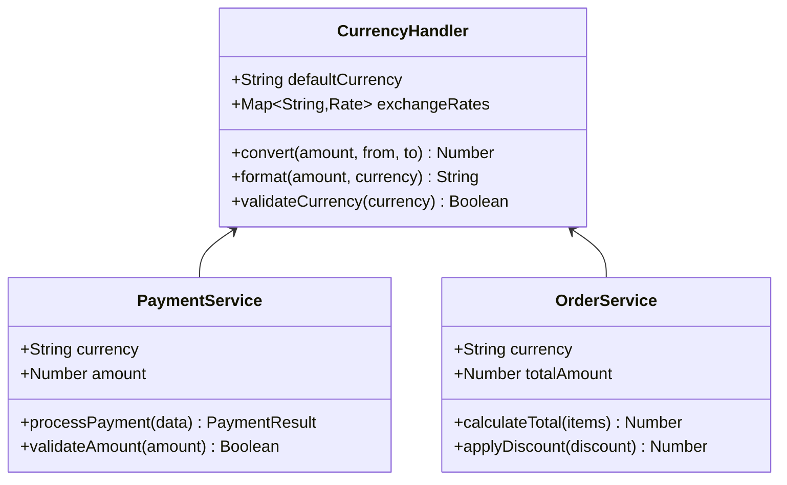
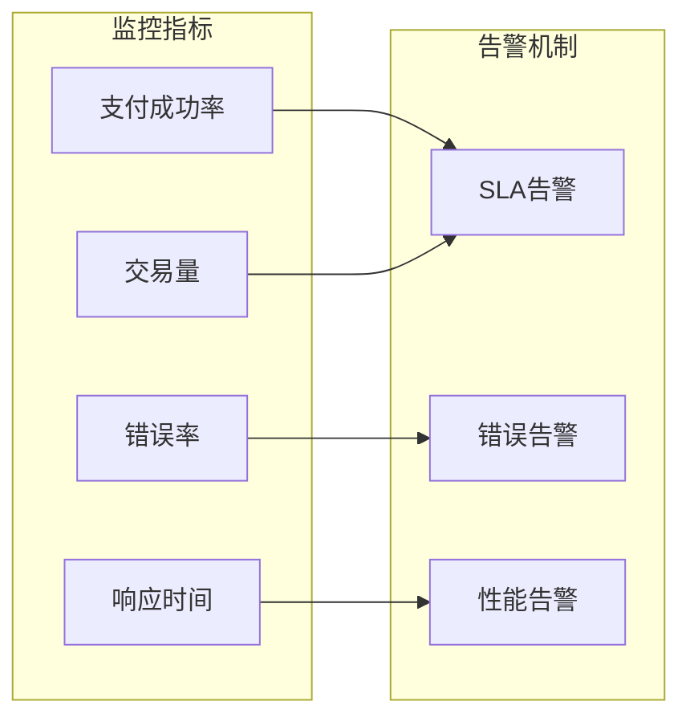
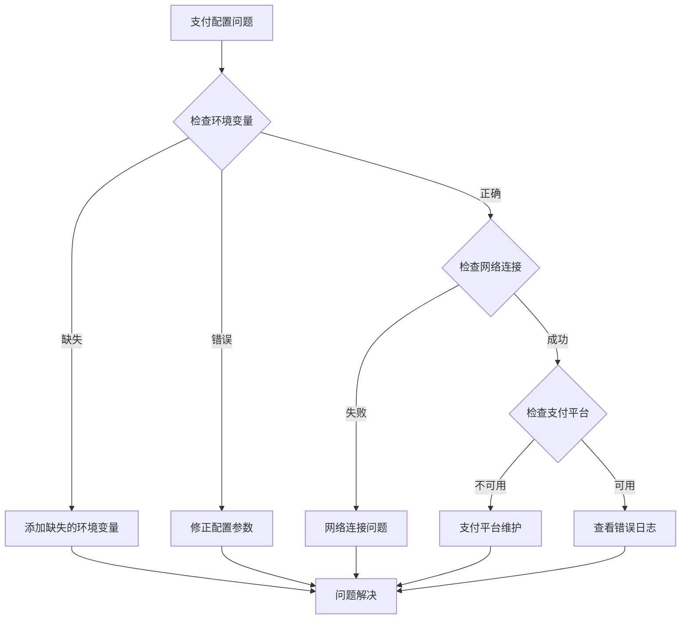

# 支付集成组件

<cite>
**本文档引用的文件**
- [paymentService.ts](file://src/services/paymentService.ts)
- [AlipayPayment.vue](file://src/components/AlipayPayment.vue)
- [StripePayment.vue](file://src/components/StripePayment.vue)
- [WechatPayment.vue](file://src/components/WechatPayment.vue)
- [PaymentView.vue](file://src/views/PaymentView.vue)
- [PaymentSuccessView.vue](file://src/views/PaymentSuccessView.vue)
- [orderService.ts](file://src/services/orderService.ts)
- [PAYMENT_SETUP.md](file://PAYMENT_SETUP.md)
- [validation.ts](file://src/utils/validation.ts)
</cite>

## 目录
1. [项目概述](#项目概述)
2. [支付架构概览](#支付架构概览)
3. [核心支付组件分析](#核心支付组件分析)
4. [支付服务层详解](#支付服务层详解)
5. [配置管理与安全](#配置管理与安全)
6. [支付流程实现](#支付流程实现)
7. [错误处理与恢复机制](#错误处理与恢复机制)
8. [多币种支持配置](#多币种支持配置)
9. [沙箱环境测试指南](#沙箱环境测试指南)
10. [生产部署注意事项](#生产部署注意事项)
11. [性能优化建议](#性能优化建议)
12. [故障排除指南](#故障排除指南)

## 项目概述

本支付集成组件是一个基于Vue 3和TypeScript构建的现代化支付系统，集成了三大主流支付平台：支付宝（Alipay）、Stripe和微信支付（WechatPay）。该系统采用模块化设计，提供了完整的支付生命周期管理，包括订单创建、支付处理、状态监控和结果反馈等功能。

### 主要特性

- **多支付平台支持**：同时集成支付宝、Stripe和微信支付
- **响应式设计**：适配桌面和移动设备的支付界面
- **实时状态更新**：支付进度和状态的实时反馈
- **安全加密传输**：所有支付数据均通过HTTPS传输
- **错误处理机制**：完善的异常捕获和用户友好的错误提示
- **多币种支持**：灵活的货币转换和显示机制

## 支付架构概览



**图表来源**
- [PaymentView.vue](file://src/views/PaymentView.vue#L1-L50)
- [paymentService.ts](file://src/services/paymentService.ts#L1-L30)

## 核心支付组件分析

### 支付组件架构

每个支付组件都遵循统一的设计模式，确保一致的用户体验和功能特性：



**图表来源**
- [AlipayPayment.vue](file://src/components/AlipayPayment.vue#L40-L80)
- [StripePayment.vue](file://src/components/StripePayment.vue#L40-L80)
- [WechatPayment.vue](file://src/components/WechatPayment.vue#L40-L80)

### 支付组件特性对比

| 特性 | 支付宝支付 | Stripe支付 | 微信支付 |
|------|------------|------------|----------|
| 支持平台 | Web、移动端 | Web、移动端 | Web、移动端 |
| 支付方式 | PC网站支付 | 卡片支付 | 二维码支付 |
| 实时性 | 异步通知 | 实时确认 | 轮询检查 |
| 用户体验 | 跳转支付 | 卡片输入 | 二维码扫描 |
| 开发复杂度 | 中等 | 高 | 中等 |

**章节来源**
- [AlipayPayment.vue](file://src/components/AlipayPayment.vue#L1-L159)
- [StripePayment.vue](file://src/components/StripePayment.vue#L1-L196)
- [WechatPayment.vue](file://src/components/WechatPayment.vue#L1-L242)

## 支付服务层详解

### PaymentService核心功能

PaymentService是整个支付系统的核心协调者，负责管理三种支付平台的配置、初始化和调用：



**图表来源**
- [paymentService.ts](file://src/services/paymentService.ts#L350-L387)

### 支付配置管理

系统采用环境变量方式进行支付配置管理，确保安全性：

```typescript
// 支付网关配置
const PAYMENT_CONFIG = {
  stripe: {
    publicKey: import.meta.env.VITE_STRIPE_PUBLIC_KEY || "",
    secretKey: import.meta.env.VITE_STRIPE_SECRET_KEY || "",
    enabled: !!import.meta.env.VITE_STRIPE_PUBLIC_KEY,
  },
  alipay: {
    appId: import.meta.env.VITE_ALIPAY_APP_ID || "",
    privateKey: import.meta.env.VITE_ALIPAY_PRIVATE_KEY || "",
    alipayPublicKey: import.meta.env.VITE_ALIPAY_PUBLIC_KEY || "",
    gateway: "https://openapi.alipay.com/gateway.do",
    charset: "UTF-8",
    signType: "RSA2",
    enabled: !!import.meta.env.VITE_ALIPAY_APP_ID,
  },
  wechat: {
    appId: import.meta.env.VITE_WECHAT_APP_ID || "",
    mchId: import.meta.env.VITE_WECHAT_MCH_ID || "",
    apiKey: import.meta.env.VITE_WECHAT_API_KEY || "",
    apiVersion: "v3",
    enabled: !!import.meta.env.VITE_WECHAT_APP_ID,
  },
};
```

### 支付结果标准化

所有支付平台的结果都通过统一的接口返回：

```typescript
export interface PaymentResult {
  success: boolean;
  paymentId?: string;
  orderId: string;
  amount: number;
  currency: string;
  method: string;
  message?: string;
  redirectUrl?: string;
  clientSecret?: string;
  paymentIntentId?: string;
}
```

**章节来源**
- [paymentService.ts](file://src/services/paymentService.ts#L1-L387)

## 配置管理与安全

### 环境变量配置

支付系统的安全性依赖于严格的配置管理：



**图表来源**
- [paymentService.ts](file://src/services/paymentService.ts#L20-L35)

### 安全最佳实践

1. **密钥管理**
   - 使用环境变量存储敏感信息
   - 定期轮换API密钥
   - 限制密钥权限范围

2. **传输安全**
   - 所有支付数据通过HTTPS传输
   - 使用TLS 1.2+加密协议
   - 实施证书验证

3. **数据保护**
   - 敏感数据加密存储
   - 实施访问控制策略
   - 定期安全审计

**章节来源**
- [PAYMENT_SETUP.md](file://PAYMENT_SETUP.md#L1-L76)

## 支付流程实现

### 支付流程状态图



**图表来源**
- [PaymentView.vue](file://src/views/PaymentView.vue#L200-L300)

### 支付组件交互流程

每个支付组件都有独特的交互模式：

#### 支付宝支付流程
1. 用户点击支付按钮
2. 系统验证支付宝配置
3. 生成支付请求参数
4. 重定向到支付宝支付页面
5. 用户完成支付后返回结果

#### Stripe支付流程
1. 用户输入信用卡信息
2. 系统初始化Stripe元素
3. 创建PaymentIntent
4. 用户确认支付
5. 支付结果实时反馈

#### 微信支付流程
1. 系统生成支付二维码
2. 用户使用微信扫描
3. 用户确认支付
4. 系统轮询检查支付状态
5. 支付结果反馈给用户

**章节来源**
- [AlipayPayment.vue](file://src/components/AlipayPayment.vue#L50-L100)
- [StripePayment.vue](file://src/components/StripePayment.vue#L80-L140)
- [WechatPayment.vue](file://src/components/WechatPayment.vue#L80-L150)

## 错误处理与恢复机制

### 错误分类与处理策略



**图表来源**
- [paymentService.ts](file://src/services/paymentService.ts#L50-L100)

### 错误恢复机制

系统实现了多层次的错误恢复机制：

1. **自动重试**：网络超时和临时错误自动重试
2. **降级处理**：支付平台不可用时切换到备用方案
3. **用户引导**：清晰的错误提示和解决建议
4. **日志记录**：完整的错误日志便于问题追踪

**章节来源**
- [paymentService.ts](file://src/services/paymentService.ts#L100-L200)

## 多币种支持配置

### 币种处理架构

虽然当前系统主要支持人民币(CNY)，但架构设计支持多币种扩展：



**图表来源**
- [orderService.ts](file://src/services/orderService.ts#L1-L50)

### 币种配置示例

```typescript
// 当前配置（仅支持CNY）
const CURRENCY_CONFIG = {
  default: "CNY",
  supported: ["CNY", "USD", "EUR"],
  rates: {
    USD: 7.25,
    EUR: 8.20,
  }
};

// 多币种支持扩展
export interface CurrencyConfig {
  default: string;
  supported: string[];
  rates: Record<string, number>;
  formatOptions: Intl.NumberFormatOptions;
}
```

**章节来源**
- [orderService.ts](file://src/services/orderService.ts#L1-L100)

## 沙箱环境测试指南

### 测试环境配置

为了确保支付功能的可靠性，系统提供了完整的沙箱测试环境：

#### Stripe沙箱测试
```env
VITE_STRIPE_PUBLIC_KEY=pk_test_your_test_key
VITE_STRIPE_SECRET_KEY=sk_test_your_test_key
```

#### 支付宝沙箱测试
```env
VITE_ALIPAY_APP_ID=your_sandbox_app_id
VITE_ALIPAY_PRIVATE_KEY=your_private_key
VITE_ALIPAY_PUBLIC_KEY=your_alipay_public_key
```

#### 微信支付沙箱测试
```env
VITE_WECHAT_APP_ID=sandbox_app_id
VITE_WECHAT_MCH_ID=sandbox_mch_id
VITE_WECHAT_API_KEY=sandbox_api_key
```

### 测试支付场景

1. **正常支付流程测试**
   - 成功支付验证
   - 支付结果回调测试
   - 订单状态更新验证

2. **异常情况测试**
   - 网络中断测试
   - 支付超时测试
   - 参数错误测试

3. **边界条件测试**
   - 最小支付金额测试
   - 最大支付金额测试
   - 货币精度测试

**章节来源**
- [PAYMENT_SETUP.md](file://PAYMENT_SETUP.md#L40-L76)

## 生产部署注意事项

### 部署前检查清单

1. **配置验证**
   - 确认所有环境变量正确设置
   - 验证支付网关密钥有效性
   - 检查回调URL配置

2. **安全加固**
   - 实施HTTPS强制跳转
   - 配置CORS策略
   - 启用CSRF保护

3. **性能优化**
   - 配置CDN加速
   - 启用缓存策略
   - 优化图片资源

### 监控与告警



**章节来源**
- [PAYMENT_SETUP.md](file://PAYMENT_SETUP.md#L50-L76)

## 性能优化建议

### 前端性能优化

1. **组件懒加载**
   ```typescript
   // 按需加载支付组件
   const AlipayPayment = defineAsyncComponent(() => 
     import('@/components/AlipayPayment.vue')
   );
   ```

2. **资源预加载**
   ```typescript
   // 预加载Stripe SDK
   import('https://js.stripe.com/v3/');
   ```

3. **缓存策略**
   - 缓存支付配置信息
   - 缓存汇率数据
   - 缓存用户支付历史

### 后端性能优化

1. **异步处理**
   - 支付回调异步处理
   - 订单状态更新异步执行
   - 报表生成后台任务

2. **数据库优化**
   - 支付相关表索引优化
   - 分区表设计
   - 查询缓存策略

## 故障排除指南

### 常见问题诊断

#### 支付配置问题


**图表来源**
- [paymentService.ts](file://src/services/paymentService.ts#L20-L35)

#### 支付失败排查步骤

1. **检查支付配置**
   ```bash
   # 验证环境变量
   echo $VITE_STRIPE_PUBLIC_KEY
   echo $VITE_ALIPAY_APP_ID
   echo $VITE_WECHAT_APP_ID
   ```

2. **验证网络连接**
   ```bash
   # 测试支付网关连通性
   curl -I https://api.stripe.com/v1/ping
   curl -I https://openapi.alipay.com/gateway.do
   curl -I https://api.mch.weixin.qq.com/v3/certificates
   ```

3. **检查SSL证书**
   ```bash
   # 验证SSL证书有效性
   openssl s_client -connect api.stripe.com:443
   ```

4. **查看错误日志**
   ```javascript
   // 在浏览器控制台查看详细错误信息
   console.error('Payment error:', error);
   ```

### 支付平台特定问题

#### Stripe常见问题
- **PaymentIntent状态异常**：检查PaymentIntent创建和确认流程
- **卡支付失败**：验证卡片信息和支付限额
- **退款处理**：确认退款权限和处理时间

#### 支付宝常见问题
- **签名验证失败**：检查私钥和公钥配置
- **网关连接超时**：验证网络防火墙设置
- **异步通知失败**：检查回调URL可访问性

#### 微信支付常见问题
- **API密钥错误**：重新生成并配置API密钥
- **商户号配置**：确认商户号和应用ID匹配
- **二维码生成失败**：检查支付参数和权限

**章节来源**
- [paymentService.ts](file://src/services/paymentService.ts#L100-L200)

## 结论

本支付集成组件提供了一个完整、安全、高性能的支付解决方案，支持三大主流支付平台。通过模块化的架构设计、完善的错误处理机制和灵活的配置管理，系统能够满足不同规模企业的支付需求。

### 关键优势

1. **技术先进性**：采用最新的Web支付技术和最佳实践
2. **安全性保障**：严格的安全措施和合规性设计
3. **易用性**：简洁直观的用户界面和流畅的操作体验
4. **可扩展性**：模块化设计便于功能扩展和定制
5. **维护性**：清晰的代码结构和完善的文档支持

### 未来发展方向

1. **更多支付渠道**：支持更多地区的本地支付方式
2. **智能推荐**：基于用户行为的支付方式智能推荐
3. **数据分析**：支付数据的深度分析和可视化
4. **AI辅助**：人工智能在支付安全和用户体验方面的应用

通过持续的优化和改进，该支付系统将继续为企业提供可靠、高效的支付服务，助力业务发展。