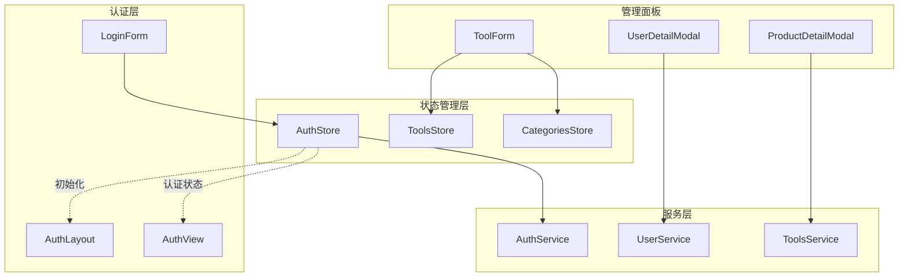
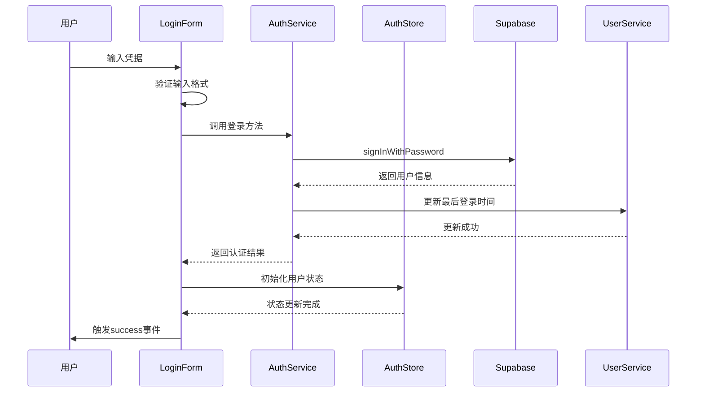
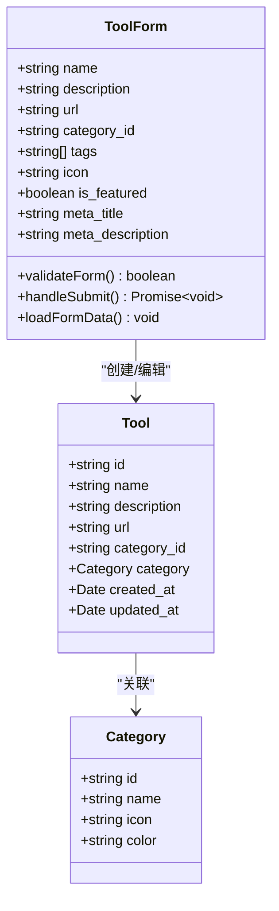
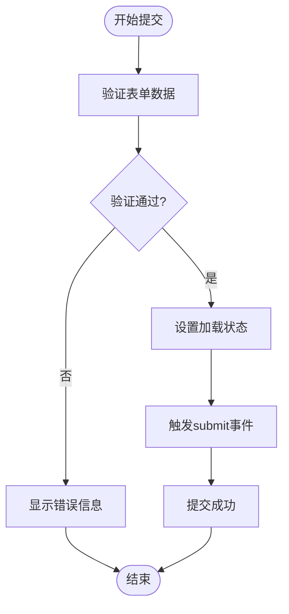
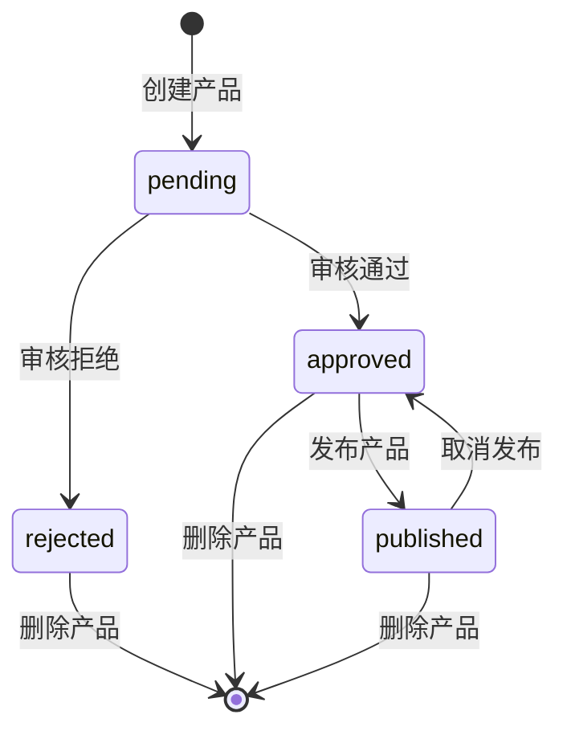
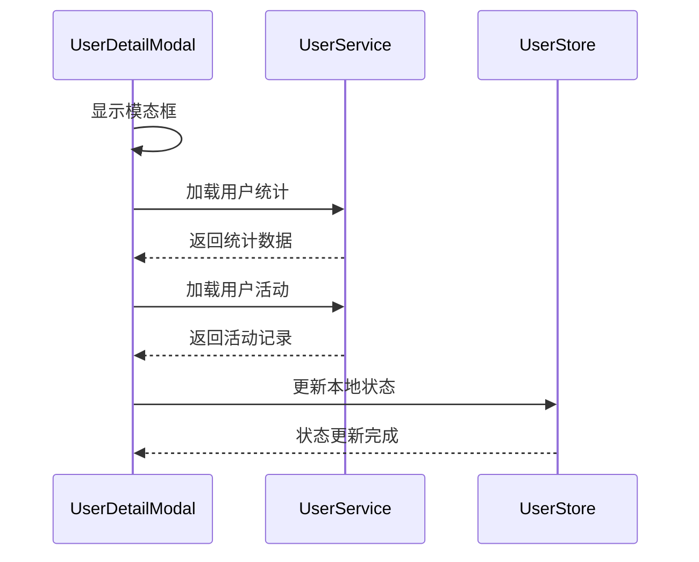
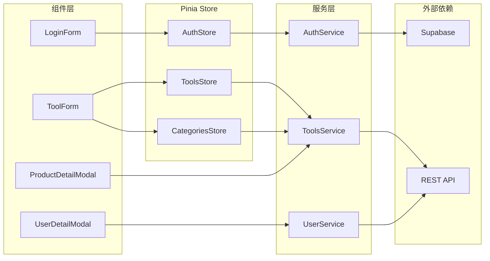

# 认证与表单组件

<cite>
**本文档引用的文件**
- [src/components/admin/ToolForm.vue](file://src/components/admin/ToolForm.vue)
- [src/components/admin/ProductDetailModal.vue](file://src/components/admin/ProductDetailModal.vue)
- [src/components/admin/UserDetailModal.vue](file://src/components/admin/UserDetailModal.vue)
- [src/components/auth/LoginForm.vue](file://src/components/auth/LoginForm.vue)
- [src/stores/auth.ts](file://src/stores/auth.ts)
- [src/services/authService.ts](file://src/services/authService.ts)
- [src/types/index.ts](file://src/types/index.ts)
- [src/utils/validation.ts](file://src/utils/validation.ts)
- [src/utils/dataTransform.ts](file://src/utils/dataTransform.ts)
- [src/views/auth/LoginView.vue](file://src/views/auth/LoginView.vue)
</cite>

## 目录
1. [项目概述](#项目概述)
2. [核心组件架构](#核心组件架构)
3. [认证组件分析](#认证组件分析)
4. [表单组件分析](#表单组件分析)
5. [数据流与状态管理](#数据流与状态管理)
6. [验证机制](#验证机制)
7. [使用示例](#使用示例)
8. [最佳实践](#最佳实践)
9. [故障排除](#故障排除)

## 项目概述

本项目是一个现代化的工具导航平台，采用Vue 3 + TypeScript + Pinia + Vite技术栈构建。项目包含完整的用户认证系统和多种表单组件，用于管理工具、产品和用户信息。

主要特性：
- 基于Supabase的身份验证系统
- 响应式表单组件设计
- 类型安全的TypeScript实现
- 基于Pinia的状态管理
- 完整的表单验证机制

## 核心组件架构



**图表来源**
- [src/components/auth/LoginForm.vue](file://src/components/auth/LoginForm.vue#L1-L122)
- [src/components/admin/ToolForm.vue](file://src/components/admin/ToolForm.vue#L1-L513)
- [src/stores/auth.ts](file://src/stores/auth.ts#L1-L190)

## 认证组件分析

### LoginForm组件

LoginForm是系统的核心认证组件，负责处理用户登录流程。

#### 主要功能特性

- **响应式表单设计**：基于Vue 3的组合式API实现
- **实时验证**：内置邮箱和密码格式验证
- **错误处理**：统一的错误消息显示机制
- **加载状态管理**：防止重复提交

#### 输入字段与验证规则

```typescript
interface LoginForm {
  email: string;     // 邮箱地址，必须有效格式
  password: string;  // 密码，最小8位
}
```

#### 提交流程



**图表来源**
- [src/components/auth/LoginForm.vue](file://src/components/auth/LoginForm.vue#L30-L50)
- [src/services/authService.ts](file://src/services/authService.ts#L15-L40)

#### 错误处理机制

```typescript
// 错误处理示例
try {
  const result = await AuthService.login(form.value);
  // 成功处理...
} catch (err) {
  error.value = err instanceof Error ? err.message : '登录失败';
}
```

**章节来源**
- [src/components/auth/LoginForm.vue](file://src/components/auth/LoginForm.vue#L1-L122)
- [src/services/authService.ts](file://src/services/authService.ts#L15-L40)

## 表单组件分析

### ToolForm组件

ToolForm是工具管理的核心表单组件，支持工具的创建和编辑。

#### 表单结构与字段



**图表来源**
- [src/components/admin/ToolForm.vue](file://src/components/admin/ToolForm.vue#L80-L120)
- [src/types/index.ts](file://src/types/index.ts#L1-L50)

#### 验证规则

1. **必需字段验证**：
   - 工具名称：非空字符串
   - 工具描述：非空文本
   - 工具链接：有效URL格式
   - 分类选择：必须选择

2. **格式验证**：
   - URL格式：必须以http://或https://开头
   - 图标：支持Unicode字符或URL

#### 提交逻辑



**图表来源**
- [src/components/admin/ToolForm.vue](file://src/components/admin/ToolForm.vue#L130-L160)

**章节来源**
- [src/components/admin/ToolForm.vue](file://src/components/admin/ToolForm.vue#L1-L513)

### ProductDetailModal组件

ProductDetailModal是一个功能丰富的模态框组件，用于展示和管理产品详情。

#### 功能模块

1. **基本信息展示**：
   - 产品名称、描述、价格
   - 分类信息和状态
   - 提交时间和用户

2. **状态管理**：
   - 待审核、已通过、已拒绝、已发布状态
   - 不同状态下的操作按钮

3. **操作控制**：
   - 审核操作：通过/拒绝
   - 发布/取消发布
   - 编辑和删除

#### 状态管理流程



**图表来源**
- [src/components/admin/ProductDetailModal.vue](file://src/components/admin/ProductDetailModal.vue#L280-L320)

**章节来源**
- [src/components/admin/ProductDetailModal.vue](file://src/components/admin/ProductDetailModal.vue#L1-L397)

### UserDetailModal组件

UserDetailModal提供了全面的用户信息展示和管理界面。

#### 信息展示层次

1. **基本信息**：
   - 用户ID、用户名、邮箱
   - 角色和状态
   - 注册时间和最后登录

2. **个人资料**：
   - 显示名称、头像
   - 个人简介、网站、位置

3. **活动统计**：
   - 收藏工具数量
   - 订单数量和总消费
   - 登录次数

4. **最近活动**：
   - 登录、下单、收藏等操作记录

#### 数据加载策略



**图表来源**
- [src/components/admin/UserDetailModal.vue](file://src/components/admin/UserDetailModal.vue#L200-L250)

**章节来源**
- [src/components/admin/UserDetailModal.vue](file://src/components/admin/UserDetailModal.vue#L1-L763)

## 数据流与状态管理

### Pinia状态管理架构



**图表来源**
- [src/stores/auth.ts](file://src/stores/auth.ts#L15-L50)
- [src/services/authService.ts](file://src/services/authService.ts#L1-L50)

### 认证状态管理

AuthStore实现了完整的认证状态管理：

```typescript
// 核心状态定义
const user = ref<UserProfile | null>(null);
const loading = ref(false);
const initialized = ref(false);
const error = ref<AuthError | null>(null);

// 计算属性
const isAuthenticated = computed(() => !!user.value);
const isAdmin = computed(() => {
  return user.value?.role === "admin" || user.value?.role === "super_admin";
});
```

**章节来源**
- [src/stores/auth.ts](file://src/stores/auth.ts#L1-L190)

## 验证机制

### 表单验证体系

项目实现了多层次的验证机制：

#### 1. 前端验证（客户端）

```typescript
// 表单验证器类
export class FormValidator {
  private validators: Record<string, Validator> = {};
  
  validate(data: Record<string, any>): ValidationResult {
    const allErrors: Record<string, string[]> = {};
    let isValid = true;
    
    for (const [field, validator] of Object.entries(this.validators)) {
      const result = validator.validate({ [field]: data[field] });
      if (!result.isValid) {
        isValid = false;
        Object.assign(allErrors, result.errors);
      }
    }
    
    return { isValid, errors: allErrors };
  }
}
```

#### 2. 后端验证（服务层）

```typescript
// 服务层验证示例
static async login(credentials: LoginForm): Promise<{ user: User; session: AuthSession }> {
  try {
    const { data, error } = await supabase.auth.signInWithPassword({
      email: credentials.email,
      password: credentials.password,
    });
    
    if (error) throw error;
    // 验证成功后的处理...
  } catch (error) {
    const appError = ErrorHandler.handleApiError(error);
    throw appError;
  }
}
```

#### 3. 常用验证规则

```typescript
export const ValidationRules = {
  email: {
    pattern: /^[^\s@]+@[^\s@]+\.[^\s@]+$/,
    message: "请输入有效的邮箱地址",
  },
  password: {
    minLength: 8,
    pattern: /^(?=.*[a-z])(?=.*[A-Z])(?=.*\d)[a-zA-Z\d@$!%*?&]{8,}$/,
    message: "密码至少8位，包含大小写字母和数字",
  },
  url: {
    pattern: /^https?:\/\/.+/,
    message: "请输入有效的URL地址",
  }
};
```

**章节来源**
- [src/utils/validation.ts](file://src/utils/validation.ts#L1-L321)
- [src/services/authService.ts](file://src/services/authService.ts#L15-L40)

## 使用示例

### 登录表单使用

```vue
<template>
  <AuthLayout>
    <div class="login-container">
      <h1 class="login-title">登录</h1>
      <LoginForm @success="onLoginSuccess" />
    </div>
  </AuthLayout>
</template>

<script setup lang="ts">
import AuthLayout from '@/layouts/AuthLayout.vue';
import LoginForm from '@/components/auth/LoginForm.vue';
import { useRouter } from 'vue-router';

const router = useRouter();

function onLoginSuccess() {
  router.push('/');
}
</script>
```

### 工具表单使用

```vue
<template>
  <ToolForm 
    :tool="currentTool"
    :isEditing="isEditMode"
    @submit="handleSubmit"
    @cancel="handleCancel"
  />
</template>

<script setup lang="ts">
import { ref } from 'vue';
import ToolForm from '@/components/admin/ToolForm.vue';

const currentTool = ref(null);
const isEditMode = ref(false);

function handleSubmit(formData) {
  // 处理表单提交
  console.log('提交数据:', formData);
}

function handleCancel() {
  // 处理取消操作
  currentTool.value = null;
  isEditMode.value = false;
}
</script>
```

### 产品详情模态框使用

```vue
<template>
  <ProductDetailModal
    v-if="selectedProduct"
    :product="selectedProduct"
    @close="closeModal"
    @approve="handleApprove"
    @reject="handleReject"
    @edit="handleEdit"
    @publish="handlePublish"
    @unpublish="handleUnpublish"
    @delete="handleDelete"
  />
</template>

<script setup lang="ts">
import { ref } from 'vue';
import ProductDetailModal from '@/components/admin/ProductDetailModal.vue';

const selectedProduct = ref(null);

function openProductDetails(product) {
  selectedProduct.value = product;
}

function closeModal() {
  selectedProduct.value = null;
}

function handleApprove(product) {
  // 处理审核通过
  console.log('审核通过:', product);
}

// 其他处理函数...
</script>
```

## 最佳实践

### 1. 表单设计原则

- **清晰的字段标识**：使用明确的标签和占位符
- **实时验证反馈**：及时显示验证错误信息
- **加载状态指示**：防止重复提交
- **错误信息友好**：提供具体的错误提示

### 2. 状态管理建议

- **单一数据源**：使用Pinia集中管理状态
- **响应式更新**：利用Vue的响应式系统
- **状态持久化**：适当保存关键状态到localStorage
- **错误边界处理**：优雅处理各种异常情况

### 3. 性能优化

- **懒加载组件**：对大型模态框组件使用懒加载
- **防抖节流**：对频繁触发的操作进行防抖处理
- **缓存策略**：合理使用缓存减少API调用
- **内存管理**：及时清理不需要的事件监听器

## 故障排除

### 常见问题及解决方案

#### 1. 登录失败

**问题症状**：登录表单提交后无响应或显示错误信息

**可能原因**：
- 网络连接问题
- 凭据错误
- Supabase服务异常

**解决方案**：
```typescript
// 检查网络连接
async function checkNetwork() {
  try {
    const response = await fetch('/api/ping');
    if (!response.ok) throw new Error('网络连接异常');
  } catch (error) {
    console.error('网络检查失败:', error);
  }
}
```

#### 2. 表单验证不工作

**问题症状**：表单提交时验证规则未生效

**可能原因**：
- 验证逻辑错误
- 错误信息未正确绑定
- 组件生命周期问题

**解决方案**：
```typescript
// 确保验证逻辑正确执行
const validateForm = (): boolean => {
  Object.keys(errors).forEach(key => delete errors[key]);
  
  try {
    validateRequiredFields(form, ['name', 'description'], 'Tool');
    // 其他验证逻辑...
    return true;
  } catch (error) {
    // 处理验证错误
    return false;
  }
};
```

#### 3. 状态同步问题

**问题症状**：组件状态与Pinia Store不同步

**可能原因**：
- 异步操作未正确等待
- 状态更新时机不当
- 组件未正确监听状态变化

**解决方案**：
```typescript
// 确保异步操作完成后更新状态
async function handleSubmit() {
  try {
    loading.value = true;
    await AuthService.login(form.value);
    
    // 等待状态完全更新
    await nextTick();
    emit('success');
  } finally {
    loading.value = false;
  }
}
```

### 调试技巧

1. **启用开发模式**：使用Vue DevTools监控状态变化
2. **日志记录**：在关键位置添加console.log
3. **断点调试**：使用浏览器开发者工具设置断点
4. **单元测试**：编写测试覆盖核心功能

**章节来源**
- [src/components/auth/LoginForm.vue](file://src/components/auth/LoginForm.vue#L30-L50)
- [src/components/admin/ToolForm.vue](file://src/components/admin/ToolForm.vue#L130-L160)