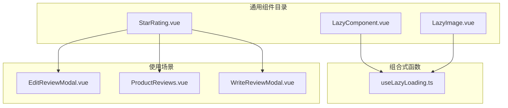
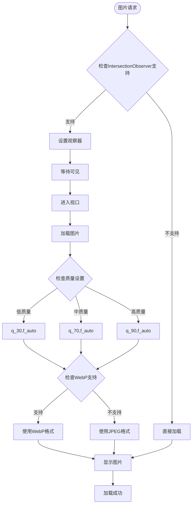
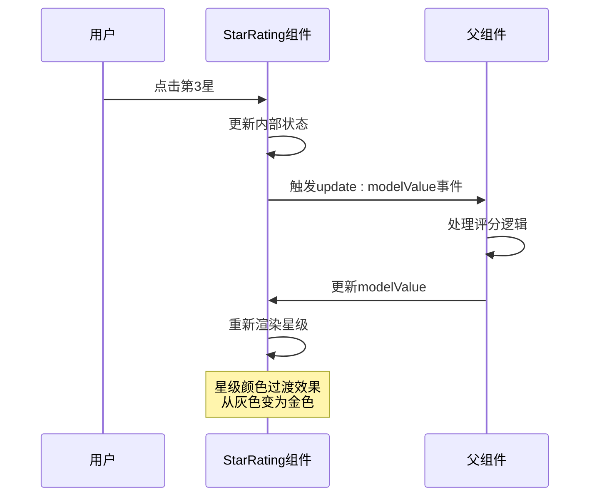

现在我已经收集了足够的信息来创建详细的文档。让我开始生成文档内容：

<docs>
# 通用组件

<cite>
**本文档中引用的文件**
- [LazyComponent.vue](file://src/components/common/LazyComponent.vue)
- [LazyImage.vue](file://src/components/common/LazyImage.vue)
- [StarRating.vue](file://src/components/ui/StarRating.vue)
- [useLazyLoading.ts](file://src\composables\useLazyLoading.ts)
</cite>

## 目录
1. [简介](#简介)
2. [项目结构](#项目结构)
3. [核心组件概览](#核心组件概览)
4. [LazyComponent 懒加载容器](#lazycomponent-懒加载容器)
5. [LazyImage 图片懒加载](#lazyimage-图片懒加载)
6. [StarRating 星级评分](#starrating-星级评分)
7. [性能优化机制](#性能优化机制)
8. [使用示例](#使用示例)
9. [最佳实践](#最佳实践)
10. [故障排除](#故障排除)

## 简介

本项目包含三个核心的基础UI组件：LazyComponent（懒加载容器）、LazyImage（图片懒加载）和StarRating（星级评分）。这些组件专为提升应用性能和用户体验而设计，采用Vue 3 Composition API构建，支持TypeScript类型安全。

## 项目结构



**图表来源**
- [LazyComponent.vue](file://src/components/common/LazyComponent.vue#L1-L288)
- [LazyImage.vue](file://src/components/common/LazyImage.vue#L1-L341)
- [StarRating.vue](file://src/components/ui/StarRating.vue#L1-L55)

## 核心组件概览

这三个组件各自承担不同的职责，但都致力于提升应用性能：

- **LazyComponent**：提供组件级别的懒加载功能，支持占位符、加载状态和错误处理
- **LazyImage**：专门优化的图片懒加载组件，支持多种质量设置和响应式图片
- **StarRating**：轻量级的星级评分组件，支持只读和可编辑模式

## LazyComponent 懒加载容器

LazyComponent是一个高级的懒加载容器组件，能够按需加载复杂的子组件，显著减少初始页面加载时间。

### 主要特性

- **智能懒加载**：基于Intersection Observer API实现
- **完整的生命周期管理**：包括加载、错误和重试机制
- **灵活的占位符系统**：支持自定义占位符内容
- **错误恢复能力**：内置重试机制和错误提示

### Props 属性

| 属性名 | 类型 | 默认值 | 描述 |
|--------|------|--------|------|
| componentLoader | () => Promise<Record<string, unknown>> | 必填 | 组件导入函数 |
| componentProps | Record<string, unknown> | {} | 传递给子组件的属性 |
| showPlaceholder | boolean | true | 是否显示加载占位符 |
| placeholderText | string | "正在加载..." | 占位符文本 |
| placeholderStyle | Record<string, string> | {minHeight: "200px"} | 占位符样式 |
| preloadDistance | number | 100 | 预加载距离（像素） |
| enableRetry | boolean | true | 启用错误重试 |
| maxRetries | number | 3 | 最大重试次数 |

### Emits 事件

| 事件名 | 参数 | 描述 |
|--------|------|------|
| loaded | [] | 组件加载完成时触发 |
| error | [error: string] | 发生错误时触发 |
| visible | [] | 组件进入视口时触发 |

### 插槽 Slots

| 插槽名 | 参数 | 描述 |
|--------|------|------|
| default | - | 默认插槽，放置实际组件 |
| placeholder | - | 自定义占位符内容 |
| loading | - | 自定义加载动画 |
| error | {error: string, retry: Function} | 自定义错误界面 |

### 使用示例

```vue
<template>
  <LazyComponent
    :component-loader="loadHeavyComponent"
    :component-props="{ userId: currentUser.id }"
    :preload-distance="200"
    @loaded="onComponentLoaded"
    @error="onComponentError"
  >
    <template #placeholder>
      <div class="custom-placeholder">
        <h3>加载中...</h3>
        <progress-bar :value="loadingProgress" />
      </div>
    </template>
  </LazyComponent>
</template>

<script setup lang="ts">
import LazyComponent from '@/components/common/LazyComponent.vue'

const loadHeavyComponent = () => import('@/components/heavy/HeavyChart.vue')

const onComponentLoaded = () => {
  console.log('组件加载完成')
}

const onComponentError = (error: string) => {
  console.error('组件加载失败:', error)
}
</script>
```

**章节来源**
- [LazyComponent.vue](file://src/components/common/LazyComponent.vue#L45-L90)

## LazyImage 图片懒加载

LazyImage是一个专门为图片优化设计的懒加载组件，支持多种质量设置、响应式图片和自动格式转换。

### 主要特性

- **Intersection Observer**：现代浏览器原生懒加载支持
- **图片质量优化**：支持低、中、高质量设置
- **WebP格式支持**：自动检测并使用WebP格式
- **响应式图片**：支持srcset和sizes属性
- **错误处理**：完善的错误状态管理和重试机制

### Props 属性

| 属性名 | 类型 | 默认值 | 描述 |
|--------|------|--------|------|
| src | string | 必填 | 图片源URL |
| placeholder | string | "" | 占位图片URL |
| alt | string | "" | 替代文本 |
| width | number \| string | "auto" | 图片宽度 |
| height | number \| string | "auto" | 图片高度 |
| showPlaceholder | boolean | true | 显示加载占位符 |
| showErrorPlaceholder | boolean | true | 显示错误占位符 |
| enableRetry | boolean | true | 启用重试功能 |
| rootMargin | string | "50px" | 观察器边距 |
| threshold | number | 0.1 | 触发阈值 |
| quality | "low" \| "medium" \| "high" | "medium" | 图片质量 |
| srcset | string | "" | 响应式图片源 |
| sizes | string | "" | 图片尺寸描述 |

### Emits 事件

| 事件名 | 参数 | 描述 |
|--------|------|------|
| load | [event: Event] | 图片加载成功时触发 |
| error | [error: string] | 图片加载失败时触发 |
| visible | [] | 图片进入视口时触发 |

### 插槽 Slots

| 插槽名 | 参数 | 描述 |
|--------|------|------|
| default | - | 默认插槽，放置图片元素 |
| placeholder | - | 自定义加载占位符 |
| error | {error: string, retry: Function} | 自定义错误界面 |

### 性能优化机制

LazyImage采用了多层次的性能优化策略：



**图表来源**
- [LazyImage.vue](file://src/components/common/LazyImage.vue#L130-L170)
- [useLazyLoading.ts](file://src\composables\useLazyLoading.ts#L15-L50)

### 使用示例

```vue
<template>
  <div class="product-gallery">
    <LazyImage
      v-for="image in product.images"
      :key="image.id"
      :src="image.url"
      :alt="image.description"
      :width="300"
      :height="200"
      :quality="image.priority === 'high' ? 'high' : 'medium'"
      :root-margin="'100px'"
      :threshold="0.2"
      @load="onImageLoad"
      @error="onImageError"
    >
      <template #placeholder>
        <div class="gallery-placeholder">
          <spinner-icon />
          <p>加载中...</p>
        </div>
      </template>
    </LazyImage>
  </div>
</template>

<script setup lang="ts">
import LazyImage from '@/components/common/LazyImage.vue'

const onImageLoad = (event: Event) => {
  console.log('图片加载完成:', event.target)
}

const onImageError = (error: string) => {
  console.error('图片加载失败:', error)
}
</script>
```

**章节来源**
- [LazyImage.vue](file://src/components/common/LazyImage.vue#L50-L120)

## StarRating 星级评分

StarRating是一个简洁高效的星级评分组件，支持双向绑定和只读模式，广泛应用于用户评价系统。

### 主要特性

- **响应式交互**：点击评分和悬停高亮
- **双向数据绑定**：支持v-model语法
- **只读模式**：适用于展示评分结果
- **平滑过渡效果**：星级切换时的视觉反馈
- **语义化HTML**：使用★字符确保无障碍访问

### Props 属性

| 属性名 | 类型 | 默认值 | 描述 |
|--------|------|--------|------|
| modelValue | number | 必填 | 当前评分值（1-5） |
| readonly | boolean | false | 是否只读模式 |

### Emits 事件

| 事件名 | 参数 | 描述 |
|--------|------|------|
| update:modelValue | [value: number] | 评分改变时触发 |

### 使用示例

```vue
<template>
  <div class="review-system">
    <!-- 可编辑评分 -->
    <StarRating
      v-model:model-value="userRating"
      :readonly="false"
      @update:model-value="onRatingChange"
    />
    
    <!-- 只读评分展示 -->
    <StarRating
      :model-value="averageRating"
      :readonly="true"
    />
    
    <!-- 分组评分 -->
    <div class="rating-group">
      <label>功能评分:</label>
      <StarRating
        v-model:model-value="featuresRating"
        :readonly="false"
      />
    </div>
  </div>
</template>

<script setup lang="ts">
import StarRating from '@/components/ui/StarRating.vue'

const userRating = ref(0)
const averageRating = ref(4.5)
const featuresRating = ref(0)

const onRatingChange = (newValue: number) => {
  console.log('用户评分:', newValue)
  // 发送评分到服务器
  saveRatingToServer(newValue)
}
</script>
```

### 交互反馈设计

StarRating的交互设计注重用户体验：



**图表来源**
- [StarRating.vue](file://src/components/ui/StarRating.vue#L1-L55)

**章节来源**
- [StarRating.vue](file://src/components/ui/StarRating.vue#L1-L55)

## 性能优化机制

### LazyComponent 优化策略

1. **组件级别懒加载**：避免一次性加载所有组件
2. **内存管理**：组件卸载时自动清理资源
3. **防抖处理**：避免频繁的状态更新
4. **条件渲染**：仅在需要时渲染组件内容

### LazyImage 优化策略

1. **Intersection Observer**：现代浏览器原生支持，性能优异
2. **图片格式优化**：自动选择最优格式
3. **质量控制**：根据网络状况动态调整质量
4. **缓存策略**：利用浏览器缓存机制

### StarRating 优化策略

1. **最小DOM结构**：仅使用必要的HTML元素
2. **CSS过渡动画**：利用硬件加速的CSS动画
3. **事件委托**：减少事件监听器数量
4. **无障碍支持**：确保键盘导航和屏幕阅读器兼容

## 使用示例

### 在评论系统中的应用

```vue
<template>
  <div class="review-section">
    <!-- 编辑评论 -->
    <EditReviewModal
      v-if="showEditModal"
      :review-id="editingReviewId"
      @close="closeEditModal"
      @saved="onReviewSaved"
    >
      <template #rating>
        <LazyComponent
          :component-loader="loadStarRating"
          :component-props="{ modelValue: form.rating }"
        >
          <StarRating
            v-model:model-value="form.rating"
            :readonly="false"
          />
        </LazyComponent>
      </template>
    </EditReviewModal>
    
    <!-- 产品评分展示 -->
    <div class="product-ratings">
      <LazyImage
        :src="product.image"
        :alt="product.name"
        :width="100"
        :height="100"
        :quality="product.featured ? 'high' : 'medium'"
      />
      
      <div class="rating-summary">
        <h3>{{ product.name }}</h3>
        <StarRating
          :model-value="product.averageRating"
          :readonly="true"
        />
        <span class="rating-count">({{ product.reviewCount }}条评价)</span>
      </div>
    </div>
  </div>
</template>
```

### 在产品列表中的应用

```vue
<template>
  <div class="product-list">
    <div
      v-for="product in productList"
      :key="product.id"
      class="product-item"
    >
      <LazyImage
        :src="product.thumbnail"
        :alt="product.title"
        :width="200"
        :height="150"
        :placeholder="placeholderUrl"
        :quality="product.popular ? 'high' : 'medium'"
        @load="onImageLoaded(product.id)"
      />
      
      <div class="product-info">
        <h4>{{ product.title }}</h4>
        <StarRating
          :model-value="product.rating"
          :readonly="true"
          class="product-rating"
        />
        <span class="price">${{ product.price }}</span>
      </div>
    </div>
  </div>
</template>
```

## 最佳实践

### LazyComponent 使用建议

1. **合理设置预加载距离**：根据页面布局调整`preloadDistance`参数
2. **提供有意义的占位符**：避免空白区域影响用户体验
3. **处理加载状态**：为用户提供明确的加载反馈
4. **错误处理**：实现优雅的错误恢复机制

### LazyImage 使用建议

1. **选择合适的质量设置**：平衡质量和加载速度
2. **使用响应式图片**：通过srcset和sizes属性适配不同设备
3. **提供备用图片**：设置placeholder属性作为后备方案
4. **监控加载性能**：使用@load和@error事件跟踪性能指标

### StarRating 使用建议

1. **语义化使用**：在适当的地方使用只读模式
2. **一致性设计**：保持评分组件在整个应用中的一致性
3. **无障碍访问**：确保组件对所有用户都可用
4. **实时反馈**：及时更新评分状态和相关数据

## 故障排除

### LazyComponent 常见问题

**问题**：组件未正确加载
- 检查`componentLoader`函数是否正确返回组件
- 确认组件路径是否正确
- 验证网络连接和模块解析

**问题**：占位符不显示
- 检查`showPlaceholder`属性设置
- 验证CSS样式是否被覆盖
- 确认插槽内容是否正确传递

### LazyImage 常见问题

**问题**：图片不懒加载
- 检查浏览器是否支持Intersection Observer
- 验证`rootMargin`和`threshold`设置
- 确认图片URL是否有效

**问题**：图片质量不佳
- 检查`quality`属性设置
- 验证