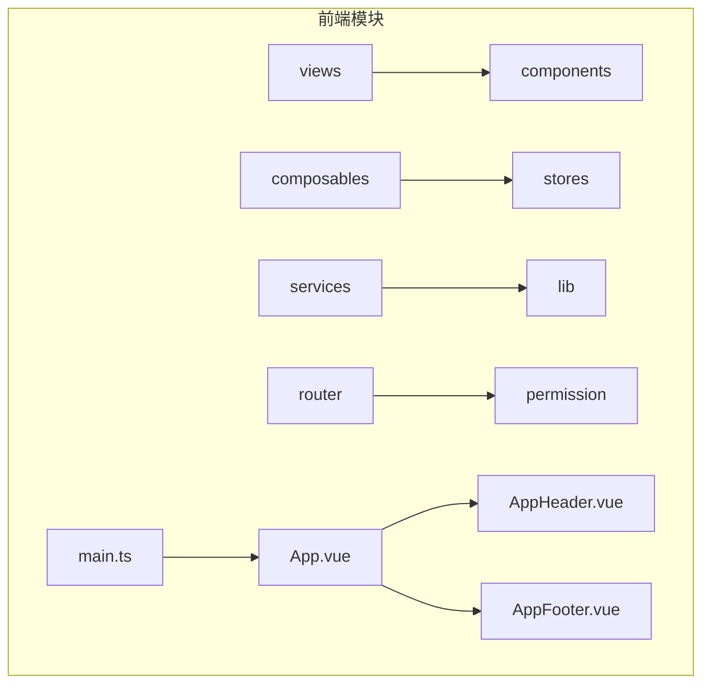
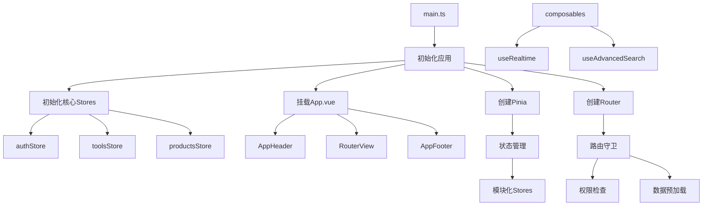
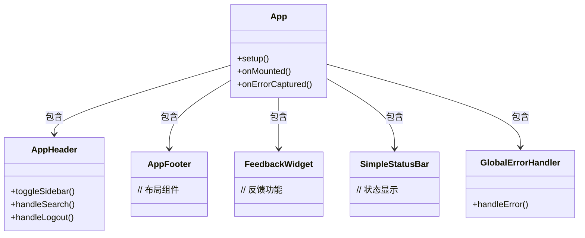
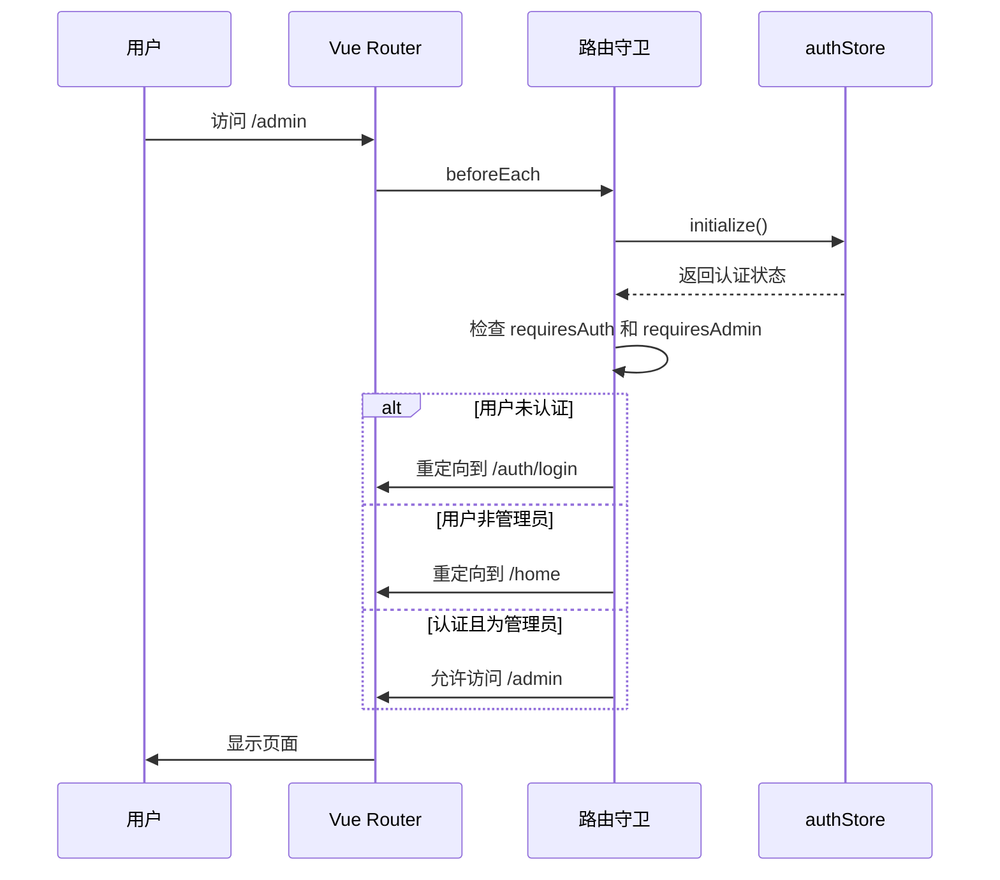
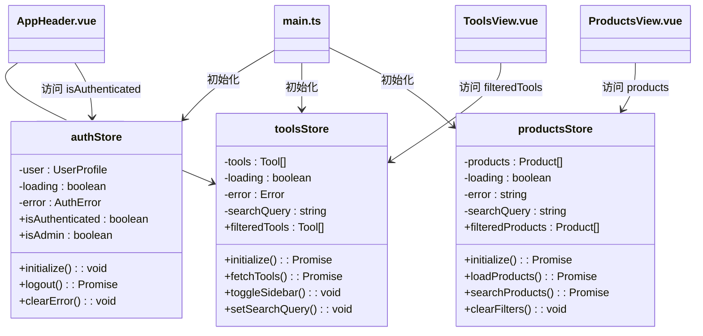
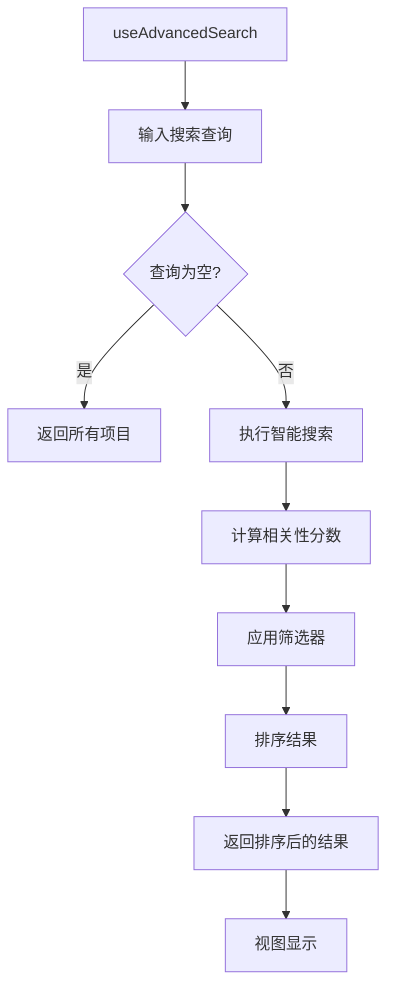
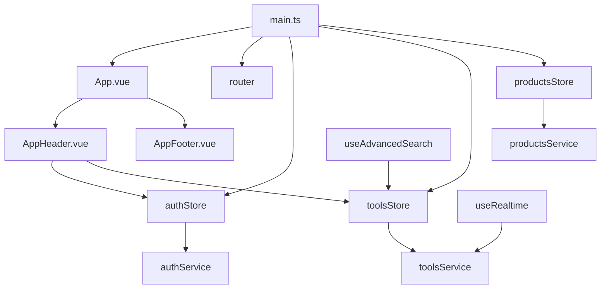

# 前端架构

<cite>
**本文档引用的文件**   
- [main.ts](file://src/main.ts)
- [App.vue](file://src/App.vue)
- [index.ts](file://src/router/index.ts)
- [permission.ts](file://src/permission.ts)
- [auth.ts](file://src/stores/auth.ts)
- [products.ts](file://src/stores/products.ts)
- [tools.ts](file://src/stores/tools.ts)
- [useRealtime.ts](file://src/composables/useRealtime.ts)
- [useAdvancedSearch.ts](file://src/composables/useAdvancedSearch.ts)
- [AppHeader.vue](file://src/components/AppHeader.vue)
</cite>

## 目录
1. [项目结构](#项目结构)
2. [核心组件](#核心组件)
3. [架构概述](#架构概述)
4. [详细组件分析](#详细组件分析)
5. [依赖分析](#依赖分析)
6. [性能考虑](#性能考虑)
7. [故障排除指南](#故障排除指南)
8. [结论](#结论)

## 项目结构

项目采用基于功能的模块化结构，将代码按职责分离。`src` 目录下包含 `components`（可复用UI组件）、`views`（页面级组件）、`stores`（Pinia状态管理）、`composables`（组合式函数）、`services`（业务逻辑与API调用）、`router`（路由配置）和 `types`（类型定义）等关键模块。这种分层设计清晰地划分了关注点，便于维护和扩展。

**图表来源**
- [main.ts](file://src/main.ts#L1-L58)
- [App.vue](file://src/App.vue#L1-L70)

**本节来源**
- [main.ts](file://src/main.ts#L1-L58)
- [App.vue](file://src/App.vue#L1-L70)

## 核心组件

系统核心由 `main.ts` 入口文件、`App.vue` 根组件、`router` 路由系统、`stores` 状态管理及 `composables` 逻辑复用模块构成。`main.ts` 负责应用的初始化和依赖注入；`App.vue` 提供全局布局和状态分发；路由系统管理页面导航；Pinia stores 实现模块化的全局状态管理；组合式函数则封装了跨组件的通用逻辑。

**本节来源**
- [main.ts](file://src/main.ts#L1-L58)
- [App.vue](file://src/App.vue#L1-L70)

## 架构概述

系统采用 Vue 3 的 MVVM 模式，结合 TypeScript 实现类型安全。应用启动时，`main.ts` 创建 Vue 实例并挂载 Pinia 和 Router。`App.vue` 作为视图容器，集成全局组件和布局。路由系统基于 Vue Router 实现懒加载和权限控制。Pinia 提供模块化的状态管理，各 store 负责特定领域的数据流。组合式 API 通过 `composables` 封装可复用的逻辑，如实时数据同步和高级搜索。

**图表来源**
- [main.ts](file://src/main.ts#L1-L58)
- [App.vue](file://src/App.vue#L1-L70)
- [permission.ts](file://src/permission.ts#L1-L90)

**本节来源**
- [main.ts](file://src/main.ts#L1-L58)
- [App.vue](file://src/App.vue#L1-L70)
- [permission.ts](file://src/permission.ts#L1-L90)

## 详细组件分析

### 主应用初始化分析

`main.ts` 是应用的入口点，负责协调所有核心依赖的初始化。它首先创建 Vue 和 Pinia 实例，并导入 `App.vue` 根组件。关键流程在于 `initializeCoreStores` 异步函数，它并发初始化 `authStore`、`toolsStore` 和 `productsStore`，确保在应用挂载前完成核心数据的加载。最后，应用实例挂载到 DOM。

**本节来源**
- [main.ts](file://src/main.ts#L1-L58)

### 根组件与全局布局分析

`App.vue` 作为应用的根组件，采用 `<script setup>` 语法糖，通过组合式 API 管理生命周期和错误处理。其模板结构清晰：`AppHeader` 和 `AppFooter` 提供全局导航和信息，`RouterView` 是动态内容的占位符，`FeedbackWidget` 和 `SimpleStatusBar` 提供辅助功能。`onMounted` 钩子初始化全局错误处理器，`onErrorCaptured` 捕获并处理组件级错误。

**图表来源**
- [App.vue](file://src/App.vue#L1-L70)
- [AppHeader.vue](file://src/components/AppHeader.vue#L1-L601)

**本节来源**
- [App.vue](file://src/App.vue#L1-L70)

### 路由系统分析

路由系统在 `router/index.ts` 中定义，采用声明式配置。所有路由均使用动态导入（`() => import(...)`）实现代码分割和懒加载。路由元信息（`meta`）包含页面标题、描述及权限要求（`requiresAuth`, `requiresAdmin`）。`permission.ts` 文件中的 `setupRouterGuard` 函数注册了全局前置守卫，实现权限控制：检查用户认证状态和管理员角色，并根据结果进行重定向。

**图表来源**
- [index.ts](file://src/router/index.ts#L1-L360)
- [permission.ts](file://src/permission.ts#L1-L90)

**本节来源**
- [index.ts](file://src/router/index.ts#L1-L360)
- [permission.ts](file://src/permission.ts#L1-L90)

### Pinia状态管理分析

Pinia 状态管理采用模块化设计，每个 store 文件（如 `auth.ts`, `tools.ts`, `products.ts`）定义一个独立的 store。每个 store 包含 `state`（状态）、`getters`（计算属性）和 `actions`（操作）。例如，`authStore` 管理用户认证状态，`isAuthenticated` 和 `isAdmin` 是其核心 getter。`toolsStore` 和 `productsStore` 负责各自领域的数据获取和缓存。`initialize` action 是各 store 的入口，负责从后端加载初始数据。

**图表来源**
- [auth.ts](file://src/stores/auth.ts#L1-L151)
- [tools.ts](file://src/stores/tools.ts#L1-L341)
- [products.ts](file://src/stores/products.ts#L1-L362)

**本节来源**
- [auth.ts](file://src/stores/auth.ts#L1-L151)
- [tools.ts](file://src/stores/tools.ts#L1-L341)
- [products.ts](file://src/stores/products.ts#L1-L362)

### 组合式函数分析

组合式函数封装了可复用的逻辑。`useRealtime.ts` 提供了与 Supabase 实时数据库交互的能力，支持订阅表的增删改查事件，并提供了 `useRealtimeList`、`useRealtimeRecord` 等高级封装，简化了实时数据同步的实现。`useAdvancedSearch.ts` 实现了智能搜索算法，支持多字段加权搜索、模糊匹配和结果排序，其返回的 `searchResults` 是一个计算属性，能响应式地更新。

**图表来源**
- [useAdvancedSearch.ts](file://src/composables/useAdvancedSearch.ts#L1-L309)
- [useRealtime.ts](file://src/composables/useRealtime.ts#L1-L402)

**本节来源**
- [useAdvancedSearch.ts](file://src/composables/useAdvancedSearch.ts#L1-L309)
- [useRealtime.ts](file://src/composables/useRealtime.ts#L1-L402)

## 依赖分析

系统依赖关系清晰。`main.ts` 是顶层依赖，依赖于 `App.vue`、`router` 和所有核心 `stores`。`App.vue` 依赖于全局组件（`AppHeader`, `AppFooter` 等）和 `router`。`AppHeader.vue` 直接依赖于 `authStore` 和 `toolsStore` 来获取用户状态和控制侧边栏。各 `store` 依赖于 `services` 层（如 `databaseService`）与后端交互。`composables` 可以依赖于 `stores` 或直接与 `services` 交互。

**图表来源**
- [main.ts](file://src/main.ts#L1-L58)
- [App.vue](file://src/App.vue#L1-L70)
- [AppHeader.vue](file://src/components/AppHeader.vue#L1-L601)

**本节来源**
- [main.ts](file://src/main.ts#L1-L58)
- [App.vue](file://src/App.vue#L1-L70)
- [AppHeader.vue](file://src/components/AppHeader.vue#L1-L601)

## 性能考虑

系统在多个层面进行了性能优化。路由采用懒加载，确保按需加载代码块。`main.ts` 中使用 `Promise.all` 并发初始化多个 store，缩短了启动时间。`permission.ts` 中的路由守卫对公开页面进行短路判断，避免不必要的认证检查。`toolsStore` 和 `productsStore` 在 `initialize` 方法中实现了防重初始化逻辑。`useRealtime` 提供了连接状态管理和自动重连机制，保证了实时功能的健壮性。

## 故障排除指南

常见问题包括：
1.  **应用无法启动**：检查 `main.ts` 中的 `initializeCoreStores` 是否成功，查看控制台是否有 store 初始化失败的错误。
2.  **路由无法访问**：检查 `permission.ts` 中的路由守卫逻辑，确认用户权限是否满足 `meta.requiresAuth` 或 `meta.requiresAdmin`。
3.  **数据未加载**：检查对应 `store` 的 `initialize` 或 `load` 方法是否被正确调用，确认 `services` 层的 API 调用是否成功。
4.  **实时更新失效**：检查 `useRealtime` 的 `subscribe` 是否成功，确认网络连接和 Supabase 服务状态。

**本节来源**
- [main.ts](file://src/main.ts#L1-L58)
- [permission.ts](file://src/permission.ts#L1-L90)
- [auth.ts](file://src/stores/auth.ts#L1-L151)

## 结论

该前端架构设计良好，充分利用了 Vue 3、TypeScript 和 Pinia 的优势。MVVM 模式清晰地分离了视图、模型和视图模型。模块化的 Pinia store 和组合式函数提高了代码的可维护性和复用性。路由系统和权限控制机制保障了应用的安全性。整体架构具备良好的扩展性和性能表现，为后续功能开发奠定了坚实基础。