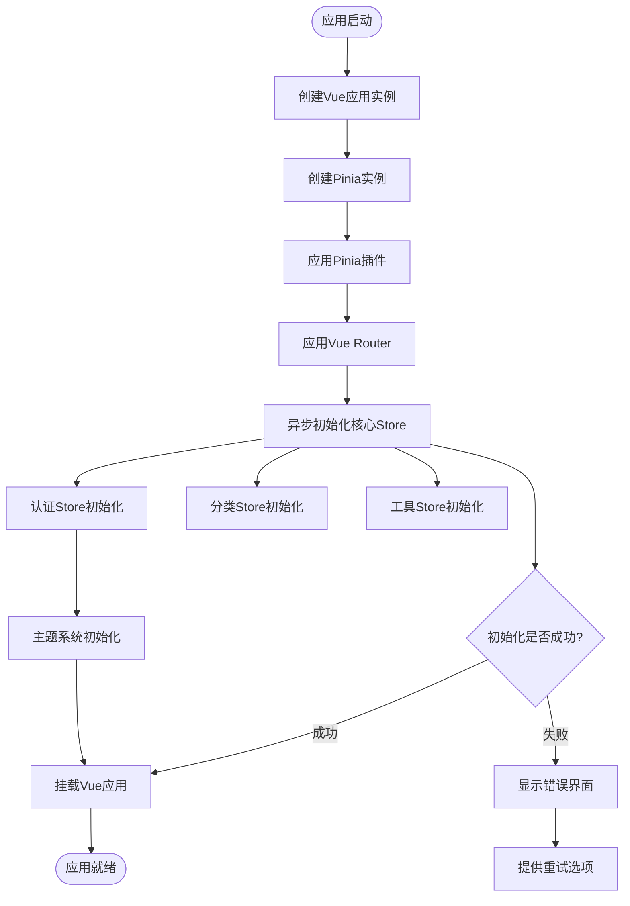
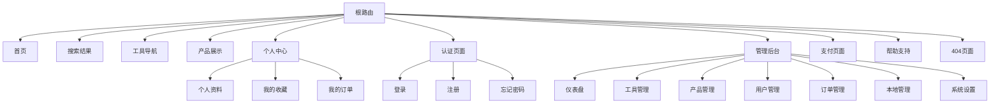
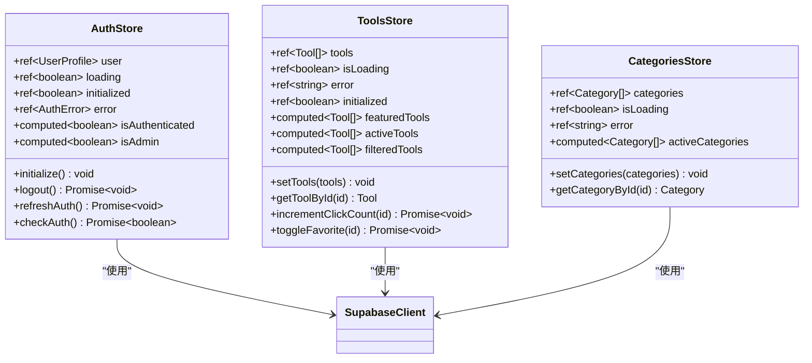
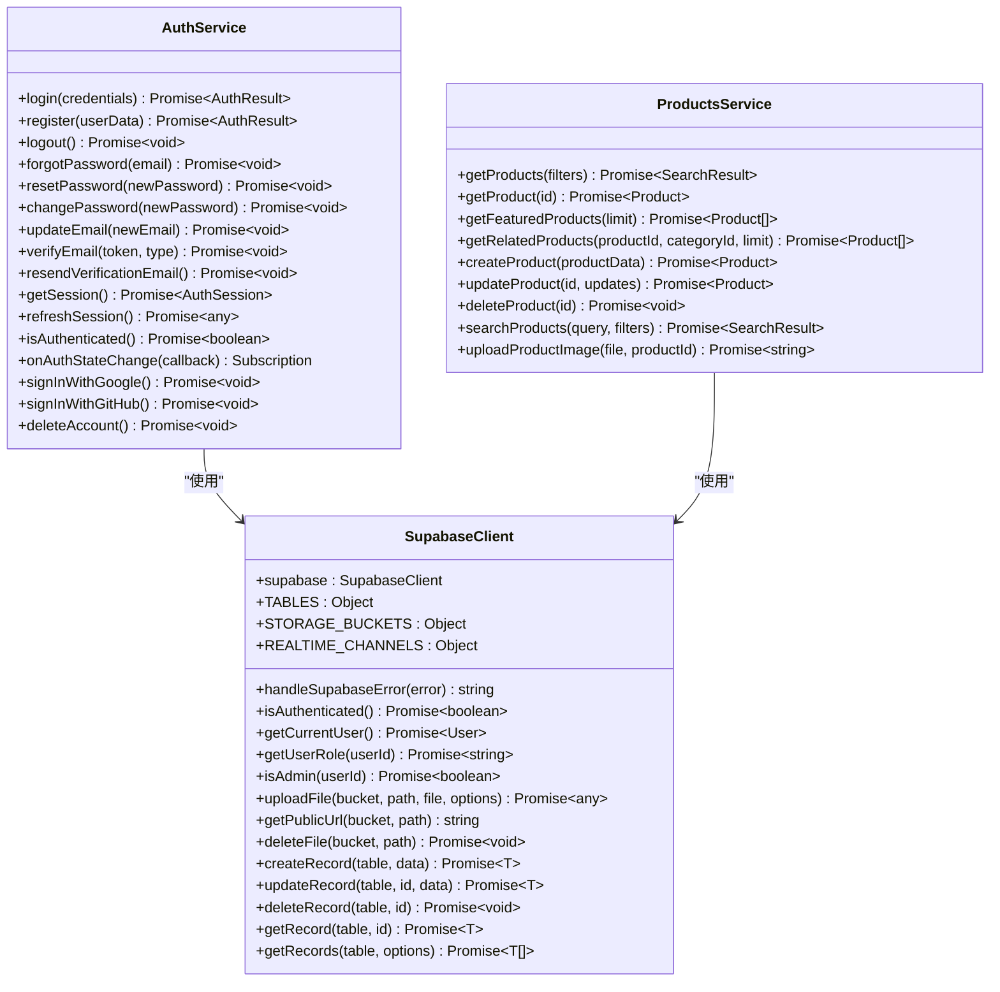
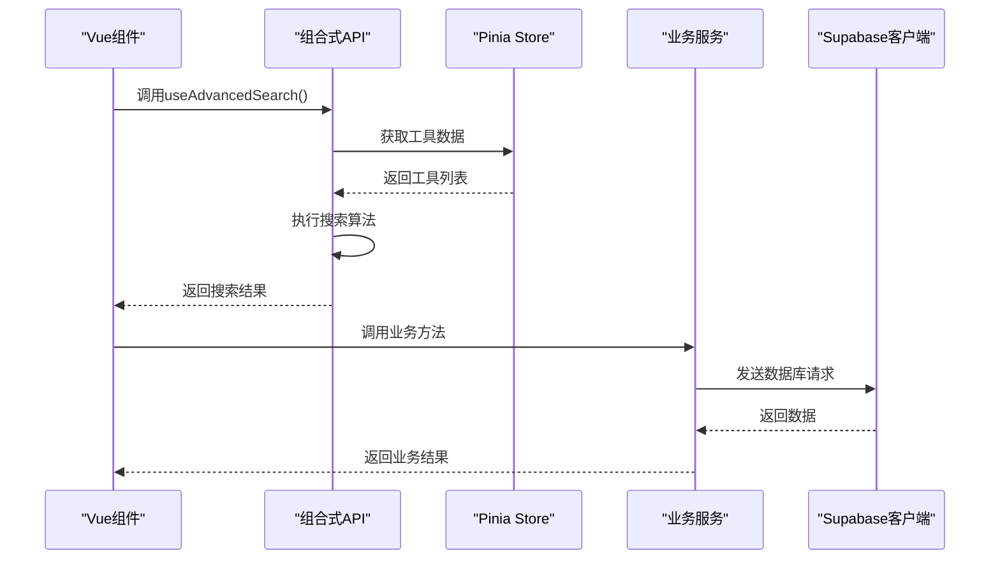
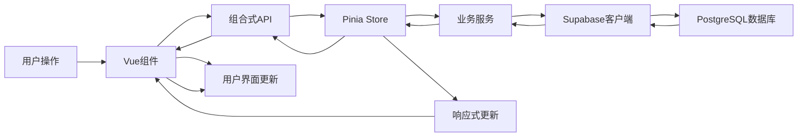
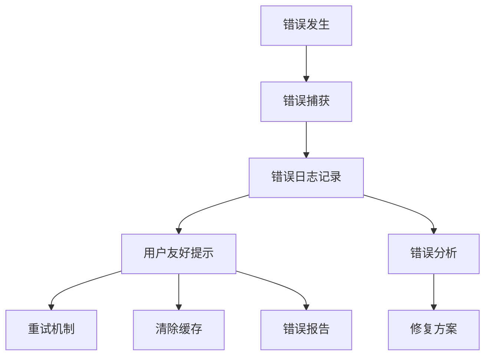

# 前端架构设计文档

<cite>
**本文档引用的文件**
- [src/main.ts](file://src/main.ts)
- [src/App.vue](file://src/App.vue)
- [src/router/index.ts](file://src/router/index.ts)
- [src/stores/auth.ts](file://src/stores/auth.ts)
- [src/services/authService.ts](file://src/services/authService.ts)
- [src/lib/supabaseClient.ts](file://src/lib/supabaseClient.ts)
- [src/views/HomeView.vue](file://src/views/HomeView.vue)
- [src/stores/tools.ts](file://src/stores/tools.ts)
- [src/composables/useAdvancedSearch.ts](file://src/composables/useAdvancedSearch.ts)
- [src/services/productsService.ts](file://src/services/productsService.ts)
</cite>

## 目录
1. [项目概述](#项目概述)
2. [应用初始化架构](#应用初始化架构)
3. [路由系统设计](#路由系统设计)
4. [状态管理架构](#状态管理架构)
5. [服务层设计](#服务层设计)
6. [组件架构模式](#组件架构模式)
7. [数据流分析](#数据流分析)
8. [性能优化策略](#性能优化策略)
9. [错误处理机制](#错误处理机制)
10. [总结](#总结)

## 项目概述

本项目是一个现代化的前端应用，采用Vue 3 Composition API构建，集成了Pinia状态管理、Vue Router路由系统和Supabase数据库服务。整体架构遵循模块化设计原则，实现了清晰的关注点分离和高度可维护的代码结构。

### 核心技术栈
- **框架**: Vue 3 (Composition API)
- **状态管理**: Pinia
- **路由管理**: Vue Router
- **UI组件**: 自定义组件库
- **数据库**: Supabase (PostgreSQL + Storage)
- **构建工具**: Vite

## 应用初始化架构

### 启动流程设计

应用的启动过程经过精心设计，确保所有核心依赖和服务能够正确初始化：



**图表来源**
- [src/main.ts](file://src/main.ts#L1-L132)

### 核心初始化逻辑

主入口文件`main.ts`展示了优雅的应用初始化流程：

```typescript
// 并发初始化所有核心Store
await Promise.all([
  authStore.initialize(),
  categoriesStore.initialize(),
  toolsStore.initialize(),
]);

// 主题系统初始化
const { applyTheme } = useSimpleTheme();
applyTheme();
```

这种并发初始化策略显著提升了应用启动性能，避免了串行等待导致的延迟。

**章节来源**
- [src/main.ts](file://src/main.ts#L25-L50)

## 路由系统设计

### 路由架构概览

Vue Router提供了强大的路由管理能力，支持嵌套路由、路由守卫和动态路由：



**图表来源**
- [src/router/index.ts](file://src/router/index.ts#L1-L399)

### 路由守卫机制

路由守卫确保了应用的安全性和用户体验：

```typescript
// 路由守卫实现
router.beforeEach(async (to, from, next) => {
  const authStore = useAuthStore();
  
  // 检查是否需要认证
  if (to.meta.requiresAuth) {
    const isAuthenticated = authStore.isAuthenticated;
    if (!isAuthenticated) {
      // 重定向到登录页
      return next({
        name: 'Login',
        query: { redirect: to.fullPath }
      });
    }
  }

  // 检查管理员权限
  if (to.meta.requiresAdmin) {
    const isAdmin = await authStore.isAdminFunction();
    if (!isAdmin) {
      return next({ name: 'NotFound' });
    }
  }
});
```

**章节来源**
- [src/router/index.ts](file://src/router/index.ts#L350-L399)

## 状态管理架构

### Pinia Store 设计模式

应用采用Pinia作为状态管理解决方案，实现了模块化的状态管理：



**图表来源**
- [src/stores/auth.ts](file://src/stores/auth.ts#L1-L190)
- [src/stores/tools.ts](file://src/stores/tools.ts#L1-L199)

### 认证状态管理

认证Store实现了完整的用户生命周期管理：

```typescript
export const useAuthStore = defineStore("auth", () => {
  const user = ref<UserProfile | null>(null);
  const loading = ref(false);
  const initialized = ref(false);
  
  // 监听Supabase认证状态变化
  function initialize() {
    const { data: { subscription } } = supabase.auth.onAuthStateChange(
      async (event, session) => {
        if (session?.user) {
          const profile = await fetchUserProfile(session.user.id);
          user.value = {
            ...session.user,
            username: profile?.username || "未设置用户名",
            avatar_url: profile?.avatar_url || "",
            role: profile?.role || "user",
          };
        } else {
          user.value = null;
        }
      }
    );
  }
});
```

**章节来源**
- [src/stores/auth.ts](file://src/stores/auth.ts#L40-L120)

## 服务层设计

### 服务架构模式

服务层采用了面向对象的设计模式，每个服务类负责特定的业务领域：



**图表来源**
- [src/services/authService.ts](file://src/services/authService.ts#L1-L306)
- [src/services/productsService.ts](file://src/services/productsService.ts#L1-L347)
- [src/lib/supabaseClient.ts](file://src/lib/supabaseClient.ts#L1-L246)

### 服务抽象层次

服务层提供了清晰的抽象层次：

1. **底层服务**: 直接与Supabase交互
2. **业务服务**: 封装业务逻辑
3. **组合式API**: 提供响应式数据流

**章节来源**
- [src/services/authService.ts](file://src/services/authService.ts#L15-L100)
- [src/services/productsService.ts](file://src/services/productsService.ts#L15-L100)

## 组件架构模式

### 组合式API设计

应用广泛使用组合式API来实现逻辑复用和响应式数据管理：



**图表来源**
- [src/composables/useAdvancedSearch.ts](file://src/composables/useAdvancedSearch.ts#L1-L306)

### 搜索功能实现

高级搜索功能展示了组合式API的强大能力：

```typescript
export function useAdvancedSearch() {
  const toolsStore = useToolsStore();
  
  const performSearch = (query: string, items: Tool[]): SearchResult[] => {
    const searchTerms = query.toLowerCase().split(/\s+/).filter(term => term.length > 0);
    const results: SearchResult[] = [];
    
    items.forEach(item => {
      let score = 0;
      const matches: string[] = [];
      
      // 多字段搜索算法
      const searchFields = [
        { field: "name", weight: 10 },
        { field: "description", weight: 5 },
        { field: "tags", weight: 3 },
        { field: "categories.name", weight: 2 },
      ];
      
      searchTerms.forEach(term => {
        searchFields.forEach(({ field, weight }) => {
          const value = getNestedValue(item, field);
          if (value && searchInField(value, term)) {
            score += weight;
            if (!matches.includes(field)) {
              matches.push(field);
            }
          }
        });
      });
      
      if (score > 0) {
        results.push({ item, score, matches });
      }
    });
    
    return results.sort((a, b) => b.score - a.score);
  };
  
  return {
    searchQuery,
    filters,
    searchResults,
    searchSuggestions,
    popularSearches,
    searchHistory,
    isSearching,
    search,
    clearSearch,
    resetFilters,
  };
}
```

**章节来源**
- [src/composables/useAdvancedSearch.ts](file://src/composables/useAdvancedSearch.ts#L30-L120)

## 数据流分析

### 完整数据流路径

应用的数据流遵循单向数据流原则，确保了数据的一致性和可预测性：



**图表来源**
- [src/views/HomeView.vue](file://src/views/HomeView.vue#L1-L600)
- [src/stores/tools.ts](file://src/stores/tools.ts#L1-L199)

### 视图组件数据绑定

HomeView展示了典型的数据绑定模式：

```typescript
// 响应式状态管理
const toolsStore = useToolsStore();
const categoriesStore = useCategoriesStore();
const authStore = useAuthStore();

// 计算属性
const displayTools = computed(() => {
  if (searchResults.value) {
    return searchResults.value.items || [];
  }
  
  let tools = toolsStore.tools;
  if (selectedCategory.value) {
    tools = tools.filter((tool) => 
      tool.category_id === selectedCategory.value
    );
  }
  return tools;
});

// 生命周期钩子
onMounted(async () => {
  // 等待store初始化完成
  if (!toolsStore.initialized) {
    await toolsStore.initialize();
  }
  if (!categoriesStore.initialized) {
    await categoriesStore.initialize();
  }
});
```

**章节来源**
- [src/views/HomeView.vue](file://src/views/HomeView.vue#L100-L150)

## 性能优化策略

### 懒加载和代码分割

应用实现了多层次的性能优化：

1. **路由级懒加载**: 路由组件按需加载
2. **组件级懒加载**: 复杂组件延迟加载
3. **资源预加载**: 关键资源提前加载

```typescript
// 路由懒加载示例
{
  path: "/tools",
  name: "Tools",
  component: () => import("../views/ToolsView.vue"),
  meta: {
    title: "工具导航",
    description: "发现和管理您的常用工具",
  },
},
```

### 缓存策略

应用实现了多层缓存机制：

1. **内存缓存**: Pinia Store中的数据缓存
2. **本地存储**: 用户偏好设置和临时数据
3. **浏览器缓存**: 静态资源缓存

### 异步初始化优化

```typescript
// 并发初始化提升性能
await Promise.all([
  authStore.initialize(),
  categoriesStore.initialize(),
  toolsStore.initialize(),
]);
```

## 错误处理机制

### 多层次错误处理

应用实现了完善的错误处理体系：



### 全局错误处理器

App.vue集成了全局错误处理机制：

```typescript
// 全局错误处理
onErrorCaptured((err, _vm, info) => {
  console.error("Vue组件错误:", err, info);
  // 错误已由GlobalErrorHandler组件处理
  return false; // 阻止错误继续传播
});

// 初始化全局错误处理器
onMounted(() => {
  setupGlobalErrorHandler();
});
```

**章节来源**
- [src/App.vue](file://src/App.vue#L20-L30)

## 总结

本前端架构展现了现代Vue 3应用的最佳实践：

### 架构优势

1. **模块化设计**: 清晰的职责分离和模块化组织
2. **响应式编程**: 充分利用Vue 3的响应式特性
3. **类型安全**: TypeScript提供完整的类型安全保障
4. **性能优化**: 多层次的性能优化策略
5. **可维护性**: 高度可维护的代码结构和设计模式

### 技术亮点

- **组合式API**: 实现了灵活的逻辑复用
- **Pinia状态管理**: 简洁高效的全局状态管理
- **Vue Router**: 强大的路由管理和守卫机制
- **Supabase集成**: 完整的后端即服务解决方案
- **服务层抽象**: 清晰的业务逻辑封装

### 设计原则

- **单一职责**: 每个模块都有明确的职责边界
- **关注点分离**: UI逻辑、业务逻辑、数据访问分离
- **可测试性**: 模块化设计便于单元测试
- **可扩展性**: 插件化架构支持功能扩展

这种架构设计不仅保证了应用的稳定性和性能，还为未来的功能扩展和维护提供了坚实的基础。通过合理的抽象和模块化设计，开发者可以快速理解和修改代码，大大提高了开发效率和代码质量。