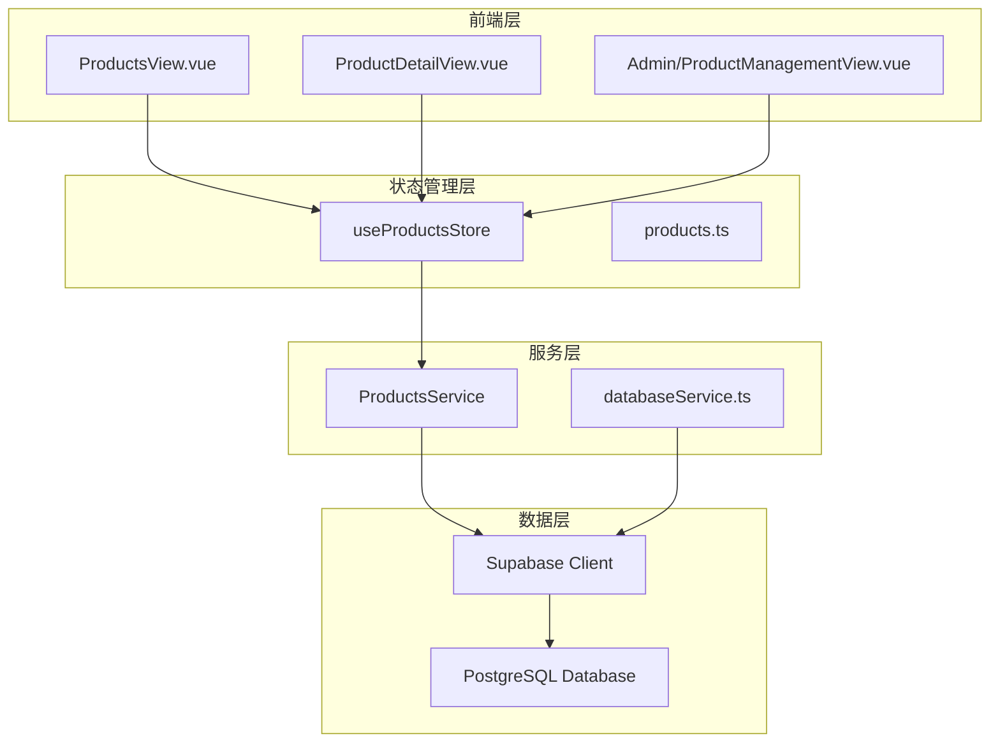
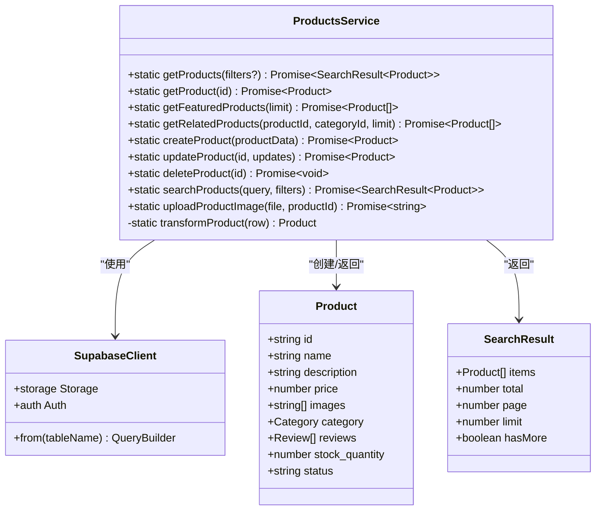
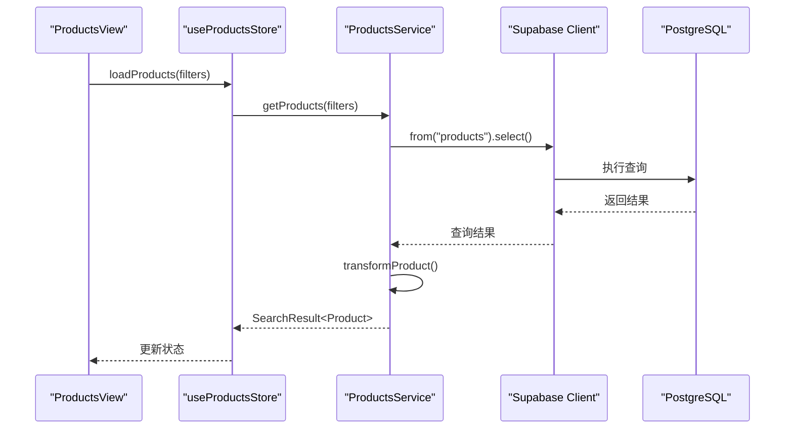
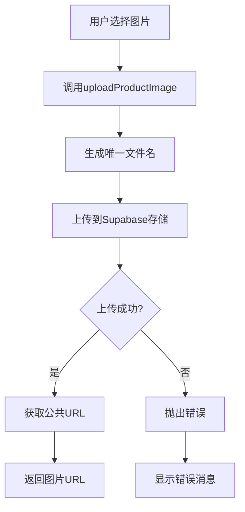
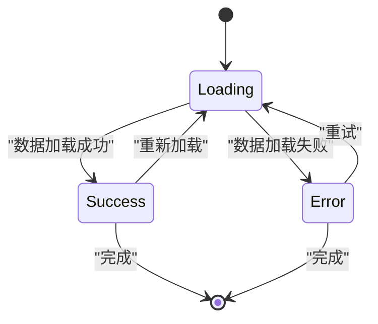
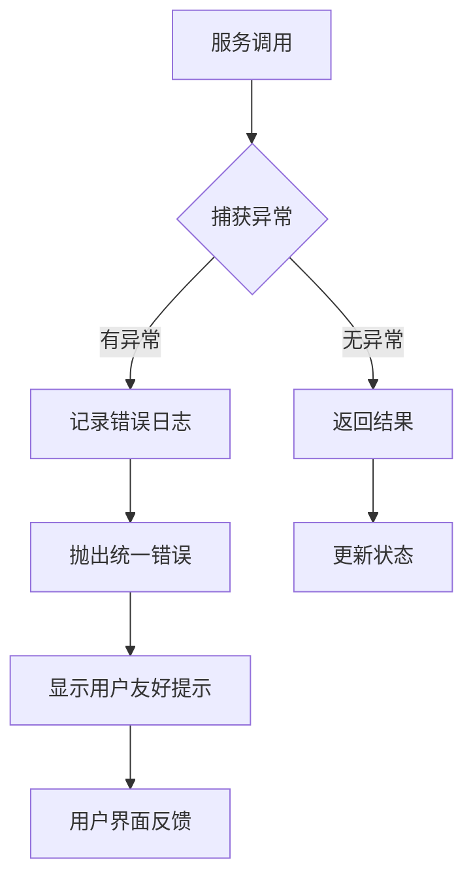
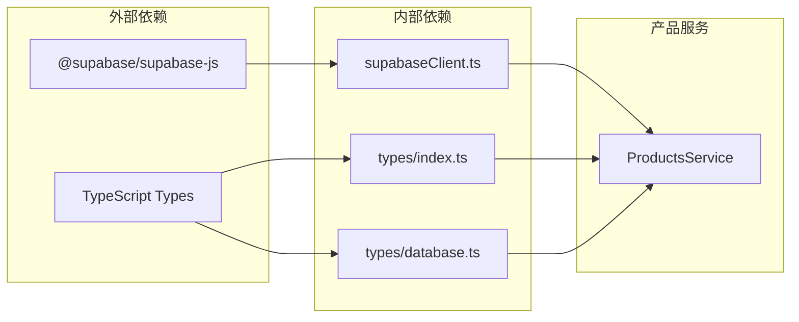

# 产品服务技术文档

<cite>
**本文档引用的文件**
- [productsService.ts](file://src/services/productsService.ts)
- [products.ts](file://src/stores/products.ts)
- [ProductsView.vue](file://src/views/ProductsView.vue)
- [supabaseClient.ts](file://src/lib/supabaseClient.ts)
- [database.ts](file://src/types/database.ts)
- [supabase-schema.ts](file://src/lib/supabase-schema.ts)
- [index.ts](file://src/types/index.ts)
</cite>

## 目录
1. [简介](#简介)
2. [项目结构](#项目结构)
3. [核心组件](#核心组件)
4. [架构概览](#架构概览)
5. [详细组件分析](#详细组件分析)
6. [依赖关系分析](#依赖关系分析)
7. [性能考虑](#性能考虑)
8. [故障排除指南](#故障排除指南)
9. [结论](#结论)

## 简介

产品服务（ProductsService）是本系统的核心业务服务层，负责管理商品信息的完整生命周期。该服务提供了丰富的接口方法，支持产品查询、筛选、创建、更新、删除等操作，同时集成了缓存策略和类型安全的数据库查询机制。

产品服务采用静态类设计模式，通过Supabase客户端直接执行数据库操作，确保了数据的一致性和实时性。服务层与前端视图层通过Pinia状态管理进行交互，实现了响应式的用户体验。

## 项目结构

产品服务在整个项目架构中的位置如下：



**图表来源**
- [ProductsView.vue](file://src/views/ProductsView.vue#L1-L50)
- [products.ts](file://src/stores/products.ts#L1-L30)
- [productsService.ts](file://src/services/productsService.ts#L1-L20)

**章节来源**
- [productsService.ts](file://src/services/productsService.ts#L1-L347)
- [products.ts](file://src/stores/products.ts#L1-L365)

## 核心组件

### ProductsService 类

ProductsService 是一个静态类，提供了完整的 CRUD 操作和高级查询功能：

- **getProducts()**: 获取带分页和筛选的产品列表
- **getProduct()**: 加载单个产品的详细信息
- **getFeaturedProducts()**: 获取精选产品
- **getRelatedProducts()**: 获取相关产品推荐
- **createProduct()**: 创建新产品
- **updateProduct()**: 更新现有产品
- **deleteProduct()**: 删除产品
- **searchProducts()**: 搜索产品
- **uploadProductImage()**: 上传产品图片

### 数据转换器

服务内部包含强大的数据转换器，将数据库记录转换为业务对象：

```typescript
private static transformProduct(row: Record<string, any>): Product {
  // 复杂的数据映射和转换逻辑
  return {
    id: row.id,
    name: row.name,
    description: row.description,
    price: row.price,
    category: transformedCategory,
    images: row.images || [],
    reviews: transformedReviews,
    // ... 其他字段
  };
}
```

**章节来源**
- [productsService.ts](file://src/services/productsService.ts#L8-L347)

## 架构概览

产品服务采用分层架构设计，确保了代码的可维护性和扩展性：



**图表来源**
- [productsService.ts](file://src/services/productsService.ts#L8-L347)
- [supabaseClient.ts](file://src/lib/supabaseClient.ts#L1-L50)

## 详细组件分析

### 产品查询与筛选

产品服务的核心功能是提供灵活的产品查询和筛选机制：



**图表来源**
- [products.ts](file://src/stores/products.ts#L50-L70)
- [productsService.ts](file://src/services/productsService.ts#L10-L60)

#### 查询参数处理

服务支持多种查询参数：

```typescript
interface SearchFilters {
  query?: string;           // 搜索关键词
  category?: string;        // 分类ID
  priceRange?: [number, number]; // 价格范围
  sortBy?: string;          // 排序字段
  sortOrder?: "asc" | "desc"; // 排序顺序
  page?: number;            // 当前页码
  limit?: number;           // 每页数量
}
```

#### 分页实现

服务实现了完整的分页机制：

```typescript
const page = filters?.page || 1;
const limit = filters?.limit || 12;
const from = (page - 1) * limit;
const to = from + limit - 1;

query = query.range(from, to);
```

**章节来源**
- [productsService.ts](file://src/services/productsService.ts#L10-L60)
- [products.ts](file://src/stores/products.ts#L50-L80)

### 图片上传与管理

产品服务集成了完整的图片上传功能：



**图表来源**
- [productsService.ts](file://src/services/productsService.ts#L200-L220)

#### 图片命名策略

服务使用时间戳确保文件名唯一性：

```typescript
const fileExt = file.name.split(".").pop();
const fileName = `${productId}-${Date.now()}.${fileExt}`;
const filePath = `products/${fileName}`;
```

**章节来源**
- [productsService.ts](file://src/services/productsService.ts#L200-L220)

### 状态管理集成

产品服务与Pinia状态管理紧密集成：



#### 加载状态管理

状态管理器提供了完整的加载状态控制：

```typescript
const loading = ref(false);
const error = ref<string | null>(null);

const loadProducts = async (filters?: SearchFilters) => {
  try {
    loading.value = true;
    error.value = null;
    
    const result = await ProductsService.getProducts(filters);
    products.value = result.items;
    
    return result;
  } catch (err) {
    error.value = err instanceof Error ? err.message : "加载产品失败";
    throw err;
  } finally {
    loading.value = false;
  }
};
```

**章节来源**
- [products.ts](file://src/stores/products.ts#L50-L80)

### 错误处理机制

服务实现了多层次的错误处理：



**图表来源**
- [productsService.ts](file://src/services/productsService.ts#L60-L80)

#### 错误类型定义

服务定义了明确的错误类型：

```typescript
try {
  // 数据库操作
  if (error) throw error;
  if (!data) throw new Error("产品不存在");
  
  return this.transformProduct(data);
} catch (error) {
  console.error("获取产品详情失败:", error);
  throw new Error("获取产品详情失败");
}
```

**章节来源**
- [productsService.ts](file://src/services/productsService.ts#L60-L80)

## 依赖关系分析

产品服务的依赖关系图展示了其与其他模块的交互：



**图表来源**
- [productsService.ts](file://src/services/productsService.ts#L1-L5)
- [supabaseClient.ts](file://src/lib/supabaseClient.ts#L1-L10)

### 核心依赖项

1. **Supabase 客户端**: 提供数据库连接和操作
2. **类型定义**: 确保类型安全
3. **错误处理**: 统一的错误管理

**章节来源**
- [productsService.ts](file://src/services/productsService.ts#L1-L5)
- [supabaseClient.ts](file://src/lib/supabaseClient.ts#L1-L20)

## 性能考虑

### 缓存策略

虽然当前版本未实现显式缓存，但服务设计支持缓存集成：

- **内存缓存**: 可在store层实现
- **浏览器缓存**: 利用图片CDN缓存
- **数据库查询优化**: 使用索引和适当的查询策略

### 查询优化

服务采用了多种查询优化技术：

1. **条件查询**: 仅查询活跃产品
2. **字段选择**: 使用select()限制返回字段
3. **索引利用**: 数据库层面的索引优化
4. **分页**: 避免一次性加载大量数据

### 异步处理

所有数据库操作都是异步的，避免阻塞主线程：

```typescript
static async getProducts(filters?: SearchFilters): Promise<SearchResult<Product>> {
  // 异步查询处理
  const { data, error, count } = await query;
  
  if (error) throw error;
  
  const products = data?.map(this.transformProduct) || [];
  
  return {
    items: products,
    total: count || 0,
    page,
    limit,
    hasMore: (count || 0) > page * limit,
  };
}
```

## 故障排除指南

### 常见问题及解决方案

#### 1. 数据库连接问题

**症状**: 服务调用失败，控制台显示连接错误
**解决方案**: 
- 检查Supabase配置
- 验证网络连接
- 确认数据库权限

#### 2. 类型转换错误

**症状**: 产品对象属性访问失败
**解决方案**:
- 检查transformProduct方法
- 验证数据库schema
- 确认类型定义一致性

#### 3. 图片上传失败

**症状**: 图片无法上传或显示
**解决方案**:
- 检查存储桶权限
- 验证文件大小限制
- 确认文件格式支持

**章节来源**
- [productsService.ts](file://src/services/productsService.ts#L60-L80)
- [supabaseClient.ts](file://src/lib/supabaseClient.ts#L100-L150)

### 调试技巧

1. **启用详细日志**: 在开发环境中开启详细错误日志
2. **使用断点**: 在关键方法设置断点
3. **监控网络请求**: 使用浏览器开发者工具
4. **验证数据流**: 确保数据在各层正确传递

## 结论

产品服务是一个设计良好、功能完整的业务服务层组件。它提供了：

- **完整的CRUD操作**: 支持产品全生命周期管理
- **灵活的查询机制**: 支持多维度筛选和排序
- **类型安全保障**: TypeScript强类型保护
- **错误处理机制**: 统一的错误管理和用户反馈
- **扩展性设计**: 易于添加新功能和优化

该服务为整个应用提供了可靠的产品管理基础，支持高效的用户交互和良好的用户体验。通过合理的架构设计和最佳实践的应用，确保了系统的稳定性和可维护性。

未来的改进方向包括：
- 实现缓存机制以提升性能
- 添加批量操作支持
- 增强数据验证和清理
- 优化图片处理流程
- 扩展搜索功能的智能化