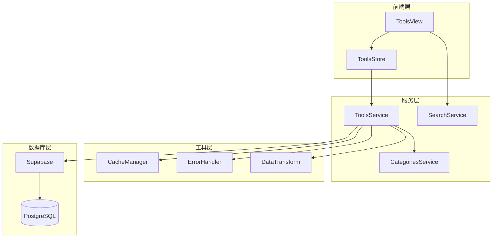
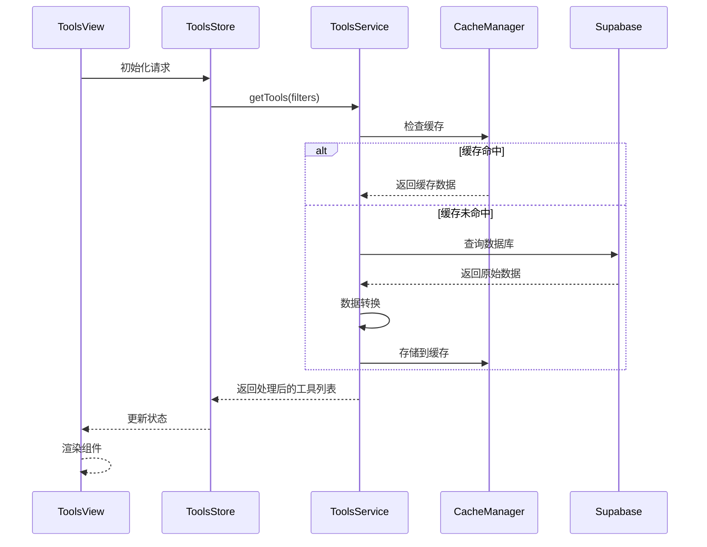
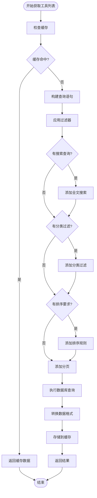
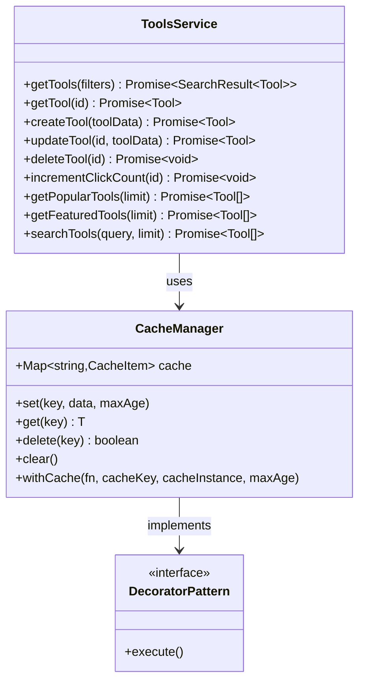
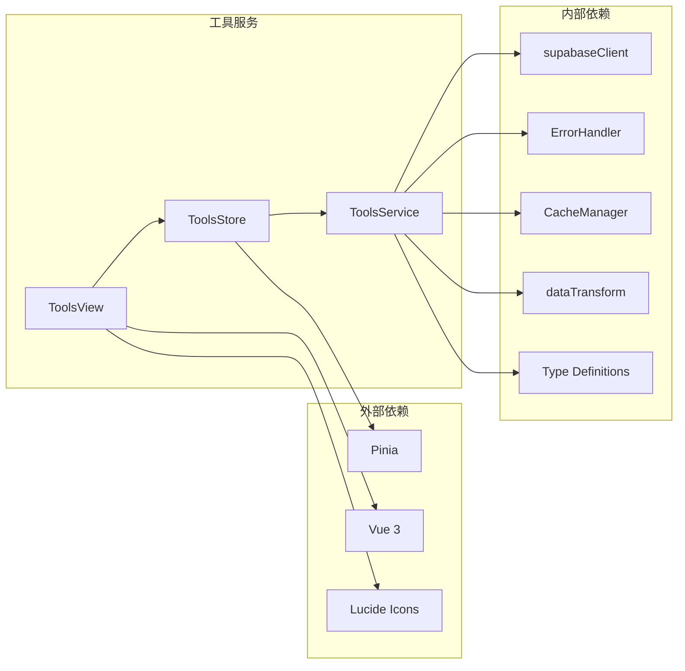

# 工具服务技术文档

<cite>
**本文档引用的文件**
- [toolsService.ts](file://src/services/toolsService.ts)
- [searchService.ts](file://src/services/searchService.ts)
- [categoriesService.ts](file://src/services/categoriesService.ts)
- [ToolsView.vue](file://src/views/ToolsView.vue)
- [tools.ts](file://src/stores/tools.ts)
- [cacheManager.ts](file://src/utils/cacheManager.ts)
- [index.ts](file://src/types/index.ts)
</cite>

## 目录
1. [简介](#简介)
2. [项目结构](#项目结构)
3. [核心组件](#核心组件)
4. [架构概览](#架构概览)
5. [详细组件分析](#详细组件分析)
6. [依赖关系分析](#依赖关系分析)
7. [性能考虑](#性能考虑)
8. [故障排除指南](#故障排除指南)
9. [结论](#结论)

## 简介

工具服务是高级工具导航系统的核心组件，负责管理工具资源的增删改查操作、业务逻辑封装以及与搜索服务和分类服务的协作机制。本文档深入分析了toolsService如何实现工具列表获取、分类过滤、热门排序、详情加载等核心功能，解释其与searchService和categoriesService的协作机制，并提供从ToolsView发起请求到渲染组件的完整调用链分析。

## 项目结构

工具服务在整个项目架构中占据重要地位，与其他服务形成紧密的协作关系：



**图表来源**
- [ToolsView.vue](file://src/views/ToolsView.vue#L1-L50)
- [toolsService.ts](file://src/services/toolsService.ts#L1-L30)

**章节来源**
- [ToolsView.vue](file://src/views/ToolsView.vue#L1-L100)
- [toolsService.ts](file://src/services/toolsService.ts#L1-L50)

## 核心组件

### ToolsService 类

ToolsService 是工具服务的核心类，提供了完整的工具 CRUD 操作和高级功能：

```typescript
export class ToolsService {
  // 状态常量
  static readonly TOOL_STATUS = {
    ACTIVE: "active",
    INACTIVE: "inactive",
  };

  // 工具输入类型
  interface ToolInput {
    name: string;
    description: string;
    url: string;
    category_id: string;
    icon?: string;
    is_featured?: boolean;
    status?: string;
    meta_title?: string;
    meta_description?: string;
    sort_order?: number;
    updated_at?: string;
  }
}
```

### 缓存管理器

工具服务集成了智能缓存管理器，提供多层级缓存策略：

```typescript
// API 数据缓存实例
export const apiCache = new CacheManager({
  maxAge: 3 * 60 * 1000, // 3分钟
  maxSize: 200,
  serialize: true,
  prefix: "api_cache_",
});
```

**章节来源**
- [toolsService.ts](file://src/services/toolsService.ts#L1-L100)
- [cacheManager.ts](file://src/utils/cacheManager.ts#L350-L380)

## 架构概览

工具服务采用分层架构设计，实现了清晰的职责分离和高效的协作机制：



**图表来源**
- [ToolsView.vue](file://src/views/ToolsView.vue#L700-L750)
- [toolsService.ts](file://src/services/toolsService.ts#L25-L80)

## 详细组件分析

### 工具列表获取功能

工具列表获取是工具服务的核心功能之一，支持复杂的过滤和排序：



**图表来源**
- [toolsService.ts](file://src/services/toolsService.ts#L35-L85)

### 高级搜索集成

工具服务与搜索服务紧密集成，提供统一的搜索体验：

```typescript
// 搜索工具的方法
static async searchTools(query: string, limit = 20): Promise<Tool[]> {
  try {
    const { data, error } = await supabase
      .from(TABLES.TOOLS)
      .select(`
        *,
        categories(*)
      `)
      .eq("status", TOOL_STATUS.ACTIVE)
      .or(`name.ilike.%${query}%,description.ilike.%${query}%`)
      .order("click_count", { ascending: false })
      .limit(limit);

    if (error) {
      throw new Error(handleSupabaseError(error));
    }

    return (data || []).map(this.transformToolRow);
  } catch (error) {
    console.error("Error searching tools:", error);
    throw error;
  }
}
```

### 热门工具和推荐功能

工具服务实现了热门工具和推荐工具的功能，支持缓存优化：

```typescript
// 获取热门工具
static async getPopularTools(limit = 10): Promise<Tool[]> {
  const cacheKey = `popular_tools_${limit}`;

  return withCache(
    this._getPopularToolsFromAPI.bind(this),
    () => cacheKey,
    apiCache,
    5 * 60 * 1000, // 5分钟缓存
  )(limit);
}

// 获取推荐工具
static async getFeaturedTools(limit = 6): Promise<Tool[]> {
  const cacheKey = `featured_tools_${limit}`;

  return withCache(
    this._getFeaturedToolsFromAPI.bind(this),
    () => cacheKey,
    apiCache,
    10 * 60 * 1000, // 10分钟缓存
  )(limit);
}
```

### RLS 权限校验传递

工具服务通过 Supabase 的 RLS（Row Level Security）确保数据安全：

```typescript
// 增加点击次数（原子操作）
static async incrementClickCount(id: string): Promise<void> {
  try {
    const { error } = await supabase.rpc("increment_click_count", {
      tool_id: id,
    });

    if (error) {
      throw new Error(handleSupabaseError(error));
    }

    // 清理相关缓存
    this.clearRelatedCache(id);
  } catch (error) {
    console.error("Error incrementing click count:", error);
    throw error;
  }
}
```

**章节来源**
- [toolsService.ts](file://src/services/toolsService.ts#L150-L250)
- [toolsService.ts](file://src/services/toolsService.ts#L300-L350)

### 缓存装饰器模式

工具服务使用装饰器模式实现透明的缓存功能：



**图表来源**
- [cacheManager.ts](file://src/utils/cacheManager.ts#L350-L400)
- [toolsService.ts](file://src/services/toolsService.ts#L25-L50)

### 异常降级策略

工具服务实现了完善的异常降级策略，确保系统稳定性：

```typescript
// 内部方法，不使用缓存
private static async _getToolsFromAPI(
  filters?: SearchFilters,
): Promise<SearchResult<Tool>> {
  try {
    // 主要业务逻辑
    let query = supabase
      .from(TABLES.TOOLS)
      .select(`
        *,
        categories(*)
      `)
      .eq("status", TOOL_STATUS.ACTIVE);

    // 应用搜索过滤器
    if (filters?.query) {
      query = query.or(
        `name.ilike.%${filters.query}%,description.ilike.%${filters.query}%`,
      );
    }

    // ... 其他逻辑

    const { data, error, count } = await query;

    if (error) {
      throw new Error(handleSupabaseError(error));
    }

    // 转换数据格式
    const tools: Tool[] = (data || []).map(this.transformToolRow);

    return {
      items: tools,
      total: count || 0,
      page,
      limit,
      hasMore: (count || 0) > offset + limit,
    };
  } catch (error) {
    console.error("获取工具列表失败:", error);
    console.log("Supabase调用失败，使用模拟工具数据");

    // 返回模拟数据作为回退
    return this.getMockTools(filters);
  }
}
```

**章节来源**
- [toolsService.ts](file://src/services/toolsService.ts#L85-L150)
- [toolsService.ts](file://src/services/toolsService.ts#L500-L600)

### 前端性能优化

工具服务在前端性能优化方面采用了多种策略：

#### 节流高频请求

```typescript
// 在 ToolsView 中的节流实现
const handleSearch = () => {
  toolsStore.setSearchQuery(searchQuery.value);
};
```

#### 懒加载和虚拟滚动

```typescript
// 在 ToolsView 中的懒加载实现
onMounted(async () => {
  if (!toolsStore.initialized) {
    await toolsStore.initialize();
  }
});
```

#### 视图模式切换优化

```typescript
// 视图模式切换
const viewMode = ref<"grid" | "list">("grid");

// 计算属性优化渲染
const filteredTools = computed(() => {
  // 如果有搜索查询，使用高级搜索结果
  if (searchQuery.value.trim()) {
    return searchResults.value.map((result) => result.item);
  }

  let tools = toolsStore.filteredTools;

  // 收藏过滤
  if (showFavoritesOnly.value) {
    // TODO: 实际应用中需要从收藏服务获取用户收藏的工具ID列表
    console.warn("收藏功能尚未完全实现");
    // tools = tools.filter((tool) => tool.is_favorite);
  }

  // 排序
  tools = [...tools].sort((a, b) => {
    switch (sortBy.value) {
      case "click_count":
        return b.click_count - a.click_count;
      case "created_at":
        return (
          new Date(b.created_at).getTime() - new Date(a.created_at).getTime()
        );
      case "name":
      default:
        return a.name.localeCompare(b.name);
    }
  });

  return tools;
});
```

**章节来源**
- [ToolsView.vue](file://src/views/ToolsView.vue#L700-L800)
- [ToolsView.vue](file://src/views/ToolsView.vue#L400-L500)

## 依赖关系分析

工具服务的依赖关系展现了清晰的分层架构：



**图表来源**
- [toolsService.ts](file://src/services/toolsService.ts#L1-L10)
- [tools.ts](file://src/stores/tools.ts#L1-L10)

**章节来源**
- [toolsService.ts](file://src/services/toolsService.ts#L1-L20)
- [tools.ts](file://src/stores/tools.ts#L1-L20)

## 性能考虑

### 缓存策略优化

工具服务采用了多层次的缓存策略：

1. **API 缓存**：3分钟有效期，适用于频繁访问的数据
2. **热门工具缓存**：5分钟有效期，适用于热度较高的工具
3. **推荐工具缓存**：10分钟有效期，适用于变化较少的推荐数据

### 数据库查询优化

```typescript
// 使用索引优化的查询
const { data, error } = await supabase
  .from(TABLES.TOOLS)
  .select(`
    *,
    categories(*)
  `)
  .eq("status", TOOL_STATUS.ACTIVE)
  .order("click_count", { ascending: false })
  .limit(limit);
```

### 前端渲染优化

- **计算属性缓存**：避免重复计算
- **条件渲染**：根据状态显示不同内容
- **事件委托**：减少事件监听器数量

## 故障排除指南

### 常见错误处理

工具服务实现了完善的错误处理机制：

```typescript
// 错误处理示例
try {
  const { data, error } = await supabase
    .from(TABLES.TOOLS)
    .select(
      `
      *,
      categories(*)
    `,
    )
    .eq("id", id)
    .single();

  if (error) {
    throw new Error(handleSupabaseError(error));
  }

  return this.transformToolRow(data);
} catch (error) {
  const appError = ErrorHandler.handleApiError(error);
  ErrorHandler.logError(appError, "ToolsService.getTool");
  throw appError;
}
```

### 调试技巧

1. **启用详细日志**：在开发环境中启用详细的控制台日志
2. **缓存检查**：使用浏览器开发者工具检查缓存状态
3. **网络监控**：监控 API 请求和响应时间

**章节来源**
- [toolsService.ts](file://src/services/toolsService.ts#L120-L150)
- [toolsService.ts](file://src/services/toolsService.ts#L580-L620)

## 结论

工具服务作为高级工具导航系统的核心组件，成功实现了以下目标：

1. **完整的 CRUD 功能**：提供了工具的创建、读取、更新、删除操作
2. **智能缓存机制**：通过多层级缓存显著提升了性能
3. **强大的搜索能力**：与搜索服务无缝集成，提供统一的搜索体验
4. **异常降级策略**：确保系统在各种异常情况下的稳定性
5. **前端性能优化**：采用多种优化策略提升用户体验

### 未来扩展方向

1. **版本管理**：实现工具版本控制和变更追踪
2. **依赖关系图谱**：建立工具间的依赖关系可视化
3. **高级推荐算法**：集成机器学习算法提供个性化推荐
4. **实时协作**：支持多用户同时编辑和协作
5. **移动端优化**：针对移动设备进行专门优化

工具服务的设计充分体现了现代前端架构的最佳实践，为系统的可维护性和可扩展性奠定了坚实的基础。