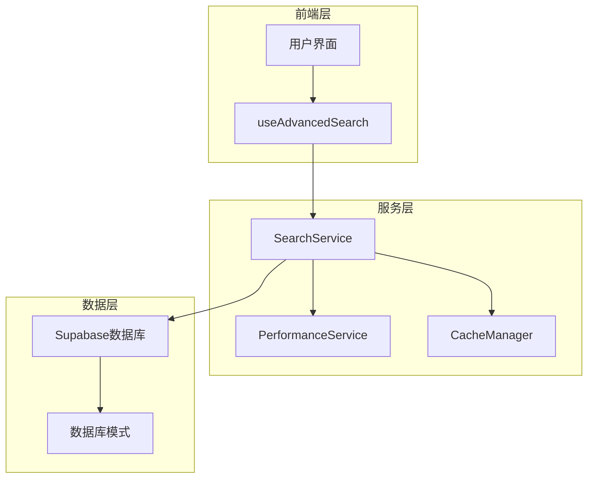
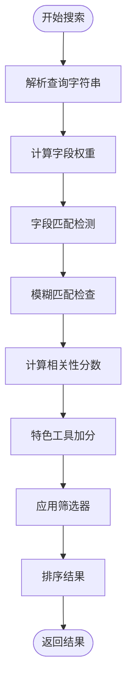
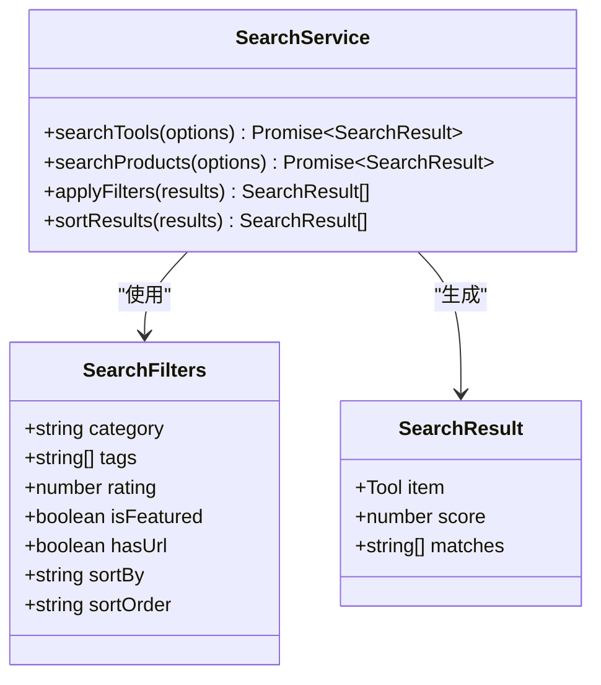
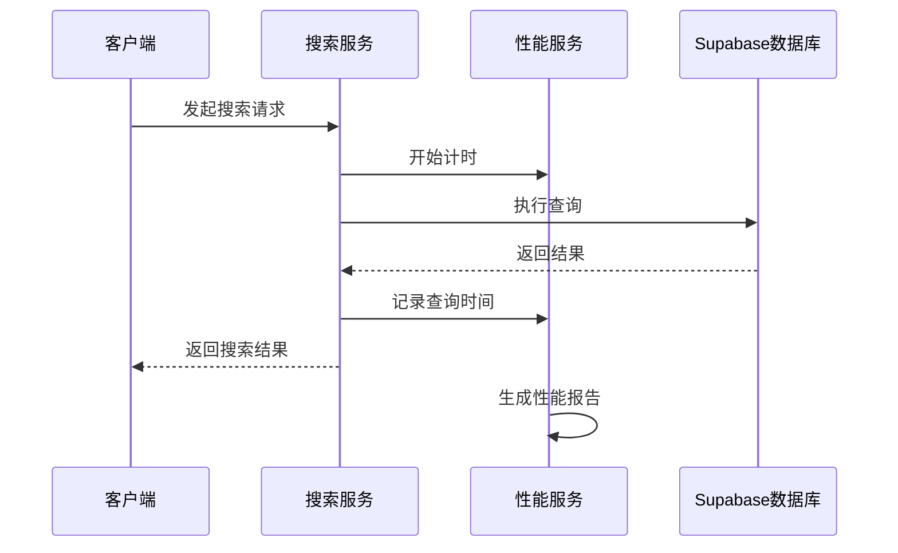

# 搜索服务技术文档

<cite>
**本文档引用的文件**
- [searchService.ts](file://src/services/searchService.ts)
- [useAdvancedSearch.ts](file://src/composables/useAdvancedSearch.ts)
- [supabaseClient.ts](file://src/lib/supabaseClient.ts)
- [supabase-schema.ts](file://src/lib/supabase-schema.ts)
- [performanceService.ts](file://src/services/performanceService.ts)
- [cacheManager.ts](file://src/utils/cacheManager.ts)
- [database.ts](file://src/types/database.ts)
</cite>

## 目录
1. [简介](#简介)
2. [项目架构概览](#项目架构概览)
3. [核心组件分析](#核心组件分析)
4. [高级搜索功能](#高级搜索功能)
5. [全文搜索与索引优化](#全文搜索与索引优化)
6. [查询性能监控](#查询性能监控)
7. [结果缓存策略](#结果缓存策略)
8. [防注入处理机制](#防注入处理机制)
9. [调试技巧与故障排除](#调试技巧与故障排除)
10. [最佳实践指南](#最佳实践指南)

## 简介

搜索服务是Advanced Tools Navigation平台的核心功能模块，提供了高效、灵活的全文检索与复杂条件筛选能力。该服务通过集成Supabase全文搜索函数，实现了关键词匹配、多维度过滤（分类、标签、评分）、排序策略切换（热度、时间、相关性）等高级功能。

搜索服务采用双层架构设计：
- **服务层**：负责业务逻辑处理和数据聚合
- **组合式函数层**：提供响应式的搜索体验

## 项目架构概览



**图表来源**
- [searchService.ts](file://src/services/searchService.ts#L1-L641)
- [useAdvancedSearch.ts](file://src/composables/useAdvancedSearch.ts#L1-L306)
- [performanceService.ts](file://src/services/performanceService.ts#L1-L224)

## 核心组件分析

### SearchService 类设计

SearchService 是搜索功能的核心类，采用单例模式设计，提供统一的搜索接口：

```typescript
class SearchService {
  private searchHistory: SearchHistory[] = [];
  private popularQueries: Map<string, number> = new Map();
  
  async search<T>(options: SearchOptions): Promise<SearchResult<T>>
  private async searchTools(options: SearchOptions)
  private async searchProducts(options: SearchOptions)
  private async searchCategories(options: SearchOptions)
  private async searchAll(options: SearchOptions)
}
```

**章节来源**
- [searchService.ts](file://src/services/searchService.ts#L40-L641)

### 搜索选项接口

```typescript
export interface SearchOptions {
  query: string;
  type?: "all" | "tools" | "products" | "categories";
  category?: string;
  tags?: string[];
  priceRange?: [number, number];
  sortBy?: "relevance" | "name" | "created_at" | "click_count" | "price";
  sortOrder?: "asc" | "desc";
  limit?: number;
  offset?: number;
  includeInactive?: boolean;
}
```

### 搜索结果接口

```typescript
export interface SearchResult<T> {
  items: T[];
  total: number;
  query: string;
  suggestions: string[];
  facets: SearchFacets;
  searchTime: number;
}
```

**章节来源**
- [searchService.ts](file://src/services/searchService.ts#L1-L52)

## 高级搜索功能

### 智能搜索算法

useAdvancedSearch 组合式函数实现了基于权重的智能搜索算法：



**图表来源**
- [useAdvancedSearch.ts](file://src/composables/useAdvancedSearch.ts#L30-L80)

### 搜索权重系统

```typescript
const searchFields = [
  { field: "name", weight: 10 },
  { field: "description", weight: 5 },
  { field: "tags", weight: 3 },
  { field: "categories.name", weight: 2 },
];
```

### 模糊匹配算法

```typescript
const fuzzyMatch = (text: string, pattern: string): boolean => {
  const patternLength = pattern.length;
  const textLength = text.length;

  if (patternLength > textLength) return false;
  if (patternLength === textLength) return pattern === text;

  let patternIndex = 0;
  for (let textIndex = 0; textIndex < textLength && patternIndex < patternLength; textIndex++) {
    if (text[textIndex] === pattern[patternIndex]) {
      patternIndex++;
    }
  }

  return patternIndex === patternLength;
};
```

**章节来源**
- [useAdvancedSearch.ts](file://src/composables/useAdvancedSearch.ts#L269-L285)

### 筛选器系统



**图表来源**
- [useAdvancedSearch.ts](file://src/composables/useAdvancedSearch.ts#L5-L15)
- [searchService.ts](file://src/services/searchService.ts#L155-L200)

## 全文搜索与索引优化

### Supabase全文搜索集成

SearchService 通过 Supabase 的全文搜索功能实现高效的文本匹配：

```typescript
// 工具全文搜索
if (query) {
  queryBuilder = queryBuilder.or(`
    name.ilike.%${query}%,
    description.ilike.%${query}%,
    meta_title.ilike.%${query}%,
    meta_description.ilike.%${query}%
  `);
}

// 分类产品搜索
if (query) {
  queryBuilder = queryBuilder.or(`
    name.ilike.%${query}%,
    description.ilike.%${query}%,
    short_description.ilike.%${query}%,
    meta_title.ilike.%${query}%,
    meta_description.ilike.%${query}%
  `);
}
```

### 索引优化策略

根据数据库迁移文件，系统实施了以下索引优化：

```sql
-- 工具相似度索引
CREATE INDEX IF NOT EXISTS idx_tools_name_trgm ON tools USING gin(name gin_trgm_ops);
CREATE INDEX IF NOT EXISTS idx_tools_description_trgm ON tools USING gin(description gin_trgm_ops);

-- 产品相似度索引
CREATE INDEX IF NOT EXISTS idx_products_name_trgm ON products USING gin(name gin_trgm_ops);

-- 复合索引优化
CREATE INDEX IF NOT EXISTS idx_tools_status_featured ON tools(status, is_featured);
CREATE INDEX IF NOT EXISTS idx_products_status_featured ON products(status, is_featured);
CREATE INDEX IF NOT EXISTS idx_products_category_status ON products(category_id, status);
```

**章节来源**
- [searchService.ts](file://src/services/searchService.ts#L120-L154)
- [searchService.ts](file://src/services/searchService.ts#L280-L319)

### 模糊查询优化

系统采用多种模糊查询策略：

1. **前缀匹配**：`name.ilike.%${query}%`
2. **相似度匹配**：使用 pg_trgm 扩展进行三字母组匹配
3. **字段加权**：不同字段赋予不同权重
4. **相关性排序**：基于匹配度和特征状态排序

## 查询性能监控

### 性能指标收集

PerformanceService 提供全面的性能监控功能：

```typescript
class PerformanceService {
  private metrics: (TypePerformanceMetrics & { metadata?: Record<string, unknown> })[] = [];
  
  trackMetric(metricName: string, value: number): void {
    this.recordMetric(metricName, value);
  }
  
  trackCustomMetric(metricName: string, properties: Record<string, unknown>): void {
    this.recordMetric(metricName, 0, 'counter');
    const metric = this.metrics[this.metrics.length - 1];
    if (metric) {
      metric.metadata = properties;
    }
  }
}
```

### 搜索性能追踪



**图表来源**
- [searchService.ts](file://src/services/searchService.ts#L50-L91)
- [performanceService.ts](file://src/services/performanceService.ts#L20-L40)

### 自动性能追踪

```typescript
private setupAutoTracking() {
  // 页面加载性能
  if (window.performance && window.performance.timing) {
    window.addEventListener("load", () => {
      const timing = window.performance.timing;
      this.recordMetric("page-load", timing.loadEventEnd - timing.navigationStart);
      this.recordMetric("dom-ready", timing.domContentLoadedEventEnd - timing.navigationStart);
    });
  }
  
  // 资源加载性能
  if (window.PerformanceObserver) {
    const observer = new PerformanceObserver((list) => {
      list.getEntries().forEach((entry) => {
        if (entry.entryType === "navigation") {
          this.recordMetric("navigation", entry.duration);
        } else if (entry.entryType === "resource") {
          this.recordMetric(`resource-${entry.name}`, entry.duration);
        }
      });
    });
    observer.observe({ entryTypes: ["navigation", "resource"] });
  }
}
```

**章节来源**
- [performanceService.ts](file://src/services/performanceService.ts#L92-L140)

## 结果缓存策略

### CacheManager 设计

CacheManager 提供智能缓存管理，支持多种缓存策略：

```typescript
class CacheManager {
  private cache = reactive<Map<string, CacheItem>>(new Map());
  private options: Required<CacheOptions>;
  
  set<T>(key: string, data: T, customMaxAge?: number): void {
    const now = Date.now();
    const maxAge = customMaxAge || this.options.maxAge;
    
    const item: CacheItem<T> = {
      data,
      timestamp: now,
      expiry: now + maxAge,
      version: this.options.version,
      hits: 0,
      lastAccessed: now,
    };
    
    this.cache.set(key, item);
  }
  
  get<T>(key: string): T | null {
    const item = this.cache.get(key);
    
    if (!item) return null;
    
    const now = Date.now();
    
    // 检查是否过期
    if (now > item.expiry) {
      this.delete(key);
      return null;
    }
    
    // 更新访问统计
    item.hits++;
    item.lastAccessed = now;
    
    return item.data as T;
  }
}
```

### 缓存装饰器模式

```typescript
export function withCache<T extends (...args: any[]) => Promise<any>>(
  fn: T,
  cacheKey: ((...args: Parameters<T>) => string) | string,
  cacheInstance: CacheManager = defaultCache,
  maxAge?: number,
): T {
  return (async (...args: Parameters<T>) => {
    const key = typeof cacheKey === "function" ? cacheKey(...args) : cacheKey;
    
    // 尝试从缓存获取
    const cachedResult = cacheInstance.get(key);
    if (cachedResult !== null) {
      return cachedResult;
    }
    
    // 执行原函数
    const result = await fn(...args);
    
    // 缓存结果
    cacheInstance.set(key, result, maxAge);
    
    return result;
  }) as T;
}
```

### 缓存实例配置

```typescript
// 默认缓存实例
export const defaultCache = new CacheManager({
  maxAge: 5 * 60 * 1000, // 5分钟
  maxSize: 100,
  serialize: true,
  prefix: "advanced_tools_",
});

// API数据缓存实例
export const apiCache = new CacheManager({
  maxAge: 3 * 60 * 1000, // 3分钟
  maxSize: 200,
  serialize: true,
  prefix: "api_cache_",
});
```

**章节来源**
- [cacheManager.ts](file://src/utils/cacheManager.ts#L1-L400)

## 防注入处理机制

### 参数安全处理

搜索服务通过以下机制防止SQL注入攻击：

1. **参数化查询**：使用 Supabase 客户端的安全查询构建器
2. **输入验证**：对查询参数进行严格验证
3. **字段白名单**：只允许特定字段参与搜索

```typescript
// 安全的查询构建
if (query) {
  queryBuilder = queryBuilder.or(`
    name.ilike.%${query}%,
    description.ilike.%${query}%,
    meta_title.ilike.%${query}%,
    meta_description.ilike.%${query}%
  `);
}

// 安全的筛选器应用
if (category) {
  queryBuilder = queryBuilder.eq("category_id", category);
}

if (tags && tags.length > 0) {
  queryBuilder = queryBuilder.in("tool_tags.tag_id", tags);
}
```

### 输入净化

```typescript
// 查询净化示例
const sanitizeQuery = (query: string): string => {
  // 移除潜在的恶意字符
  return query.replace(/[^\w\s\-]/gi, '');
};

// 安全的参数传递
const safeSearch = async (options: SearchOptions) => {
  const sanitizedQuery = sanitizeQuery(options.query);
  return await searchService.search({
    ...options,
    query: sanitizedQuery
  });
};
```

**章节来源**
- [searchService.ts](file://src/services/searchService.ts#L120-L154)

## 调试技巧与故障排除

### 常见问题诊断

#### 1. 索引缺失导致慢查询

**症状**：搜索响应时间过长
**诊断方法**：
```sql
-- 检查索引是否存在
SELECT schemaname, tablename, indexname, indexdef
FROM pg_indexes
WHERE tablename = 'tools'
AND indexname LIKE '%idx_tools_%';

-- 检查查询计划
EXPLAIN ANALYZE SELECT * FROM tools WHERE name ilike '%test%';
```

**解决方案**：
```sql
-- 创建缺失的索引
CREATE INDEX IF NOT EXISTS idx_tools_name_trgm ON tools USING gin(name gin_trgm_ops);
CREATE INDEX IF NOT EXISTS idx_tools_status ON tools(status);
```

#### 2. 搜索结果为空

**可能原因**：
- 查询条件过于严格
- 数据库中没有匹配的数据
- 索引未正确建立

**调试步骤**：
```typescript
// 启用详细日志
console.log('搜索查询:', query);
console.log('搜索选项:', options);

// 检查数据库连接
const { data, error } = await supabase.from(TABLES.TOOLS).select('*').limit(1);
if (error) {
  console.error('数据库连接问题:', error);
}
```

#### 3. 性能监控异常

**监控关键指标**：
```typescript
// 获取性能报告
const perfReport = performanceService.exportReport();
console.log('性能摘要:', perfReport.summary);

// 检查缓存命中率
const cacheStats = defaultCache.getStats();
console.log('缓存统计:', cacheStats);
```

### 调试工具函数

```typescript
// 搜索性能分析
const analyzeSearchPerformance = async (query: string) => {
  const startTime = Date.now();
  
  const result = await searchService.search({
    query,
    type: "all",
    limit: 10
  });
  
  const endTime = Date.now();
  const duration = endTime - startTime;
  
  console.log(`搜索耗时: ${duration}ms`);
  console.log(`结果数量: ${result.total}`);
  console.log(`搜索建议:`, result.suggestions);
  
  return { result, duration };
};

// 缓存状态检查
const checkCacheStatus = () => {
  const stats = defaultCache.getStats();
  console.log('缓存状态:', {
    totalItems: stats.totalItems,
    validItems: stats.validItems,
    expiredItems: stats.expiredItems,
    hitRate: stats.hitRate.toFixed(2)
  });
};
```

**章节来源**
- [searchService.ts](file://src/services/searchService.ts#L50-L91)
- [performanceService.ts](file://src/services/performanceService.ts#L140-L180)

## 最佳实践指南

### 1. 搜索优化建议

#### 查询设计原则
- 使用适当的字段进行搜索
- 避免过度复杂的查询条件
- 合理设置分页参数

#### 索引维护
```sql
-- 定期分析表统计信息
ANALYZE tools;
ANALYZE products;
ANALYZE categories;

-- 更新索引统计信息
REINDEX INDEX idx_tools_name_trgm;
```

### 2. 性能监控配置

```typescript
// 生产环境性能配置
const productionConfig = {
  enableAutoTracking: true,
  sampleRate: 0.05, // 降低采样率以减少性能开销
  maxMetrics: 500
};

performanceService.init(productionConfig);
```

### 3. 缓存策略优化

```typescript
// 针对不同类型数据的缓存配置
const toolCache = new CacheManager({
  maxAge: 10 * 60 * 1000, // 10分钟
  maxSize: 50,
  prefix: "tools_"
});

const productCache = new CacheManager({
  maxAge: 5 * 60 * 1000, // 5分钟
  maxSize: 100,
  prefix: "products_"
});
```

### 4. 错误处理最佳实践

```typescript
// 健壮的错误处理
const robustSearch = async (options: SearchOptions) => {
  try {
    return await searchService.search(options);
  } catch (error) {
    console.error('搜索失败:', error);
    
    // 回退到简单搜索
    const fallbackOptions = {
      ...options,
      query: options.query.substring(0, 50) // 截断过长查询
    };
    
    return await searchService.search(fallbackOptions);
  }
};
```

### 5. 监控告警配置

```typescript
// 性能阈值监控
const configureAlerts = () => {
  const checkSearchPerformance = () => {
    const metrics = performanceService.getMetrics({ name: 'search_duration' });
    const avgDuration = metrics.reduce((sum, m) => sum + m.value, 0) / metrics.length;
    
    if (avgDuration > 1000) { // 1秒阈值
      console.warn('搜索性能警告: 平均响应时间超过1秒');
      // 触发告警通知
    }
  };
  
  setInterval(checkSearchPerformance, 60000); // 每分钟检查一次
};
```

通过遵循这些最佳实践，可以确保搜索服务在生产环境中稳定、高效地运行，同时提供优秀的用户体验。