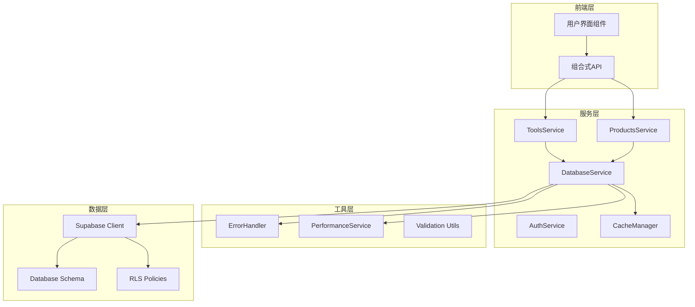
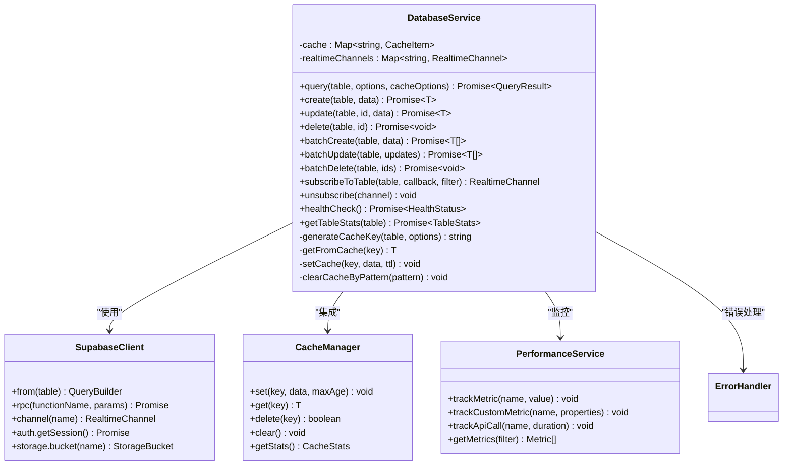
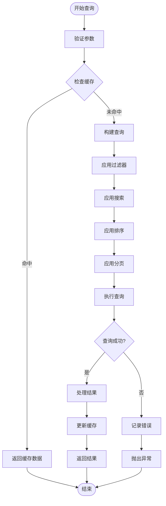
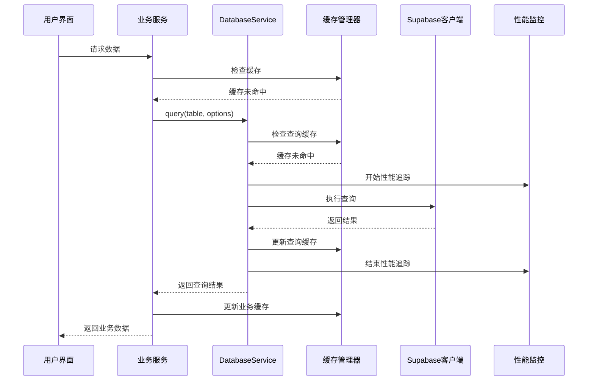
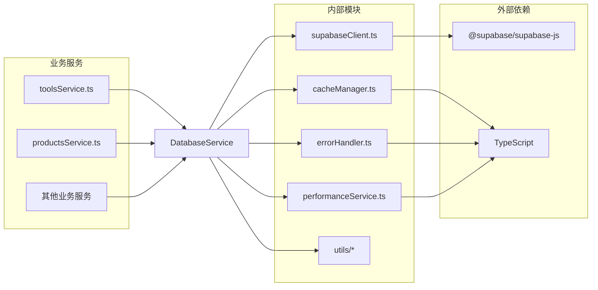

# 数据库服务技术文档

<cite>
**本文档引用的文件**
- [databaseService.ts](file://src/services/databaseService.ts)
- [supabaseClient.ts](file://src/lib/supabaseClient.ts)
- [toolsService.ts](file://src/services/toolsService.ts)
- [productsService.ts](file://src/services/productsService.ts)
- [cacheManager.ts](file://src/utils/cacheManager.ts)
- [errorHandler.ts](file://src/utils/errorHandler.ts)
- [performanceService.ts](file://src/services/performanceService.ts)
- [supabase-schema.ts](file://src/lib/supabase-schema.ts)
- [initial_schema.sql](file://supabase/migrations/20241224000001_initial_schema.sql)
</cite>

## 目录
1. [简介](#简介)
2. [项目结构](#项目结构)
3. [核心组件](#核心组件)
4. [架构概览](#架构概览)
5. [详细组件分析](#详细组件分析)
6. [依赖关系分析](#依赖关系分析)
7. [性能考虑](#性能考虑)
8. [故障排除指南](#故障排除指南)
9. [结论](#结论)

## 简介

数据库服务（DatabaseService）是Advanced Tools Navigation应用中的核心基础设施组件，负责提供统一的数据访问抽象层和通用操作封装。作为整个应用的数据交互基础，它不仅增强了原生Supabase客户端的功能，还添加了企业级特性如请求日志、性能追踪、自动重试、超时控制等。

DatabaseService通过提供类型安全的查询构建、自定义SQL片段注入安全规范、RLS策略上下文传递机制，为上层业务服务奠定了可靠的数据交互基础。它实现了统一的增删改查接口、RPC调用封装、批量操作支持及事务处理能力，同时集成了智能缓存管理、错误处理和性能监控功能。

## 项目结构

数据库服务在整个项目架构中占据重要地位，位于服务层的核心位置，为所有业务逻辑提供数据访问能力。



**图表来源**
- [databaseService.ts](file://src/services/databaseService.ts#L1-L405)
- [toolsService.ts](file://src/services/toolsService.ts#L1-L642)
- [productsService.ts](file://src/services/productsService.ts#L1-L347)

**章节来源**
- [databaseService.ts](file://src/services/databaseService.ts#L1-L50)
- [supabaseClient.ts](file://src/lib/supabaseClient.ts#L1-L50)

## 核心组件

DatabaseService作为基础服务的核心组件，提供了以下关键功能：

### 主要特性

1. **统一数据访问接口**：提供一致的CRUD操作接口
2. **智能缓存管理**：内置缓存机制和缓存失效策略
3. **实时数据订阅**：支持PostgreSQL变更事件监听
4. **批量操作支持**：高效的批量创建、更新和删除操作
5. **性能监控集成**：内置性能追踪和指标收集
6. **错误处理机制**：完善的错误处理和重试策略
7. **健康检查功能**：数据库连接状态监控

### 核心接口定义

```typescript
// 查询选项接口
interface QueryOptions {
  page?: number;
  limit?: number;
  sortBy?: string;
  sortOrder?: "asc" | "desc";
  filters?: Record<string, unknown>;
  search?: string;
  searchFields?: string[];
}

// 查询结果接口
interface QueryResult<T> {
  data: T[];
  count: number;
  page: number;
  limit: number;
  totalPages: number;
  hasMore: boolean;
}

// 缓存选项接口
interface CacheOptions {
  ttl?: number;
  key?: string;
}
```

**章节来源**
- [databaseService.ts](file://src/services/databaseService.ts#L8-L25)
- [databaseService.ts](file://src/services/databaseService.ts#L27-L45)

## 架构概览

DatabaseService采用分层架构设计，通过多层抽象实现数据访问的统一管理和优化。



**图表来源**
- [databaseService.ts](file://src/services/databaseService.ts#L27-L405)
- [supabaseClient.ts](file://src/lib/supabaseClient.ts#L10-L50)
- [cacheManager.ts](file://src/utils/cacheManager.ts#L20-L100)

## 详细组件分析

### DatabaseService核心实现

DatabaseService是一个单例类，提供了完整的数据访问功能。其核心实现包括以下几个方面：

#### 1. 查询构建器

```typescript
async query<T>(
  table: string,
  options: QueryOptions = {},
  cacheOptions?: CacheOptions,
): Promise<QueryResult<T>>
```

查询构建器支持复杂的查询条件，包括：
- 分页查询（page, limit）
- 排序（sortBy, sortOrder）
- 过滤条件（filters）
- 模糊搜索（search, searchFields）



**图表来源**
- [databaseService.ts](file://src/services/databaseService.ts#L47-L95)

#### 2. 缓存管理系统

DatabaseService内置了智能缓存系统，支持：

```typescript
// 缓存键生成
private generateCacheKey(table: string, options: QueryOptions): string {
  return `${table}:${JSON.stringify(options)}`;
}

// 缓存数据结构
interface CacheItem<T> {
  data: T;
  timestamp: number;
  ttl: number;
}
```

缓存管理包括：
- TTL（生存时间）控制
- 模式匹配的缓存清理
- 缓存统计和监控
- 内存使用优化

#### 3. 实时数据订阅

```typescript
subscribeToTable(
  table: string,
  callback: (payload: unknown) => void,
  filter?: string,
): RealtimeChannel
```

实时订阅功能支持：
- PostgreSQL变更事件监听
- 自定义过滤条件
- 多频道管理
- 自动断线重连

#### 4. 批量操作支持

```typescript
// 批量创建
async batchCreate<T>(table: string, data: Partial<T>[]): Promise<T[]>

// 批量更新
async batchUpdate<T>(
  table: string,
  updates: { id: string; data: Partial<T> }[],
): Promise<T[]>

// 批量删除
async batchDelete(table: string, ids: string[]): Promise<void>
```

批量操作的优势：
- 减少网络往返次数
- 提高数据一致性
- 自动缓存失效

**章节来源**
- [databaseService.ts](file://src/services/databaseService.ts#L47-L180)
- [databaseService.ts](file://src/services/databaseService.ts#L200-L250)
- [databaseService.ts](file://src/services/databaseService.ts#L270-L320)

### 与业务服务的集成

DatabaseService与各个业务服务紧密集成，形成了完整的数据访问链路：



**图表来源**
- [toolsService.ts](file://src/services/toolsService.ts#L30-L80)
- [databaseService.ts](file://src/services/databaseService.ts#L47-L95)

**章节来源**
- [toolsService.ts](file://src/services/toolsService.ts#L30-L100)
- [productsService.ts](file://src/services/productsService.ts#L10-L50)

### 错误处理和重试机制

DatabaseService集成了完善的错误处理和重试机制：

```typescript
// 重试装饰器
export function withRetry<T extends (...args: any[]) => Promise<any>>(
  fn: T,
  maxRetries: number = 3,
  delay: number = 1000,
): T {
  return (async (...args: Parameters<T>) => {
    for (let attempt = 1; attempt <= maxRetries; attempt++) {
      try {
        return await fn(...args);
      } catch (error) {
        if (attempt === maxRetries) {
          throw error;
        }
        
        const retryDelay = delay * Math.pow(2, attempt - 1);
        await new Promise((resolve) => setTimeout(resolve, retryDelay));
      }
    }
  }) as T;
}
```

错误处理流程：
1. **网络错误检测**：识别网络连接问题
2. **数据库错误分类**：区分不同类型的数据库错误
3. **重试策略**：指数退避重试机制
4. **降级处理**：提供备用数据源

**章节来源**
- [errorHandler.ts](file://src/utils/errorHandler.ts#L280-L330)

### 性能监控集成

DatabaseService与性能监控服务深度集成：

```typescript
// 性能指标追踪
trackMetric(metricName: string, value: number): void
trackCustomMetric(metricName: string, properties: Record<string, unknown>): void

// API调用追踪
trackApiCall(name: string, duration: number): void
trackUserAction(name: string, properties: Record<string, unknown>): void
trackError(name: string, error: Error): void
```

性能监控包括：
- 查询执行时间追踪
- 缓存命中率统计
- 错误率监控
- 网络延迟分析

**章节来源**
- [performanceService.ts](file://src/services/performanceService.ts#L15-L50)
- [performanceService.ts](file://src/services/performanceService.ts#L180-L220)

## 依赖关系分析

DatabaseService的依赖关系体现了清晰的分层架构设计：



**图表来源**
- [databaseService.ts](file://src/services/databaseService.ts#L1-L10)
- [supabaseClient.ts](file://src/lib/supabaseClient.ts#L1-L10)

**章节来源**
- [databaseService.ts](file://src/services/databaseService.ts#L1-L10)
- [toolsService.ts](file://src/services/toolsService.ts#L1-L10)

## 性能考虑

DatabaseService在设计时充分考虑了性能优化：

### 缓存策略

1. **查询缓存**：对频繁查询的结果进行缓存
2. **业务缓存**：针对特定业务场景的缓存策略
3. **LRU淘汰**：最近最少使用算法淘汰缓存
4. **TTL控制**：可配置的缓存生存时间

### 查询优化

1. **索引利用**：合理使用数据库索引
2. **分页处理**：避免全表扫描
3. **连接优化**：减少JOIN操作的使用
4. **批量操作**：合并多个操作减少网络开销

### 网络优化

1. **请求去重**：避免重复的相同查询
2. **压缩传输**：减少数据传输量
3. **连接池**：复用数据库连接
4. **异步处理**：非阻塞的异步操作

## 故障排除指南

### 常见问题和解决方案

#### 1. 缓存失效问题

**症状**：数据更新后缓存未及时失效
**解决方案**：
```typescript
// 手动清理相关缓存
databaseService.clearCacheByPattern(table);

// 或者在业务服务中
this.clearRelatedCache(id);
```

#### 2. 性能问题

**症状**：查询响应时间过长
**诊断步骤**：
1. 检查数据库索引是否正确
2. 分析查询计划
3. 查看缓存命中率
4. 监控网络延迟

#### 3. 实时订阅问题

**症状**：实时数据更新不及时
**解决方案**：
```typescript
// 检查订阅状态
const channels = databaseService.getRealtimeChannels();
channels.forEach(channel => {
  if (channel.status !== 'SUBSCRIBED') {
    // 重新订阅
  }
});
```

**章节来源**
- [databaseService.ts](file://src/services/databaseService.ts#L320-L370)

## 结论

DatabaseService作为Advanced Tools Navigation应用的核心数据访问层，成功实现了以下目标：

1. **统一抽象**：为整个应用提供了统一的数据访问接口
2. **性能优化**：通过智能缓存和查询优化显著提升了性能
3. **可靠性保障**：完善的错误处理和重试机制确保了系统的稳定性
4. **可观测性**：深度集成的性能监控和日志记录提供了良好的运维支持
5. **可扩展性**：模块化的架构设计便于功能扩展和维护

通过这些特性，DatabaseService为上层业务服务提供了坚实的基础，使得开发者可以专注于业务逻辑的实现，而不必担心底层数据访问的复杂性。这种设计不仅提高了开发效率，也保证了系统的长期可维护性和可扩展性。