# 服务层技术文档

<cite>
**本文档中引用的文件**
- [supabaseClient.ts](file://src/lib/supabaseClient.ts)
- [databaseService.ts](file://src/services/databaseService.ts)
- [favoritesService.ts](file://src/services/favoritesService.ts)
- [toolsService.ts](file://src/services/toolsService.ts)
- [notificationService.ts](file://src/services/notificationService.ts)
- [searchService.ts](file://src/services/searchService.ts)
- [productsService.ts](file://src/services/productsService.ts)
- [authService.ts](file://src/services/authService.ts)
- [cacheManager.ts](file://src/utils/cacheManager.ts)
- [errorHandler.ts](file://src/utils/errorHandler.ts)
- [validation.ts](file://src/utils/validation.ts)
</cite>

## 目录
1. [简介](#简介)
2. [架构概览](#架构概览)
3. [核心服务模块](#核心服务模块)
4. [数据库抽象层](#数据库抽象层)
5. [缓存策略](#缓存策略)
6. [错误处理机制](#错误处理机制)
7. [数据验证系统](#数据验证系统)
8. [服务间依赖关系](#服务间依赖关系)
9. [性能优化策略](#性能优化策略)
10. [故障排除指南](#故障排除指南)
11. [总结](#总结)

## 简介

Advanced Tools Navigation 的服务层是一个高度模块化的架构，专门设计用于处理复杂的业务逻辑和API协调。该服务层通过多个专门化的服务模块（auth、products、tools、notification、search等）实现了清晰的职责分离，同时提供了强大的数据访问、缓存管理和错误处理能力。

服务层的核心设计理念是：
- **单一职责原则**：每个服务专注于特定的业务领域
- **类型安全**：全面的TypeScript支持确保编译时类型检查
- **可扩展性**：模块化设计便于功能扩展和维护
- **性能优化**：内置缓存、批量操作和并发控制机制
- **可靠性**：完善的错误处理和重试机制

## 架构概览

服务层采用分层架构模式，通过抽象层封装底层数据库操作，提供统一的API接口：

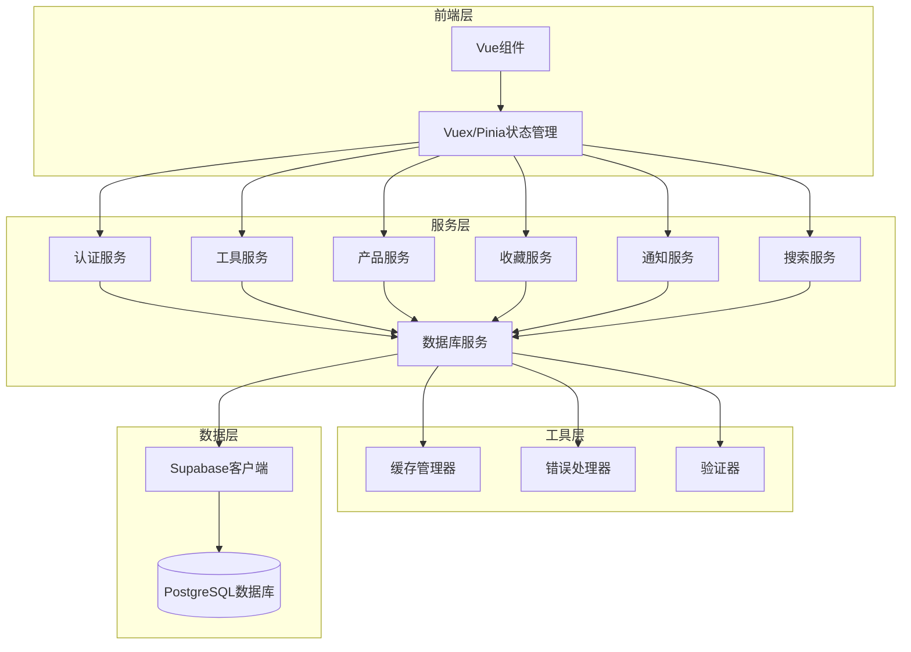

**图表来源**
- [databaseService.ts](file://src/services/databaseService.ts#L1-L50)
- [cacheManager.ts](file://src/utils/cacheManager.ts#L1-L50)
- [errorHandler.ts](file://src/utils/errorHandler.ts#L1-L50)

## 核心服务模块

### 认证服务 (AuthService)

认证服务负责用户身份验证、会话管理和权限控制：

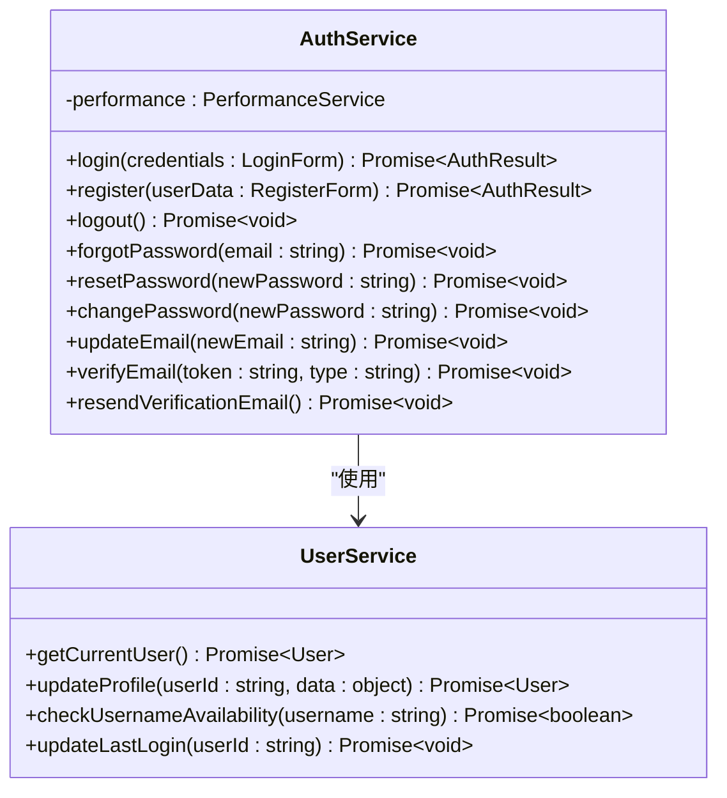

**图表来源**
- [authService.ts](file://src/services/authService.ts#L1-L100)
- [userService.ts](file://src/services/userService.ts)

### 工具服务 (ToolsService)

工具服务提供工具数据的CRUD操作和高级搜索功能：

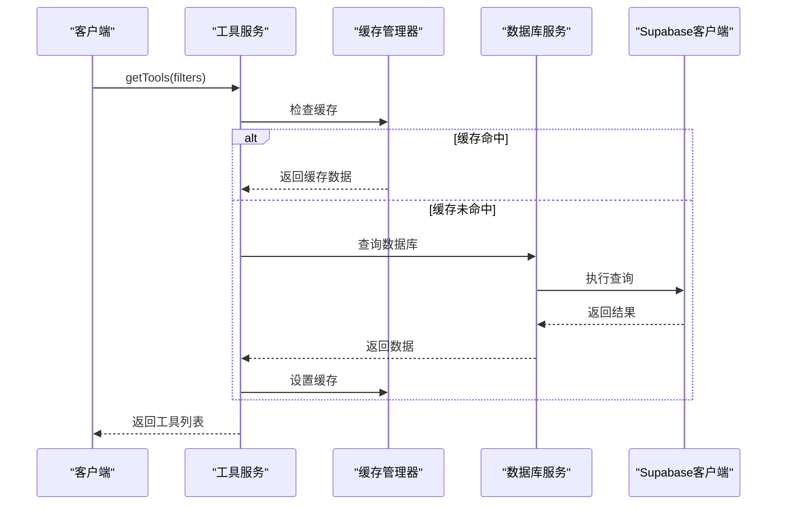

**图表来源**
- [toolsService.ts](file://src/services/toolsService.ts#L30-L80)
- [cacheManager.ts](file://src/utils/cacheManager.ts#L50-L100)

### 收藏服务 (FavoritesService)

收藏服务管理用户的收藏夹功能，支持工具和产品的收藏：

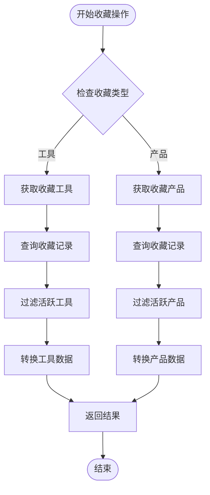

**图表来源**
- [favoritesService.ts](file://src/services/favoritesService.ts#L15-L80)

**章节来源**
- [authService.ts](file://src/services/authService.ts#L1-L200)
- [toolsService.ts](file://src/services/toolsService.ts#L1-L200)
- [favoritesService.ts](file://src/services/favoritesService.ts#L1-L200)

## 数据库抽象层

### DatabaseService 类设计

DatabaseService 是整个服务层的核心抽象层，提供了统一的数据库操作接口：

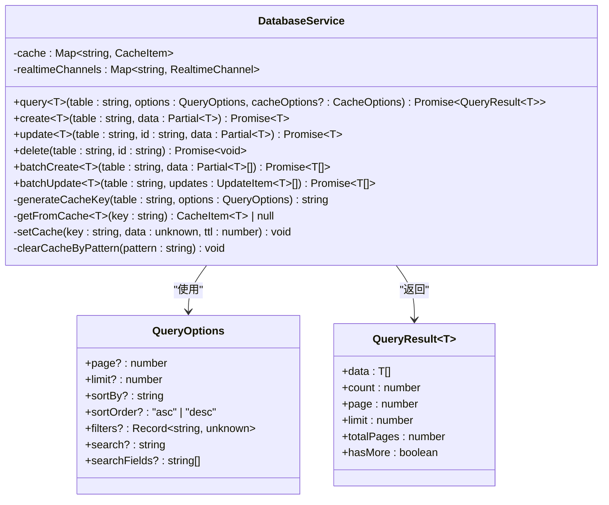

**图表来源**
- [databaseService.ts](file://src/services/databaseService.ts#L15-L100)

### Supabase 客户端封装

服务层通过 supabaseClient.ts 对 Supabase 客户端进行了深度封装，提供了类型安全的数据访问：

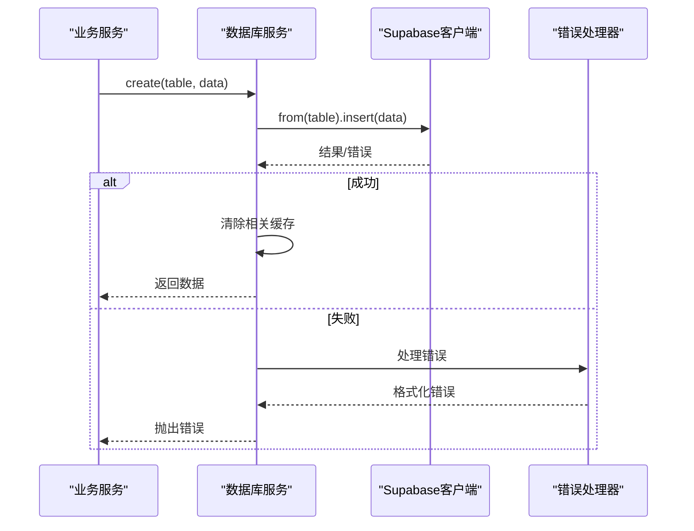

**图表来源**
- [databaseService.ts](file://src/services/databaseService.ts#L80-L120)
- [supabaseClient.ts](file://src/lib/supabaseClient.ts#L150-L200)

**章节来源**
- [databaseService.ts](file://src/services/databaseService.ts#L1-L200)
- [supabaseClient.ts](file://src/lib/supabaseClient.ts#L1-L246)

## 缓存策略

### CacheManager 设计

CacheManager 提供了智能的缓存管理机制，支持多种缓存策略：

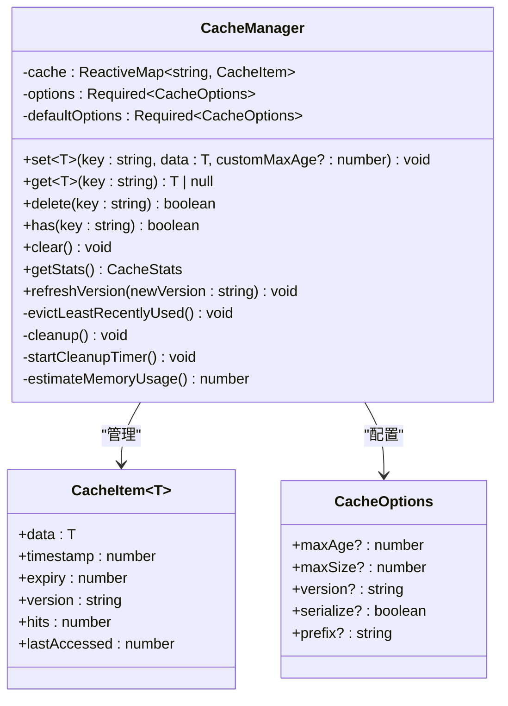

**图表来源**
- [cacheManager.ts](file://src/utils/cacheManager.ts#L15-L100)

### 缓存装饰器模式

服务层广泛使用缓存装饰器模式来简化缓存逻辑：

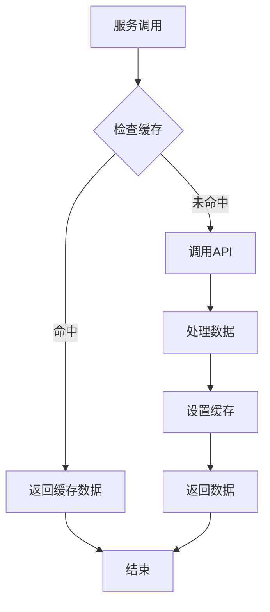

**图表来源**
- [toolsService.ts](file://src/services/toolsService.ts#L30-L50)
- [cacheManager.ts](file://src/utils/cacheManager.ts#L200-L250)

**章节来源**
- [cacheManager.ts](file://src/utils/cacheManager.ts#L1-L200)

## 错误处理机制

### ErrorHandler 类设计

ErrorHandler 提供了统一的错误处理机制，支持多种错误类型的分类处理：

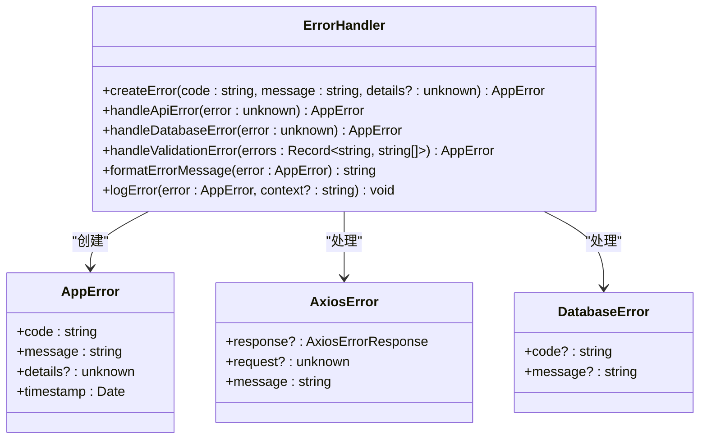

**图表来源**
- [errorHandler.ts](file://src/utils/errorHandler.ts#L1-L100)

### 错误分类处理流程

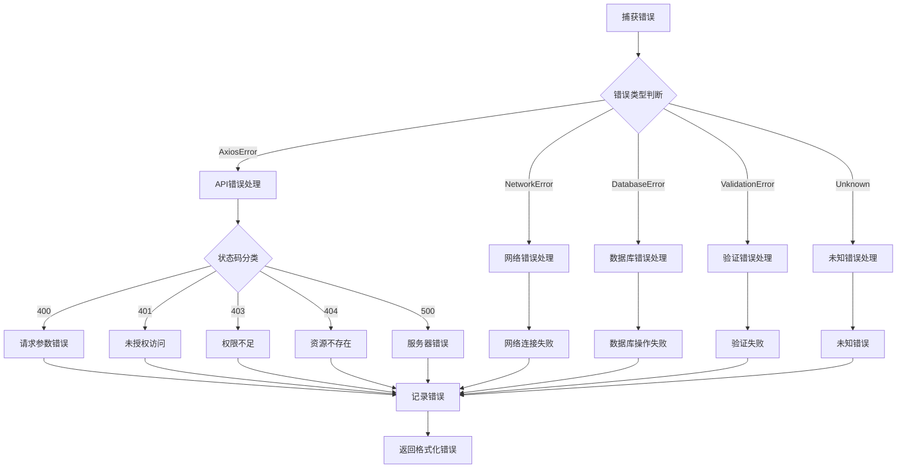

**图表来源**
- [errorHandler.ts](file://src/utils/errorHandler.ts#L50-L150)

**章节来源**
- [errorHandler.ts](file://src/utils/errorHandler.ts#L1-L200)

## 数据验证系统

### Validator 类设计

Validator 提供了灵活的数据验证框架：

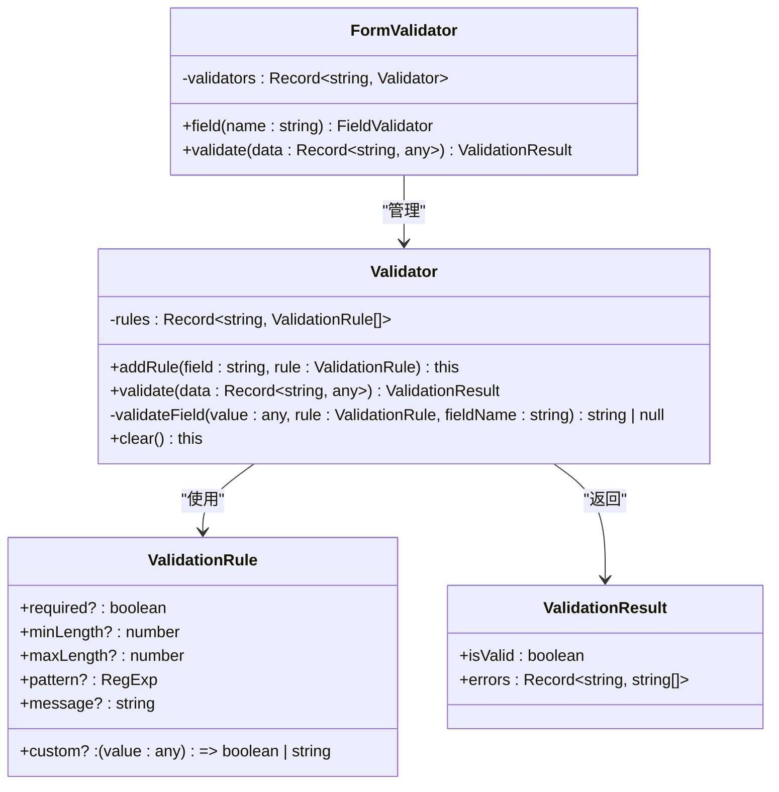

**图表来源**
- [validation.ts](file://src/utils/validation.ts#L1-L100)

### 常用验证规则

服务层预定义了一系列常用的验证规则：

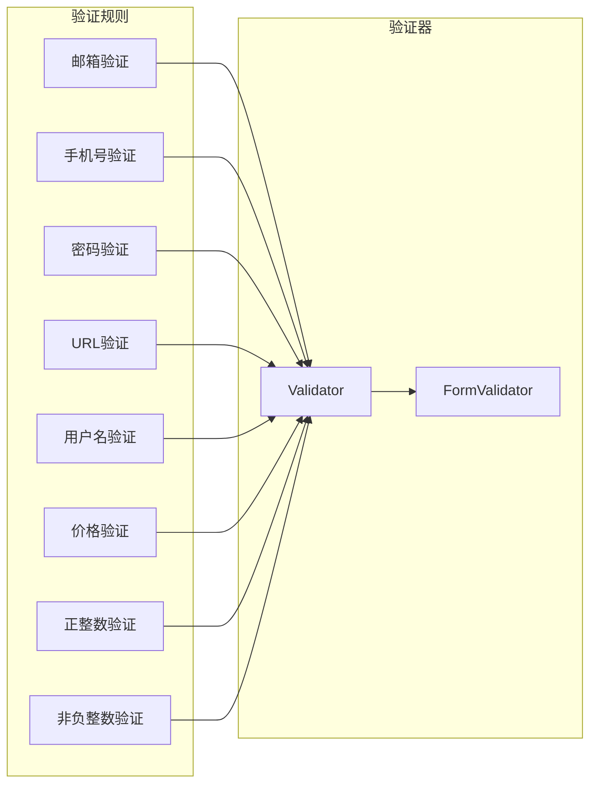

**图表来源**
- [validation.ts](file://src/utils/validation.ts#L100-L200)

**章节来源**
- [validation.ts](file://src/utils/validation.ts#L1-L200)

## 服务间依赖关系

### 依赖图谱

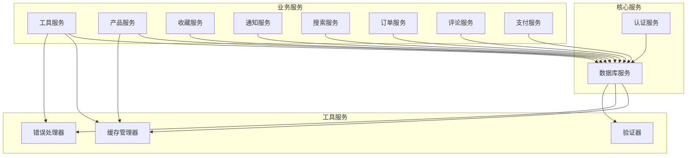

**图表来源**
- [databaseService.ts](file://src/services/databaseService.ts#L1-L50)
- [toolsService.ts](file://src/services/toolsService.ts#L1-L50)

### 潜在耦合风险

服务层的设计尽量减少了直接的耦合，但仍然存在一些间接依赖：

1. **共享错误处理**：所有服务都依赖 ErrorHandler
2. **缓存一致性**：DatabaseService 和具体业务服务共享缓存策略
3. **数据库模式**：所有服务都依赖相同的数据库表结构
4. **认证状态**：多个服务需要检查用户认证状态

**章节来源**
- [databaseService.ts](file://src/services/databaseService.ts#L1-L100)
- [toolsService.ts](file://src/services/toolsService.ts#L1-L100)

## 性能优化策略

### 请求缓存策略

服务层实现了多层缓存策略：

1. **内存缓存**：使用 Map 数据结构存储热点数据
2. **持久化缓存**：支持 localStorage 序列化存储
3. **智能过期**：基于 TTL 和版本控制的自动清理
4. **LRU淘汰**：最近最少使用算法优化内存使用

### 并发控制

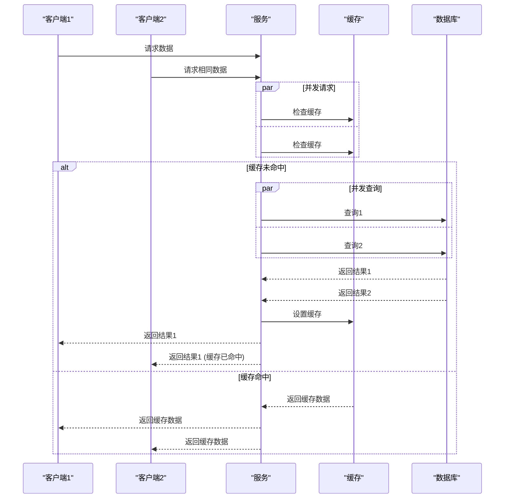

**图表来源**
- [cacheManager.ts](file://src/utils/cacheManager.ts#L50-L150)

### 超时设置和重试机制

服务层通过以下机制确保可靠性：

1. **请求超时**：默认 30 秒超时设置
2. **指数退避**：失败时的重试策略
3. **熔断器模式**：防止级联故障
4. **降级策略**：缓存或模拟数据回退

## 故障排除指南

### 常见问题诊断

1. **缓存失效问题**
   - 检查缓存键生成逻辑
   - 验证 TTL 设置是否合理
   - 确认缓存清理策略

2. **数据库连接问题**
   - 验证 Supabase 配置
   - 检查网络连接状态
   - 确认 RLS 策略配置

3. **认证失败问题**
   - 检查 JWT 令牌有效性
   - 验证用户权限设置
   - 确认会话状态同步

4. **性能问题**
   - 分析缓存命中率
   - 检查数据库索引
   - 优化查询语句

### 日志追踪方案

服务层提供了完整的日志追踪机制：

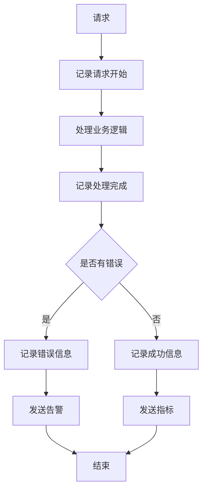

**图表来源**
- [errorHandler.ts](file://src/utils/errorHandler.ts#L200-L300)

**章节来源**
- [errorHandler.ts](file://src/utils/errorHandler.ts#L200-L331)

## 总结

Advanced Tools Navigation 的服务层是一个设计精良、功能完备的企业级架构。它通过以下关键特性实现了高质量的业务逻辑抽象：

### 核心优势

1. **模块化设计**：清晰的职责分离和接口定义
2. **类型安全**：全面的 TypeScript 支持确保代码质量
3. **性能优化**：多层次缓存和智能优化策略
4. **可靠性保障**：完善的错误处理和监控机制
5. **可扩展性**：灵活的架构设计便于功能扩展

### 最佳实践

1. **服务职责单一**：每个服务专注于特定的业务领域
2. **缓存策略合理**：根据数据特性和访问模式选择合适的缓存策略
3. **错误处理完善**：统一的错误处理机制和详细的日志记录
4. **验证机制严格**：多层次的数据验证确保数据完整性
5. **监控体系健全**：完整的性能监控和错误追踪

### 未来发展方向

1. **微服务拆分**：考虑将大型服务拆分为更细粒度的微服务
2. **异步处理**：引入消息队列处理耗时任务
3. **分布式缓存**：考虑使用 Redis 等分布式缓存系统
4. **可观测性增强**：集成 APM 工具提升系统可观测性
5. **自动化测试**：完善单元测试和集成测试覆盖率

这个服务层架构为 Advanced Tools Navigation 提供了坚实的技术基础，能够支持系统的持续发展和业务需求的变化。