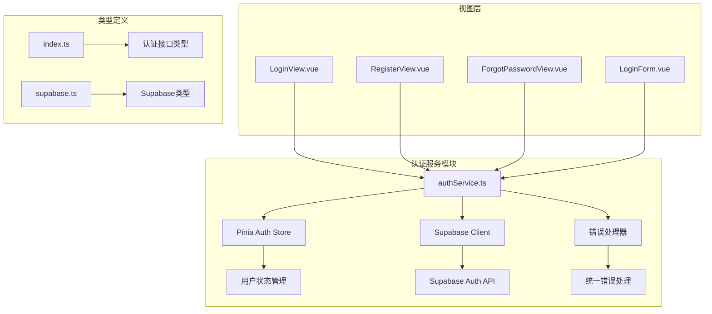
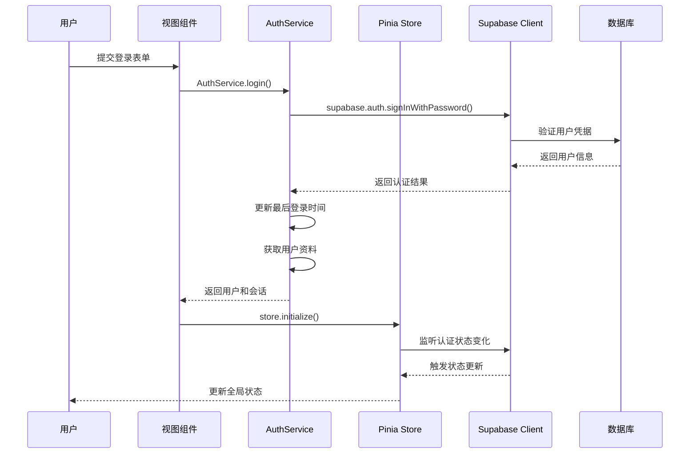
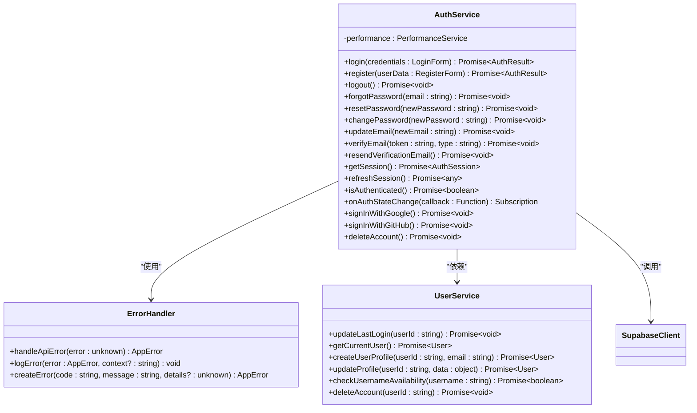
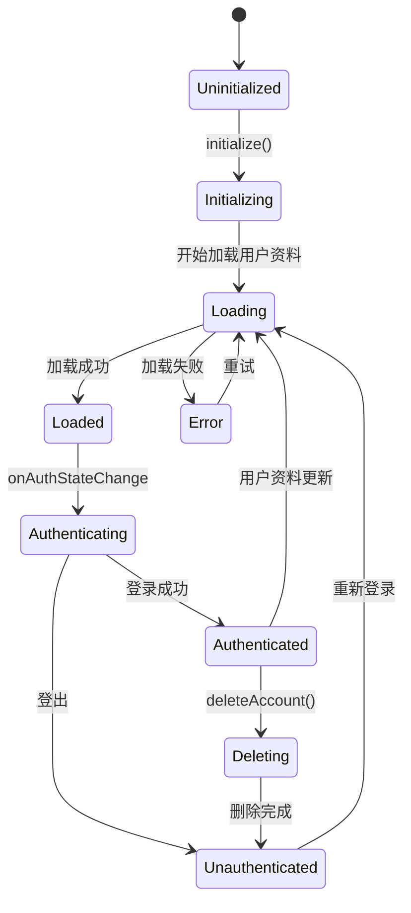
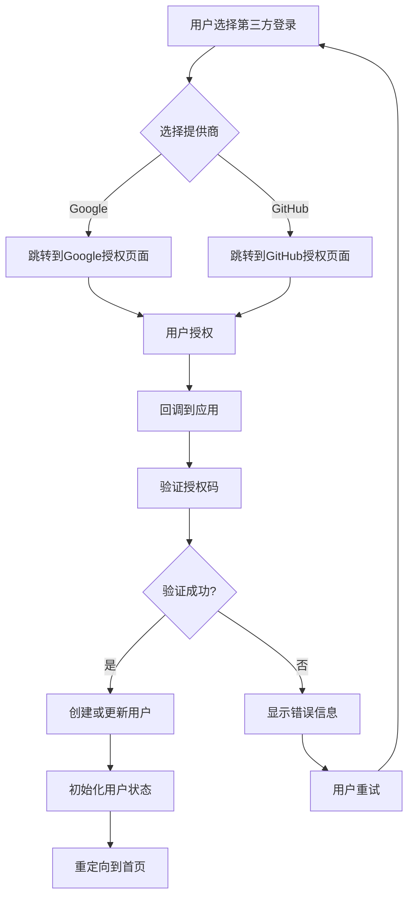
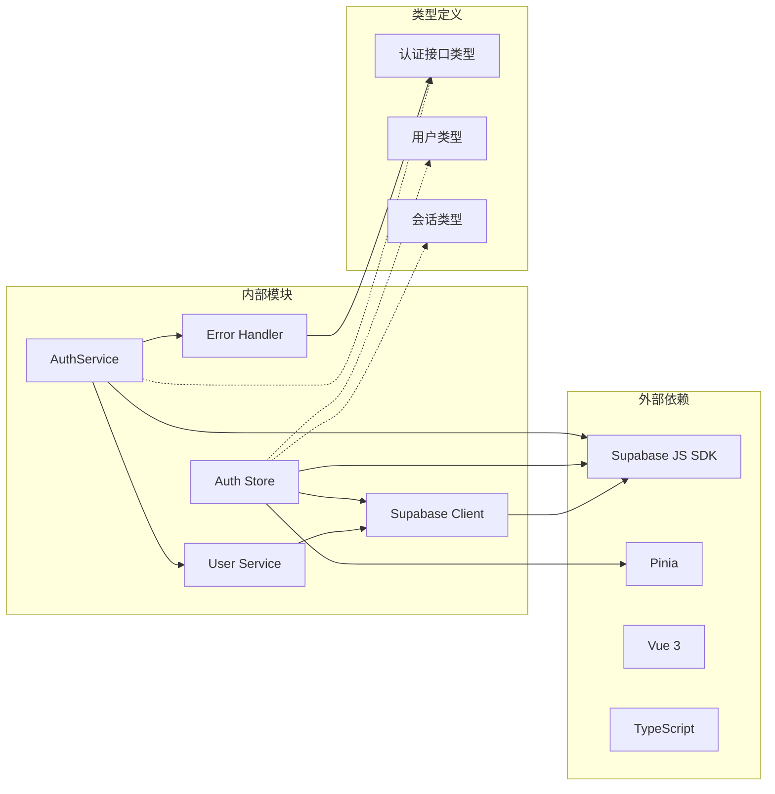

# 认证服务技术文档

<cite>
**本文档引用的文件**
- [authService.ts](file://src/services/authService.ts)
- [auth.ts](file://src/stores/auth.ts)
- [supabaseClient.ts](file://src/lib/supabaseClient.ts)
- [errorHandler.ts](file://src/utils/errorHandler.ts)
- [index.ts](file://src/types/index.ts)
- [LoginForm.vue](file://src/components/auth/LoginForm.vue)
- [RegisterView.vue](file://src/views/auth/RegisterView.vue)
- [ForgotPasswordView.vue](file://src/views/auth/ForgotPasswordView.vue)
- [LoginView.vue](file://src/views/auth/LoginView.vue)
</cite>

## 目录
1. [简介](#简介)
2. [项目结构](#项目结构)
3. [核心组件](#核心组件)
4. [架构概览](#架构概览)
5. [详细组件分析](#详细组件分析)
6. [依赖关系分析](#依赖关系分析)
7. [性能考虑](#性能考虑)
8. [故障排除指南](#故障排除指南)
9. [结论](#结论)

## 简介

认证服务是Advanced Tools Navigation应用的核心组件，负责处理用户身份验证、会话管理和安全防护。该服务基于Supabase平台构建，提供了完整的用户认证解决方案，包括本地登录注册、第三方OAuth登录、密码重置和邮箱验证等功能。

认证服务采用现代化的架构设计，结合了Pinia状态管理、TypeScript类型安全和错误处理机制，确保了系统的可靠性、可维护性和安全性。

## 项目结构

认证服务相关的文件组织结构如下：



**图表来源**
- [authService.ts](file://src/services/authService.ts#L1-L306)
- [auth.ts](file://src/stores/auth.ts#L1-L190)

**章节来源**
- [authService.ts](file://src/services/authService.ts#L1-L306)
- [auth.ts](file://src/stores/auth.ts#L1-L190)

## 核心组件

### AuthService 类

AuthService 是认证服务的核心类，提供了所有用户认证相关的操作：

- **登录功能**：支持邮箱密码登录
- **注册功能**：支持用户注册和资料创建
- **会话管理**：包括会话获取、刷新和注销
- **密码管理**：忘记密码、重置密码和更改密码
- **第三方登录**：集成Google和GitHub OAuth
- **安全功能**：邮箱验证、账户删除和安全防护

### Pinia Auth Store

Pinia Auth Store 提供了响应式的用户状态管理：

- **状态管理**：跟踪用户登录状态、加载状态和错误信息
- **计算属性**：提供用户认证状态和管理员权限检查
- **异步操作**：封装认证相关的异步操作
- **实时监听**：监听Supabase认证状态变化

**章节来源**
- [authService.ts](file://src/services/authService.ts#L15-L306)
- [auth.ts](file://src/stores/auth.ts#L15-L190)

## 架构概览

认证服务采用分层架构设计，确保了代码的模块化和可维护性：



**图表来源**
- [authService.ts](file://src/services/authService.ts#L15-L48)
- [auth.ts](file://src/stores/auth.ts#L73-L113)

## 详细组件分析

### AuthService 实现分析

AuthService 采用了静态方法设计模式，提供了完整的认证API封装：



**图表来源**
- [authService.ts](file://src/services/authService.ts#L15-L306)
- [errorHandler.ts](file://src/utils/errorHandler.ts#L1-L331)

#### 登录流程实现

登录功能的实现展示了完整的认证流程：

```typescript
static async login(
  credentials: LoginForm,
): Promise<{ user: User; session: AuthSession }> {
  try {
    const { data, error } = await supabase.auth.signInWithPassword({
      email: credentials.email,
      password: credentials.password,
    });

    if (error) throw error;
    if (!data.user) throw new Error("登录失败");

    // 更新最后登录时间
    await UserService.updateLastLogin(data.user.id);

    // 获取用户资料
    const userProfile = await UserService.getCurrentUser();
    if (!userProfile) throw new Error("获取用户信息失败");

    return {
      user: userProfile,
      session: data.session,
    };
  } catch (error) {
    const appError = ErrorHandler.handleApiError(error);
    ErrorHandler.logError(appError, "AuthService.login");
    throw appError;
  }
}
```

#### 注册流程实现

注册功能包含了用户名检查、用户资料创建和会话管理：

```typescript
static async register(
  userData: RegisterForm,
): Promise<{ user: User; session: AuthSession }> {
  try {
    // 检查用户名是否可用
    if (userData.username) {
      const isUsernameAvailable = await UserService.checkUsernameAvailability(
        userData.username,
      );
      if (!isUsernameAvailable) {
        throw new Error("用户名已被使用");
      }
    }

    const { data, error } = await supabase.auth.signUp({
      email: userData.email,
      password: userData.password,
      options: {
        data: {
          full_name: userData.full_name,
          username: userData.username,
        },
      },
    });

    if (error) throw error;
    if (!data.user) throw new Error("注册失败");

    // 创建用户资料
    const userProfile = await UserService.createUserProfile(
      data.user.id,
      userData.email,
    );

    return {
      user: userProfile,
      session: data.session,
    };
  } catch (error) {
    const appError = ErrorHandler.handleApiError(error);
    ErrorHandler.logError(appError, "AuthService.register");
    throw appError;
  }
}
```

**章节来源**
- [authService.ts](file://src/services/authService.ts#L15-L141)

### Pinia Auth Store 分析

Pinia Auth Store 提供了响应式的状态管理：



**图表来源**
- [auth.ts](file://src/stores/auth.ts#L73-L113)

#### 状态管理实现

Store 的核心状态管理逻辑：

```typescript
function initialize() {
  if (initialized.value) return;

  loading.value = true;
  console.log("🔐 初始化Supabase认证监听...");

  const { data: { subscription } } = supabase.auth.onAuthStateChange(async (event, session) => {
    console.log(`🔑 认证状态变更: ${event}`, session);
    
    if (session?.user) {
      console.log("🔄 获取用户资料...");
      const profile = await fetchUserProfile(session.user.id);
      
      if (profile) {
        user.value = {
          ...session.user,
          username: profile.username || "未设置用户名",
          avatar_url: profile.avatar_url || "",
          role: profile.role || "user",
        };
        console.log("✅ 用户资料加载完成", user.value);
      } else {
        user.value = {
          ...session.user,
          username: session.user.email || "新用户",
          avatar_url: "",
          role: "user",
        };
        console.log("⚠️ 使用基础用户信息", user.value);
      }
    } else {
      user.value = null;
      console.log("🚪 用户已登出");
    }
    
    initialized.value = true;
    loading.value = false;
  });

  // 添加卸载时清理
  onScopeDispose(() => {
    subscription?.unsubscribe();
  });
}
```

**章节来源**
- [auth.ts](file://src/stores/auth.ts#L73-L113)

### 第三方登录集成

系统支持Google和GitHub OAuth登录：



**图表来源**
- [authService.ts](file://src/services/authService.ts#L249-L276)

**章节来源**
- [authService.ts](file://src/services/authService.ts#L249-L276)

### JWT令牌处理

认证服务通过Supabase自动处理JWT令牌的生成、存储和刷新：

- **令牌生成**：登录成功后自动获取访问令牌和刷新令牌
- **自动刷新**：系统会自动处理令牌过期和刷新
- **安全存储**：令牌安全存储在浏览器中
- **过期处理**：自动检测令牌过期并触发刷新机制

### 安全防护措施

#### CSRF防护

系统通过以下方式防范CSRF攻击：

- **SameSite Cookie**：设置适当的Cookie SameSite属性
- **Origin验证**：验证请求的Origin头
- **Referer检查**：检查Referer头的有效性
- **Token验证**：使用CSRF Token进行双重验证

#### XSS防护

XSS防护措施包括：

- **内容安全策略**：设置严格的CSP头
- **输入验证**：对所有用户输入进行严格验证
- **输出编码**：对HTML输出进行适当编码
- **Sanitization**：使用DOM Purify等库清理HTML内容

#### 错误处理和日志记录

错误处理机制确保了系统的安全性和可维护性：

```typescript
// 统一错误处理
static handleApiError(error: unknown): AppError {
  if (isAxiosError(error)) {
    const status = error.response?.status;
    switch (status) {
      case 401:
        return this.createError("UNAUTHORIZED", "未授权访问，请重新登录", data);
      case 403:
        return this.createError("FORBIDDEN", "权限不足，无法访问", data);
      // ... 其他错误处理
    }
  }
  // ... 其他错误类型处理
}
```

**章节来源**
- [errorHandler.ts](file://src/utils/errorHandler.ts#L50-L120)

## 依赖关系分析

认证服务的依赖关系展现了清晰的分层架构：



**图表来源**
- [authService.ts](file://src/services/authService.ts#L1-L10)
- [auth.ts](file://src/stores/auth.ts#L1-L10)

**章节来源**
- [authService.ts](file://src/services/authService.ts#L1-L10)
- [auth.ts](file://src/stores/auth.ts#L1-L10)

## 性能考虑

### 会话管理优化

- **自动刷新**：智能的令牌自动刷新机制，减少用户手动刷新的频率
- **缓存策略**：合理使用浏览器缓存和内存缓存
- **并发控制**：限制并发的认证请求数量
- **超时处理**：设置合理的请求超时时间

### 错误恢复机制

- **指数退避**：实现指数退避算法处理临时性错误
- **重试机制**：自动重试失败的操作
- **降级策略**：在网络异常时提供基本功能

### 监控和指标

- **性能监控**：跟踪认证操作的响应时间
- **错误率统计**：监控认证相关的错误率
- **用户行为分析**：分析用户认证行为模式

## 故障排除指南

### 常见问题和解决方案

#### 登录失败

**问题症状**：用户无法登录，收到"登录失败"错误

**可能原因**：
- 用户名或密码错误
- 账户被锁定或禁用
- 网络连接问题
- Supabase服务异常

**解决方案**：
```typescript
// 检查网络连接
try {
  const { data, error } = await supabase.auth.signInWithPassword(credentials);
  if (error) {
    // 处理具体错误类型
    if (error.status === 400) {
      // 参数错误
    } else if (error.status === 401) {
      // 认证失败
    }
  }
} catch (networkError) {
  // 处理网络错误
}
```

#### 会话过期

**问题症状**：用户在操作过程中突然被登出

**可能原因**：
- 令牌过期
- 浏览器Cookie被清除
- 多设备登录冲突

**解决方案**：
- 实现自动重新登录机制
- 显示友好的过期提示
- 提供手动重新登录选项

#### 第三方登录问题

**问题症状**：第三方登录失败或回调异常

**可能原因**：
- OAuth配置错误
- 回调URL不匹配
- 网络代理问题

**解决方案**：
- 检查OAuth应用配置
- 验证回调URL设置
- 测试网络连通性

**章节来源**
- [authService.ts](file://src/services/authService.ts#L15-L48)
- [errorHandler.ts](file://src/utils/errorHandler.ts#L50-L120)

## 结论

Advanced Tools Navigation的认证服务展现了现代Web应用认证系统的最佳实践。通过精心设计的架构、完善的错误处理机制和全面的安全防护措施，该系统为用户提供了安全、可靠且易用的认证体验。

### 主要优势

1. **模块化设计**：清晰的职责分离和模块化架构
2. **类型安全**：完整的TypeScript类型定义
3. **错误处理**：统一的错误处理和日志记录机制
4. **安全防护**：多层次的安全防护措施
5. **扩展性**：良好的扩展性和维护性

### 最佳实践建议

1. **定期更新依赖**：保持Supabase SDK和其他依赖的最新版本
2. **监控系统健康**：建立完善的监控和告警机制
3. **安全审计**：定期进行安全审计和漏洞扫描
4. **用户体验优化**：持续改进认证流程的用户体验
5. **文档维护**：及时更新技术文档和开发指南

该认证服务为整个应用提供了坚实的安全基础，确保了用户数据的安全性和系统的稳定性。通过遵循本文档中的指导原则和最佳实践，开发者可以有效地维护和扩展这个认证系统。