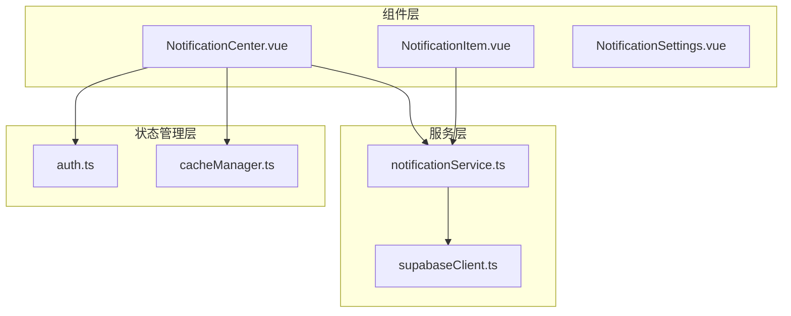
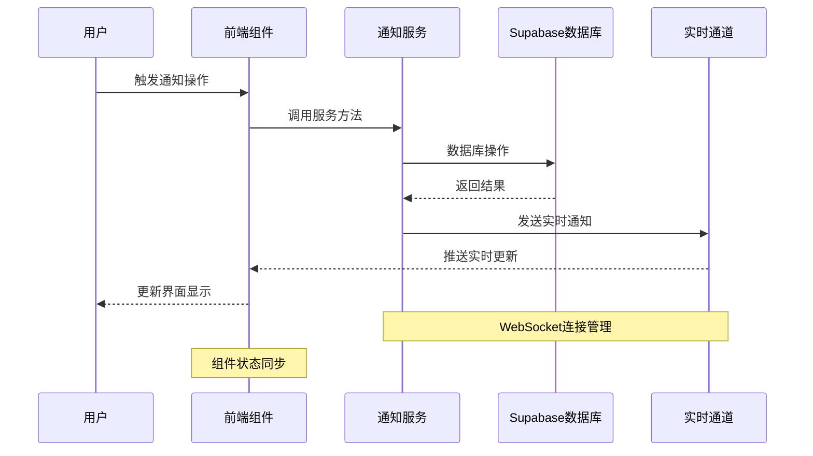
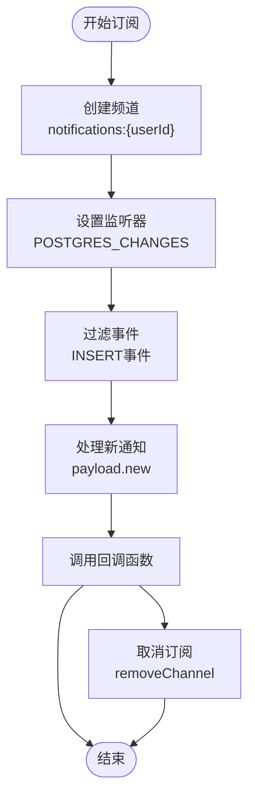
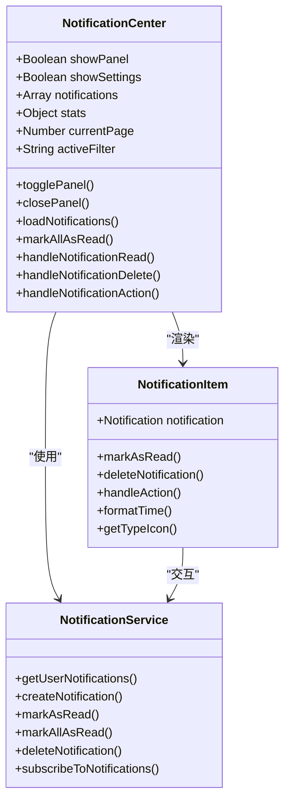
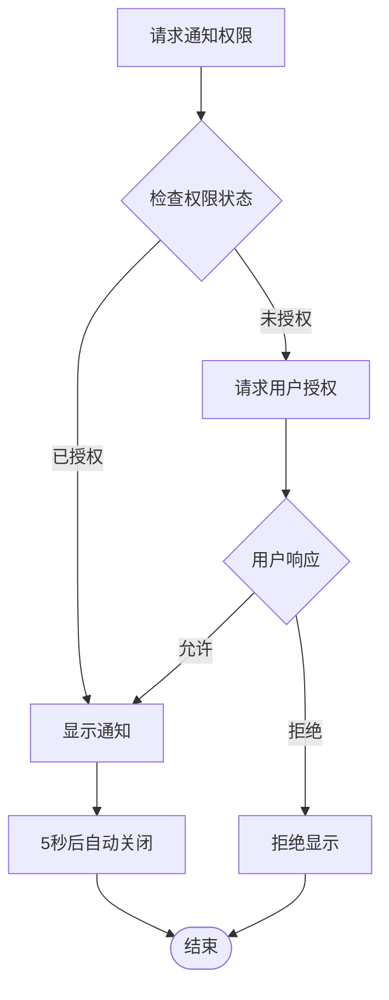
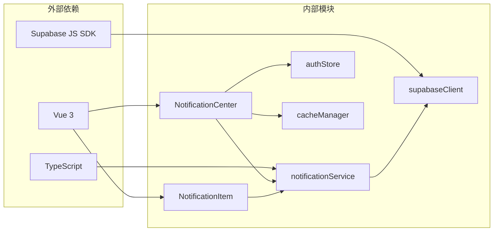

# 通知服务技术文档

<cite>
**本文档引用的文件**
- [notificationService.ts](file://src/services/notificationService.ts)
- [NotificationCenter.vue](file://src/components/notifications/NotificationCenter.vue)
- [NotificationItem.vue](file://src/components/notifications/NotificationItem.vue)
- [supabaseClient.ts](file://src/lib/supabaseClient.ts)
- [auth.ts](file://src/stores/auth.ts)
- [cacheManager.ts](file://src/utils/cacheManager.ts)
</cite>

## 目录
1. [简介](#简介)
2. [项目结构](#项目结构)
3. [核心组件](#核心组件)
4. [架构概览](#架构概览)
5. [详细组件分析](#详细组件分析)
6. [依赖关系分析](#依赖关系分析)
7. [性能考虑](#性能考虑)
8. [故障排除指南](#故障排除指南)
9. [结论](#结论)

## 简介

通知服务是一个完整的实时消息推送与用户提醒系统，基于Vue 3和TypeScript构建，集成了Supabase实时数据库功能。该系统提供了全面的通知管理功能，包括通知创建、读取状态更新、批量标记已读、未读计数获取等核心功能，同时支持WebSocket连接管理和离线消息存储。

系统采用现代化的前端架构设计，通过组件化的方式实现了NotificationCenter组件与前端界面的无缝通信，并集成了本地推送功能，为用户提供及时的消息提醒体验。

## 项目结构

通知服务的核心文件组织如下：



**图表来源**
- [notificationService.ts](file://src/services/notificationService.ts#L1-L514)
- [NotificationCenter.vue](file://src/components/notifications/NotificationCenter.vue#L1-L716)
- [supabaseClient.ts](file://src/lib/supabaseClient.ts#L1-L246)

**章节来源**
- [notificationService.ts](file://src/services/notificationService.ts#L1-L514)
- [NotificationCenter.vue](file://src/components/notifications/NotificationCenter.vue#L1-L716)

## 核心组件

### 通知服务类 (NotificationService)

NotificationService是整个通知系统的核心类，负责处理所有与通知相关的业务逻辑：

```typescript
class NotificationService {
  private eventSource?: EventSource;
  
  // 主要接口
  async getUserNotifications(userId: string, options: object): Promise<object>
  async createNotification(notificationData: CreateNotificationData): Promise<Notification | null>
  async markAsRead(notificationId: string, userId: string): Promise<void>
  async markAllAsRead(userId: string, type?: string): Promise<void>
  async deleteNotification(notificationId: string, userId: string): Promise<void>
}
```

### 通知数据模型

系统定义了完整的通知数据结构：

```typescript
interface Notification {
  id: string;
  user_id: string;
  type: "info" | "success" | "warning" | "error" | "system" | "product" | "order";
  title: string;
  message: string;
  action_url?: string;
  action_text?: string;
  is_read: boolean;
  is_important: boolean;
  expires_at?: string;
  metadata?: Record<string, any>;
  created_at: string;
  updated_at: string;
}
```

**章节来源**
- [notificationService.ts](file://src/services/notificationService.ts#L1-L514)

## 架构概览

通知服务采用分层架构设计，结合实时数据库和前端组件：



**图表来源**
- [notificationService.ts](file://src/services/notificationService.ts#L408-L465)
- [NotificationCenter.vue](file://src/components/notifications/NotificationCenter.vue#L1-L199)

## 详细组件分析

### 实时订阅机制

通知服务通过Supabase的实时功能实现实时通知推送：



**图表来源**
- [notificationService.ts](file://src/services/notificationService.ts#L408-L465)

### 通知中心组件

NotificationCenter组件提供了完整的用户界面交互：



**图表来源**
- [NotificationCenter.vue](file://src/components/notifications/NotificationCenter.vue#L1-L199)
- [NotificationItem.vue](file://src/components/notifications/NotificationItem.vue#L1-L199)
- [notificationService.ts](file://src/services/notificationService.ts#L1-L514)

### 浏览器通知集成

系统支持浏览器原生通知功能：



**图表来源**
- [notificationService.ts](file://src/services/notificationService.ts#L425-L465)

**章节来源**
- [NotificationCenter.vue](file://src/components/notifications/NotificationCenter.vue#L1-L199)
- [NotificationItem.vue](file://src/components/notifications/NotificationItem.vue#L1-L199)
- [notificationService.ts](file://src/services/notificationService.ts#L408-L465)

### 通知偏好管理

系统提供了灵活的通知偏好设置：

```typescript
interface NotificationPreferences {
  id: string;
  user_id: string;
  email_notifications: boolean;
  push_notifications: boolean;
  system_notifications: boolean;
  product_notifications: boolean;
  order_notifications: boolean;
  marketing_notifications: boolean;
  notification_frequency: "immediate" | "daily" | "weekly" | "never";
  quiet_hours_start?: string;
  quiet_hours_end?: string;
  created_at: string;
  updated_at: string;
}
```

### 性能优化策略

系统采用了多种性能优化策略：

1. **缓存管理**: 使用智能缓存管理器优化数据加载
2. **分页加载**: 支持无限滚动的分页加载机制
3. **实时订阅**: 通过WebSocket实现实时更新
4. **批量操作**: 支持批量标记已读和批量删除

**章节来源**
- [notificationService.ts](file://src/services/notificationService.ts#L1-L514)
- [cacheManager.ts](file://src/utils/cacheManager.ts#L1-L400)

## 依赖关系分析

通知服务的依赖关系图：



**图表来源**
- [notificationService.ts](file://src/services/notificationService.ts#L1-L10)
- [NotificationCenter.vue](file://src/components/notifications/NotificationCenter.vue#L1-L20)
- [supabaseClient.ts](file://src/lib/supabaseClient.ts#L1-L10)

**章节来源**
- [notificationService.ts](file://src/services/notificationService.ts#L1-L514)
- [NotificationCenter.vue](file://src/components/notifications/NotificationCenter.vue#L1-L716)
- [supabaseClient.ts](file://src/lib/supabaseClient.ts#L1-L246)

## 性能考虑

### 高并发订阅处理

系统通过以下机制处理高并发订阅：

1. **连接池管理**: Supabase自动管理WebSocket连接池
2. **消息去重**: 避免重复推送相同通知
3. **负载均衡**: 通过数据库索引优化查询性能

### 内存优化

1. **缓存策略**: 使用LRU算法管理内存使用
2. **定期清理**: 自动清理过期缓存项
3. **懒加载**: 按需加载通知内容

### 网络优化

1. **压缩传输**: 减少网络带宽使用
2. **增量更新**: 只传输变更的数据
3. **断线重连**: 自动处理网络异常

## 故障排除指南

### 常见问题及解决方案

1. **实时通知不推送**
   - 检查WebSocket连接状态
   - 验证用户认证状态
   - 确认数据库触发器配置

2. **通知显示异常**
   - 检查CSS样式冲突
   - 验证数据格式正确性
   - 确认组件生命周期管理

3. **性能问题**
   - 分析缓存命中率
   - 检查数据库查询优化
   - 监控内存使用情况

**章节来源**
- [notificationService.ts](file://src/services/notificationService.ts#L408-L465)
- [cacheManager.ts](file://src/utils/cacheManager.ts#L1-L400)

## 结论

通知服务是一个功能完整、架构清晰的实时消息推送系统。通过集成Supabase实时数据库功能，系统实现了高效的通知管理和实时推送能力。组件化的架构设计确保了代码的可维护性和扩展性，而完善的错误处理和性能优化策略则保证了系统的稳定运行。

该系统特别适用于需要实时消息推送的应用场景，如社交平台、电商平台、内容管理系统等。通过合理的架构设计和性能优化，系统能够处理高并发场景下的通知推送需求，为用户提供及时、准确的消息提醒体验。