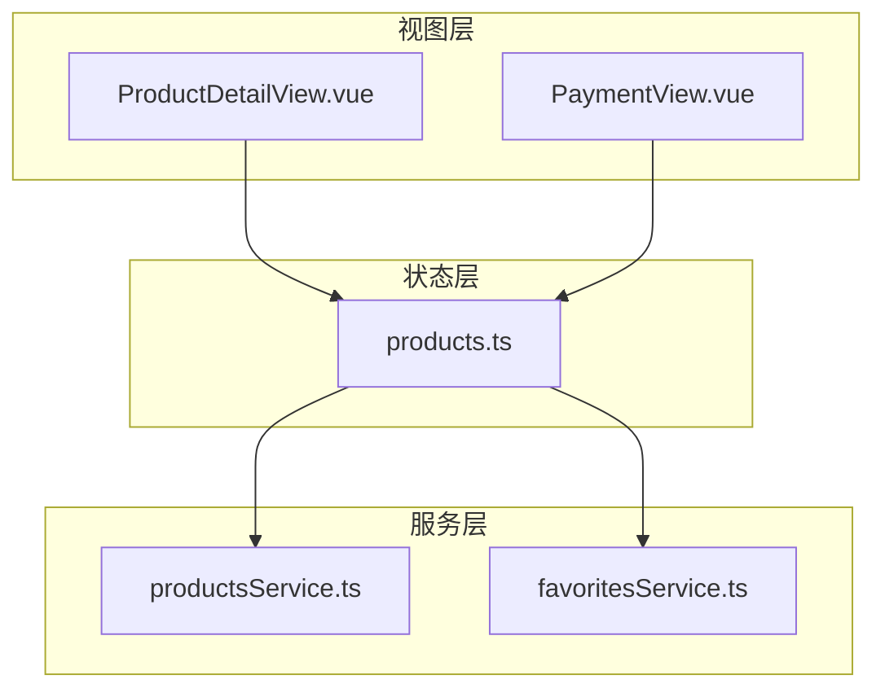
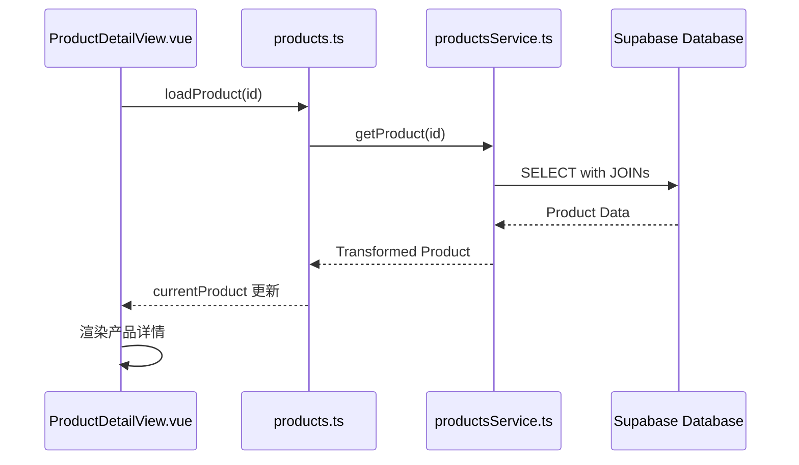
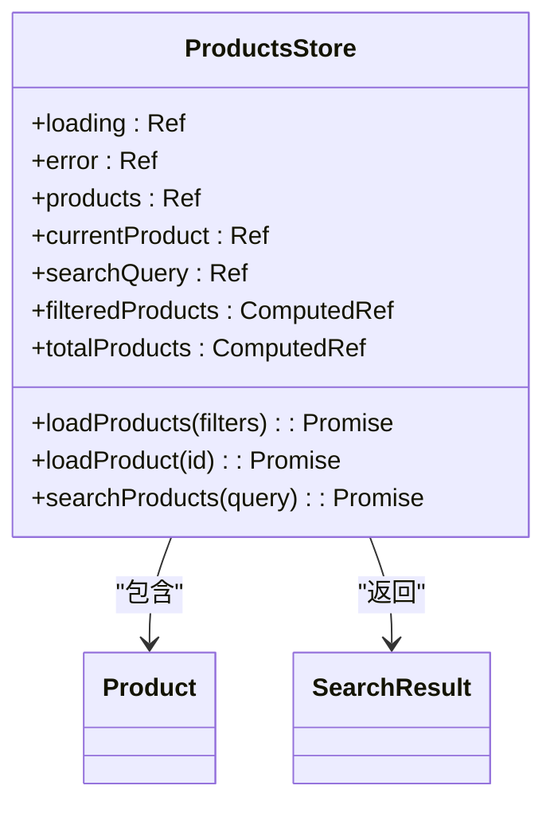
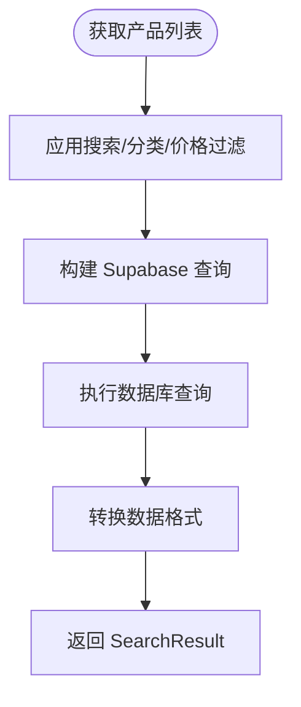
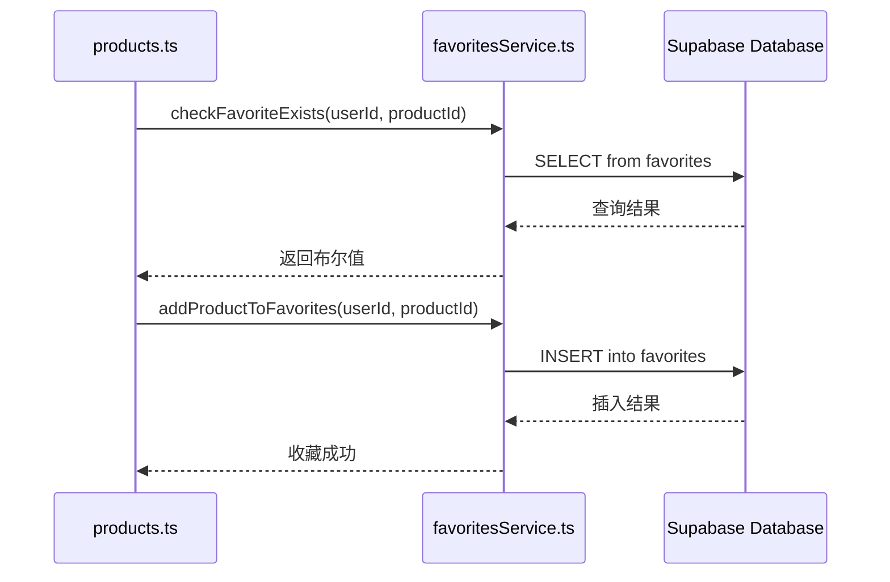
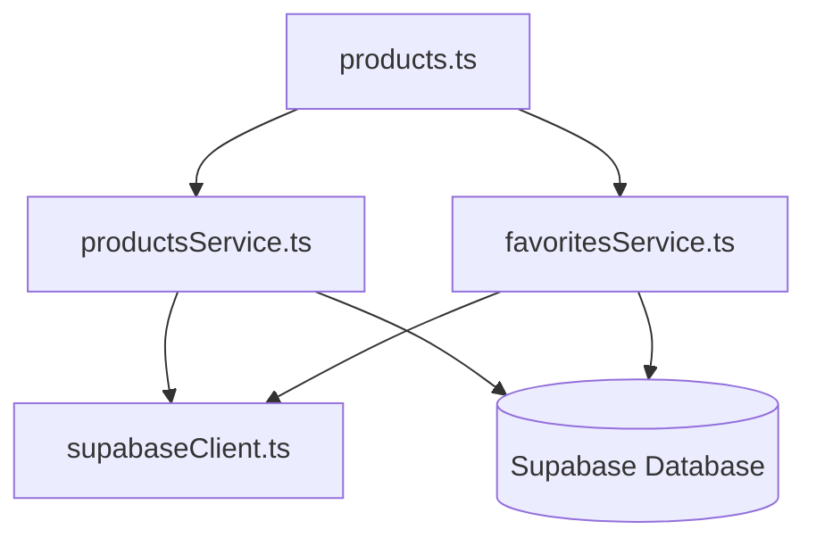

# 产品状态管理

<cite>
**本文档引用的文件**
- [products.ts](file://src/stores/products.ts)
- [productsService.ts](file://src/services/productsService.ts)
- [favoritesService.ts](file://src/services/favoritesService.ts)
- [ProductDetailView.vue](file://src/views/ProductDetailView.vue)
- [PaymentView.vue](file://src/views/PaymentView.vue)
</cite>

## 目录
1. [简介](#简介)
2. [项目结构](#项目结构)
3. [核心组件](#核心组件)
4. [架构概览](#架构概览)
5. [详细组件分析](#详细组件分析)
6. [依赖分析](#依赖分析)
7. [性能考虑](#性能考虑)
8. [故障排除指南](#故障排除指南)
9. [结论](#结论)

## 简介
本文档详细阐述了基于 Pinia 的产品状态管理系统设计，涵盖产品列表、详情、购物车及收藏状态的管理机制。重点分析了 `products.ts` 中的状态管理逻辑、`productsService.ts` 的数据获取与处理流程，以及 `favoritesService.ts` 的收藏同步机制。同时说明了状态如何在 `ProductDetailView.vue` 和 `PaymentView.vue` 中驱动 UI 渲染和订单信息传递，并介绍了高并发访问、数据一致性保障和缓存失效策略的技术实现。

## 项目结构
产品状态管理相关代码分布在 `src/stores` 和 `src/services` 目录下，通过模块化设计实现关注点分离。状态逻辑由 Pinia store 管理，业务服务封装数据访问，视图组件消费状态并触发动作。

**图示来源**
- [products.ts](file://src/stores/products.ts)
- [productsService.ts](file://src/services/productsService.ts)
- [favoritesService.ts](file://src/services/favoritesService.ts)

**本节来源**
- [src/stores/products.ts](file://src/stores/products.ts)
- [src/services/productsService.ts](file://src/services/productsService.ts)

## 核心组件
`products.ts` 定义了产品状态的核心 store，管理产品列表、搜索结果、当前产品等状态，并提供加载、搜索、创建、更新、删除等操作方法。`productsService.ts` 封装了与 Supabase 数据库的交互逻辑，执行实际的数据查询和变更操作。`favoritesService.ts` 处理用户收藏的增删查操作，与产品状态管理协同工作。

**本节来源**
- [products.ts](file://src/stores/products.ts#L1-L362)
- [productsService.ts](file://src/services/productsService.ts#L1-L339)
- [favoritesService.ts](file://src/services/favoritesService.ts#L1-L341)

## 架构概览
系统采用分层架构，视图层通过 Pinia store 访问状态和调用业务逻辑，store 内部协调多个服务完成数据操作。状态变更自动触发视图更新，形成响应式数据流。

**图示来源**
- [products.ts](file://src/stores/products.ts#L100-L120)
- [productsService.ts](file://src/services/productsService.ts#L50-L80)

## 详细组件分析

### 产品状态管理分析
`useProductsStore` 使用 Pinia 定义了产品相关的状态和操作。状态包括产品列表、当前产品、搜索状态等，通过 ref 声明响应式变量。计算属性如 `filteredProducts` 和 `totalProducts` 提供派生数据，避免重复计算。

#### 状态与计算属性

**图示来源**
- [products.ts](file://src/stores/products.ts#L10-L50)

#### 业务逻辑实现
产品数据获取、库存检查、价格计算等业务逻辑主要在 `productsService.ts` 中实现。`getProducts` 方法应用搜索过滤器、分类筛选、价格范围和排序规则，通过 Supabase 查询构造器构建复杂查询。`transformProduct` 方法将数据库记录转换为前端业务对象，处理关联数据如分类和评论。

**图示来源**
- [productsService.ts](file://src/services/productsService.ts#L10-L40)

**本节来源**
- [products.ts](file://src/stores/products.ts#L1-L362)
- [productsService.ts](file://src/services/productsService.ts#L1-L339)

### 收藏状态同步机制
收藏状态通过 `favoritesService.ts` 与后端同步。`checkFavoriteExists` 方法检查用户是否已收藏特定产品，`addProductToFavorites` 和 `removeProductFromFavorites` 方法处理收藏的增删操作。这些服务被集成到产品 store 中，确保收藏状态的实时性和一致性。

**图示来源**
- [favoritesService.ts](file://src/services/favoritesService.ts#L100-L150)

**本节来源**
- [favoritesService.ts](file://src/services/favoritesService.ts#L1-L341)

## 依赖分析
产品状态管理模块依赖于 Supabase 作为后端数据源，通过 `supabaseClient` 进行数据交互。`productsService.ts` 依赖于数据库模式定义，`products.ts` 依赖于 `productsService.ts` 和类型定义。各组件之间通过清晰的接口进行通信，降低了耦合度。

**图示来源**
- [products.ts](file://src/stores/products.ts#L1-L10)
- [productsService.ts](file://src/services/productsService.ts#L1-L10)
- [favoritesService.ts](file://src/services/favoritesService.ts#L1-L10)

**本节来源**
- [src/services/productsService.ts](file://src/services/productsService.ts)
- [src/services/favoritesService.ts](file://src/services/favoritesService.ts)
- [src/lib/supabase.ts](file://src/lib/supabase.ts)

## 性能考虑
为应对高并发商品访问，系统采用分页查询（`range`）和合理索引策略。数据一致性通过 Supabase 的 RLS（Row Level Security）策略保障。缓存失效策略依赖于 store 的状态管理，当执行创建、更新、删除操作时，store 会自动更新本地状态，确保视图层获取最新数据。

## 故障排除指南
常见问题包括数据加载失败、收藏状态不同步等。应检查网络连接、Supabase 配置、RLS 策略设置。对于数据不一致问题，可尝试清除 store 状态并重新初始化。错误处理在 service 层捕获并抛出，store 层记录错误信息供视图层显示。

**本节来源**
- [products.ts](file://src/stores/products.ts#L30-L40)
- [productsService.ts](file://src/services/productsService.ts#L20-L30)
- [favoritesService.ts](file://src/services/favoritesService.ts#L20-L30)

## 结论
产品状态管理系统通过 Pinia store 实现了高效的状态管理，结合 Supabase 提供了可靠的数据持久化。分层架构和清晰的职责划分使得系统易于维护和扩展。通过合理的性能优化和错误处理机制，确保了良好的用户体验和系统稳定性。