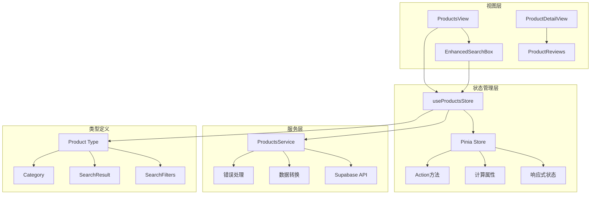
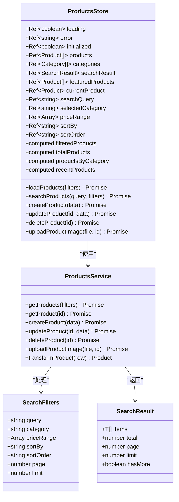
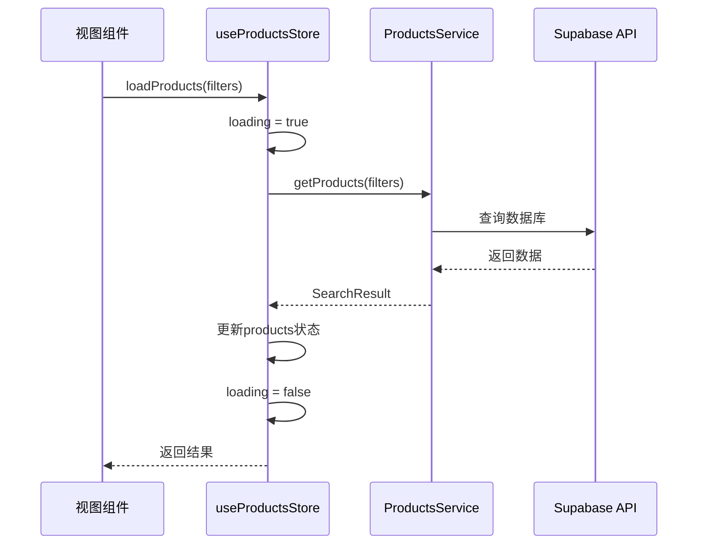
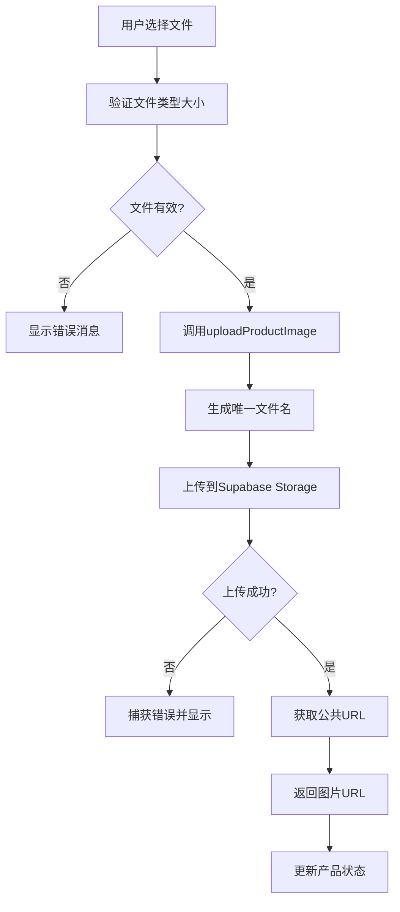
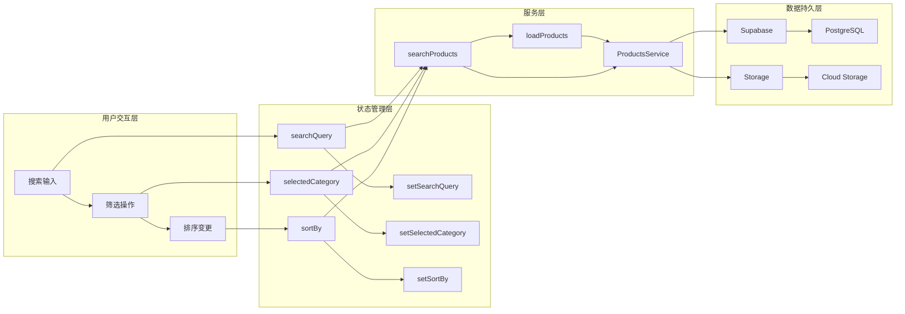
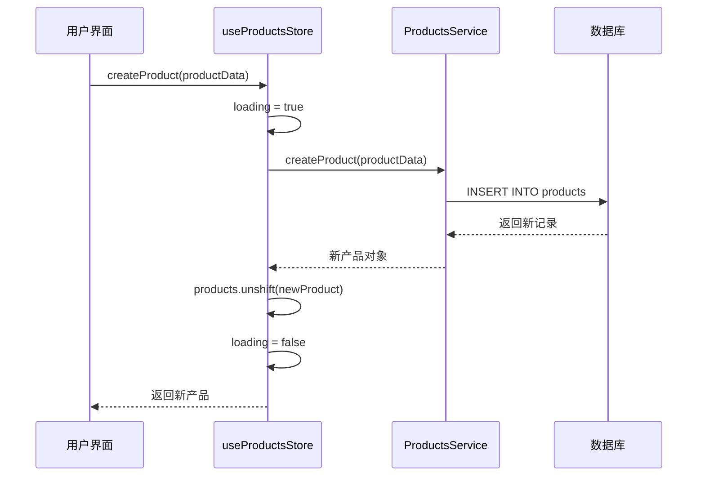
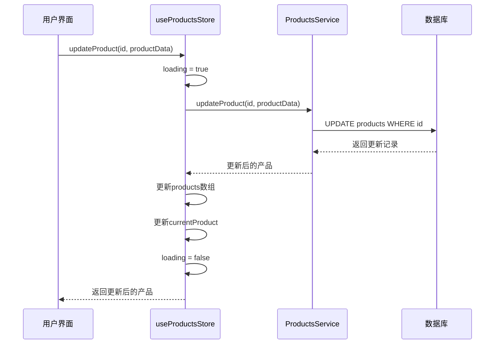
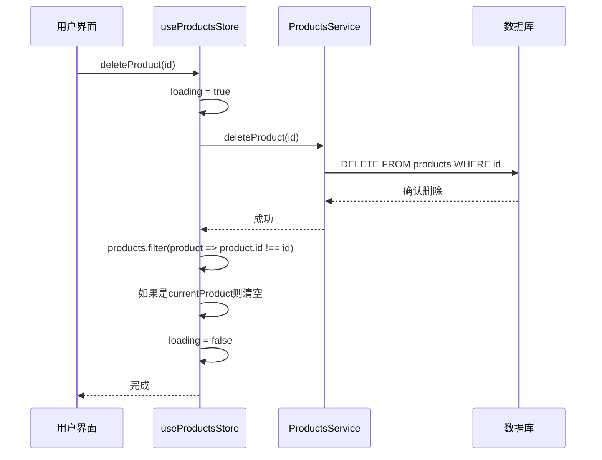
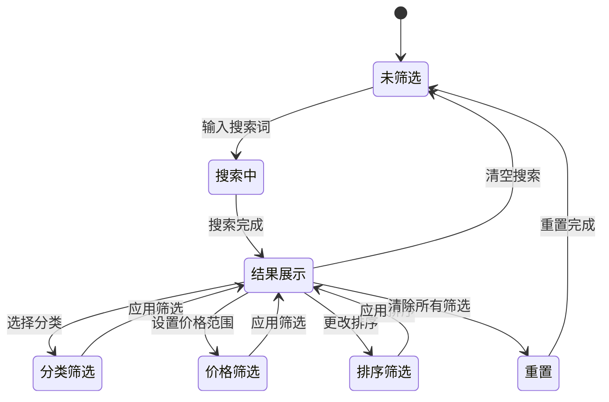
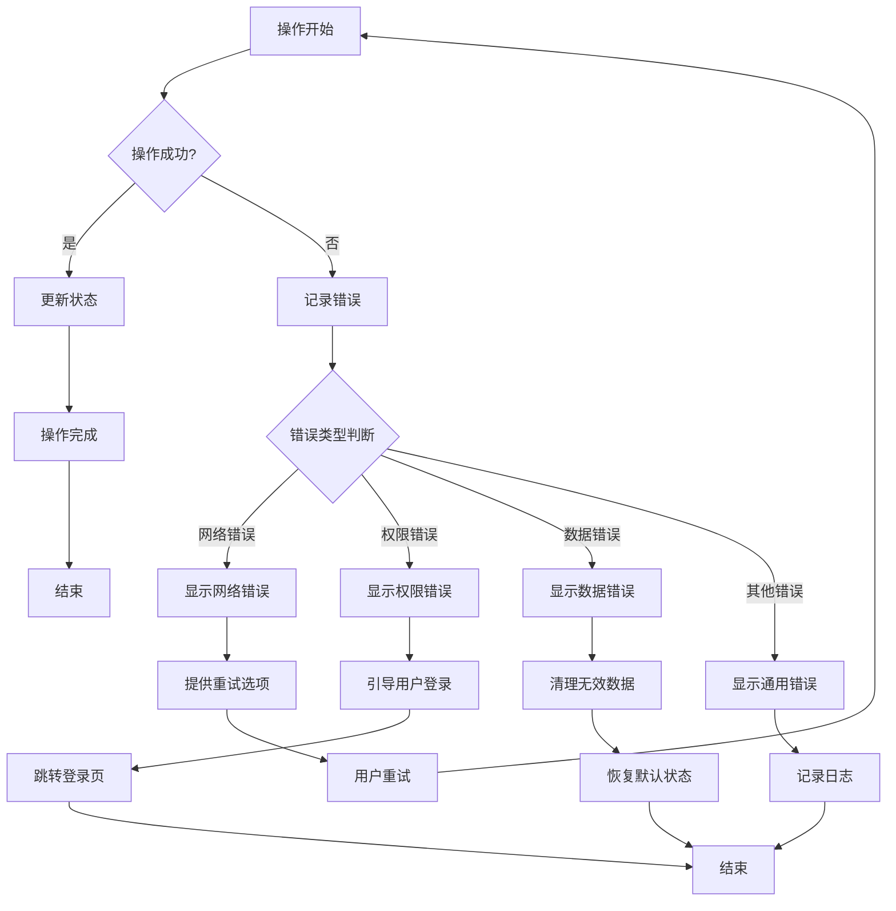

# 产品状态管理模块详细文档

<cite>
**本文档引用的文件**
- [src/stores/products.ts](file://src/stores/products.ts)
- [src/services/productsService.ts](file://src/services/productsService.ts)
- [src/types/index.ts](file://src/types/index.ts)
- [src/views/ProductsView.vue](file://src/views/ProductsView.vue)
- [src/components/search/EnhancedSearchBox.vue](file://src/components/search/EnhancedSearchBox.vue)
- [src/router/index.ts](file://src/router/index.ts)
</cite>

## 目录
1. [简介](#简介)
2. [项目结构概览](#项目结构概览)
3. [核心架构设计](#核心架构设计)
4. [状态管理架构](#状态管理架构)
5. [详细组件分析](#详细组件分析)
6. [数据流机制](#数据流机制)
7. [CRUD操作流程](#crud操作流程)
8. [搜索与筛选机制](#搜索与筛选机制)
9. [性能优化策略](#性能优化策略)
10. [错误处理模式](#错误处理模式)
11. [最佳实践与建议](#最佳实践与建议)
12. [故障排除指南](#故障排除指南)

## 简介

产品状态管理模块是基于Vue 3 Composition API和Pinia的状态管理系统，专门设计用于管理电商平台中的产品数据。该模块提供了完整的CRUD操作、智能搜索、筛选排序、图片上传等核心功能，采用响应式设计确保组件间的数据同步。

## 项目结构概览



**图表来源**
- [src/stores/products.ts](file://src/stores/products.ts#L1-L365)
- [src/services/productsService.ts](file://src/services/productsService.ts#L1-L347)

## 核心架构设计

### Store设计原则

useProductsStore采用了函数式编程的设计理念，通过defineStore创建了一个独立的状态容器：

```typescript
export const useProductsStore = defineStore("products", () => {
  // 状态定义
  const loading = ref(false);
  const error = ref<string | null>(null);
  const initialized = ref(false);
  
  // 数据状态
  const products = ref<Product[]>([]);
  const categories = ref<Category[]>([]);
  const searchResult = ref<SearchResult<Product> | null>(null);
  const featuredProducts = ref<Product[]>([]);
  const currentProduct = ref<Product | null>(null);
});
```

### 状态层次结构



**图表来源**
- [src/stores/products.ts](file://src/stores/products.ts#L5-L365)
- [src/services/productsService.ts](file://src/services/productsService.ts#L10-L347)
- [src/types/index.ts](file://src/types/index.ts#L250-L280)

**章节来源**
- [src/stores/products.ts](file://src/stores/products.ts#L1-L365)
- [src/services/productsService.ts](file://src/services/productsService.ts#L1-L347)

## 状态管理架构

### 响应式状态管理

产品状态管理采用Vue 3的响应式系统，所有状态都通过ref和reactive创建：

```typescript
// 基础状态
const loading = ref(false);
const error = ref<string | null>(null);
const initialized = ref(false);

// 数据状态
const products = ref<Product[]>([]);
const categories = ref<Category[]>([]);
const searchResult = ref<SearchResult<Product> | null>(null);
const featuredProducts = ref<Product[]>([]);
const currentProduct = ref<Product | null>(null);

// 搜索和筛选状态
const searchQuery = ref("");
const selectedCategory = ref("");
const priceRange = ref<[number, number] | null>(null);
const sortBy = ref("created_at");
const sortOrder = ref<"asc" | "desc">("desc");
```

### 计算属性设计

计算属性实现了派生状态的自动更新：

```typescript
// 主要计算属性
const filteredProducts = computed(() => {
  if (searchResult.value) {
    return searchResult.value.items;
  }
  return products.value;
});

const totalProducts = computed(() => {
  return searchResult.value
    ? searchResult.value.total
    : products.value.length;
});

const productsByCategory = computed(() => {
  const grouped = new Map<string, Product[]>();
  products.value.forEach((product) => {
    const categoryId = product.category.id;
    if (!grouped.has(categoryId)) {
      grouped.set(categoryId, []);
    }
    grouped.get(categoryId)!.push(product);
  });
  return grouped;
});

const recentProducts = computed(() =>
  [...products.value]
    .sort(
      (a, b) =>
        new Date(b.created_at).getTime() - new Date(a.created_at).getTime(),
    )
    .slice(0, 6),
);
```

**章节来源**
- [src/stores/products.ts](file://src/stores/products.ts#L8-L365)

## 详细组件分析

### 核心Action方法

#### 数据加载方法



**图表来源**
- [src/stores/products.ts](file://src/stores/products.ts#L50-L80)
- [src/services/productsService.ts](file://src/services/productsService.ts#L10-L80)

#### 搜索功能实现

搜索功能支持复杂的过滤条件和智能建议：

```typescript
const searchProducts = async (
  query: string,
  filters?: Partial<SearchFilters>,
) => {
  if (!query.trim()) {
    searchResult.value = null;
    return;
  }

  try {
    loading.value = true;
    error.value = null;

    const searchFilters: SearchFilters = {
      query: query.trim(),
      category: selectedCategory.value || undefined,
      priceRange: priceRange.value || undefined,
      sortBy: sortBy.value as "name" | "price" | "rating" | "created_at" | "click_count",
      sortOrder: sortOrder.value,
      limit: 20,
      ...filters,
    };

    await loadProducts(searchFilters);
  } catch (err) {
    error.value = err instanceof Error ? err.message : "搜索产品失败";
    console.error("Error searching products:", err);
  } finally {
    loading.value = false;
  }
};
```

#### 图片上传机制



**图表来源**
- [src/stores/products.ts](file://src/stores/products.ts#L230-L250)
- [src/services/productsService.ts](file://src/services/productsService.ts#L230-L260)

**章节来源**
- [src/stores/products.ts](file://src/stores/products.ts#L140-L250)
- [src/services/productsService.ts](file://src/services/productsService.ts#L230-L260)

## 数据流机制

### 单向数据流设计



**图表来源**
- [src/stores/products.ts](file://src/stores/products.ts#L250-L290)
- [src/services/productsService.ts](file://src/services/productsService.ts#L10-L80)

### 状态同步机制

当用户执行搜索操作时，状态会按照以下流程同步：

1. **用户输入**：searchQuery发生变化
2. **状态更新**：setSearchQuery被调用
3. **自动触发**：如果searchQuery非空，自动调用searchProducts
4. **数据加载**：ProductsService获取新数据
5. **状态更新**：searchResult被更新
6. **视图渲染**：filteredProducts自动重新计算

**章节来源**
- [src/stores/products.ts](file://src/stores/products.ts#L250-L290)

## CRUD操作流程

### 创建产品流程



**图表来源**
- [src/stores/products.ts](file://src/stores/products.ts#L160-L180)
- [src/services/productsService.ts](file://src/services/productsService.ts#L120-L140)

### 更新产品流程



**图表来源**
- [src/stores/products.ts](file://src/stores/products.ts#L180-L210)
- [src/services/productsService.ts](file://src/services/productsService.ts#L140-L170)

### 删除产品流程



**图表来源**
- [src/stores/products.ts](file://src/stores/products.ts#L210-L230)
- [src/services/productsService.ts](file://src/services/productsService.ts#L170-L190)

**章节来源**
- [src/stores/products.ts](file://src/stores/products.ts#L160-L230)
- [src/services/productsService.ts](file://src/services/productsService.ts#L120-L190)

## 搜索与筛选机制

### 智能搜索架构

搜索组件与产品状态管理紧密集成，提供了高级的搜索功能：

```typescript
// 搜索组件与store的集成示例
const searchProducts = async (query: string) => {
  if (!query.trim()) return;
  
  try {
    const searchOptions = {
      query: query.trim(),
      type: searchType.value,
      category: filters.value.category || undefined,
      tags: selectedTags.value.map(tag => tag.id),
      priceRange: filters.value.priceMin && filters.value.priceMax 
        ? [filters.value.priceMin, filters.value.priceMax] 
        : undefined,
      sortBy: filters.value.sortBy,
      sortOrder: filters.value.sortOrder,
      limit: 20,
    };
    
    const result = await searchService.search(searchOptions);
    lastSearchResult.value = result;
    
    // 导航到搜索结果页面
    router.push({
      name: 'SearchResults',
      query: {
        q: query,
        type: searchType.value,
        ...filters.value,
      },
    });
  } catch (error) {
    console.error("搜索失败:", error);
  }
};
```

### 筛选状态管理



**图表来源**
- [src/stores/products.ts](file://src/stores/products.ts#L250-L290)
- [src/components/search/EnhancedSearchBox.vue](file://src/components/search/EnhancedSearchBox.vue#L400-L500)

### 搜索建议系统

搜索组件实现了智能的搜索建议功能：

```typescript
// 搜索建议加载逻辑
const loadSuggestions = async () => {
  try {
    if (query.value) {
      suggestions.value = await searchService.getSmartSuggestions(query.value);
    } else {
      suggestions.value = [];
      searchHistory.value = searchService.getSearchHistory(5);
      popularSearches.value = await searchService.getPopularSearches(8);
    }
  } catch (error) {
    console.error("加载搜索建议失败:", error);
  }
};

// 防抖搜索实现
const debouncedLoadSuggestions = useDebounceFn(loadSuggestions, 300);
```

**章节来源**
- [src/stores/products.ts](file://src/stores/products.ts#L140-L160)
- [src/components/search/EnhancedSearchBox.vue](file://src/components/search/EnhancedSearchBox.vue#L400-L500)

## 性能优化策略

### 防抖搜索机制

为了减少不必要的API调用，搜索功能实现了防抖机制：

```typescript
// 使用VueUse的防抖函数
const debouncedLoadSuggestions = useDebounceFn(loadSuggestions, 300);

// 在用户输入时触发
const handleInput = () => {
  selectedIndex.value = -1;
  debouncedLoadSuggestions();
};
```

### 分页与懒加载

```mermaid
flowchart TD
A[用户滚动] --> B{到达底部?}
B --> |否| C[等待更多滚动]
B --> |是| D[检查是否有更多数据]
D --> E{hasMore?}
E --> |否| F[显示"已加载全部"]
E --> |是| G[增加页码]
G --> H[加载下一页数据]
H --> I[追加到现有数据]
I --> J[更新hasMore状态]
J --> K[渲染新数据]
```

### 缓存策略

```typescript
// 产品详情缓存
const loadProduct = async (id: string) => {
  // 检查缓存
  if (currentProduct.value?.id === id) {
    return currentProduct.value;
  }
  
  try {
    loading.value = true;
    error.value = null;
    
    const product = await ProductsService.getProduct(id);
    currentProduct.value = product;
    
    return product;
  } catch (err) {
    error.value = err instanceof Error ? err.message : "加载产品详情失败";
    console.error("Error loading product:", err);
    throw err;
  } finally {
    loading.value = false;
  }
};
```

### 内存优化

```typescript
// 及时清理不需要的状态
const clearFilters = () => {
  searchQuery.value = "";
  selectedCategory.value = "";
  priceRange.value = null;
  sortBy.value = "created_at";
  sortOrder.value = "desc";
  searchResult.value = null;
};

// 清理错误状态
const clearError = () => {
  error.value = null;
};
```

**章节来源**
- [src/components/search/EnhancedSearchBox.vue](file://src/components/search/EnhancedSearchBox.vue#L400-L450)
- [src/stores/products.ts](file://src/stores/products.ts#L290-L310)

## 错误处理模式

### 统一错误处理

```typescript
// 统一的错误处理模式
const loadProducts = async (filters?: SearchFilters) => {
  try {
    loading.value = true;
    error.value = null;
    
    const result = await ProductsService.getProducts(filters);
    
    if (filters) {
      searchResult.value = result;
    } else {
      products.value = result.items;
      searchResult.value = null;
    }
    
    return result;
  } catch (err) {
    error.value = err instanceof Error ? err.message : "加载产品失败";
    console.error("Error loading products:", err);
    throw err;
  } finally {
    loading.value = false;
  }
};
```

### 错误恢复机制



### 错误边界处理

```typescript
// 全局错误处理
const handleError = (error: unknown, operation: string) => {
  if (error instanceof Error) {
    error.value = error.message;
    console.error(`${operation} failed:`, error);
  } else {
    error.value = "发生未知错误";
    console.error(`${operation} failed with unknown error`);
  }
  
  // 发送错误报告
  reportError(error, { operation });
};
```

**章节来源**
- [src/stores/products.ts](file://src/stores/products.ts#L50-L80)

## 最佳实践与建议

### 状态命名规范

```typescript
// 推荐的状态命名
const loading = ref(false);           // 布尔状态
const error = ref<string | null>(null); // 字符串或null
const products = ref<Product[]>([]);   // 数组状态
const currentProduct = ref<Product | null>(null); // 对象状态
const searchResult = ref<SearchResult<Product> | null>(null); // 复杂对象状态
```

### 组件使用建议

```typescript
// 在组件中使用store的最佳实践
export default defineComponent({
  setup() {
    const productsStore = useProductsStore();
    
    // 计算属性优先于直接使用状态
    const isLoading = computed(() => productsStore.loading);
    const filteredProducts = computed(() => productsStore.filteredProducts);
    
    // 异步操作封装
    const loadProducts = async (filters?: SearchFilters) => {
      try {
        await productsStore.loadProducts(filters);
      } catch (error) {
        // 处理组件特定的错误
        console.error("Failed to load products:", error);
      }
    };
    
    return {
      isLoading,
      filteredProducts,
      loadProducts,
    };
  },
});
```

### 性能监控

```typescript
// 性能监控装饰器
const withPerformanceMonitoring = (fn: Function) => {
  return async (...args: any[]) => {
    const startTime = performance.now();
    try {
      const result = await fn(...args);
      const endTime = performance.now();
      console.log(`Operation ${fn.name} took ${endTime - startTime}ms`);
      return result;
    } catch (error) {
      const endTime = performance.now();
      console.error(`Operation ${fn.name} failed after ${endTime - startTime}ms`);
      throw error;
    }
  };
};
```

## 故障排除指南

### 常见问题诊断

#### 1. 数据加载失败

**症状**：产品列表为空，loading状态持续为true

**排查步骤**：
```typescript
// 检查网络连接
console.log("Network status:", navigator.onLine);

// 检查store状态
console.log("Store state:", {
  loading: productsStore.loading,
  error: productsStore.error,
  products: productsStore.products.length,
  searchResult: productsStore.searchResult,
});

// 检查服务层
try {
  const result = await ProductsService.getProducts();
  console.log("Service response:", result);
} catch (error) {
  console.error("Service error:", error);
}
```

#### 2. 搜索功能异常

**症状**：搜索无结果或结果不准确

**排查步骤**：
```typescript
// 检查搜索参数
console.log("Search filters:", {
  query: productsStore.searchQuery,
  category: productsStore.selectedCategory,
  priceRange: productsStore.priceRange,
  sortBy: productsStore.sortBy,
  sortOrder: productsStore.sortOrder,
});

// 检查服务端查询
const debugSearch = async () => {
  const filters: SearchFilters = {
    query: "test",
    category: productsStore.selectedCategory,
    priceRange: productsStore.priceRange,
    sortBy: productsStore.sortBy as any,
    sortOrder: productsStore.sortOrder,
    limit: 10,
  };
  
  console.log("Debug search filters:", filters);
  const result = await ProductsService.getProducts(filters);
  console.log("Search result:", result);
};
```

#### 3. 图片上传失败

**症状**：图片无法上传或显示错误

**排查步骤**：
```typescript
// 检查文件格式和大小
const validateFile = (file: File) => {
  const maxSize = 5 * 1024 * 1024; // 5MB
  const allowedTypes = ['image/jpeg', 'image/png', 'image/gif'];
  
  if (file.size > maxSize) {
    throw new Error('文件大小不能超过5MB');
  }
  
  if (!allowedTypes.includes(file.type)) {
    throw new Error('只支持JPEG、PNG、GIF格式');
  }
};

// 检查存储桶权限
const checkStoragePermissions = async () => {
  try {
    const { data, error } = await supabase.storage
      .from('product-images')
      .list();
    
    if (error) throw error;
    console.log('Storage buckets:', data);
  } catch (error) {
    console.error('Storage permission error:', error);
  }
};
```

### 调试工具

```typescript
// 开发环境调试工具
if (import.meta.env.DEV) {
  window.debugProductsStore = {
    state: {
      loading: productsStore.loading,
      error: productsStore.error,
      products: productsStore.products,
      searchResult: productsStore.searchResult,
    },
    actions: {
      loadProducts: productsStore.loadProducts,
      searchProducts: productsStore.searchProducts,
      clearFilters: productsStore.clearFilters,
    },
  };
}
```

### 监控指标

```typescript
// 性能监控指标
const trackPerformance = () => {
  const metrics = {
    loadTime: 0,
    searchCount: 0,
    errorCount: 0,
    cacheHitRate: 0,
  };
  
  // 监控数据加载时间
  const originalLoadProducts = productsStore.loadProducts;
  productsStore.loadProducts = async (filters) => {
    const start = performance.now();
    try {
      const result = await originalLoadProducts.call(productsStore, filters);
      metrics.loadTime = performance.now() - start;
      return result;
    } catch (error) {
      metrics.errorCount++;
      throw error;
    }
  };
  
  return metrics;
};
```

**章节来源**
- [src/stores/products.ts](file://src/stores/products.ts#L50-L80)
- [src/services/productsService.ts](file://src/services/productsService.ts#L10-L80)