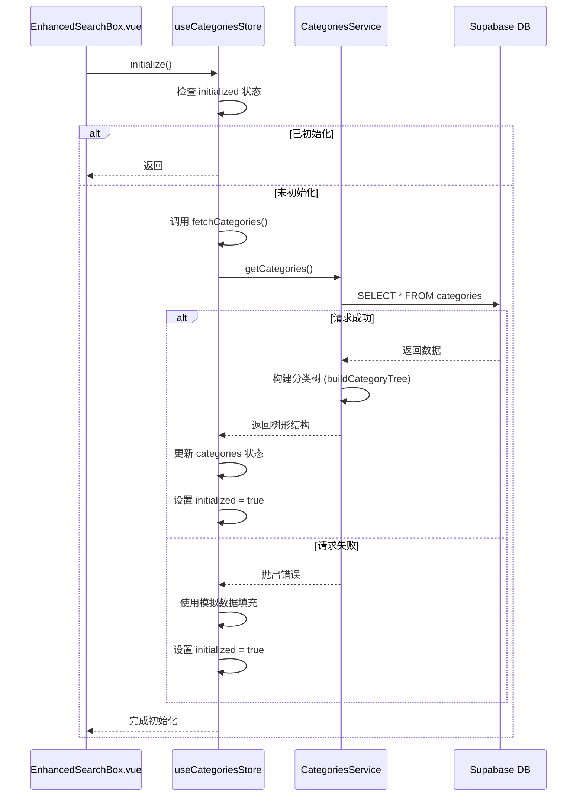
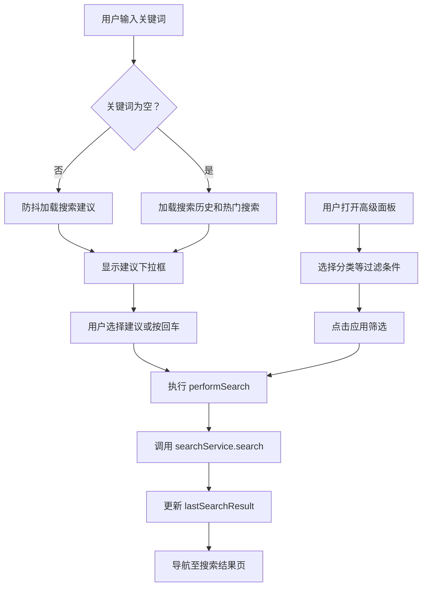

# 分类与本地状态管理

<cite>
**本文档中引用的文件**  
- [categories.ts](file://src/stores/categories.ts)
- [localManagement.ts](file://src/stores/localManagement.ts)
- [categoriesService.ts](file://src/services/categoriesService.ts)
- [EnhancedSearchBox.vue](file://src/components/search/EnhancedSearchBox.vue)
</cite>

## 目录
1. [引言](#引言)
2. [分类树结构存储与动态加载](#分类树结构存储与动态加载)
3. [本地UI状态管理机制](#本地ui状态管理机制)
4. [分类数据的归一化存储策略](#分类数据的归一化存储策略)
5. [搜索组件中的分类应用](#搜索组件中的分类应用)
6. [性能优化与内存管理](#性能优化与内存管理)
7. [结论](#结论)

## 引言
本文档旨在深入解析高级工具导航系统中分类数据与本地状态的管理机制。重点阐述分类树结构在前端的状态管理、动态加载逻辑及其在搜索功能中的集成应用。同时，分析非持久化UI状态的管理策略，明确其与全局状态的边界划分。通过结合具体组件与服务的实现，揭示系统在大型分类体系下的性能优化实践。

## 分类树结构存储与动态加载

分类数据的存储与加载由 `categories.ts` 中的 Pinia Store 和 `categoriesService.ts` 服务共同协作完成。Store 负责状态管理，而 Service 封装了与后端 Supabase 数据库的交互逻辑。

### 分类数据获取流程
分类数据的加载遵循一个健壮的初始化流程，确保数据的可用性，即使在后端服务不可用时也能提供基础功能。

**Diagram sources**  
- [categories.ts](file://src/stores/categories.ts#L1-L199)
- [categoriesService.ts](file://src/services/categoriesService.ts#L1-L278)

**Section sources**
- [categories.ts](file://src/stores/categories.ts#L1-L199)
- [categoriesService.ts](file://src/services/categoriesService.ts#L1-L278)

### 树形结构构建
`CategoriesService` 类中的 `buildCategoryTree` 方法是构建树形结构的核心。它通过两次遍历实现：
1.  **创建映射表**：将所有分类按 `id` 存入 `Map`，并初始化 `children` 数组。
2.  **建立父子关系**：遍历每个分类，根据其 `parent_id` 在映射表中找到父节点，并将当前节点添加到父节点的 `children` 数组中。若 `parent_id` 为空，则该节点为根节点。

此方法确保了分类数据在前端以直观的树形结构存储，便于后续的递归遍历和渲染。

## 本地UI状态管理机制

`localManagement.ts` Store 专门负责管理与用户交互相关的、非持久化的本地UI状态，与全局共享的业务数据（如分类、工具）明确分离。

### 管理的状态类型
该 Store 管理的状态主要包括：
- **离线模式状态**：`isOfflineMode`，`isSyncing`，`syncError`，`lastSyncTime`
- **用户偏好设置**：`userPreferences`，如自动同步开关
- **本地缓存数据**：`localTools`，`localCategories`（用于离线编辑）
- **离线操作队列**：`offlineQueue`，存储待同步的操作
- **UI状态**：`pendingSyncCount`（计算属性），`hasLocalChanges`（计算属性）

### 与全局状态的分离设计
这种分离设计具有显著优势：
1.  **关注点分离**：`categories.ts` 专注于业务数据的获取、缓存和一致性，而 `localManagement.ts` 专注于用户体验和离线功能。
2.  **性能优化**：避免将频繁变化的UI状态（如输入框内容、展开/折叠状态）与大型业务数据混合，减少不必要的状态更新和组件重渲染。
3.  **模块化**：每个 Store 职责单一，代码更易于维护和测试。例如，处理网络状态变化的逻辑被封装在 `localManagement.ts` 内部。

**Section sources**
- [localManagement.ts](file://src/stores/localManagement.ts#L1-L350)

## 分类数据的归一化存储策略

尽管 `categoriesService.ts` 返回的是树形结构，但 `categories.ts` Store 在内部存储时，采用了一种混合策略，兼顾了树形结构的直观性和潜在的归一化优势。

### 实际存储结构
Store 的 `categories` 状态直接存储了由 `buildCategoryTree` 返回的树形结构数组。这意味着数据在 Store 中是嵌套的，而非完全扁平化的归一化形式。

### 归一化思想的体现
虽然存储是树形的，但其设计体现了归一化的核心思想：
- **单一数据源**：所有分类数据都通过 `fetchCategories` 从单一的 `categories` 表获取，避免了数据冗余。
- **引用关系**：树形结构通过对象引用来建立父子关系，这类似于归一化数据库中的外键关联。
- **状态集中管理**：所有分类数据集中在一个 Store 中，任何组件都通过这个唯一的 Store 访问数据，保证了数据的一致性。

这种设计在保持数据关系清晰的同时，也简化了前端的处理逻辑，避免了复杂的归一化/反归一化转换。

**Section sources**
- [categories.ts](file://src/stores/categories.ts#L1-L199)
- [categoriesService.ts](file://src/services/categoriesService.ts#L1-L278)

## 搜索组件中的分类应用

`EnhancedSearchBox.vue` 组件是分类数据在UI层面的关键应用点，它利用分类数据实现了高级搜索功能。

### 分类数据的集成
组件通过以下方式使用分类数据：
1.  **初始化加载**：在 `onMounted` 生命周期钩子中，检查 `categoriesStore.categories` 是否为空，若为空则调用 `initialize()` 方法触发数据加载。
2.  **高级筛选**：在高级搜索面板中，`<select>` 元素的 `v-for` 指令遍历 `categories` 计算属性（来自 Store），动态生成分类选项，允许用户按分类进行筛选。
3.  **搜索建议**：虽然当前代码未完全实现，但 `getSuggestionIcon` 和 `getSuggestionTypeText` 方法已为分类类型的搜索建议提供了支持。

### 实时过滤与展示逻辑
组件的实时过滤主要依赖于用户的输入和选择：
- **输入监听**：`@input` 事件触发防抖的 `debouncedLoadSuggestions`，动态加载搜索建议。
- **键盘导航**：`@keydown` 事件处理上下键以在建议列表中导航，回车键确认选择或执行搜索。
- **筛选应用**：当用户在高级面板中选择分类或设置其他过滤条件后，点击“应用筛选”会触发 `performSearch`，将包括 `filters.category` 在内的所有条件传递给 `searchService` 进行查询。

**Diagram sources**  
- [EnhancedSearchBox.vue](file://src/components/search/EnhancedSearchBox.vue#L1-L1017)

**Section sources**
- [EnhancedSearchBox.vue](file://src/components/search/EnhancedSearchBox.vue#L1-L1017)

## 性能优化与内存管理

面对大型分类体系，系统在性能和内存管理方面采取了多项措施。

### 性能优化建议
1.  **懒加载子分类**：对于层级极深的分类树，不应一次性加载所有数据。应实现按需加载，即当用户展开某个父分类时，再通过 `getCategories()` 并传入 `parent_id` 参数来获取其子分类。
2.  **虚拟滚动**：在渲染大型分类列表或搜索建议时，使用虚拟滚动技术，只渲染可视区域内的元素，极大减少DOM节点数量。
3.  **缓存策略**：利用 `initialized` 标志位避免重复请求。可进一步引入 `cacheManager.ts` 实现更精细的缓存，如设置数据过期时间。
4.  **防抖与节流**：对搜索输入等高频操作使用防抖（如 `useDebounceFn`），减少不必要的后端请求。

### 内存管理实践
1.  **错误回退机制**：`categories.ts` 中的错误处理逻辑在Supabase调用失败时回退到预设的模拟数据，保证了应用的健壮性，避免了因网络问题导致的内存泄漏或崩溃。
2.  **资源清理**：`localManagement.ts` 提供了 `clearLocalData` 方法，允许用户主动清理本地存储的缓存数据，释放内存。
3.  **事件监听器管理**：在 `localManagement.ts` 的 `initialize` 方法中，正确地添加了 `online` 和 `offline` 事件监听器，应在 Store 销毁时移除，防止内存泄漏（代码中未显式展示销毁逻辑，需注意）。

**Section sources**
- [categories.ts](file://src/stores/categories.ts#L1-L199)
- [localManagement.ts](file://src/stores/localManagement.ts#L1-L350)

## 结论
本系统通过 `categories.ts` Store 和 `categoriesService.ts` 服务的协同，实现了分类树结构的有效存储与动态加载，并具备良好的容错能力。`localManagement.ts` Store 清晰地分离了本地UI状态与全局业务状态，提升了应用的可维护性和性能。`EnhancedSearchBox.vue` 组件成功地将分类数据应用于搜索功能，提供了丰富的筛选体验。为应对大型分类体系，建议实施懒加载、虚拟滚动等优化策略，并持续关注内存管理，确保应用的流畅与稳定。