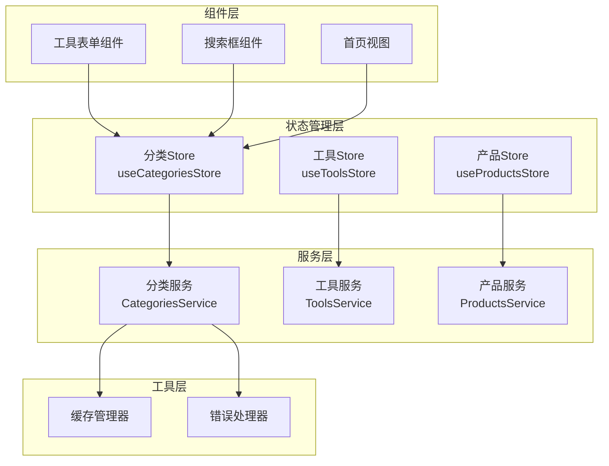
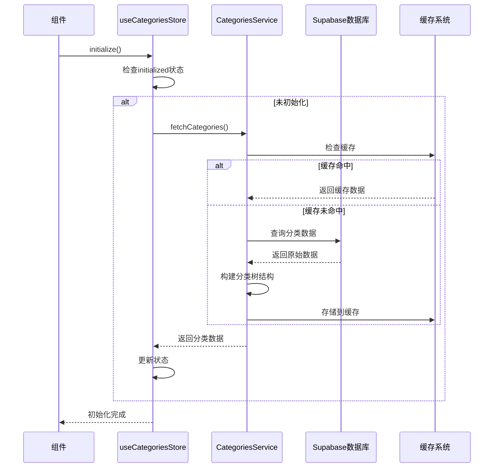
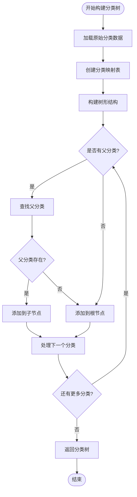
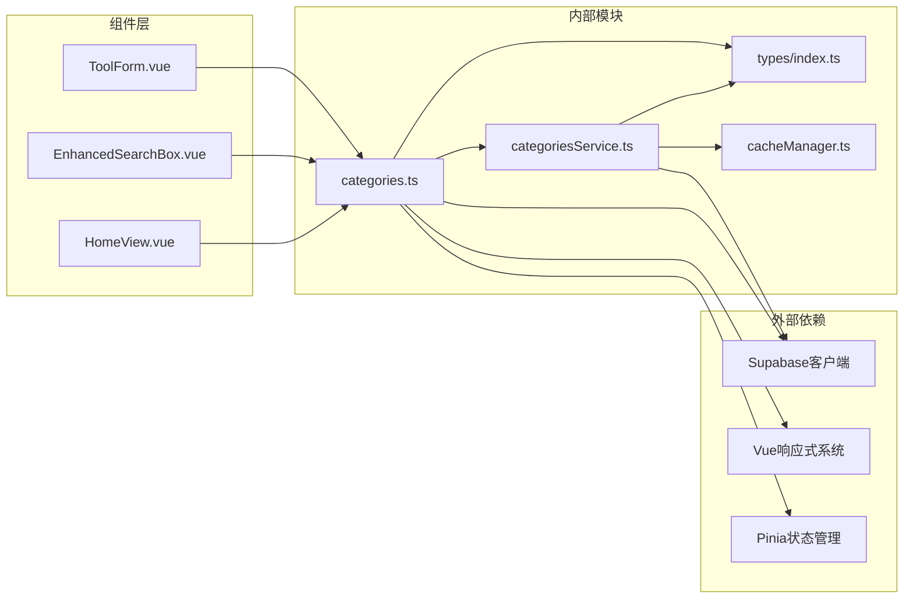
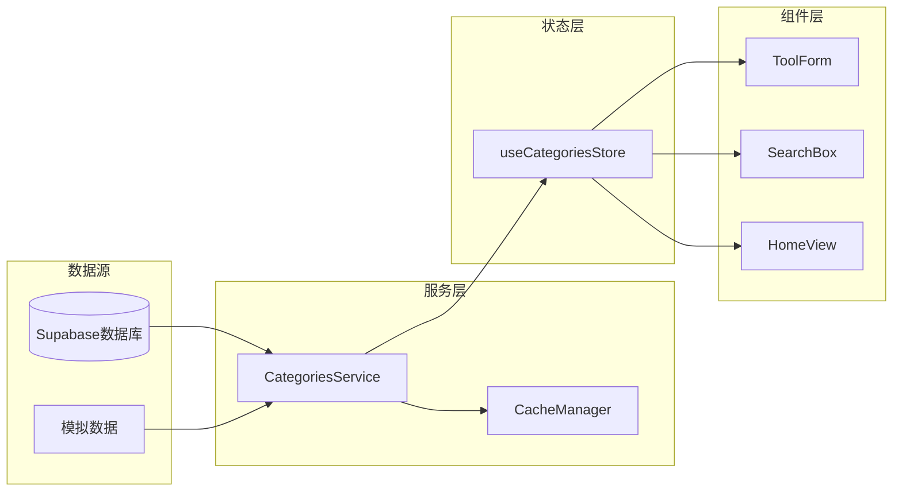

# 分类状态管理模块

<cite>
**本文档引用的文件**
- [src/stores/categories.ts](file://src/stores/categories.ts)
- [src/types/index.ts](file://src/types/index.ts)
- [src/services/categoriesService.ts](file://src/services/categoriesService.ts)
- [src/stores/tools.ts](file://src/stores/tools.ts)
- [src/stores/products.ts](file://src/stores/products.ts)
- [src/components/admin/ToolForm.vue](file://src/components/admin/ToolForm.vue)
- [src/components/search/EnhancedSearchBox.vue](file://src/components/search/EnhancedSearchBox.vue)
- [src/views/HomeView.vue](file://src/views/HomeView.vue)
- [src/utils/cacheManager.ts](file://src/utils/cacheManager.ts)
</cite>

## 目录
1. [简介](#简介)
2. [项目结构概览](#项目结构概览)
3. [核心组件分析](#核心组件分析)
4. [架构设计](#架构设计)
5. [详细组件分析](#详细组件分析)
6. [依赖关系分析](#依赖关系分析)
7. [性能考虑](#性能考虑)
8. [故障排除指南](#故障排除指南)
9. [结论](#结论)

## 简介

分类状态管理模块是Advanced Tools Navigation应用的核心数据层组件，负责维护和管理工具与产品的分类层级结构。该模块通过Pinia状态管理库实现了高效的数据缓存、异步数据加载以及错误处理机制，为整个应用提供了统一的分类数据访问接口。

模块的主要功能包括：
- 分类数据的初始化和缓存管理
- 分类树结构的构建和维护
- 分类数据的增删改查操作
- 与其他store的数据联动
- 错误恢复和降级机制

## 项目结构概览



**图表来源**
- [src/stores/categories.ts](file://src/stores/categories.ts#L1-L284)
- [src/services/categoriesService.ts](file://src/services/categoriesService.ts#L1-L354)

**章节来源**
- [src/stores/categories.ts](file://src/stores/categories.ts#L1-L50)
- [src/types/index.ts](file://src/types/index.ts#L1-L100)

## 核心组件分析

### useCategoriesStore - 分类状态管理器

`useCategoriesStore`是分类状态管理的核心组件，基于Pinia实现，提供了完整的分类数据生命周期管理。

#### 状态管理

```typescript
// 状态定义
const categories = ref<Category[]>([]);
const loading = ref(false);
const error = ref<Error | null>(null);
const initialized = ref(false);
```

#### 核心功能

1. **数据获取与缓存**
   - 从Supabase数据库获取分类数据
   - 实现智能缓存策略
   - 支持开发环境下的模拟数据

2. **错误处理与降级**
   - 生产环境严格错误处理
   - 开发环境友好降级
   - 自动回退到模拟数据

3. **初始化管理**
   - 避免重复初始化
   - 支持延迟加载
   - 状态追踪机制

**章节来源**
- [src/stores/categories.ts](file://src/stores/categories.ts#L6-L284)

## 架构设计

### 整体架构图



**图表来源**
- [src/stores/categories.ts](file://src/stores/categories.ts#L15-L120)
- [src/services/categoriesService.ts](file://src/services/categoriesService.ts#L15-L60)

### 分类树结构构建



**图表来源**
- [src/services/categoriesService.ts](file://src/services/categoriesService.ts#L280-L320)

**章节来源**
- [src/services/categoriesService.ts](file://src/services/categoriesService.ts#L280-L354)

## 详细组件分析

### 分类Store实现

#### 状态定义与初始化

```typescript
export const useCategoriesStore = defineStore("categories", () => {
  // 状态
  const categories = ref<Category[]>([]);
  const loading = ref(false);
  const error = ref<Error | null>(null);
  const initialized = ref(false);
  
  // 初始化方法
  async function initialize() {
    if (!initialized.value) {
      await fetchCategories();
    }
  }
});
```

#### 数据获取逻辑

`fetchCategories`方法实现了完整的数据获取流程：

1. **环境检测**：检查Supabase配置状态
2. **错误处理**：区分生产环境和开发环境的处理策略
3. **数据查询**：从数据库获取激活的分类
4. **树结构构建**：将扁平数据转换为嵌套树结构
5. **降级机制**：数据库访问失败时使用模拟数据

#### 错误处理机制

```typescript
// 生产环境严格错误处理
if (import.meta.env.PROD) {
  console.error("Supabase 环境变量未配置（生产），请在 CI/部署环境中设置 VITE_SUPABASE_URL 和 VITE_SUPABASE_ANON_KEY");
  error.value = new Error("Supabase 未配置（生产环境）");
  initialized.value = true;
  loading.value = false;
  return;
}

// 开发环境友好降级
console.warn("Supabase 环境变量未配置，使用模拟分类数据");
categories.value = mockCategories;
```

**章节来源**
- [src/stores/categories.ts](file://src/stores/categories.ts#L15-L180)

### 分类服务层

#### 分类树构建算法

```typescript
private static buildCategoryTree(categories: Category[]): Category[] {
  const categoryMap = new Map<string, Category>();
  const rootCategories: Category[] = [];

  // 创建分类映射
  categories.forEach((category) => {
    categoryMap.set(category.id, { ...category, children: [] });
  });

  // 构建树结构
  categories.forEach((category) => {
    const categoryNode = categoryMap.get(category.id)!;

    if (category.parent_id) {
      const parent = categoryMap.get(category.parent_id);
      if (parent) {
        parent.children = parent.children || [];
        parent.children.push(categoryNode);
      } else {
        rootCategories.push(categoryNode);
      }
    } else {
      rootCategories.push(categoryNode);
    }
  });

  return rootCategories;
}
```

#### 分类统计计算

```typescript
static async getCategoriesWithStats(): Promise<Category[]> {
  const [categories, stats] = await Promise.all([
    this.getCategories(),
    this.getCategoryStats(),
  ]);

  const statsMap = new Map(stats.map((s) => [s.categoryId, s.count]));

  const updateCategoryCount = (category: Category): Category => {
    const count = statsMap.get(category.id) || 0;
    const children = category.children?.map(updateCategoryCount) || [];
    const childrenCount = children.reduce(
      (sum, child) => sum + child.count,
      0,
    );

    return {
      ...category,
      count: count + childrenCount,
      children,
    };
  };

  return categories.map(updateCategoryCount);
}
```

**章节来源**
- [src/services/categoriesService.ts](file://src/services/categoriesService.ts#L280-L354)

### 组件集成模式

#### 搜索组件中的使用

```typescript
// 在搜索组件中使用分类store
const categoriesStore = useCategoriesStore();
const categories = computed(() => categoriesStore.categories);

// 搜索建议生成
const loadSuggestions = async () => {
  if (query.value) {
    suggestions.value = await searchService.getSmartSuggestions(query.value);
  } else {
    suggestions.value = [];
    searchHistory.value = searchService.getSearchHistory(5);
    popularSearches.value = await searchService.getPopularSearches(8);
  }
};
```

#### 工具表单中的使用

```typescript
// 在工具表单中使用分类store
const categoriesStore = useCategoriesStore();
const categories = computed(() => categoriesStore.categories);

// 表单初始化
onMounted(async () => {
  if (categories.value.length === 0) {
    await categoriesStore.initialize();
  }
  loadFormData();
});
```

**章节来源**
- [src/components/search/EnhancedSearchBox.vue](file://src/components/search/EnhancedSearchBox.vue#L200-L300)
- [src/components/admin/ToolForm.vue](file://src/components/admin/ToolForm.vue#L170-L200)

## 依赖关系分析

### 模块依赖图



**图表来源**
- [src/stores/categories.ts](file://src/stores/categories.ts#L1-L10)
- [src/services/categoriesService.ts](file://src/services/categoriesService.ts#L1-L10)

### 数据流分析



**图表来源**
- [src/stores/categories.ts](file://src/stores/categories.ts#L15-L120)
- [src/services/categoriesService.ts](file://src/services/categoriesService.ts#L15-L60)

**章节来源**
- [src/stores/categories.ts](file://src/stores/categories.ts#L1-L284)
- [src/services/categoriesService.ts](file://src/services/categoriesService.ts#L1-L354)

## 性能考虑

### 缓存策略

分类状态管理模块实现了多层次的缓存策略：

1. **内存缓存**：实时数据缓存
2. **持久化缓存**：localStorage存储
3. **智能过期**：基于时间的自动清理
4. **LRU淘汰**：最近最少使用算法

```typescript
// 缓存配置
export const defaultCache = new CacheManager({
  maxAge: 5 * 60 * 1000, // 5分钟
  maxSize: 100,
  serialize: true,
  prefix: "advanced_tools_",
});
```

### 性能优化技术

1. **懒加载**：按需初始化分类数据
2. **并发处理**：并行获取多个数据源
3. **防抖处理**：搜索建议的防抖机制
4. **状态追踪**：避免不必要的重新渲染

### 内存管理

```typescript
// 内存使用估算
private estimateMemoryUsage(): number {
  let totalSize = 0;
  
  for (const [key, item] of this.cache) {
    totalSize += key.length * 2; // Unicode 字符串
    totalSize += JSON.stringify(item).length * 2;
  }
  
  return totalSize; // 字节数
}
```

**章节来源**
- [src/utils/cacheManager.ts](file://src/utils/cacheManager.ts#L1-L400)

## 故障排除指南

### 常见问题与解决方案

#### 1. Supabase连接失败

**症状**：分类数据加载失败，显示错误信息

**解决方案**：
```typescript
// 检查环境变量配置
const supabaseUrl = import.meta.env.VITE_SUPABASE_URL;
const supabaseAnonKey = import.meta.env.VITE_SUPABASE_ANON_KEY;

if (!supabaseUrl || !supabaseAnonKey) {
  console.error("Supabase 环境变量未配置");
  // 使用模拟数据
}
```

#### 2. 分类树构建异常

**症状**：分类数据显示不正确，层级混乱

**解决方案**：
```typescript
// 检查分类数据完整性
const validateCategoryData = (categories: Category[]) => {
  return categories.every(cat => 
    cat.id && 
    typeof cat.name === 'string' && 
    cat.sort_order !== undefined
  );
};
```

#### 3. 性能问题

**症状**：分类加载缓慢，界面卡顿

**解决方案**：
- 启用缓存机制
- 减少并发请求
- 优化树结构构建算法

**章节来源**
- [src/stores/categories.ts](file://src/stores/categories.ts#L25-L50)
- [src/services/categoriesService.ts](file://src/services/categoriesService.ts#L280-L320)

## 结论

分类状态管理模块通过精心设计的架构和完善的错误处理机制，为Advanced Tools Navigation应用提供了稳定可靠的分类数据管理服务。模块的主要优势包括：

1. **架构清晰**：分层设计，职责明确
2. **错误处理完善**：生产环境严格，开发环境友好
3. **性能优化**：多级缓存，智能过期
4. **易于维护**：模块化设计，良好的抽象层次
5. **扩展性强**：支持多种使用场景

该模块不仅满足了当前的功能需求，还为未来的功能扩展奠定了坚实的基础。通过合理的缓存策略和错误处理机制，确保了应用在各种环境下的稳定运行。