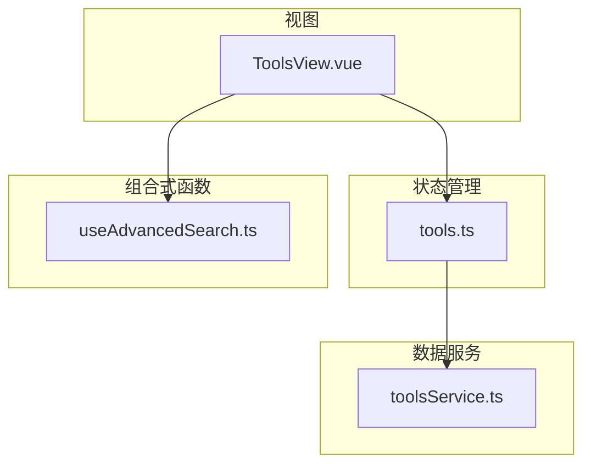
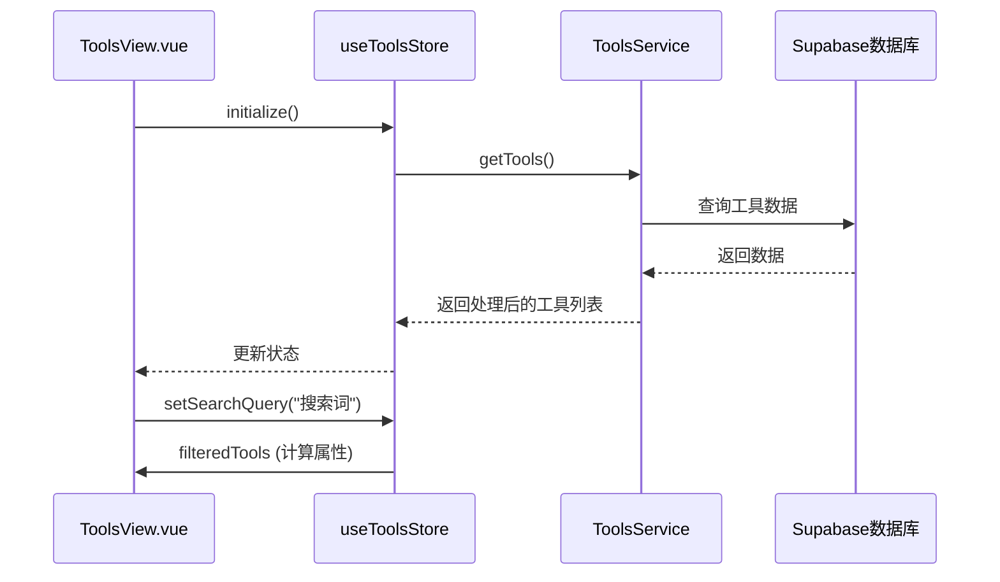
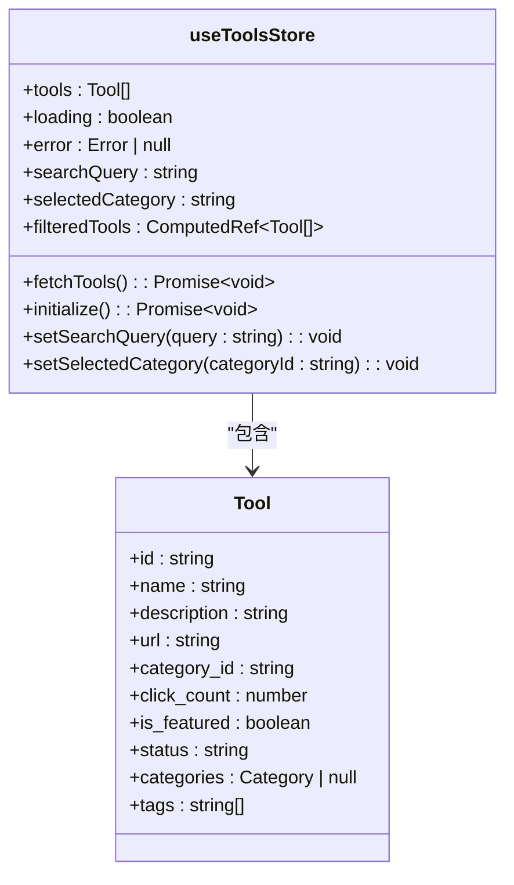
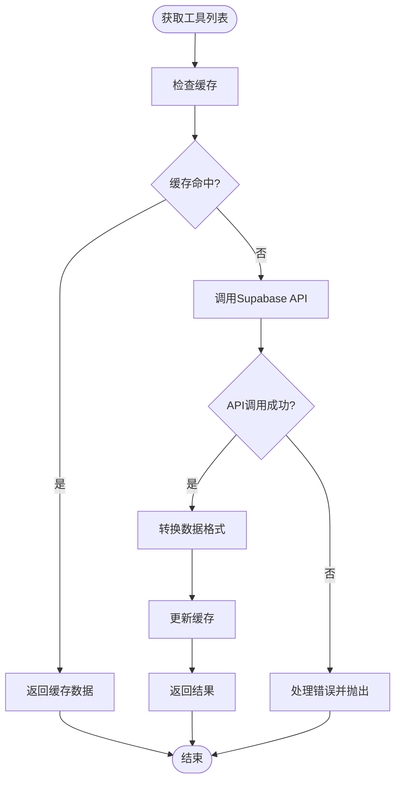
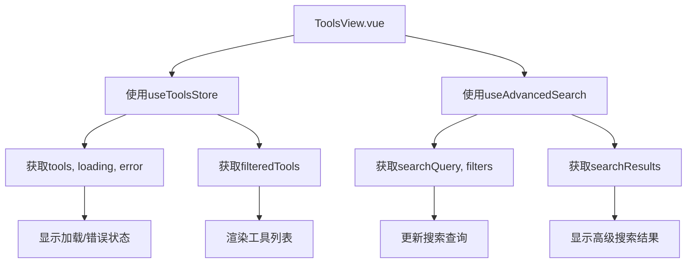
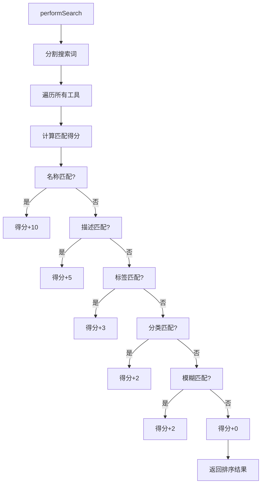
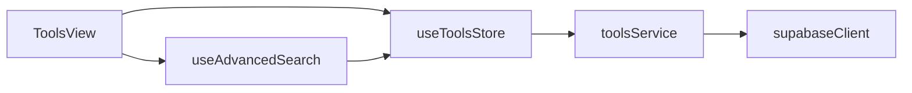

# 工具状态管理

<cite>
**本文档引用的文件**
- [tools.ts](file://src/stores/tools.ts)
- [toolsService.ts](file://src/services/toolsService.ts)
- [ToolsView.vue](file://src/views/ToolsView.vue)
- [useAdvancedSearch.ts](file://src/composables/useAdvancedSearch.ts)
</cite>

## 目录
1. [项目结构](#项目结构)
2. [核心组件](#核心组件)
3. [架构概述](#架构概述)
4. [详细组件分析](#详细组件分析)
5. [依赖分析](#依赖分析)
6. [性能考虑](#性能考虑)
7. [故障排除指南](#故障排除指南)
8. [结论](#结论)

## 项目结构

项目采用模块化架构，主要分为组件（components）、组合式函数（composables）、服务（services）、状态管理（stores）和视图（views）等目录。工具状态管理相关的核心文件位于 `src/stores/tools.ts`，数据服务位于 `src/services/toolsService.ts`，视图组件位于 `src/views/ToolsView.vue`，高级搜索逻辑位于 `src/composables/useAdvancedSearch.ts`。

**Diagram sources**
- [tools.ts](file://src/stores/tools.ts#L1-L341)
- [toolsService.ts](file://src/services/toolsService.ts#L1-L469)
- [useAdvancedSearch.ts](file://src/composables/useAdvancedSearch.ts#L1-L309)
- [ToolsView.vue](file://src/views/ToolsView.vue#L1-L967)

**Section sources**
- [tools.ts](file://src/stores/tools.ts#L1-L341)
- [toolsService.ts](file://src/services/toolsService.ts#L1-L469)

## 核心组件

工具状态管理由 `useToolsStore` Pinia store 驱动，负责管理工具列表、加载状态、错误信息和用户界面状态（如搜索查询、分类筛选、侧边栏折叠状态）。该 store 通过 `toolsService` 与后端 Supabase 数据库交互，并为 `ToolsView` 组件提供响应式数据。

**Section sources**
- [tools.ts](file://src/stores/tools.ts#L1-L341)
- [ToolsView.vue](file://src/views/ToolsView.vue#L1-L967)

## 架构概述

系统采用分层架构，从上至下分为视图层、状态管理层、服务层和数据层。`ToolsView` 组件订阅 `useToolsStore` 的状态，`useToolsStore` 调用 `ToolsService` 进行数据获取，`ToolsService` 使用 Supabase 客户端与数据库通信。组合式函数 `useAdvancedSearch` 提供独立的搜索逻辑，可被多个组件复用。

**Diagram sources**
- [tools.ts](file://src/stores/tools.ts#L1-L341)
- [toolsService.ts](file://src/services/toolsService.ts#L1-L469)
- [ToolsView.vue](file://src/views/ToolsView.vue#L1-L967)

## 详细组件分析

### 工具状态分析

`useToolsStore` 定义了工具相关的状态、计算属性和操作。状态包括工具列表、加载状态、错误信息、搜索查询和选中分类。计算属性 `filteredTools` 基于搜索查询对工具列表进行响应式过滤。操作方法如 `fetchTools` 负责从服务层获取数据，并处理加载和错误状态。

**Diagram sources**
- [tools.ts](file://src/stores/tools.ts#L1-L341)

**Section sources**
- [tools.ts](file://src/stores/tools.ts#L1-L341)

### 数据服务分析

`ToolsService` 类提供工具数据的 CRUD 操作和搜索功能。它实现了数据缓存机制，使用 `withCache` 装饰器对 `getTools`、`getTool`、`getPopularTools` 和 `getFeaturedTools` 等方法进行缓存，减少对数据库的重复请求。服务还包含错误处理和数据转换逻辑。

**Diagram sources**
- [toolsService.ts](file://src/services/toolsService.ts#L1-L469)

**Section sources**
- [toolsService.ts](file://src/services/toolsService.ts#L1-L469)

### 视图组件分析

`ToolsView` 组件负责渲染工具列表。它使用 `useToolsStore` 获取工具数据和状态，并使用 `useAdvancedSearch` 处理高级搜索逻辑。组件根据 `filteredTools` 计算属性渲染工具卡片，并提供搜索、分类筛选、排序和视图模式切换等功能。

**Diagram sources**
- [ToolsView.vue](file://src/views/ToolsView.vue#L1-L967)

**Section sources**
- [ToolsView.vue](file://src/views/ToolsView.vue#L1-L967)

### 高级搜索分析

`useAdvancedSearch` 组合式函数提供智能搜索功能。它实现了一个基于权重的搜索算法，对工具名称、描述、标签和分类进行搜索，并根据匹配字段的权重计算相关性得分。函数还支持筛选器应用和结果排序，并维护搜索历史和热门搜索词。

**Diagram sources**
- [useAdvancedSearch.ts](file://src/composables/useAdvancedSearch.ts#L1-L309)

**Section sources**
- [useAdvancedSearch.ts](file://src/composables/useAdvancedSearch.ts#L1-L309)

## 依赖分析

**Diagram sources**
- [tools.ts](file://src/stores/tools.ts#L1-L341)
- [toolsService.ts](file://src/services/toolsService.ts#L1-L469)
- [useAdvancedSearch.ts](file://src/composables/useAdvancedSearch.ts#L1-L309)
- [ToolsView.vue](file://src/views/ToolsView.vue#L1-L967)

**Section sources**
- [tools.ts](file://src/stores/tools.ts#L1-L341)
- [toolsService.ts](file://src/services/toolsService.ts#L1-L469)
- [useAdvancedSearch.ts](file://src/composables/useAdvancedSearch.ts#L1-L309)
- [ToolsView.vue](file://src/views/ToolsView.vue#L1-L967)

## 性能考虑

- **数据缓存策略**：`ToolsService` 使用内存缓存（`apiCache`）存储最近的 API 响应，减少对数据库的重复请求。不同方法的缓存时间不同，例如工具列表缓存 2 分钟，热门工具缓存 5 分钟。
- **避免重复请求**：`useToolsStore` 中的 `fetchTools` 方法在加载状态为 `true` 时直接返回，防止并发请求。
- **大数据量渲染处理**：`ToolsView` 组件在网格视图中使用 CSS Grid 布局，在列表视图中使用 Flexbox 布局，均能高效处理大量工具的渲染。工具描述使用 `-webkit-line-clamp` 限制行数，避免长文本影响性能。

**Section sources**
- [toolsService.ts](file://src/services/toolsService.ts#L1-L469)
- [tools.ts](file://src/stores/tools.ts#L1-L341)
- [ToolsView.vue](file://src/views/ToolsView.vue#L1-L967)

## 故障排除指南

- **工具列表加载失败**：检查 `VITE_SUPABASE_URL` 和 `VITE_SUPABASE_ANON_KEY` 环境变量是否正确配置。如果未配置，系统会使用模拟数据。
- **搜索无结果**：确认 `searchQuery` 是否正确更新到 `useToolsStore`。`useAdvancedSearch` 的搜索结果优先于 `useToolsStore` 的过滤结果。
- **缓存未更新**：在创建、更新或删除工具后，`ToolsService` 会调用 `clearRelatedCache` 清理相关缓存，确保数据一致性。

**Section sources**
- [tools.ts](file://src/stores/tools.ts#L1-L341)
- [toolsService.ts](file://src/services/toolsService.ts#L1-L469)

## 结论

工具状态管理系统设计合理，职责分明。`useToolsStore` 作为单一数据源，`ToolsService` 处理业务逻辑和数据缓存，`ToolsView` 专注 UI 渲染，`useAdvancedSearch` 提供可复用的搜索逻辑。系统具备良好的错误处理和性能优化机制，能够为用户提供流畅的工具浏览体验。