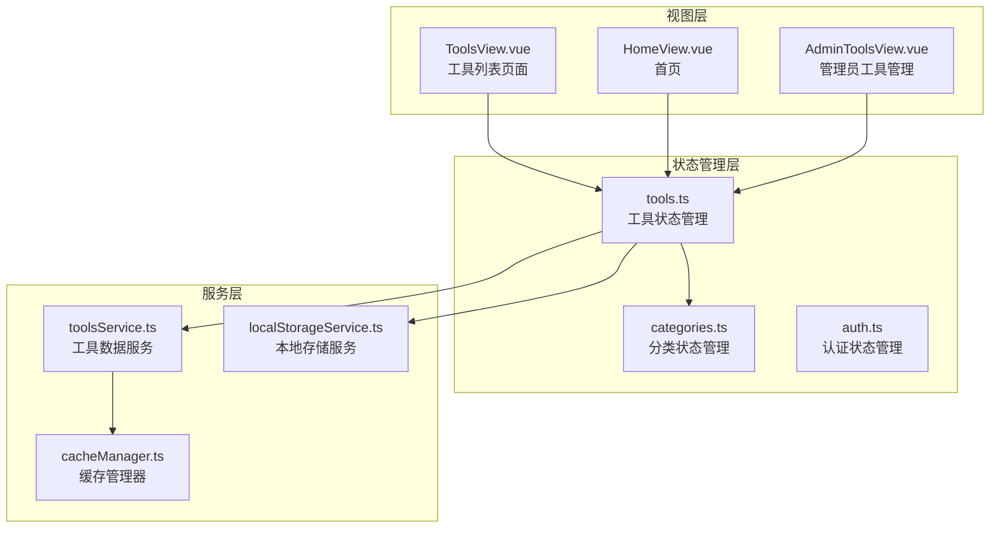
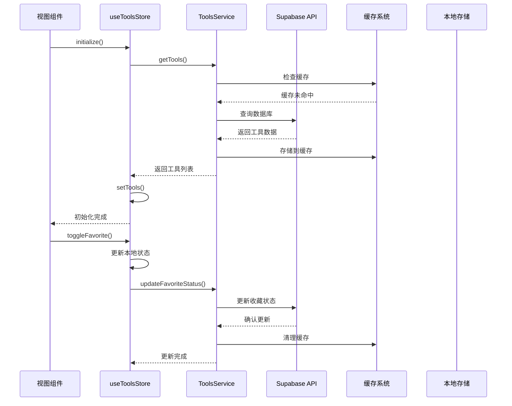
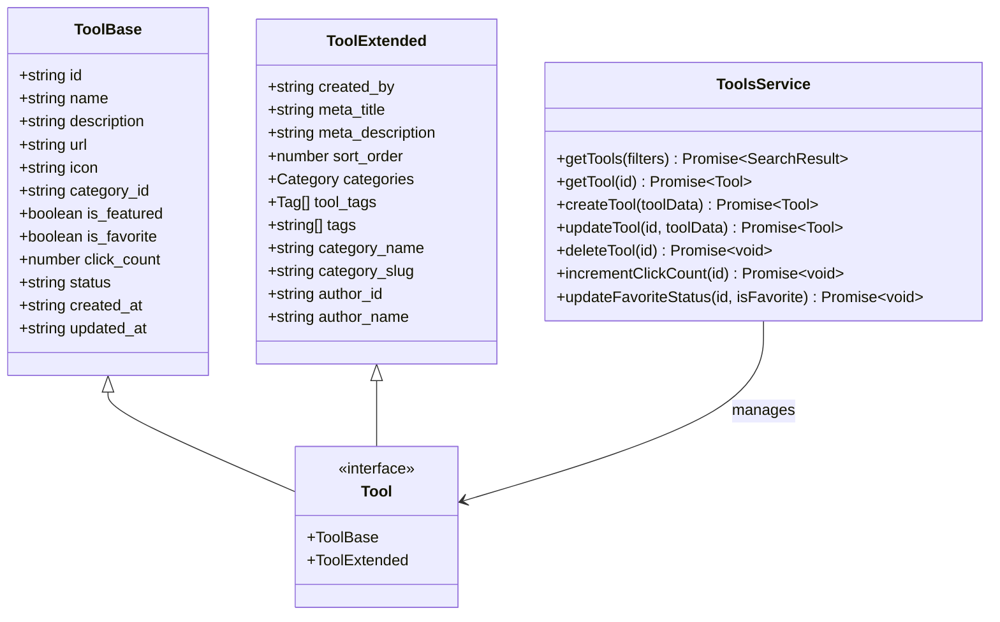
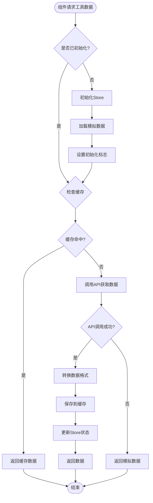
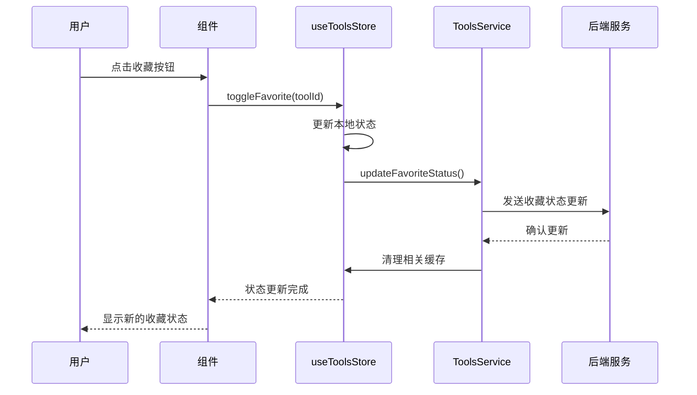
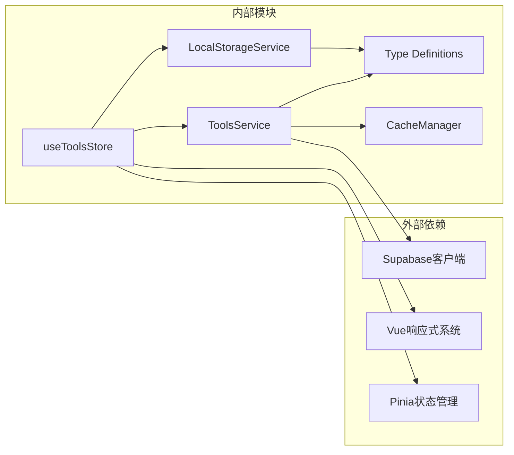

# 工具状态管理模块

<cite>
**本文档引用的文件**
- [src/stores/tools.ts](file://src/stores/tools.ts)
- [src/services/toolsService.ts](file://src/services/toolsService.ts)
- [src/views/ToolsView.vue](file://src/views/ToolsView.vue)
- [src/views/HomeView.vue](file://src/views/HomeView.vue)
- [src/views/AdminToolsView.vue](file://src/views/AdminToolsView.vue)
- [src/stores/categories.ts](file://src/stores/categories.ts)
- [src/services/localStorageService.ts](file://src/services/localStorageService.ts)
- [src/types/index.ts](file://src/types/index.ts)
</cite>

## 目录
1. [简介](#简介)
2. [项目结构概览](#项目结构概览)
3. [核心组件分析](#核心组件分析)
4. [架构概览](#架构概览)
5. [详细组件分析](#详细组件分析)
6. [依赖关系分析](#依赖关系分析)
7. [性能考虑](#性能考虑)
8. [故障排除指南](#故障排除指南)
9. [结论](#结论)

## 简介

工具状态管理模块是Advanced Tools Navigation项目的核心状态管理系统，负责管理工具数据的获取、存储、过滤和用户交互。该模块采用Pinia状态管理库，提供了统一的数据访问接口和高效的缓存机制，支持多组件共享状态，并实现了完整的本地缓存策略。

## 项目结构概览

工具状态管理模块主要由以下核心文件组成：



**图表来源**
- [src/stores/tools.ts](file://src/stores/tools.ts#L1-L319)
- [src/services/toolsService.ts](file://src/services/toolsService.ts#L1-L642)
- [src/views/ToolsView.vue](file://src/views/ToolsView.vue#L1-L600)

**章节来源**
- [src/stores/tools.ts](file://src/stores/tools.ts#L1-L319)
- [src/services/toolsService.ts](file://src/services/toolsService.ts#L1-L642)

## 核心组件分析

### useToolsStore - 工具状态管理核心

`useToolsStore`是整个工具状态管理的核心，基于Pinia实现，提供了完整的状态管理功能：

```typescript
export const useToolsStore = defineStore('tools', () => {
  const tools = ref<Tool[]>([])
  const featuredTools = computed(() => tools.value.filter(t => t.is_featured))
  const activeTools = computed(() => tools.value.filter(t => t.status === 'active'))
  const isLoading = ref(false)
  const error = ref<string | null>(null)
  const initialized = ref(false)
  
  // UI状态
  const sidebarCollapsed = ref(false)
  const searchQuery = ref('')
  const selectedCategory = ref<string | null>(null)
  
  // 计算属性：过滤后的工具
  const filteredTools = computed(() => {
    let result = activeTools.value
    
    // 按搜索查询过滤
    if (searchQuery.value.trim()) {
      const query = searchQuery.value.toLowerCase()
      result = result.filter(tool => 
        tool.name.toLowerCase().includes(query) ||
        tool.description.toLowerCase().includes(query)
      )
    }
    
    // 按分类过滤
    if (selectedCategory.value) {
      result = result.filter(tool => tool.category_id === selectedCategory.value)
    }
    
    return result
  })
})
```

**章节来源**
- [src/stores/tools.ts](file://src/stores/tools.ts#L100-L150)

## 架构概览

工具状态管理模块采用了分层架构设计，确保了良好的可维护性和扩展性：



**图表来源**
- [src/stores/tools.ts](file://src/stores/tools.ts#L150-L200)
- [src/services/toolsService.ts](file://src/services/toolsService.ts#L30-L80)

## 详细组件分析

### 工具数据模型与类型安全

工具状态管理模块实现了严格的类型系统，确保数据的一致性和安全性：



**图表来源**
- [src/stores/tools.ts](file://src/stores/tools.ts#L10-L80)
- [src/services/toolsService.ts](file://src/services/toolsService.ts#L15-L50)

### 数据流机制

工具状态管理模块实现了完整的数据流机制，包括数据获取、处理、缓存和同步：



**图表来源**
- [src/stores/tools.ts](file://src/stores/tools.ts#L150-L200)
- [src/services/toolsService.ts](file://src/services/toolsService.ts#L30-L80)

### 本地缓存策略与实时同步

模块实现了多层次的缓存策略，确保最佳性能和用户体验：

```typescript
// 缓存装饰器示例
export const withCache = (
  fn: (...args: any[]) => Promise<any>,
  getKey: () => string,
  cache: CacheManager,
  ttl: number
) => {
  return async (...args: any[]) => {
    const key = getKey();
    const cached = cache.get(key);
    
    if (cached) {
      return cached;
    }
    
    const result = await fn(...args);
    cache.set(key, result, ttl);
    return result;
  };
};
```

**章节来源**
- [src/services/toolsService.ts](file://src/services/toolsService.ts#L30-L80)
- [src/services/localStorageService.ts](file://src/services/localStorageService.ts#L1-L100)

### 用户交互与状态更新

工具状态管理模块提供了完整的用户交互支持，包括收藏状态切换、点击计数更新等：



**图表来源**
- [src/stores/tools.ts](file://src/stores/tools.ts#L120-L140)
- [src/services/toolsService.ts](file://src/services/toolsService.ts#L280-L320)

**章节来源**
- [src/stores/tools.ts](file://src/stores/tools.ts#L120-L140)
- [src/services/toolsService.ts](file://src/services/toolsService.ts#L280-L320)

## 依赖关系分析

工具状态管理模块与其他模块存在复杂的依赖关系：



**图表来源**
- [src/stores/tools.ts](file://src/stores/tools.ts#L1-L5)
- [src/services/toolsService.ts](file://src/services/toolsService.ts#L1-L10)

**章节来源**
- [src/stores/tools.ts](file://src/stores/tools.ts#L1-L10)
- [src/services/toolsService.ts](file://src/services/toolsService.ts#L1-L10)

## 性能考虑

### 虚拟滚动支持

对于大型工具列表，模块支持虚拟滚动技术以提高渲染性能：

```typescript
// 虚拟滚动配置示例
const virtualScrollConfig = {
  itemHeight: 80, // 每个工具项的高度
  containerHeight: 600, // 可视容器高度
  buffer: 10, // 缓冲区大小
  threshold: 0.1 // 滚动阈值
};
```

### 批量操作优化

模块实现了批量操作优化，减少API调用次数：

```typescript
// 批量更新示例
async function batchUpdateTools(updates: ToolUpdate[]) {
  const promises = updates.map(update => 
    toolsService.updateTool(update.id, update.data)
  );
  
  const results = await Promise.all(promises);
  return results;
}
```

### 内存管理

通过合理的缓存策略和垃圾回收机制，确保内存使用效率：

- 缓存过期自动清理
- 大数据集分页加载
- 事件监听器及时解绑

## 故障排除指南

### 常见使用误区

1. **忘记初始化Store**
   ```typescript
   // 错误：直接使用未初始化的store
   const tools = toolsStore.tools // 可能为空
   
   // 正确：先初始化
   await toolsStore.initialize()
   const tools = toolsStore.tools
   ```

2. **过度依赖本地状态**
   ```typescript
   // 错误：忽略服务器状态同步
   toolsStore.toggleFavorite(toolId) // 仅更新本地状态
   
   // 正确：等待服务器同步
   await toolsStore.toggleFavorite(toolId)
   ```

3. **缓存清理不当**
   ```typescript
   // 错误：手动清理所有缓存
   apiCache.clear() // 影响其他数据
   
   // 正确：清理特定缓存
   toolsService.clearRelatedCache(toolId)
   ```

### 调试方法

1. **启用Pinia DevTools**
   ```typescript
   // 在开发环境中启用调试
   const toolsStore = useToolsStore()
   toolsStore.$subscribe((mutation, state) => {
     console.log('Store mutation:', mutation)
     console.log('New state:', state)
   })
   ```

2. **监控API调用**
   ```typescript
   // 添加API调用日志
   const originalGetTools = toolsService.getTools
   toolsService.getTools = async function(...args) {
     console.log('API call:', 'getTools', args)
     const result = await originalGetTools.apply(this, args)
     console.log('API response:', result)
     return result
   }
   ```

3. **验证数据完整性**
   ```typescript
   // 数据验证工具
   function validateToolData(tools: Tool[]) {
     return tools.every(tool => {
       return tool.id && tool.name && tool.status
     })
   }
   ```

**章节来源**
- [src/stores/tools.ts](file://src/stores/tools.ts#L150-L200)
- [src/services/toolsService.ts](file://src/services/toolsService.ts#L280-L320)

## 结论

工具状态管理模块通过精心设计的架构和完善的缓存策略，为Advanced Tools Navigation项目提供了高效、可靠的状态管理解决方案。模块具有以下优势：

1. **类型安全**：完整的TypeScript类型定义确保数据一致性
2. **性能优化**：多层次缓存和智能数据加载策略
3. **用户体验**：流畅的交互和实时状态同步
4. **可维护性**：清晰的分层架构和模块化设计
5. **扩展性**：灵活的插件机制支持功能扩展

该模块不仅满足了当前的功能需求，还为未来的功能扩展奠定了坚实的基础。通过合理的错误处理和调试支持，开发者可以轻松地维护和扩展这个状态管理系统。