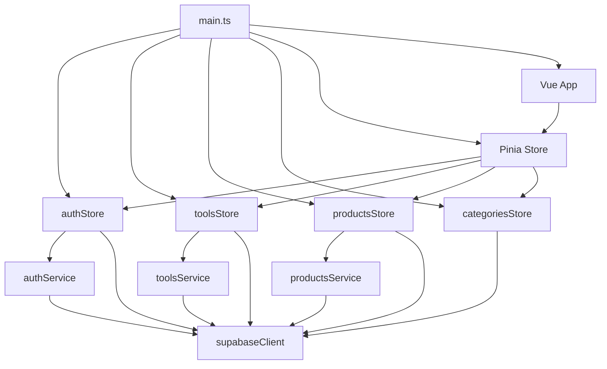
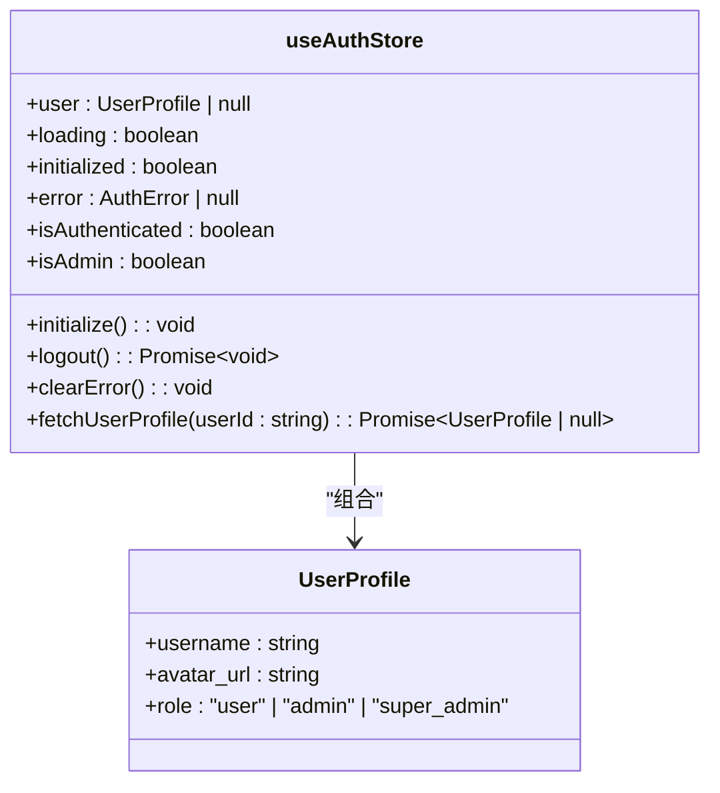
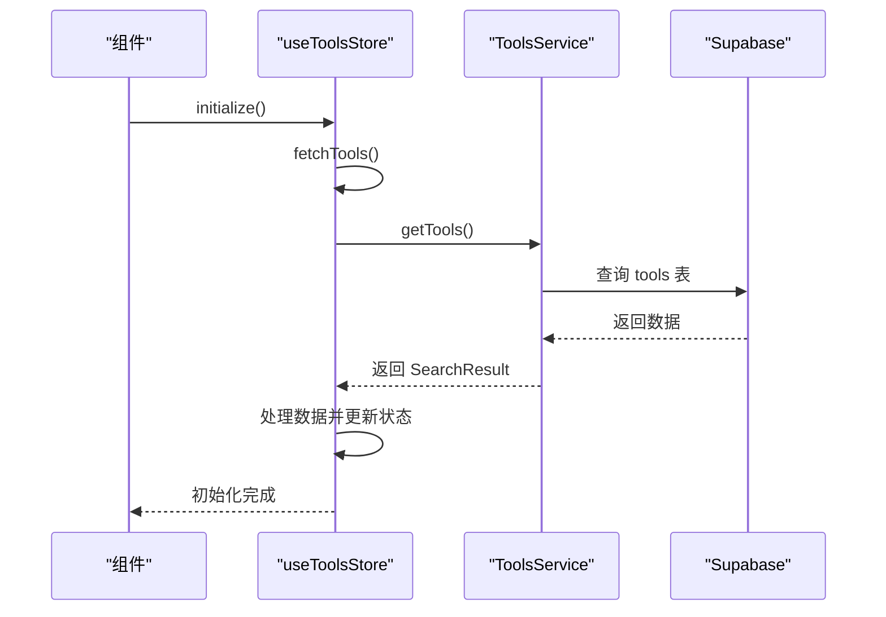
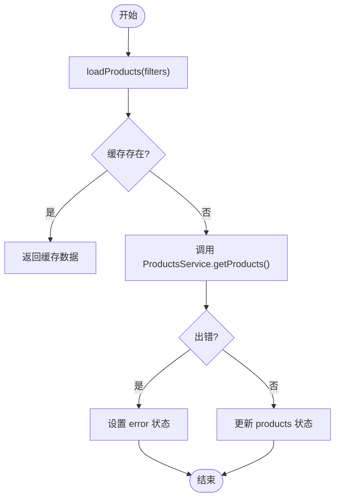
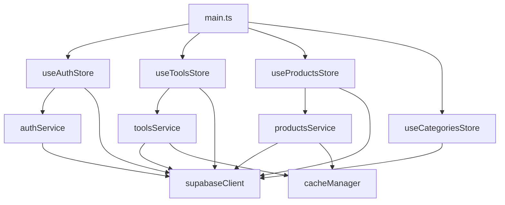

# 状态管理

<cite>
**本文档中引用的文件**   
- [auth.ts](file://src/stores/auth.ts)
- [tools.ts](file://src/stores/tools.ts)
- [products.ts](file://src/stores/products.ts)
- [main.ts](file://src/main.ts)
- [categories.ts](file://src/stores/categories.ts)
- [authService.ts](file://src/services/authService.ts)
- [toolsService.ts](file://src/services/toolsService.ts)
- [productsService.ts](file://src/services/productsService.ts)
</cite>

## 目录
1. [简介](#简介)
2. [项目结构](#项目结构)
3. [核心组件](#核心组件)
4. [架构概述](#架构概述)
5. [详细组件分析](#详细组件分析)
6. [依赖分析](#依赖分析)
7. [性能考虑](#性能考虑)
8. [故障排除指南](#故障排除指南)
9. [结论](#结论)

## 简介
本文档详细描述了基于 Pinia 的模块化状态管理设计，如何支撑用户认证、工具管理、产品管理等核心功能。重点分析 `auth.ts` 中用户状态的持久化与同步机制，`tools.ts` 和 `products.ts` 如何封装数据获取与缓存逻辑，并与对应 services 层交互。说明 store 在应用初始化时如何通过 `main.ts` 挂载，以及 actions、getters、state 的使用规范。结合实际业务场景（如登录后自动加载用户收藏）展示状态流的完整生命周期。提供错误处理、异步操作管理及与其他模块（如路由守卫）集成的最佳实践示例。

## 项目结构

```mermaid
graph TB
subgraph "Stores"
auth[auth.ts]
tools[tools.ts]
products[products.ts]
categories[categories.ts]
end
subgraph "Services"
authService[authService.ts]
toolsService[toolsService.ts]
productsService[productsService.ts]
end
subgraph "App"
main[main.ts]
App[App.vue]
end
main --> auth
main --> tools
main --> products
main --> categories
auth --> authService
tools --> toolsService
products --> productsService
```

**图示来源**
- [auth.ts](file://src/stores/auth.ts)
- [tools.ts](file://src/stores/tools.ts)
- [products.ts](file://src/stores/products.ts)
- [main.ts](file://src/main.ts)

**本节来源**
- [src/stores](file://src/stores)
- [src/services](file://src/services)
- [src/main.ts](file://src/main.ts)

## 核心组件

本文档的核心组件包括 `auth.ts`、`tools.ts`、`products.ts` 三个 Pinia store，分别管理用户认证、工具和产品数据。这些 store 通过定义清晰的 state、getters 和 actions，实现了模块化的状态管理。`auth.ts` 负责用户登录状态的持久化和同步，`tools.ts` 和 `products.ts` 则封装了各自领域的数据获取、缓存和错误处理逻辑。所有 store 都在 `main.ts` 中被统一初始化和挂载，确保了应用启动时状态的一致性。

**本节来源**
- [auth.ts](file://src/stores/auth.ts#L1-L151)
- [tools.ts](file://src/stores/tools.ts#L1-L341)
- [products.ts](file://src/stores/products.ts#L1-L362)
- [main.ts](file://src/main.ts#L1-L58)

## 架构概述



**图示来源**
- [main.ts](file://src/main.ts#L1-L58)
- [auth.ts](file://src/stores/auth.ts#L1-L151)
- [tools.ts](file://src/stores/tools.ts#L1-L341)
- [products.ts](file://src/stores/products.ts#L1-L362)
- [authService.ts](file://src/services/authService.ts#L1-L292)
- [toolsService.ts](file://src/services/toolsService.ts#L1-L469)
- [productsService.ts](file://src/services/productsService.ts#L1-L339)

## 详细组件分析

### 认证状态管理分析

`useAuthStore` 是应用的核心 store，负责管理用户认证状态。它通过 `supabase.auth.onAuthStateChange` 监听认证状态变化，实现用户状态的持久化与同步。当用户登录时，store 会自动从 `user_profiles` 表获取用户的详细信息，并将其与 Supabase Auth User 对象合并，形成完整的 `UserProfile` 对象。

#### 认证状态管理类图



**图示来源**
- [auth.ts](file://src/stores/auth.ts#L1-L151)

**本节来源**
- [auth.ts](file://src/stores/auth.ts#L1-L151)
- [authService.ts](file://src/services/authService.ts#L1-L292)

### 工具状态管理分析

`useToolsStore` 负责管理工具数据的获取、过滤和展示。它通过 `fetchTools` 方法从 Supabase 数据库获取所有工具数据，并支持关联查询分类和标签信息。store 内置了搜索查询、分类筛选和侧边栏折叠状态，通过 `filteredTools` 计算属性实现响应式过滤。

#### 工具状态管理序列图



**图示来源**
- [tools.ts](file://src/stores/tools.ts#L1-L341)
- [toolsService.ts](file://src/services/toolsService.ts#L1-L469)

**本节来源**
- [tools.ts](file://src/stores/tools.ts#L1-L341)
- [toolsService.ts](file://src/services/toolsService.ts#L1-L469)

### 产品状态管理分析

`useProductsStore` 通过 `ProductsService` 封装了产品数据的 CRUD 操作和搜索功能。它提供了 `loadProducts`、`searchProducts`、`createProduct` 等方法，支持分页、排序和复杂过滤。store 还管理着当前产品、特色产品和相关产品等状态，为产品详情页提供数据支持。

#### 产品状态管理流程图



**图示来源**
- [products.ts](file://src/stores/products.ts#L1-L362)
- [productsService.ts](file://src/services/productsService.ts#L1-L339)

**本节来源**
- [products.ts](file://src/stores/products.ts#L1-L362)
- [productsService.ts](file://src/services/productsService.ts#L1-L339)

## 依赖分析



**图示来源**
- [main.ts](file://src/main.ts#L1-L58)
- [auth.ts](file://src/stores/auth.ts#L1-L151)
- [tools.ts](file://src/stores/tools.ts#L1-L341)
- [products.ts](file://src/stores/products.ts#L1-L362)
- [categories.ts](file://src/stores/categories.ts#L1-L198)
- [authService.ts](file://src/services/authService.ts#L1-L292)
- [toolsService.ts](file://src/services/toolsService.ts#L1-L469)
- [productsService.ts](file://src/services/productsService.ts#L1-L339)

**本节来源**
- [package.json](file://package.json#L1-L10)
- [src/main.ts](file://src/main.ts#L1-L58)
- [src/stores](file://src/stores)
- [src/services](file://src/services)

## 性能考虑

在状态管理设计中，我们采用了多项性能优化策略。首先，所有 store 都实现了 `initialized` 状态，避免了不必要的重复数据获取。其次，`toolsService` 和 `productsService` 都集成了缓存机制，通过 `withCache` 装饰器减少对后端的请求。此外，`main.ts` 中使用 `Promise.all` 并发初始化多个 store，显著提升了应用启动速度。对于大型数据集，我们实现了分页和懒加载，确保了应用的响应性。

## 故障排除指南

当遇到状态管理相关问题时，可以按照以下步骤进行排查：
1. 检查 `main.ts` 中的 store 初始化流程是否正确。
2. 确认 store 的 `initialize` 方法是否被正确调用。
3. 查看网络请求，确认 service 层的数据获取是否成功。
4. 检查错误状态，store 通常会暴露 `error` 状态供组件显示。
5. 验证 Pinia 实例是否已正确安装到 Vue 应用。

**本节来源**
- [auth.ts](file://src/stores/auth.ts#L1-L151)
- [tools.ts](file://src/stores/tools.ts#L1-L341)
- [products.ts](file://src/stores/products.ts#L1-L362)
- [main.ts](file://src/main.ts#L1-L58)

## 结论

本文档详细阐述了基于 Pinia 的模块化状态管理方案。通过将状态按功能拆分为 `auth`、`tools`、`products` 等独立的 store，我们实现了高内聚、低耦合的状态管理架构。每个 store 都封装了自身的数据获取、缓存和错误处理逻辑，并通过清晰的 actions、getters 和 state 接口与组件交互。`main.ts` 中的统一初始化流程确保了应用启动时状态的一致性。这种设计不仅提高了代码的可维护性，还为未来的功能扩展提供了良好的基础。